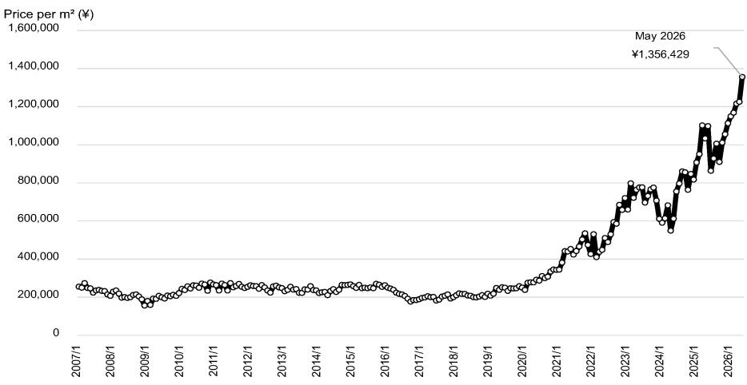
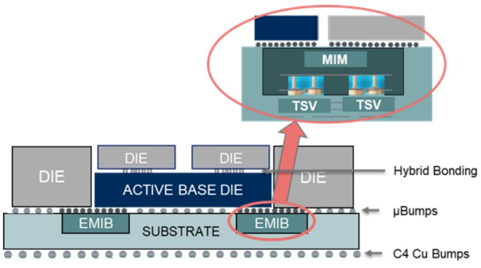

# 日本电子元件行业观察

## 我们对加速器路线图的假设进行修订

**研究分析师**

**日本电子元件**

我们假设持续采用2-die GPU配置，并关注更早的EMIB-T出货用于4-die定制ASIC配置

Manabu Akizuki - NSC

manabu.akizuki@NOM.com

+81 3 6703 1185

**4-6月行业动态：Rubin处理器开始出货**
我们认为Nvidia Rubin GPU的封装出货已在27/3 Q1开始。我们预计Q2将进入全面量产。根据宏观统计数据，我们估算1-3月月度出货价值为247亿日元，4-5月为258亿日元（5月为281亿日元）。每平方米价格从1-3月的118万日元上升至4-5月的129亿日元（5月为136亿日元；图1）。

**我们修订加速器路线图假设：GPU采用2-die配置，EMIB-T出货时间提前**

封装行业中有越来越多的观点认为，Rubin Ultra的结构将从3月GTC上公布的4-die改为2-die（参见我们2026年6月30日关于Rubin Ultra的Quick Note SemiAnalysis报告），一些观察者开始认为Feynman将采用2-die 3D堆叠配置的双模块结构。将大于5.5倍掩模版尺寸的中间层与布线较多的HBM4结合，在技术上可能变得困难。我们已修订了对Ibiden [4062]（买入）的预测，下调了28/3财年GPU封装价格的预测，假设Rubin Ultra采用2-die配置，同时我们新增观点认为EMIB-T的封装出货将在28/3财年开始，比此前预期提前一年。由于这些正面和负面因素大致相互抵消，我们仅微调了利润预测。

EMIB-T旨在不使用中间层的情况下嵌入硅桥，使得生产更大的封装基板更加容易。我们认为这导致了对集成更多AI加速器die、HBM和I/O的大型封装基板的强劲需求，并且我们推测越来越多的定制ASIC制造商正在考虑使用EMIB-T。使用大型封装可以增加机架内的计算密度，提高内存和存储容量，并增加信号带宽，从而实现大规模批处理，降低每个token的能耗，并减少代理模型的延迟。目前，我们认为EMIB-T的出货量受到产能不足的限制，但及时增加产能可能为29/3财年及以后的盈利带来上行空间。

## 代理模型更新背景下的封装技术进展

在基于代理的编码模型中，性能（每瓦特每小时token数）受到内存容量以及内存与GPU之间带宽的限制。当前加速器的设计方法是通过增加封装尺寸来增加每个模块的GPU数量和HBM容量，我们认为这种设计方法将随着基于代理的工作负载的增长而变得更加有利。例如，使用大型封装增加每个GPU的HBM容量，将增加可存储在HBM中的权重和键值缓存的比例，从而减少与主机内存或SSD的数据传输。此外，在一个模块中包含更多GPU可以增加GPU之间的带宽，既减少了信号传输所需的能量，也提高了GPU利用率。

## 参考图表

**图1：刚性模块板每平方米价格**

注：模块板表面安装有元件。
来源：NOM，基于经济产业省《生产动态统计调查》

**图2：刚性PCB产值**

来源：NOM，基于经济产业省《生产动态统计调查》

**图3：基于PLP中间层的3.5D封装**

来源：NOM

**图4：基于EMIB的3.5D封装**

来源：NOM

## 附录A-1

本报告由NOM Securities Co., Ltd. (NSC) 日本编制。

关于NOM集团实体详情，请参阅免责声明。

## 分析师认证

我，Manabu Akizuki，特此证明：(1) 本研究报告中表达的观点准确反映了我个人对相关证券或发行人的看法；(2) 我的薪酬中没有任何部分直接或间接与本研究报告中表达的具体建议或观点相关；(3) 我的薪酬中没有任何部分与NOM Securities International, Inc.、NOM International plc或任何其他NOM集团公司执行的任何特定投行业务挂钩。

## 重要披露

作为NOM Securities Co., Ltd.母公司的NOM Holdings Inc.的关联公司或子公司、有高管同时担任NOM Securities Co., Ltd.高管的发行人、NOM集团持有任何类别普通股证券1%或以上的发行人，以及NOM Securities Co., Ltd.在过去12个月内担任股权或股权挂钩证券公开发行主承销商的发行人名单，可在 https://www.NOMholdings.com/report/ 获取。如需更多信息，请联系NOM Securities Co., Ltd.研究制作运营部。

## 研究的在线获取及利益冲突披露

NOM集团研究可在 www.NOMnow.com/research、Bloomberg、Capital IQ、Factset、LSEG 上获取。

重要披露可访问 http://go.NOMnow.com/research/m/Disclosures 阅读，或向NOM Securities International, Inc.索取。如网站访问遇到问题，请发送电子邮件至 grpsupport@NOM.com 寻求帮助。

负责编写本报告的分析师已根据多种因素获得薪酬，其中包括公司总收入的一部分来自投行业务活动。除非另有说明，本报告首页列出的非美国分析师未在FINRA规则下注册/具备研究分析师资格，可能不是NSI的关联人员，且可能不受FINRA规则2241关于与所覆盖公司沟通、公开露面以及研究分析师账户持有证券交易的限制。

NOM Global Financial Products Inc. (NGFP)、NOM Derivative Products Inc. (NDP) 和 NOM International plc. (NIplc) 已在美国商品期货交易委员会和美国国家期货协会注册为掉期交易商。NGFP、NDPI 和 NIplc 通常从事掉期及其他衍生品交易，其中任何一项均可能成为本报告的主题。

## 评级分布（NOM集团）

NOM集团全球股权研究发布的所有评级分布如下：

58% 被授予报告评级，出于强制披露目的，该评级被归类为报告评级；其中33%的公司是NOM集团\*的投行客户。0% 获得此评级的公司（在EEA受监管市场上市交易）曾接受NOM集团提供的实质性服务\*\*。

39% 被授予中性评级，出于强制披露目的，该评级被归类为持有评级；其中57%的公司是NOM集团\*的投行客户。0% 获得此评级的公司（在EEA受监管市场上市交易）曾接受NOM集团提供的实质性服务。

3% 被授予减持评级，出于强制披露目的，该评级被归类为报告评级；其中15%的公司是NOM集团\*的投行客户。0% 获得此评级的公司（在EEA受监管市场上市交易）曾接受NOM集团提供的实质性服务。

截至2026年6月30日。

\*NOM集团的定义见本报告末尾的免责声明部分。

\*\* 根据欧盟市场滥用监管法规的定义。

## NOM集团股权研究评级体系及行业分类定义

评级体系为相对体系，表示相对于为每只股票确定的特定基准的预期表现，并受有限的管理裁量权约束。分析师的目标价是基于分析师确定的适当估值方法对股票当前内在公允价值的评估。估值方法包括但不限于贴现现金流分析、预期股本回报率和倍数分析。分析师也可能指出相对于所述目标价的预期相对上行/下行空间，定义为（目标价 - 当前价格）/ 当前价格。

## 股票

"买入"评级表示分析师预计该股票在未来12个月内将跑赢基准。"中性"评级表示分析师预计该股票在未来12个月内将表现与基准一致。"减持"评级表示分析师预计该股票在未来12个月内将跑输基准。"暂停"评级表示评级、目标价和预测已暂时暂停，以遵守适用法规和/或公司政策。标记为"未评级"或显示为"无评级"的证券和/或公司不在常规研究覆盖范围内。读者不应期望NOM就此类证券和/或公司提供持续或额外的信息。基准如下：美国/欧洲/亚洲（除日本）：请参阅估值方法了解股票相关基准的解释，可访问：http://go.NOMnow.com/research/m/Disclosures；全球新兴市场（除亚洲）：MSCI新兴市场除亚洲指数，除非估值方法中另有说明；日本：Russell/NOM大盘指数。

## 行业

"看多"立场表示分析师预计该行业在未来12个月内将跑赢基准。"中性"立场表示分析师预计该行业在未来12个月内将表现与基准一致。"看空"立场表示分析师预计该行业在未来12个月内将跑输基准。标记为"未评级"或显示为"N/A"的行业不分配评级。基准如下：美国：标普500指数；欧洲：道琼斯STOXX 600指数；全球新兴市场（除亚洲）：MSCI新兴市场除亚洲指数。日本/亚洲（除日本）：不分配行业评级。

## 目标价

目标价（如有讨论）表示分析师对未来12个月股价的预测，部分反映了分析师对公司盈利的估计。任何目标价的实现可能受到总体市场和宏观趋势、与公司或市场相关的其他风险的阻碍，如果公司盈利与估计不符，则可能无法实现。

## 免责声明

本出版物包含由第1页确定的NOM集团实体编制的材料，并且在适用情况下，包含一个或多个NOM集团实体的贡献，其员工及其各自隶属关系在第1页或本出版物其他地方指定。本文中使用的术语"NOM集团"指NOM Holdings, Inc.及其关联公司和子公司，包括：(a) NOM Securities Co., Ltd. ('NSC') 日本东京，(b) NOM Financial Products Europe GmbH ('NFPE') 德国，(c) NOM International plc ('NIplc') 英国，(d) NOM Securities International, Inc. ('NSI') 美国纽约，(e) NOM International (Hong Kong) Ltd. ('NIHK') 香港，(f) NOM Financial Investment (Korea) Co., Ltd. ('NFIK') 韩国（在韩国金融投资协会注册的NOM分析师信息可在KOFIA内联网 http://dis.kofia.or.kr 上找到），(g) NOM Singapore Ltd. ('NSL') 新加坡（注册号197201440E，受新加坡金融管理局监管），(h) NOM Australia Ltd. ('NAL') 澳大利亚（ABN 48 003 032 513），受澳大利亚证券和投资委员会监管，持有澳大利亚金融服务牌照号246412，(i) NOM Securities Malaysia Sdn. Bhd. ('NSM') 马来西亚，(j) NIHK台北分行 ('NITB') 台湾，(k) NOM Financial Advisory and Securities (India) Private Limited ('NFASL') 印度孟买（注册地址：Ceejay House, Level 11, Plot F, Shivsagar Estate, Dr. Annie Besant Road, Worli, Mumbai- 400 018, India；电话：91 22 4037 4037，传真：91 22 4037 4111；CIN号：U74140MH2007PTC169116，SEBI股票经纪活动注册号：INZ000255633；SEBI商人银行注册号：INM000011419；SEBI研究注册号：INH000001014 - 合规官：Ms. Pratiksha Tondwalkar，91 22 40374904，投诉邮箱：investorgrievancesra@NOM.com 网页：链接

关于印度上市公司或由印度NFASL研究分析师撰写的报告：(i) 证券市场投资存在市场风险。投资前请仔细阅读所有相关文件。(ii) SEBI的注册和NISM的认证不以任何方式保证中介机构的业绩或向读者提供任何回报保证。(iii) NFASL获取研究服务的条款和条件在NFASL网页上披露。

(l) NOM Fiduciary Research & Consulting Co., Ltd. ('NFRC') 日本东京。(m) NOM Orient International Securities Co., Ltd ("NOI") 是NOM集团、东方国际（集团）有限公司和上海黄浦投资控股（集团）有限公司共同控股的合资企业。根据中华人民共和国法律（为本文件目的，不包括香港、澳门和台湾），NOI在中国境内获得提供证券研究和研究交流的许可，并独立于NOM集团其他成员运营；特别是，NOI在中国证券中的利益不会向任何其他NOM集团实体披露或与其持仓合并，其他NOM集团实体在中国证券中的利益也不会向NOI披露或与其持仓合并。研究报告首页上NOI旁边打印的个人姓名表示该个人受雇于NOI，根据研究合作协议为NIHK提供研究协助。研究报告首页上员工姓名旁的'NSFSPL'表示该个人受雇于NOM Structured Finance Services Private Limited，根据公司间协议为某些NOM实体提供协助。研究报告首页上个人姓名旁的'Verdhana'表示该个人受雇于PT Verdhana Sekuritas Indonesia ('Verdhana')，根据研究合作协议为NIHK提供研究协助，Verdhana及该个人均未在印度尼西亚境外获得许可。

本材料：(I) 仅供您私人参考，我们不寻求基于此采取任何行动；(II) 不得被解释为在任何司法管辖区出售或招揽购买任何证券的要约，如果此类要约或招揽在该司法管辖区是非法的；(III) 除与NOM集团相关的披露外，基于我们认为可靠的来源信息，但未经NOM集团独立核实。

除与NOM集团相关的披露外，NOM集团不保证、陈述或承诺（明示或暗示）本文件是公平、准确、完整、正确、可靠或适合任何特定目的或适销的，并且在法律/法规允许的最大范围内，不承担因使用本文件及相关数据而产生的任何行为（或决定不采取行动）的责任（无论是过失或其他责任，以及全部或部分）。在法律/法规允许的最大范围内，NOM集团的所有保证和其他承诺特此排除，NOM集团不承担因使用、误用或分发本材料或其中包含的信息或以其他方式与之相关的任何损失的责任（无论是过失或其他责任，以及全部或部分）。

所表达的意见或估计是截至本材料原始发布日期当前的意见，并且其中包含的信息（包括意见和估计）如有变更，恕不另行通知。然而，NOM集团明确否认任何义务，因此没有责任更新或修订本文件。本文中的任何评论或陈述均为作者本人的观点，可能与NOM集团内部其他方持有的观点不同。客户应考虑本报告中的任何建议或推荐是否适合其特定情况，并在适当时寻求专业建议，包括税务建议。NOM集团不提供税务建议。

在适用法律/法规允许的范围内，NOM集团和/或其高级职员、董事、员工和关联方可能以委托人、代理人或其他身份进行交易，或持有本文提及的发行人或证券的多头或空头头寸，或买入或卖出这些证券、商品或工具，或基于这些证券、商品或工具的期权或其他衍生工具。NOM集团公司也可能担任发行人金融工具的市场做市商或流动性提供者（根据英国适用法规的含义）。如果市场做市商活动是根据美国或其他司法管辖区的特定法律法规的定义进行的，则将在特定发行人披露中单独披露。

本文件可能包含从第三方获得的信息，包括但不限于信用评级机构的评级，如标准普尔。NOM集团特此明确否认对从第三方获得的任何信息（包含在本材料中或以其他方式与之相关）的原创性、公平性、准确性、完整性、正确性、适销性或特定目的适用性的所有陈述、保证或承诺，并且不承担因使用或误用任何从第三方获得的信息（包含在本材料中或以其他方式与之相关）而产生的任何直接、间接、附带、示范性、补偿性、惩罚性、特殊或后果性损害、成本、费用、法律费用或损失（包括收入或利润损失和机会成本）的责任（无论是过失或其他责任，以及全部或部分）。禁止以任何形式复制和分发第三方内容，除非事先获得相关第三方的书面许可。第三方内容提供商不（明示或暗示）保证任何信息（包括评级）的公平性、准确性、完整性、正确性、及时性或可用性，并且不对因使用或误用此类内容而产生的任何错误或遗漏（无论是过失或其他原因）负责。第三方内容提供商不提供明示或暗示的保证，包括但不限于适销性或特定目的或用途适用性的任何保证。第三方内容提供商不承担因使用或误用其内容（包括评级）而产生的任何直接、间接、附带、示范性、补偿性、惩罚性、特殊或后果性损害、成本、费用、法律费用或损失（包括收入或利润损失和机会成本）的责任（无论是过失或其他责任，以及全部或部分）。信用评级是意见陈述，不是事实陈述或购买、持有或出售证券的建议。它们不涉及证券的适合性或证券用于投资目的的适合性，不应作为研究交流依赖。本文件中任何MSCI来源的信息均为MSCI Inc. ('MSCI')的专有财产。未经MSCI事先书面许可，不得为任何目的（包括创建任何金融产品和任何指数）复制、转载、再传播、再分发或使用本信息及其任何MSCI知识产权（全部或部分）。此信息按"原样"提供。用户承担使用此信息的全部风险。MSCI、其关联方以及任何参与或相关计算或编制此信息的第三方特此明确否认对此材料或其中包含的信息或以其他方式与之相关的任何原创性、公平性、准确性、完整性、正确性、适销性或特定目的适用性的所有陈述、保证或承诺。在不限制前述规定的情况下，MSCI、其任何关联方或任何参与或相关计算或编制此信息的第三方在任何情况下均不承担任何类型的任何损害责任（无论是过失或其他责任，以及全部或部分）。MSCI和MSCI指数是MSCI及其关联方的服务标志。

Russell/NOM日本股票指数的知识产权和其他权利属于NOM Fiduciary Research & Consulting Co., Ltd. ("NFRC") 和 FTSE Russell ("Russell")。NFRC和Russell不保证该指数的公平性、准确性、完整性、正确性、可靠性、有用性、市场性、适销性或适合性，并且不考虑任何指数用户和/或其关联方在使用该指数时进行的商业活动或服务。

读者应将本文件视为其做出投资决策的单一因素，因此，本报告不应被视为识别或暗示与任何投资决策相关的所有风险（直接或间接）。NOM集团制作多种不同类型的研究产品，包括但不限于基础分析和定量分析；一种研究产品中包含的建议可能因时间范围、方法论或其他原因而不同于其他类型研究产品中的建议。NOM集团以多种不同方式发布研究产品，包括在NOM集团门户网站上发布和/或直接分发给客户。不同的客户群体可能根据其个人需求从研究部门获得不同的产品和服务。

本文中呈现的数字可能涉及过往表现或基于过往表现的模拟，这些并非未来或可能表现的可靠指标。如果信息包含对未来表现和业务前景的预期、预测或指示，此类预测可能不是未来或可能表现的可靠指标。此外，模拟基于模型和简化假设，可能过度简化且不能反映未来的回报分布。本文件中为说明目的创建和发布的任何数字、策略或指数，不旨在作为欧洲基准监管法规定义的"基准"的"使用"。某些证券受汇率波动影响，可能对投资的价值、价格或收入产生不利影响。

关于固定收益研究：建议分为两类：战术性建议，通常持续最多三个月；或战略性建议，通常持续6-12个月。然而，交易建议可能随时根据情况变化进行审查。交易建议还提供"止损"水平；如果触及，将自动关闭交易建议。建议中显示的价格和回报表现是在提交发布时获取的，基于当时指示性的Bloomberg、LSEG或NOM价格和回报表现。显示的价格和回报表现不一定是交易建议可以实施的价格和回报表现。

本文描述的证券可能未根据1933年美国证券法（'1933年法案'）注册，在这种情况下，除非已根据1933年法案注册，或符合1933年法案注册要求的豁免条件，否则不得在美国或向美国人士发售或出售。除非适用法律允许，否则任何交易应通过您所在司法管辖区的NOM实体执行。

本文件已获批准在英国作为投资研究由NIplc分发。NIplc由审慎监管局授权，并受金融行为监管局和审慎监管局监管。NIplc是伦敦证券交易所的成员。本文件不构成英国适用法规意义上的个人推荐，也不考虑特定读者的投资目标、财务状况或需求。本文件仅针对英国适用法规意义上的"合格对手方"或"专业客户"，因此不得再分发给此类目的的"零售客户"。

本文件已获批准在欧洲经济区作为投资研究由NOM Financial Products Europe GmbH ("NFPE")分发。NFPE是一家根据德国法律组织的有限责任公司，在法兰克福/美因法院商业登记处注册，注册号为HRB 110223。NFPE由德国联邦金融监管局授权和监管。

本文件已获NIHK批准在香港由NIHK分发，NIHK受香港证券及期货事务监察委员会监管。本文件仅针对香港适用法规意义上的"专业读者"，因此不得再分发给非此类目的的"专业读者"。

本文件已获批准在澳大利亚由NAL分发，NAL在澳大利亚由ASIC授权和监管。本文件也已获批准在马来西亚由NSM分发。

在新加坡，本文件由NSL分发，NSL是根据《财务顾问法》（第110章）定义的豁免财务顾问，并受新加坡金融管理局监管。NSL可根据《财务顾问条例》第32C条的规定，通过安排分发其外国关联公司制作的此文件。本文件针对《证券及期货法》（第289章）定义的认可读者、专家读者或机构读者。如果本文件的接收者不是认可读者、专家读者或机构读者，NSL仅在法律要求的范围内对此类接收者承担本文件内容的法律责任。新加坡的接收者应就本文件引起或与之相关的事项联系NSL。本文件旨在广泛分发。它不考虑任何特定个人的具体投资目标、财务状况或特殊需求。接收者在承诺购买任何证券之前，应考虑其具体的投资目标、财务状况或特殊需求，包括根据其认为合适的方式，通过单独约定寻求独立财务顾问关于投资适合性的建议。除非1933年法案S条例的规定禁止，本材料在美国由NSI分发，NSI是一家美国注册的经纪交易商，根据1934年美国证券交易法Rule 15a-6的规定，NSI对其内容承担责任。编写本文件的实体允许NOM集团内独立运营的关联公司向其客户提供此类文件的副本。

本文件尚未获批准分发给沙特阿拉伯王国中除"授权人士"、"豁免人士"或"机构"（由资本市场管理局定义）以外的人士，或阿拉伯联合酋长国中除"市场对手方"或"专业客户"（由迪拜金融服务局定义）以外的人士，或卡塔尔国中除"市场对手方"或"商业客户"（由卡塔尔金融中心监管局定义）以外的人士，由NOM沙特阿拉伯、NIplc或NOM集团任何其他成员（视情况而定）分发。除非获得授权，任何人不得将本文件或其任何副本带入、传输或分发（直接或间接）到沙特阿拉伯、阿联酋或卡塔尔，或分发给沙特阿拉伯境内的"授权人士"、"豁免人士"或"机构"、阿联酋的"市场对手方"或"专业客户"、卡塔尔的"市场对手方"或"商业客户"以外的任何人。未能遵守这些限制可能构成违反阿联酋、沙特阿拉伯或卡塔尔法律的行为。

关于涉及台湾上市公司或由台湾研究分析师撰写的报告：

本文件仅供参考。您应独立评估投资风险，并自行承担投资决策的责任。未经NOM集团书面授权，不得复制或引用本报告的任何部分给媒体或任何其他人。根据台湾《证券商受托买卖有价证券对客户应行注意事项》和/或其他适用法律法规，您不得向他人（包括但不限于关联方、关联公司和任何其他第三方）提供本报告，或从事任何可能涉及利益冲突的与本报告相关的活动。关于NOM International (Hong Kong) Ltd.台北分行不可执行的证券/工具的信息仅供参考，不得解释为对此类证券/工具的建议或招揽交易。

本材料不得在印度尼西亚境内分发，或以构成根据印度尼西亚共和国法律公开发售的方式传递给印度尼西亚共和国境内的人士或印度尼西亚公民（无论其居住地或所在地）或印度尼西亚的实体或居民。本文件中提及的证券不得在印度尼西亚境内发售或出售，或以构成根据印度尼西亚共和国法律公开发售的方式出售给印度尼西亚公民（无论其居住地或所在地）或印度尼西亚的实体或居民。

研究报告首页上NOI旁边打印的个人姓名表示本文件是NOI在中国发布的研究报告的翻译。在所有其他情况下，本文件由未在中国获得提供证券研究许可的NOM集团或其子公司或关联公司（统称"离岸发行人"）编制。本研究报告未获批准或旨在在中国境内分发。A股相关分析（如有）并非为位于或注册于中国境内的任何人制作。接收者不应依赖本研究报告中包含的任何信息做出投资决策，离岸发行人不对此承担任何责任。未经NOM集团成员事先书面同意，不得以任何形式或任何方式（I）复制、影印、复制或复印本材料的任何部分；或（II）再传播、再发布或再分发本材料。如果本文件通过电子传输方式分发，例如电子邮件，则此类传输不能保证安全或无错误，因为信息可能被拦截、损坏、丢失、销毁、延迟到达或不完整，或包含病毒。因此，发送方不承担因电子传输而产生的本文件内容中的任何错误或遗漏的责任（无论是过失或其他责任，以及全部或部分）。如需验证，请索取硬拷贝版本。

## 日本所需的免责声明

文中标有星号(\*)的信用评级是由未根据日本《金融工具与交易法》注册的评级机构（"未注册评级"）发布的。有关未注册评级的详细信息，请联系NOM Securities Co., Ltd.研究制作运营部。

投资NOM Securities提供的金融产品的读者可能会产生这些产品特有的费用和佣金（例如，涉及日本股票的交易需缴纳最高为交易金额1.43%的销售佣金（含税），或对于20万日元及以下的交易收取2,860日元的佣金；而涉及投资信托的交易需缴纳各种费用，例如购买时的佣金和资产管理费（信托费），具体因投资信托而异）。

此外，所有产品都存在因价格波动或其他因素造成损失的风险。费用和风险因产品而异。请仔细阅读提供的书面材料，例如合同签订前交付的文件、上市证券文件或招股说明书。涉及日本股票（包括日本REITs、日本ETFs、日本ETNs、日本基础设施基金）的交易需缴纳最高为交易金额1.43%（含税）的销售佣金（或对于20万日元及以下的交易收取2,860日元（含税）的佣金）。当通过场外交易（包括发行）购买日本股票时，只需支付购买价格，不收取销售佣金。但是，NOM Securities可能会根据与客户的协议收取单独的场外交易费用。日本股票存在因价格波动造成损失的风险。日本REITs存在因价格和/或基础房地产收益波动造成损失的风险。日本ETFs和ETNs存在因基础指数或其他基准波动造成损失的风险。日本基础设施基金存在因价格和/或基础基础设施收益波动造成损失的风险。

涉及外国股票的交易需缴纳最高为交易金额1.045%（含税）的国内销售佣金（对于购买，等于当地交易金额加上当地费用和税费；对于出售，等于当地交易金额减去当地费用和税费）（对于75万日元及以下的交易金额，最高国内销售佣金为7,810日元（含税））。外国金融市场中的当地费用和税费因国家/地区而异。当通过场外交易（包括发行）购买外国股票时，只需支付购买价格，不收取销售佣金。但是，NOM Securities可能会根据与客户的协议收取单独的场外交易费用。外国股票存在因价格波动和汇率波动等因素造成损失的风险。

保证金交易需缴纳最高为交易金额1.43%（含税）的销售佣金（或对于20万日元及以下的交易收取2,860日元（含税）的佣金），以及管理费和权利处理费。此外，多头保证金交易需支付购买金额的利息，而空头保证金交易需支付借入股票的出借费用。需要至少为交易金额30%（在线交易至少33%）且至少30万日元的保证金。通过保证金交易，可以交易大约相当于保证金3.3倍（在线交易大约3倍）的金额。因此，保证金交易存在因股价波动导致损失超过保证金的风险。详情请仔细阅读提供的书面材料，例如上市证券文件或合同签订前交付的文件。

涉及可转换债券的交易需缴纳最高为交易金额1.10%（含税）的销售佣金（或如果低于4,400日元，则收取4,400日元（含税）的佣金）。当通过场外交易（包括发行）购买可转换债券时，只需支付购买价格，不收取销售佣金。但是，NOM Securities可能会根据与客户的协议收取单独的场外交易费用。可转换债券存在因利率波动和基础股票价格波动等因素造成损失的风险。此外，以外币计价的可转换债券也存在因汇率波动等因素造成损失的风险。

当通过NOM Securities的公开募集、二次分销或其他场外交易购买债券时，只需支付购买价格，不收取销售佣金。债券存在损失风险，因为价格会随着市场利率的变化而波动。债券价格也可能因发行人管理和财务状况的变化、或第三方对相关债券估值的变化等因素而跌破投资本金。此外，外币计价债券也存在因汇率波动等因素造成损失的风险。

当通过公开募集购买面向个人读者的日本国债时，只需支付购买价格，不收取销售佣金。原则上，面向个人读者的日本国债在发行后12个月内不得出售。当面向个人读者的日本国债在到期前出售时，将从债券面值加上应计利息中扣除按以下公式计算的金额：(1) 对于10年期浮动利率债券，将使用前两次票息支付（税前）金额 x 0.79685，(2) 对于5年期和3年期固定利率债券，将使用前两次票息支付（税前）金额 x 0.79685。当通过NOM Securities的公开募集、二次分销（uridashi交易）或其他场外交易购买通胀挂钩日本国债时，只需支付购买价格，不收取销售佣金。通胀挂钩日本国债存在损失风险，因为价格会随着市场利率的变化和全国消费者价格指数的波动而波动。通胀挂钩日本国债的名义本金根据发行以来全国CPI通胀率的变化而变化。票息支付金额通过将票面利率乘以支付时的名义本金计算。到期价值是债券到期时的名义本金金额。对于JI17及后续发行，到期价值不得低于面值。购买投资信托（以及出售某些投资信托）需缴纳最高为交易金额5.5%（含税）的购买或销售费用。此外，出售投资信托时可能产生的直接成本是赎回时单位价格最高2.0%的费用。持有投资信托期间可能产生的间接成本包括：对于国内投资信托，最高为信托净资产5.5%（含税/年化）的资产管理费（信托费），以及基于投资业绩的费用。还可能产生其他间接成本。对于外国投资信托，持有期间可能产生间接费用，例如投资公司报酬。

投资信托主要投资于日本和外国股票、债券等证券，其价格会波动。投资信托单位价格因基础资产价格波动和汇率波动而波动。因此，投资信托存在损失风险。费用和风险因投资信托而异。最高适用费用可能发生变化；请仔细阅读提供的书面材料，例如招股说明书或合同签订前交付的文件。

在利率掉期交易和美元/日元基差掉期交易（"利率掉期交易等"）中，仅在结算日支付约定的交易款项。某些利率掉期交易等可能需要质押保证金抵押品。在某些情况下，交易款项可能超过抵押品金额。所需的抵押品价值或抵押品比率不会提前通知，因为它们因交易而异。利率掉期交易等存在因利率、货币和其他市场以及参考指数的市场价格波动造成损失的风险。由此产生的损失可能超过保证金抵押品的价值，在这种情况下可能触发追加保证金通知。如果双方同意进行替代（或终止）交易，新安排下收到（支付）的利率可能与原始安排不同，即使除利率以外的条款与原始交易相同。风险因交易而异。请仔细阅读提供的书面材料，例如合同签订前交付的文件和披露声明。

在信用违约掉期的场外交易中，不收取销售佣金。进行CDS交易时，保护买方需要质押或委托约定金额的保证金抵押品。在某些情况下，交易款项可能超过保证金抵押品的金额。所需的抵押品价值或抵押品比率不会提前通知，因为它们因保护买方的财务状况而异。CDS交易存在因部分或全部参考实体的信用状况变化和/或利率市场波动造成损失的风险。在信用事件触发CDS时，保护买方收到的金额可能低于其在交易过程中支付的总保费。同样，在信用事件发生时，保护卖方支付的金额可能超过其在交易中收到的总保费。在所有其他条件相同的情况下，保护买方支付的保费金额与保护卖方收到的保费金额应有所不同。原则上，CDS交易将限于金融工具业务经营者和合格机构读者。通过日本证券存管中心将股权转让给另一家证券公司，需根据数量支付每只转让股票最高11,000日元（含税）的转让费。对于有价证券或存入的资金，不收取账户费。

## NOM Securities Co., Ltd.

在关东财务局注册的金融工具公司（注册号：第142号）

会员协会：日本证券业协会；日本投资管理协会；日本金融期货协会；第二类金融工具业协会；日本证券代币发行协会。

NOM集团通过其合规政策和程序（包括但不限于利益冲突、中国墙和保密政策）以及维护中国墙和员工培训来管理与研究制作相关的冲突。

如需获取本文件中包含的任何研究交流所使用的方法或模型的更多信息，请联系首页列出的NOM研究分析师。可根据要求提供披露信息，披露信息可在NOM披露网页上获取。
