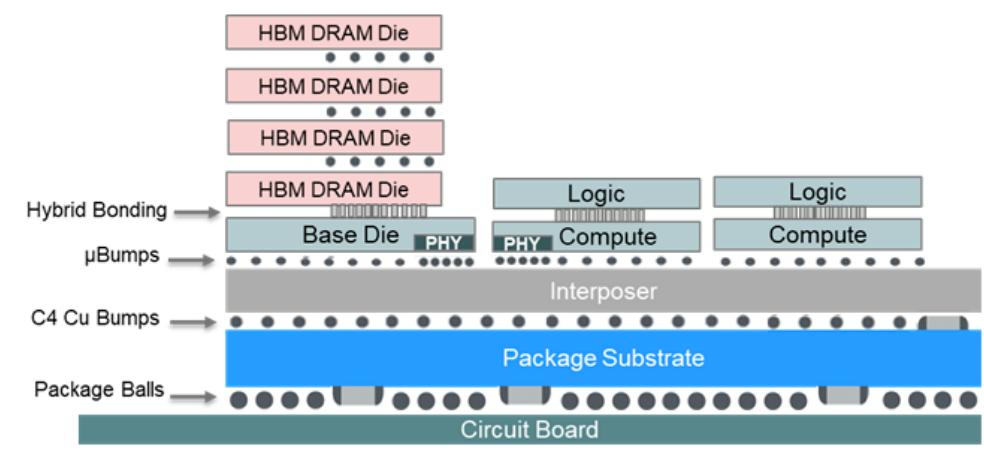
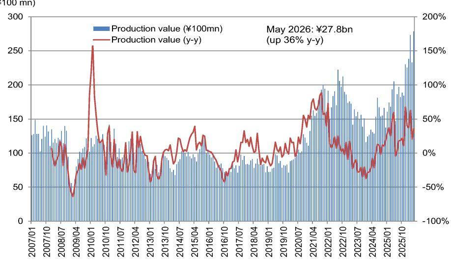

# NOM：半导体行业数据与主题变化观察

英伟达下一代GPU的封装方案正在经历一次关键调整。NOM标的在最新研报中指出，行业普遍认为Rubin Ultra将从GTC 2025上公布的4芯片设计改为2芯片配置，同时Feynman可能采用2芯片3D堆叠结构。这一变化直接影响了GPU封装基板的价格预期和先进封装技术的商业化节奏。

NOM估算，2027财年第一季度（2026年1-3月）GPU封装基板的月均出货金额约为247亿日元，4-5月升至258亿日元，5月单月达到281亿日元。每平方米价格从1-3月的118万日元上升至4-5月的129万日元（5月为136万日元）。出货量和单价同步上升，反映出AI加速器封装需求仍在扩张。

## 1. Rubin Ultra改为2芯片结构影响封装基板价格预期

NOM认为，将超过5.5倍光罩尺寸的中介层与布线密集的HBM4结合，在技术上存在难度。这是Rubin Ultra从4芯片改为2芯片的主要原因。基于这一假设，NOM下调了对Ibiden 2028年3月期GPU封装基板价格的预测。

但这一调整并非单向影响。NOM同时将EMIB-T封装基板的出货时间预期提前了一年，预计将在2028年3月期开始出货。EMIB-T通过嵌入硅桥而不使用中介层，降低了大型封装基板的生产难度。正负因素大致抵消，NOM仅对Ibiden的利润预测做了微调。

> **KC评论：** Rubin Ultra从4芯片改为2芯片，表面上是技术调整，但背后是HBM4布线密度与中介层尺寸之间的物理约束。这一调整对封装基板单价的影响是谨慎的，但EMIB-T出货提前一年又提供了新的增长点。两者对冲后，市场对封装基板厂商的预期需要重新校准。

## 2. EMIB-T出货提前一年，定制ASIC厂商需求上升

EMIB-T的核心优势在于无需中介层即可实现大尺寸封装基板。NOM观察到，越来越多的定制ASIC厂商正在考虑采用EMIB-T方案。大尺寸封装能够提高机架内的计算密度，增加内存和存储容量，提升信号带宽，从而支持大规模批处理、降低每token能耗并减少agent模型的延迟。

目前EMIB-T的出货量受限于产能不足。NOM认为，如果产能能够及时扩张，2029年3月期以后的盈利存在上行空间。这一判断意味着，先进封装产能的扩张速度将成为影响AI硬件供应链的关键变量。

## 3. Agent模型对封装技术提出新要求

NOM在研报中特别强调了agent模型对封装架构的影响。在基于agent的编程模型中，性能（每瓦特每小时处理的token数）受限于内存容量以及内存与GPU之间的带宽。当前加速器的设计思路是通过增大封装尺寸来增加每个模块的GPU数量和HBM容量。

随着agent工作负载的增长，这种设计思路将更具优势。大封装可以增加每个GPU对应的HBM容量，从而提高权重和键值缓存在HBM中的存储比例，减少与主机内存或SSD之间的数据传输。同时，一个模块内包含更多GPU可以提升GPU间的带宽，既降低信号传输能耗，又提高GPU利用率。

NOM的这一分析提供了一个观察框架：封装技术的演进方向，正在从单纯的芯片互联问题，转变为系统级的内存带宽和计算密度问题。agent模型的普及将进一步强化大封装方案的竞争优势。

For informational purposes only. Portions may be generated,translated,summarized,or edited with AI assistance based on source materials and may contain omissions or errors. Please verify independently. This is not investment,legal,tax,accounting,or other professional advice.

