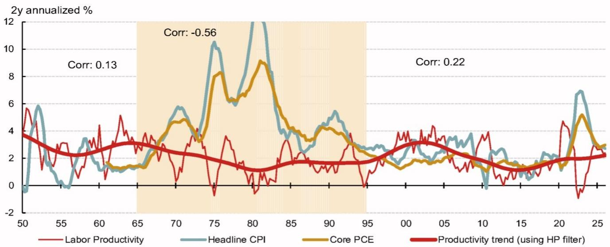
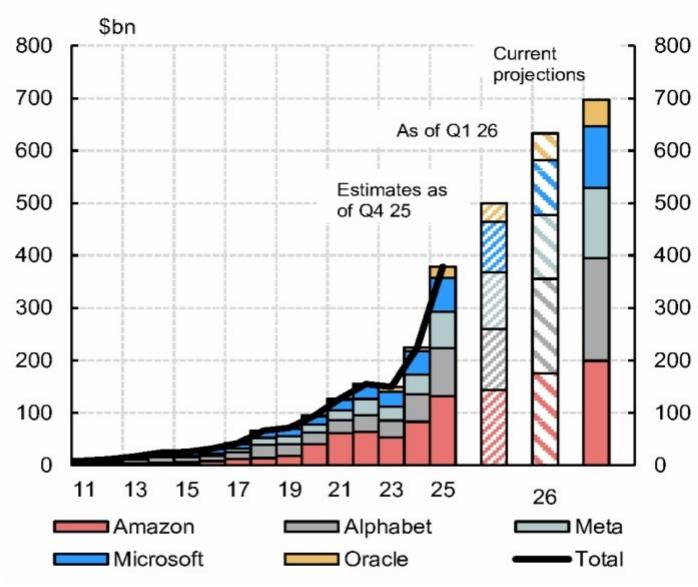
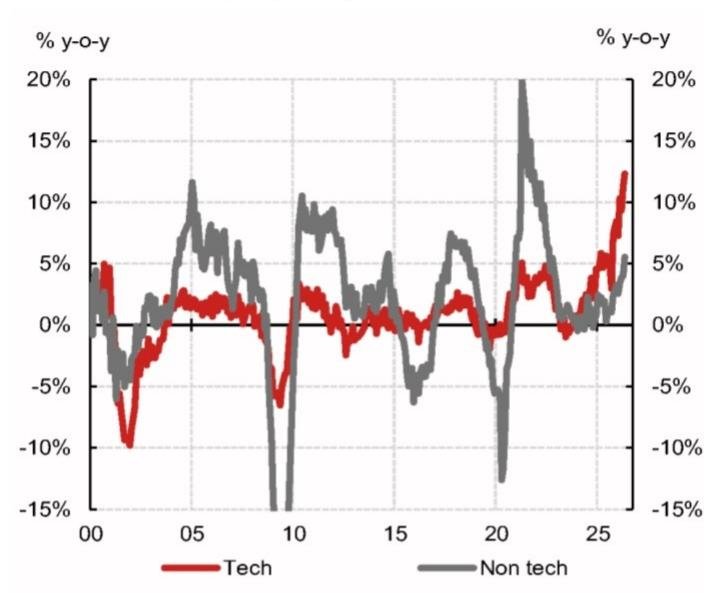
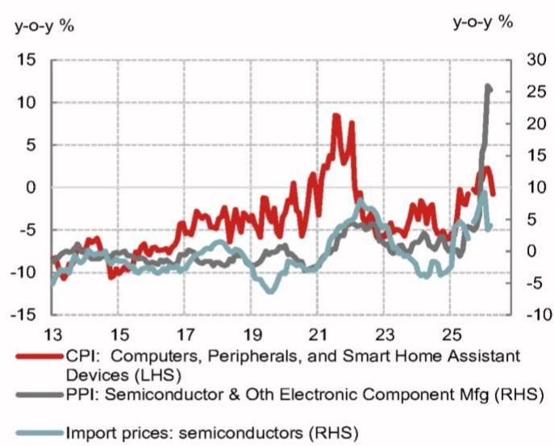
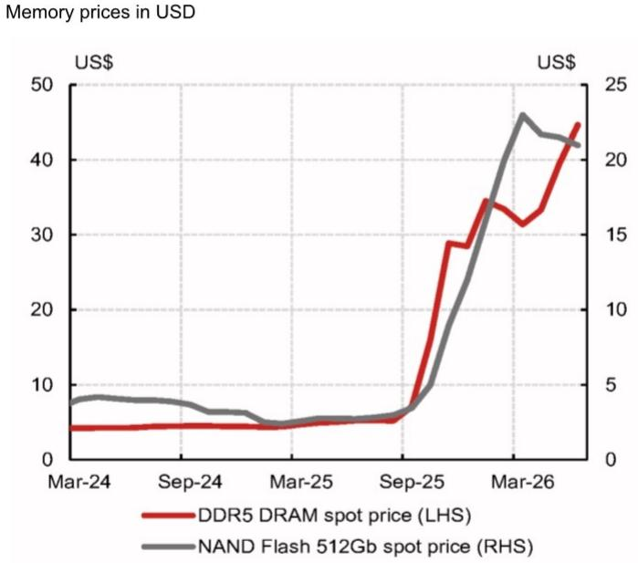
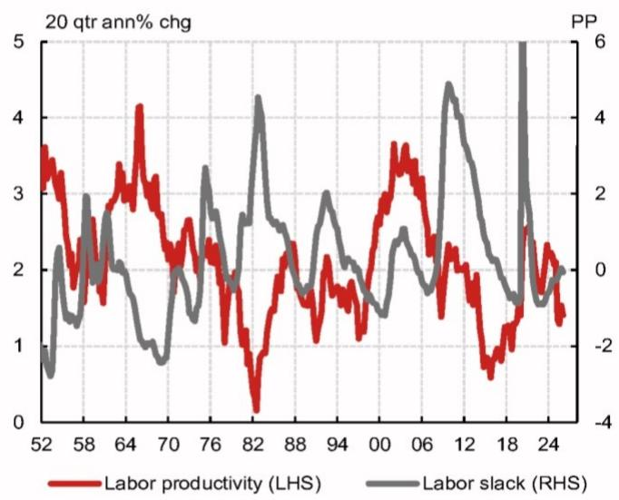
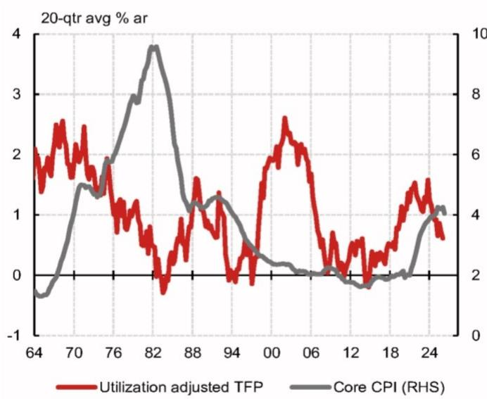
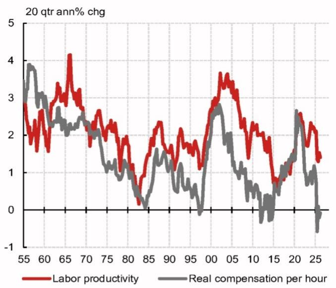
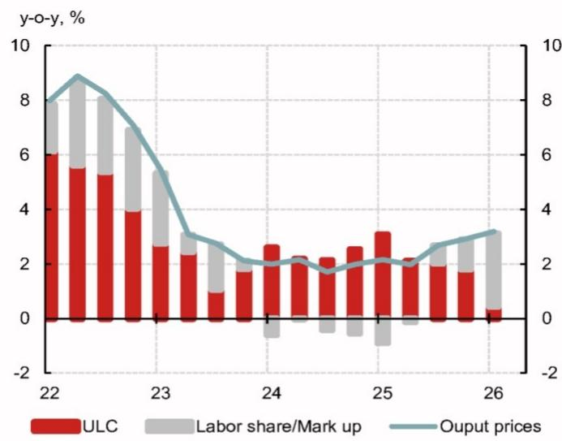

Economics - North America

## US: Will AI-driven productivity lead to disinflation?

- We view Chair Warsh's optimism on the disinflationary impact of productivity as an important signal of his dovish inclination.

- In theory, productivity can have either a positive or negative impact on inflation. Historically, there is some negative correlation, but the relationship is inconsistent and has performed especially poorly in recent decades.

- The policy implications of productivity trends are subtle. In real time, strong productivity growth is a good reason to tolerate hawkish signals from growth or wages. This is different from assuming future productivity growth will drive incremental disinflation.

## Research Analysts

North America Economics  
Jeremy Schwartz - NSI  
jeremy.schwartz@NOM.com  
+1 212 667 9637

Ruchir Sharma - NSI
ruchir.sharma@NOM.com
+1 212 667 9186

Aichi Amemiya - NSI  
aichi.amemiya@NOM.com  
+1 212 667 9347

- Warsh has not convinced other Fed officials that AI will be predictably disinflationary. His repeated emphasis on productivity and supply growth makes us skeptical that he will turn hawkish and support pre-emptive rate hikes though.

Fig. 1: Data point to little evidence for "disinflationary productivity" Correlation between trend productivity and headline CPI  
  
Note: Labor productivity is real output per hour of all persons. Following Gordon (2005), we define trend productivity growth as the HP trend of the 8 qtr change (with smoothing parameter as 6400, based on Gordon (2003))  
Source: BLS, BEA, Haver, NOM

As Fed Chair, Kevin Warsh consistently emphasizes productivity growth, suggesting this should be an important driver of policy decisions. One of his five task forces will focus on "productivity and jobs in an era of transformation." And despite aggressive editing through most of the June FOMC statement, one conspicuous addition was a reference to strong productivity growth.

Warsh claims that technological progress is a reason to expect disinflation. Before his nomination, he wrote that “AI will be a significant disinflationary force.” In his Humphrey-Hawkins testimony he added that “productivity improvements over time will be structurally disinflationary,” and that “everything technology touches ultimately gets cheaper.”

In this note, we argue that productivity is not inherently disinflationary. In the near term, technological progress is driving investment higher, likely boosting inflation. Many (including Warsh) argue that relief is on the way from a future productivity payoff, but we do not see evidence for a clear directional impact.

In real time, productivity can be a helpful benchmark for gauging inflation trends – if productivity accelerates, it should make policymakers more willing to tolerate stronger growth in output and wages.

This is different from assuming future productivity growth will drive incremental disinflation though. Productivity itself tends to drive output and wage growth trends. Consequently, even if it seems certain that there would be an acceleration in labor productivity in the future, this would not be a sufficient reason to forecast a gap between wage growth and productivity or between actual output and potential.

## Is productivity disinflationary in theory?

There are early signs that AI diffusion is leading to productivity gains. That said, the read-through to inflation and interest rates is not clear.

In theory, productivity can have either a positive or negative impact on inflation.

Intuition tends to point to a disinflationary impact. For any particular business or industry, productivity growth typically leads to cost cutting and falling prices. Economic history adds to the intuition for “disinflationary productivity.” Under certain policy regimes – like a gold standard – productivity growth tends to be disinflationary. A managed money supply will tend to keep nominal GDP steady – implying faster real growth will lead to cooling inflation. Indeed, strong productivity growth is often cited by economic historians as a factor behind deflationary episodes in the late-19 $^{th}$ century $^{[1]}$ .

What we think this intuition misses is the dynamic impact of productivity on demand. Productivity raises real income, and more importantly, can incentivize business capex. This implies that even if the most productive sectors see cost relief from productivity gains, the economy-wide effect could be inflationary. Again, the policy regime matters. This demand channel could be especially prevalent for modern central banks, which target interest rates and manage financial conditions.

## Inflation pressure has already materialized

This inflationary impact of technological progress is already on clear display. Capex in AI is booming (Fig. 2), driving up tech component prices and leading to inflation pressure for consumer electronics (Fig. 4).

Fig. 2: Earnings calls and anecdotal evidence indicate businesses are increasingly willing to spend on capex
Hyperscalers' capex plans  
  
Source: Company filings, Bloomberg, NOM

Fig. 3: Strong capex appears to be broadening out to other industries  
  
Source: BEA, Census Bureau, Haver, NOM

With the Fed remaining on hold, there is no circuit breaker for this strong demand. Financial conditions have remained easy, and rather than crowding out other sectors, strong capex appears to be broadening out to other industries (Fig. 3).

From the perspective of a hyperscaler, policy likely appears procyclical. Given rapid price increases for tech equipment, the “real interest rate” for pulling forward debt-financed investment is likely deeply negative (and becoming even more negative as demand strengthens) (Fig. 5). Earnings calls indicate businesses are increasingly willing to spend on capex, with activity only constrained by supply and availability of equipment.

Fig. 4: Booming capex in AI is driving up tech component prices  
  
Source: BLS, Haver, NOM

Fig. 5: Rising equipment costs incentivize hyperscalers to frontload orders  
  
Source: Bloomberg, inSpectrum, NOM

## Is there relief on the way?

Warsh has acknowledged the demand impulse from AI, but he has also suggested that a disinflationary impulse from productivity is still likely to occur with a lag.

At the June FOMC press conference, he said “it may well be an intuition the supply side is going to expand, but it’ll take longer.” In the Humphrey-Hawkins testimony, Warsh went even further to say that this lagged disinflationary impact was sufficient reason to discount the demand-driven inflation already evident in current data.

## Evaluating potential channels for productivity led disinflation

In our view, productivity growth on its own is insufficient reason to expect meaningful inflation relief. Strong productivity can coincide with disinflation in some scenarios, but the relationship is inconsistent and has weakened in recent decades. In particular, it is important to consider both inflationary and disinflationary pressure from productivity growth, as well as potential attenuating factors like wage growth and margins adjustments.

Beyond the theoretical reasons to be skeptical of “disinflationary productivity,” historical data also point to ambiguity (Fig. 1). There was some negative correlation between labor productivity and inflation from the mid-1960s through the early 1990s. However, the relationship has weakened since then though and has especially broken down post-GFC. Weak productivity growth in the 2010s coincided with a period of low inflation (at the time, theories of ‘secular stagnation’ often cited the era’s low productivity growth as a cause of sluggish inflation). In contrast, inflation has surged post-pandemic alongside an acceleration in trend productivity.

## Can productivity growth cause an output gap?

Productivity growth is often viewed as a positive shock to aggregate supply – which could in theory lead to a negative output gap (actual growth lower than potential) and therefore disinflation.

In practice though, there is almost no correlation between productivity trends and economic slack measures (Fig. 6).

And at least some of the limited relationship between productivity and slack is likely driven by reverse causality. Productivity often rises early in recessions as businesses prioritize their most essential workers (and remaining workers increase their efforts) during periods of slack demand and layoffs. The recent pandemic also saw a technical spike in

productivity as shutdowns tended to impact lower-productivity service sectors. Adjusting for cyclical fluctuations, measures such as trend labor productivity and utilization-adjusted total factor productivity offer no evidence that productivity is associated with disinflationary slack (Fig. 7).

Fig. 6: There is almost no correlation between productivity trends and economic slack measures  
  
Note: Labor slack refers to the difference between realized u-rate and CBO's estimate of the noncyclical rate of unemployment (formerly called NAIRU)  
Source: CBO, BLS, BEA, Haver, NOM

Fig. 7: Adjusting for cyclical fluctuations, alternative measures offer no evidence that productivity is associated with disinflationary slack  
  
Note: The utilization adjustments follows Basu, Fernald, and Kimball (BFK, 2006)  
Source: SF Fed, BLS, Haver, NOM

It is true that strong growth is less likely to be inflationary if it is driven by productivity gains rather than cyclical tightening. This is close to the argument Chair Greenspan made in the 1990s, when inflation was subdued and the Fed was debating pre-emptive tightening.

It's more difficult to explain why ex ante productivity growth would be a reason to expect disinflation though, specifically when inflation has remained elevated and above the Fed's target for five years.

One possibility is that AI is a uniquely disruptive technology for labor markets, causing productivity growth mostly through a reduction in hours worked, rather than through faster output growth. We see little evidence in recent labor data to support this view though.

## Unit labor costs

Another channel linking productivity to inflation is unit labor costs (ULC). This measures the ratio of total-economy compensation and output, which can also be expressed as the ratio of average wages and labor productivity. ULC has a strong contemporaneous correlation to inflation, so this appears to be a channel for productivity to put downward pressure on inflation. However, despite a strong intuitive connection, we see two shortcomings with this framework.

First, productivity trends do not consistently drive ULC growth. Although productivity is the denominator in the formula for unit labor costs, it does not follow that ULC mechanically slows when productivity accelerates (Fig. 8). (This would be like saying a baseball player's batting average inevitably falls as they get more at bats, or a stock's P/E ratio declines whenever there is faster earnings growth.) The implicit assumption behind this formulaic interpretation is that the numerator, wage growth, is held constant. This is reasonable for short-run forecasts, but over a longer time horizon, productivity growth is one of the strongest drivers of real wages (Fig. 9). Empirically, the relationship between productivity and ULC varies over time and has tended to be weak in recent decades (Fig. 8).

Fig. 8: Productivity does not mechanically reduce ULC, since wage growth also changes over time Correlation between trend productivity and ULC  
  
Source: BEA, Haver, NOM

Second, the causal relationship between ULC and inflation tends to be overstated. Profit margins often adjust to limit the pass-through of labor costs to final prices especially, if labor productivity improves due to capital deepening (Fig. 10). A large share of the consumer basket is also relatively insensitive to labor costs – including imported goods and housing services.

In practice, while ULC has a reasonable contemporaneous correlation to inflation, it adds little or no value as a forecast of future inflation.

Fig. 9: Over a longer time horizon, productivity growth is one of the strongest drivers of real wages  
  
Source: BEA, BLS, Haver, NOM

Fig. 10: Profit margins often adjust to limit the pass-through of labor costs to final prices  
  
Source: BLS, Haver, NOM

## Productivity in inflation models

Some macro inflation forecast equations will incorporate trend productivity growth with a negative coefficient.

In most cases though, these models are capturing a partial or conditional impact of productivity growth. For instance, Robert Gordon's "Goldilocks" inflation model includes trend productivity growth in addition to demand indicators and lagged inflation.

In other words, these models do not consider the full impact of productivity on inflation but

instead take demand indicators as a given.

This is a reasonable approach for short-term inflation forecasting and can help to shed some light on real-time policymaking. Faster trend productivity should make officials more willing to tolerate a strong labor market or above-trend GDP growth.

In our opinion, these models are less helpful when analyzing productivity from a forward-looking perspective though. The main channel for productivity growth to be inflationary is by boosting demand (because of faster real income growth or by increasing incentives to invest). A policymaker who expects future productivity strength would want to consider the unconditional impact, not a partial relationship which takes demand growth as a given.

## Productivity surprises and policy mistakes

One possibility is that productivity does not drive inflation in general, but productivity surprises can. This could help explain why productivity and inflation are correlated at times, but inconsistently.

The narrative record of the 1970s inflation episode demonstrated Fed officials' slowness in realizing that trend productivity had shifted (the reasons for the slowdown were still being debated well into the subsequent decades). This, in turn, contributed to overly dovish policy as inflation was attributed to cost shocks rather than an overheated economy.

Considering the current context, it seems unlikely that policymakers would be caught off guard by an AI-driven productivity boom. (The Fed chair described the productivity impact of AI as the most important narrative in his adult life). While mismeasurement and misperception of growth trends are always risks, we do not expect faster productivity growth to lead the Warsh Fed into persistent hawkish policy errors that drive inflation lower.

## Policy implications

Economic theory and history do not make a strong case for disinflationary productivity. Recent price pressure in IT goods suggest the near-term impact of technological progress may be inflationary. And we do not see strong evidence to expect disinflationary relief in the longer run.

Most Fed officials do not appear convinced by Warsh's argument that AI will lead to disinflation. The June FOMC meeting minutes showed "many participants" concerned about the inflationary impact of AI investment, while only "some" expected offsetting downward pressure from productivity growth. (The June minutes also show disinflationary productivity optimists pushing out their expected timing for inflation relief, claiming "this effect would likely take time to materialize.")

Warsh's repeated emphasis on productivity and supply growth has led to our skepticism that he will turn hawkish and support pre-emptive rate hikes. His views on the impact of productivity growth appear deeply held – he has de scribed these in terms of his "intuition," and has continued to emphasize the importance of supply growth, even while noting it is difficult to measure. And given Warsh's criticism of official government statistics, it appears unlikely that near-term data would dissuade him from this view.

Incidentally, the near-term inflation trajectory is also likely to be encouraging for FOMC doves. Inflation momentum appears to have peaked. Headline inflation has cooled, and we expect a gradual slowdown in monthly core readings driven by waning tariff pass-through and residual seasonality. We do not expect disinflationary productivity growth, but “disinflation and productivity” should be enough to keep policy on hold.

1. For example, see "The Myth of the Great Depression (1873-1896)" by S.B. Saul

## Appendix A-1

This report has been produced by NOM Securities International, Inc.(NSI), US.

See Disclaimers for NOM Group entity details.

## Analyst Certification

We, Jeremy Schwartz, Ruchir Sharma and Aichi Amemiya, hereby certify (1) that the views expressed in this Research report accurately reflect our personal views about any or all of the subject securities or issuers referred to in this Research report, (2) no part of our compensation was, is or will be directly or indirectly related to the specific recommendations or views expressed in this Research report and (3) no part of our compensation is tied to any specific investment banking transactions performed by NOM Securities International, Inc., NOM International plc or any other NOM Group company.

## Important Disclosures

## Online availability of research and conflict-of-interest disclosures

NOM Group research is available on www.NOMnow.com/research, Bloomberg, Capital IQ, Factset, LSEG.

Important disclosures may be read at http://go.NOMnow.com/research/m/Disclosures or requested from NOM Securities International, Inc. If you have any difficulties with the website, please email grpsupport@NOM.com for help.

The analysts responsible for preparing this report have received compensation based upon various factors including the firm's total revenues, a portion of which is generated by Investment Banking activities. Unless otherwise noted, the non-US analysts listed at the front of this report are not registered/qualified as research analysts under FINRA rules, may not be associated persons of NSI, and may not be subject to FINRA Rule 2241 restrictions on communications with covered companies, public appearances, and trading securities held by a research analyst account.

NOM Global Financial Products Inc. (NGFP) NOM Derivative Products Inc. (NDP) and NOM International plc. (NIplc) are registered with the Commodities Futures Trading Commission and the National Futures Association (NFA) as swap dealers. NGFP, NDPI, and NIplc are generally engaged in the trading of swaps and other derivative products, any of which may be the subject of this report.

## Disclaimers

This publication contains material that has been prepared by the NOM Group entity identified on page 1 and, if applicable, with the contributions of one or more NOM Group entities whose employees and their respective affiliations are specified on page 1 or identified elsewhere in this publication. The term "NOM Group" used herein refers to NOM Holdings, Inc. and its affiliates and subsidiaries including: (a) NOM Securities Co., Ltd. ('NSC') Tokyo, Japan, (b) NOM Financial Products Europe GmbH ('NFPE'), Germany, (c) NOM International plc ('NIplc'), UK, (d) NOM Securities International, Inc. ('NSI'), New York, US, (e) NOM International (Hong Kong) Ltd. ('NIHK'), Hong Kong, (f) NOM Financial Investment (Korea) Co., Ltd. ('NFIK'), Korea (Information on NOM analysts registered with the Korea Financial Investment Association ('KOFIA') can be found on the KOFIA Intranet at http://dis.kofia.or.kr, (g) NOM Singapore Ltd. ('NSL'), Singapore (Registration number 197201440E, regulated by the Monetary Authority of Singapore) (h) NOM Australia Ltd. ('NAL'), Australia (ABN 48 003 032 513), regulated by the Australian Securities and Investment Commission ('ASIC') and holder of an Australian financial services licence number 246412, (i) NOM Securities Malaysia Sdn. Bhd. ('NSM'), Malaysia, (j) NIHK, Taipei Branch ('NITB'), Taiwan, (k) NOM Financial Advisory and Securities (India) Private Limited ('NFASL'), Mumbai, India (Registered Address: Ceejay House, Level 11, Plot F, Shivsagar Estate, Dr. Annie Besant Road, Worli, Mumbai- 400 018, India; Tel: 91 22 4037 4037, Fax: 91 22 4037 4111; CIN No: U74140MH2007PTC169116, SEBI Registration No. for Stock Broking activities : INZ000255633; SEBI Registration No. for Merchant Banking : INM000011419; SEBI Registration No. for Research: INH000001014 - Compliance Officer: Ms. Pratiksha Tondwalkar, 91 22 40374904, grievance email: investorgrievancesra@NOM.com Webpage: LINK

For reports with respect to Indian public companies or authored by India-based NFASL research analysts: (i) Investment in securities markets is subject to market risks. Read all the related documents carefully before investing. (ii) Registration granted by SEBI, and certification from NISM in no way guarantee performance of the intermediary or provide any assurance of returns to investors. (iii) NFASL terms and conditions for availing research services is disclosed on NFASL webpage.

(I) NOM Fiduciary Research & Consulting Co., Ltd. ('NFRC') Tokyo, Japan. (m) NOM Orient International Securities Co., Ltd ("NOI"), is a majority owned joint venture amongst NOM Group, Orient International (Holding) Co., Ltd, and Shanghai Huangpu Investment Holding (Group) Co., Ltd. In accordance with the laws of the People's Republic of China ("PRC", excluding Hong Kong, Macau and Taiwan, for the purpose of this document), NOI is licensed in the PRC to provide securities research and investment recommendations and it operates independently from the other members of the NOM Group; in particular, NOI's interests in PRC securities are not disclosed to, or aggregated with the holdings of, any other NOM Group entities and the interests in PRC securities of other NOM Group entities are not disclosed to, or aggregated with the holdings of, NOI. An individual name printed next to NOI on the front page of a research report indicates that individual is employed by NOI to provide research assistance to NIHK under a research partnership agreement. 'NSFSPL' next to an employee's name on the front page of a research report indicates that the individual is employed by NOM Structured Finance Services Private Limited to provide assistance to certain NOM entities under inter-company agreements. 'Verdhana' next to an individual's name on the front page of a research report indicates that the individual is employed by PT Verdhana Sekuritas Indonesia ('Verdhana') to provide research assistance to NIHK under a research partnership agreement and neither Verdhana nor such individual is licensed outside of Indonesia.

THIS MATERIAL IS: (I) FOR YOUR PRIVATE INFORMATION, AND WE ARE NOT SOLICITING ANY ACTION BASED UPON IT; (II) NOT TO BE CONSTRUED AS AN OFFER TO SELL OR A SOLICITATION OF AN OFFER TO BUY ANY SECURITIES IN ANY JURISDICTION WHERE SUCH OFFER OR SOLICITATION WOULD BE ILLEGAL; AND (III) OTHER THAN DISCLOSURES RELATING TO THE NOM GROUP, BASED UPON INFORMATION FROM SOURCES THAT WE CONSIDER RELIABLE, BUT HAS NOT BEEN INDEPENDENTLY VERIFIED BY NOM GROUP.

Other than disclosures relating to the NOM Group, the NOM Group does not warrant, represent or undertake, express or implied, that the document is fair, accurate, complete, correct, reliable or fit for any particular purpose or merchantable, and to the maximum extent permissible by law and/or regulation, does not accept liability (in negligence or otherwise, and in whole or in part) for any act (or decision not to act) resulting from use of this document and related data. To the maximum extent permissible by law and/or regulation, all warranties and other assurances by the NOM Group are hereby excluded and the NOM Group shall have no liability (in negligence or otherwise, and in whole or in part) for any loss howsoever arising from the use, misuse, or distribution of this material or the information contained in this material or otherwise arising in connection therewith.

Opinions or estimates expressed are current opinions as of the original publication date appearing on this material and the information, including the opinions and estimates contained herein, are subject to change without notice. The NOM Group, however, expressly disclaims any obligation, and therefore is under no duty, to update or revise this document. Any comments or statements made herein are those of the author(s) and may differ from views held by other parties within NOM Group. Clients should consider whether any advice or recommendation in this report is suitable for their particular circumstances and, if appropriate, seek professional advice, including tax advice. The NOM Group does not provide tax advice.

The NOM Group, and/or its officers, directors, employees and affiliates, may, to the extent permitted by applicable law and/or regulation, deal as principal, agent, or otherwise, or have long or short positions in, or buy or sell, the securities, commodities or instruments, or options or other derivative instruments based thereon, of issuers or securities mentioned herein. The NOM Group companies may also act as market maker or liquidity provider (within the meaning of applicable regulations in the UK) in the financial instruments of the issuer. Where the activity of market maker is carried out in accordance with the definition given to it by specific laws and regulations of the US or other jurisdictions, this will be separately disclosed within the specific issuer disclosures.

This document may contain information obtained from third parties, including, but not limited to, ratings from credit ratings agencies such as Standard & Poor's. The NOM Group hereby expressly disclaims all representations, warranties or undertakings of originality, fairness,

accuracy, completeness, correctness, merchantability or fitness for a particular purpose with respect to any of the information obtained from third parties contained in this material or otherwise arising in connection therewith, and shall not be liable (in negligence or otherwise, and in whole or in part) for any direct, indirect, incidental, exemplary, compensatory, punitive, special or consequential damages, costs, expenses, legal fees, or losses (including lost income or profits and opportunity costs) in connection with any use or misuse of any of the information obtained from third parties contained in this material or otherwise arising in connection therewith. Reproduction and distribution of third-party content in any form is prohibited except with the prior written permission of the related third-party. Third-party content providers do not, express or implied, guarantee the fairness, accuracy, completeness, correctness, timeliness or availability of any information, including ratings, and are not in any way responsible for any errors or omissions (negligent or otherwise), regardless of the cause, or for the results obtained from the use or misuse of such content. Third-party content providers give no express or implied warranties, including, but not limited to, any warranties of merchantability or fitness for a particular purpose or use. Third-party content providers shall not be liable (in negligence or otherwise, and in whole or in part) for any direct, indirect, incidental, exemplary, compensatory, punitive, special or consequential damages, costs, expenses,

legal fees, or losses (including lost income or profits and opportunity costs) in connection with any use or misuse of their content, including ratings. Credit ratings are statements of opinions and are not statements of fact or recommendations to purchase hold or sell securities. They do not address the suitability of securities or the suitability of securities for investment purposes, and should not be relied on as investment advice. Any MSCI sourced information in this document is the exclusive property of MSCI Inc. ('MSCI'). Without prior written permission of MSCI, this information and any other MSCI intellectual property may not be duplicated, reproduced, re-disseminated, redistributed or used, in whole or in part, for any purpose whatsoever, including creating any financial products and any indices. This information is provided on an "as is" basis. The user assumes the entire risk of any use made of this information. MSCI, its affiliates and any third party involved in, or related to, computing or compiling the information hereby expressly disclaim all representations, warranties or undertakings of originality, fairness, accuracy,

completeness, correctness, merchantability or fitness for a particular purpose with respect to any of this material or the information contained in this material or otherwise arising in connection therewith. Without limiting any of the foregoing, in no event shall MSCI, any of its affiliates or any third party involved in, or related to, computing or compiling the information have any liability (in negligence or otherwise, and in whole or in part) for any damages of any kind. MSCI and the MSCI indexes are services marks of MSCI and its affiliates.

The intellectual property rights and any other rights, in Russell/NOM Japan Equity Index belong to NOM Fiduciary Research & Consulting Co., Ltd. ("NFRC") and FTSE Russell ("Russell"). NFRC and Russell do not guarantee fairness, accuracy, completeness, correctness, reliability, usefulness, marketability, merchantability or fitness of the Index, and do not account for business activities or services that any index user and/or its affiliates undertakes with the use of the Index.

Investors should consider this document as only a single factor in making their investment decision and, as such, the report should not be viewed as identifying or suggesting all risks, direct or indirect, that may be associated with any investment decision. NOM Group produces a number of different types of research product including, among others, fundamental analysis and quantitative analysis; recommendations contained in one type of research product may differ from recommendations contained in other types of research product, whether as a result of differing time horizons, methodologies or otherwise. The NOM Group publishes research product in a number of different ways including the posting of product on the NOM Group portals and/or distribution directly to clients. Different groups of clients may receive different products and services from the research department depending on their individual requirements.

Figures presented herein may refer to past performance or simulations based on past performance which are not reliable indicators of future or likely performance. Where the information contains an expectation, projection or indication of future performance and business prospects, such forecasts may not be a reliable indicator of future or likely performance. Moreover, simulations are based on models and simplifying assumptions which may oversimplify and not reflect the future distribution of returns. Any figure, strategy or index created and published for illustrative purposes within this document is not intended for “use” as a “benchmark” as defined by the European Benchmark Regulation. Certain securities are subject to fluctuations in exchange rates that could have an adverse effect on the value or price of, or income derived from, the investment.

With respect to Fixed Income Research: Recommendations fall into two categories: tactical, which typically last up to three months; or strategic, which typically last from 6-12 months. However, trade recommendations may be reviewed at any time as circumstances change. 'Stop loss' levels for trades are also provided; which, if hit, closes the trade recommendation automatically. Prices and yields shown in recommendations are taken at the time of submission for publication and are based on either indicative Bloomberg, LSEG or NOM prices and yields at that time. The prices and yields shown are not necessarily those at which the trade recommendation can be implemented.

The securities described herein may not have been registered under the US Securities Act of 1933 (the '1933 Act'), and, in such case, may not be offered or sold in the US or to US persons unless they have been registered under the 1933 Act, or except in compliance with an exemption from the registration requirements of the 1933 Act. Unless governing law permits otherwise, any transaction should be executed via a NOM entity in your home jurisdiction.

This document has been approved for distribution in the UK as investment research by NIplc. NIplc is authorised by the Prudential Regulation Authority and regulated by the Financial Conduct Authority and the Prudential Regulation Authority. NIplc is a member of the London Stock Exchange. This document does not constitute a personal recommendation within the meaning of applicable regulations in the UK, or take into account the particular investment objectives, financial situations, or needs of individual investors. This document is intended only for investors who are 'eligible counterparties' or 'professional clients' for the purposes of applicable regulations in the UK, and may not, therefore, be redistributed to persons who are 'retail clients' for such purposes.

This document has been approved for distribution in the European Economic Area as investment research by NOM Financial Products Europe GmbH ("NFPE"). NFPE is a company organized as a limited liability company under German law registered in the Commercial Register of the Court of Frankfurt/Main under HRB 110223. NFPE is authorized and regulated by the German Federal Financial Supervisory Authority (BaFin).

This document has been approved by NIHK, which is regulated by the Hong Kong Securities and Futures Commission, for distribution in Hong Kong by NIHK. This document is intended only for investors who are 'professional investors' for the purposes of applicable regulations in Hong Kong and may not, therefore, be redistributed to persons who are not 'professional investors' for such purposes.

This document has been approved for distribution in Australia by NAL, which is authorized and regulated in Australia by the ASIC.

This document has also been approved for distribution in Malaysia by NSM.

In Singapore, this document has been distributed by NSL, an exempt financial adviser as defined under the Financial Advisers Act (Chapter 110), among other things, and regulated by the Monetary Authority of Singapore. NSL may distribute this document produced by its foreign affiliates pursuant to an arrangement under Regulation 32C of the Financial Advisers Regulations. This document is intended for accredited, expert or institutional investors as defined by the Securities and Futures Act (Chapter 289). Where the recipient of this document is not an accredited, expert or institutional investor, NSL accepts legal responsibility for the contents of this document in respect of such recipient only to the extent required by law. Recipients of this document in Singapore should contact NSL in respect of matters arising from, or in connection with, this document. THIS DOCUMENT IS INTENDED FOR GENERAL CIRCULATION. IT DOES NOT TAKE INTO ACCOUNT THE SPECIFIC INVESTMENT OBJECTIVES, FINANCIAL SITUATION OR PARTICULAR NEEDS OF ANY PARTICULAR PERSON. RECIPIENTS SHOULD TAKE INTO ACCOUNT THEIR SPECIFIC INVESTMENT OBJECTIVES, FINANCIAL SITUATION OR PARTICULAR NEEDS BEFORE MAKING A COMMITMENT TO PURCHASE ANY SECURITIES, INCLUDING SEEKING ADVICE FROM AN INDEPENDENT FINANCIAL ADVISER REGARDING THE SUITABILITY OF THE INVESTMENT, UNDER A SEPARATE ENGAGEMENT, AS THE RECIPIENT DEEMS FIT. Unless prohibited by the provisions of Regulation S of the 1933 Act, this material is distributed in the US, by NSI, a US-registered broker-dealer, which accepts responsibility for its contents in accordance with the provisions of Rule 15a-6, under the US Securities Exchange Act of 1934. The entity that prepared this document permits its separately operated affiliates within the NOM Group to make copies of such documents available to their clients.

This document has not been approved for distribution to persons other than ‘Authorised Persons’, ‘Exempt Persons’ or ‘Institutions’ (as defined by the Capital Markets Authority) in the Kingdom of Saudi Arabia ('Saudi Arabia') or a 'Market Counterparty' or a 'Professional Client' (as defined by the Dubai Financial Services Authority) in the United Arab Emirates ('UAE') or a 'Market Counterparty' or a 'Business Customer' (as defined by the Qatar Financial Centre Regulatory Authority) in the State of Qatar ('Qatar') by NOM Saudi Arabia, NIplc or any other member of the NOM Group, as the case may be. Neither this document nor any copy thereof may be taken or transmitted or distributed, directly or indirectly, by any person other than those authorised to do so into Saudi Arabia or in the UAE or in Qatar or to any person other than ‘Authorised Persons’, ‘Exempt Persons’ or ‘Institutions’ located in Saudi Arabia or a 'Market Counterparty' or a 'Professional Client' in the UAE or a 'Market Counterparty' or a 'Business Customer' in Qatar. Any failure to comply with these restrictions may constitute a violation of the laws of the UAE or Saudi Arabia or Qatar.

For report with reference of TAIWAN public companies or authored by Taiwan based research analyst:

THIS DOCUMENT IS SOLELY FOR REFERENCE ONLY. You should independently evaluate the investment risks and are solely responsible for your investment decisions. NO PORTION OF THE REPORT MAY BE REPRODUCED OR QUOTED BY THE PRESS OR ANY OTHER PERSON WITHOUT WRITTEN AUTHORIZATION FROM NOM GROUP. Pursuant to Operational Regulations Governing Securities Firms Recommending Trades in Securities to Customers and/or other applicable laws or regulations in Taiwan, you are prohibited to provide the reports to others (including but not limited to related parties, affiliated companies and any other third parties) or engage in any activities in connection with the reports which may involve conflicts of interests. INFORMATION ON SECURITIES / INSTRUMENTS NOT EXECUTABLE BY NOM INTERNATIONAL (HONG KONG) LTD., TAIPEI BRANCH IS FOR INFORMATIONAL PURPOSES ONLY AND IS NOT BE CONSTRUED AS A RECOMMENDATION OR A SOLICITATION TO TRADE IN SUCH SECURITIES / INSTRUMENTS.

This material may not be distributed in Indonesia or passed on within the territory of the Republic of Indonesia or to persons who are Indonesian citizens (wherever they are domiciled or located) or entities of or residents in Indonesia in a manner which constitutes a
