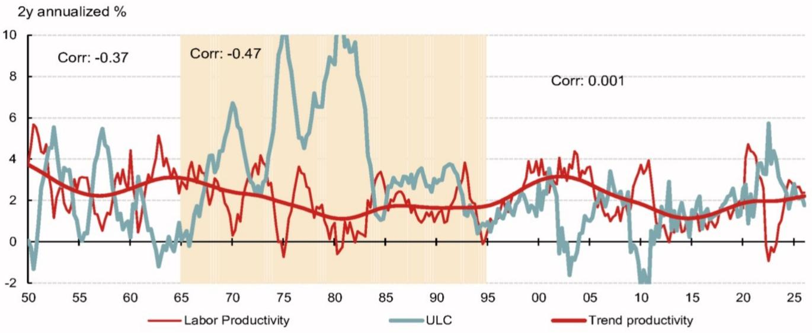

# AI驱动的生产率提升并非可靠的通胀下行路径，不应以此作为政策依据

认为人工智能将带来强劲通缩效应的观点，已成为当前宏观环境乐观情绪的核心支柱之一。美联储主席Kevin Warsh多次表示，技术驱动的生产率提升将在结构上产生通缩效果，甚至在提名前就写道“AI将成为重要的通缩力量”。这一观点具有实际的政策影响：它塑造了美联储在未采取预防性收紧的情况下，容忍高于趋势的增长、强劲的工资上涨和资产价格高企的意愿。然而，这一论点的证据远不如其支持者所声称的那么有力。对经济理论、历史数据和当前市场动态的仔细审视表明，生产率增长与通胀之间并不存在一致、可预测的关系。事实上，AI投资的短期影响已经显示出通胀效应，而长期通缩渠道要么被抵消力量削弱，要么缺乏实证支持。美联储不应假设未来的生产率提升能解决尚未解决的通胀问题。

这场辩论的利害关系非同寻常。如果美联储主席关于生产率通缩效应的判断有误，风险就不仅仅是预测错误，而是一流的政策失误——过于宽松的立场使通胀持续高企，迫使日后更严厉的收紧，或损害央行的信誉。如果他是对的，经济将实现软着陆，增长持续且通胀下降。问题不在于AI是否会提升生产率——早期证据表明它会——而在于这种生产率加速能否以可靠、与政策相关的方式转化为更低的通胀。基于对数据的严谨解读，答案是：不能。

本文从四个维度剖析“通缩性生产率”的逻辑：两者关系的理论模糊性、AI资本支出中已显现的通胀需求冲击、生产率与通胀历史相关性的瓦解，以及生产率可能或不可能降低价格压力的具体渠道。随后，这些发现被转化为决策框架，供政策制定者和观察者在美联储主席的深层直觉可能与证据不符的背景下参考。

## 通缩性生产率的理论依据存在模糊性，因为生产率也提振需求

生产率增长具有通缩效应的直觉基于一个简单的供给侧故事：当企业或行业变得更高效时，单位成本下降，竞争应推动价格走低。这一逻辑得到历史案例的支持，例如19世纪末金本位制下强劲的生产率增长与通缩并存。在固定货币供应体制下，更快的实际增长会机械地降低价格水平。但现代央行通过利率目标和积极的金融条件管理打破了这种机械联系。当生产率上升时，它也提高了实际收入并激励企业投资。这种需求侧效应可能是通胀性的，而非通缩性的。

生产率对通胀的净影响取决于在特定政策体制下哪个渠道占主导。在央行保持利率稳定而经济加速的情况下，需求渠道很可能占上风。生产率驱动的收入增长提振消费，而更高未来回报的前景推动资本支出。这两种力量都推高了总需求。美联储当前的姿态——在宽松的金融条件下——恰恰创造了生产率需求侧效应可能压倒任何供给侧缓解的环境。主席关于生产率最终将带来通缩的论点，依赖于供给侧效应随时间占主导的假设。但这一假设既没有明确的理论机制支持，也与过去两年的证据相矛盾。

## AI投资的短期通胀影响已体现在资本支出上升和技术组件价格上涨中

反对通缩性生产率论点最具体的证据显而易见。AI的资本支出正在蓬勃发展。超大规模云服务商和其他主要科技公司大幅增加了投资计划，这些支出正在推高技术组件、半导体及相关设备的价格。消费电子产品价格正在上涨。认为AI将使“技术触及的一切最终变得更便宜”的观点，正受到技术本身生产和部署成本上升这一现实的考验。

从超大规模云服务商的角度看，政策环境似乎是顺周期的。在美联储立场宽松、金融条件宽松的情况下，债务融资的AI设备投资的真实利率为深度负值，并随着需求增强而进一步下降。这创造了提前下单的强大激励，进一步提振需求并推高价格。财报电话会议证实，企业越来越愿意增加资本支出，活动仅受供应和设备可用性限制，而非成本敏感性。AI投资的通胀冲动并非理论上的可能性，它正在发生，并且在价格数据中可测量。

Warsh主席承认了这一需求冲动，但认为通缩性的生产率回报将滞后出现。在6月FOMC新闻发布会上，他表示“供给侧可能会扩张，但这需要更长时间，这很可能是一种直觉。”这是一个关键主张。它断言生产率的滞后效应将超过当前的通胀压力。但这一断言没有实证基础。生产率增长与通胀之间的历史关系不支持“今天生产率加速预示着明天通胀下降”的观点。事实上，趋势生产率与整体CPI之间的相关性一直不一致，尤其在近几十年表现不佳。

## 生产率与通胀的历史相关性已瓦解，尤其是自全球金融危机以来

如果生产率确实具有通缩效应，数据应显示趋势生产率增长与通胀之间存在一致的负相关。从20世纪60年代中期到90年代初期，这种关系有一定证据。但此后它已大幅减弱，并在2008年金融危机后实际上已瓦解。2010年代是一个有力的反例：整个十年生产率增长疲弱，而通胀也处于低位。“长期停滞”的支持者当时认为低生产率是通胀低迷的原因——这与通缩性生产率的故事正好相反。最近，通胀在疫情后飙升，同时趋势生产率加速。相关性（如果存在的话）近年来一直是正的。

这种瓦解并非统计假象。它反映了经济结构的变化，削弱了生产率与价格之间的联系。全球化、服务业重要性上升、无形资本的崛起以及劳动力市场动态的变化，都改变了生产率可能影响通胀的渠道。更快的生产率意味着更低通胀的简单故事已不再成立（如果它曾经成立的话）。依赖这种关系的政策制定者是在押注数据已不再支持的模式。

同样的模糊性也适用于生产率与经济闲置之间的关系。生产率增长常被视为正面的供给冲击，创造负产出缺口从而带来通缩。但数据显示，生产率趋势与劳动力市场闲置指标（如实际失业率与国会预算办公室非周期性失业率估计值之差）之间几乎没有相关性。存在的有限关系很可能是由反向因果关系驱动的。生产率在经济衰退初期往往上升，因为企业保留最关键的员工并削减效率较低的岗位，在需求疲软时期造成技术性飙升。疫情也产生了类似效应，因为停工对低生产率服务行业的影响尤为严重。一旦调整这些周期性波动，趋势劳动生产率和利用率调整后的全要素生产率等指标并未提供证据表明生产率与通缩性闲置相关。

## 单位劳动力成本渠道比看起来更弱，因为生产率推动工资和利润率调整

连接生产率与通胀最直观的渠道是通过单位劳动力成本。如果生产率加速而工资增长保持不变，单位劳动力成本下降，这应对价格产生下行压力。这一逻辑在数学上是正确的，但在经济上具有误导性，因为它假设工资不变。在更长的时间跨度内，生产率增长是实际工资较强的驱动因素之一。更快的生产率意味着工人可以要求并获得更高的报酬。单位劳动力成本公式中的分子与分母同向变动，对单位劳动力成本的净影响是不确定的。

从实证角度看，生产率与单位劳动力成本之间的相关性随时间变化，近几十年来一直较弱。生产率并不会机械地降低单位劳动力成本，因为工资增长会调整。此外，从单位劳动力成本到最终价格的传导并非自动的。利润率通常会调整以吸收劳动力成本的变化，尤其是当生产率因资本深化而提高时。消费者篮子中的很大一部分对国内劳动力成本相对不敏感，包括进口商品和住房服务。在实践中，虽然单位劳动力成本与通胀有合理的同期相关性，但作为未来通胀的预测指标，它们几乎没有或根本没有价值。该渠道在理论上存在，但在现实中因抵消力量而被削弱。

## 决策框架：生产率在实时政策与前瞻策略中的条件性作用

上述分析指出了政策制定中使用生产率数据的两种不同用途之间的明确区别。第一种是实时校准。当生产率加速时，它为美联储容忍产出和工资更强劲增长而不立即收紧提供了理由。这是Alan Greenspan主席在1990年代提出的论点，有其合理性。如果生产率确实在上升，经济可以更快增长而不会因劳动力市场紧张产生通胀压力。这是一种条件性的、同期的判断，表明在当前生产率水平下，经济有更大的运行空间。

第二种是前瞻策略。这是指预期的未来生产率增长应导致美联储预期通缩，从而在今天保持宽松立场。这是一个弱得多的论点。它需要假设未来的生产率不仅会提振供给，而且提振幅度会超过对需求的提振，且净效应将是通缩性的。证据不支持这一假设。生产率增长可能具有通胀效应的主要渠道是通过更高的实际收入和投资激励来提振需求。预期未来生产率强劲的政策制定者应考虑无条件影响，而非将需求增长视为给定的局部关系。

对当前美联储的实际意义是，主席关于通缩性生产率的深层直觉不应成为非对称政策立场的基础。因为今天生产率强劲而避免预防性加息是一回事；因为预期明天生产率更强劲而推迟收紧则是另一回事。前者是合理的实时判断，后者是对数据不支持的理论的押注。这种区别很重要，因为判断错误的成本是非对称的。如果美联储基于未实现的预期通缩而保持过于宽松的立场，通胀将持续高企，信誉受损。如果美联储预防性收紧而生产率带来意外的通缩，代价是经济略微放缓，这是可以逆转的。审慎的做法是将生产率视为实时条件变量，而非通缩的前瞻预测。

短期通胀轨迹可能为这种方法提供掩护。通胀势头似乎已见顶。整体通胀已降温，月度核心读数可能因关税传导减弱和剩余季节性因素而逐步放缓。这种“通缩与生产率”的组合足以维持当前政策立场，而无需依赖“生产率本身在推动价格下降”这一更强的主张。美联储不需要相信通缩性生产率来证明其当前立场的合理性。它只需要看到通胀正朝着正确方向发展，同时经济保持韧性。这是一个比押注数据反复未能证实的理论关系更站得住脚的立场。

*仅供参考。部分内容可能基于源材料通过AI辅助生成、翻译、总结或编辑，可能存在遗漏或错误。请独立核实。本文不构成专业建议。*

仅供参考。部分内容可能基于源材料通过AI辅助生成、翻译、总结或编辑，可能存在遗漏或错误。请独立核实。本文不构成专业建议。

