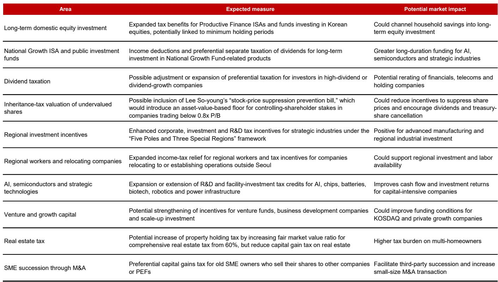
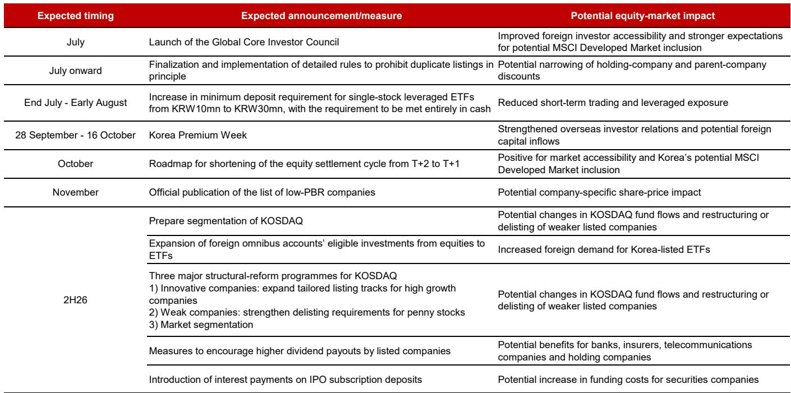
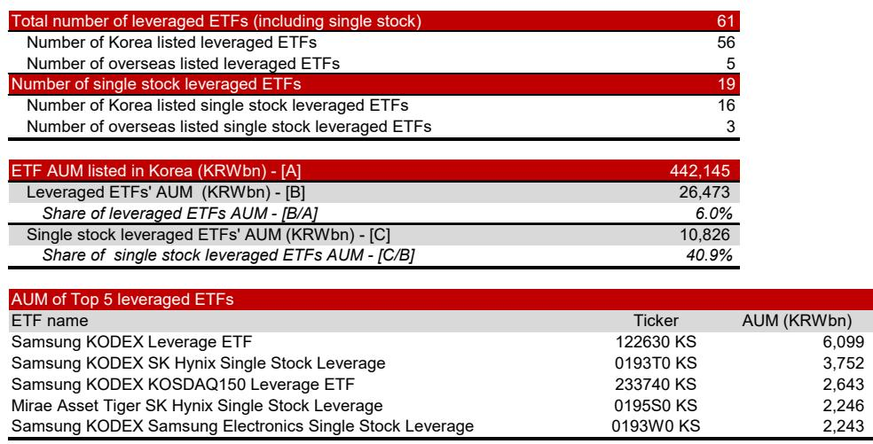

# NOM：研究主题与行业变化观察

韩国综合报价指数从2026年6月22日的9,115点高点回落至7月24日的6,691点，跌幅约27%。NOM在最新研报中认为，这一回调主要由外资机械性观点偏谨慎、杠杆ETF扩张和机构资金配置触及上限三股力量叠加造成，而非企业基本面出现变化。随着去杠杆进程推进，下一阶段韩国市场的再定价将依赖企业公司回购和库存股注销，尤其是两家大型半导体公司的回购计划。NOM维持KOSPI 10,000-11,000点的目标区间。

## 1. 外资卖出与杠杆产品放大了市场波动

NOM测算，截至7月24日，外资年内累计净观点偏谨慎韩股约158万亿韩元（约1,080亿美元）。触发因素并非基本面变化，而是韩国在MSCI新兴市场指数中的权重上升后，部分机构产品因持仓比例超过内部风控上限而被迫减仓。与此同时，韩国杠杆ETF市场规模已达约27万亿韩元，占全部ETF资产规模的6%，其中约85%由散户持有。自6月22日高点以来，杠杆ETF回报率为-53%，远高于KOSPI同期-22%的跌幅。散户追加保证金和强制平仓数量激增，促使韩国政府在7月16日宣布收紧单一公司杠杆ETF的研究资格要求。

> **KC评论：** 报告区分了两种不同的下跌力量——外资是“超配后的机械减仓”，散户杠杆是“追涨后的被动去杠杆”。前者有明确的仓位阈值，后者则与零售情绪和流动性环境更相关。两者同时出现时，市场波动率往往被放大到超出基本面所能解释的范围。

## 2. 企业回购将成为新的结构性需求来源

NOM认为，随着外资观点偏谨慎不确定性逐步缓解，韩国市场的下一个支撑来自企业回购。报告估算，2026至2028年KOSPI回购规模将分别达到116万亿、274万亿和328万亿韩元，其中约90%来自两家大型半导体公司（含员工奖金和股东回报用途）。以2026年为例，116万亿韩元的回购规模相当于KOSPI总市值的2.2%，远高于2018-2025年期间0.2%-0.9%的水平。若剔除两家半导体公司，其余企业的回购比例约为4.9%，仍高于历史均值但增幅有限。NOM强调，这一回购预测高度依赖半导体公司的自由现金流和股东回报承诺，存在执行不及预期的不确定性。

## 3. 政策催化集中在低市净率名单和税收改革

报告指出，2026年下半年韩国政策层面的关键节点包括：低市净率公司名单的公布（预计11月）、单一公司杠杆ETF的进一步收紧、以及7月底提出的税改方案。NOM认为，低市净率名单可能成为最直接的公司层面催化剂，推动企业进行库存股注销、提高分红和处置非核心资产。税改方面，报告预期将包含三项内容：通过个人储蓄账户和养老金账户对长期国内公司研究给予更高税收优惠；改革遗产与赠与税框架，降低控股股东压低报价的动机；以及加大对AI、半导体等战略产业的税收抵免。这些措施若落地，将进一步强化企业提升资本效率和股东回报的激励。

## 4. 估值仍处于历史低位，但再定价依赖盈利兑现

当前KOSPI基于2026年预期盈利的市盈率约为7.0倍，市净率约1.7倍，均低于NOM目标区间所对应的10.5-11.5倍市盈率和2.5-2.8倍市净率。报告认为，实现再定价需要四个条件同时成立：AI相关盈利（存储/HBM、电力设备、储能、核电）在未来五年持续支撑ROE；上市公司转向更优的资本效率和杠杆水平；积极股东行动持续推动治理改善；以及监管层强制执行更严格的目标ROE披露和上市规则。节奏变化不确定性方面，NOM特别提醒，若KOSPI回升至7,500-9,000点区间而盈利未同步上调，外资可能再次触发机械性观点偏谨慎。

For informational purposes only. Portions may be generated,translated,summarized,or edited with AI assistance based on source materials and may contain omissions or errors. Please verify independently. This is not investment,legal,tax,accounting,or other professional advice.

For informational purposes only. Portions may be generated,translated,summarized,or edited with AI assistance based on source materials and may contain omissions or errors. Please verify independently. This is not investment,legal,tax,accounting,or other professional advice.

