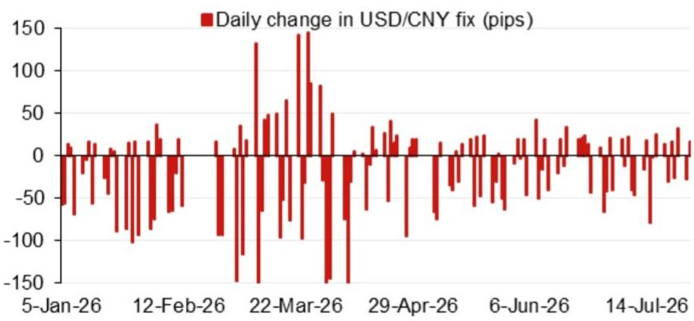
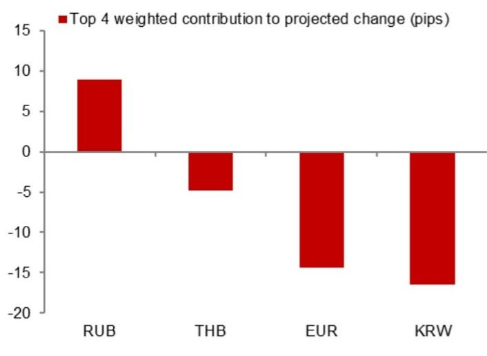

# NOM：CNY中间价模型-7月29日定价6.7640

NOM亚洲外汇策略团队在7月29日发布的USD/CNY中间价模型中，给出了当日定价预测：6.7640。这一预测值较前一日的模型预测值6.7928下降了288个基点，较前一日官方收盘价则低了34个基点。模型同时提供了引入逆周期因子后的调整值6.7727，较前一日实际中间价下降201个基点。这份报告的核心价值不在于单日预测的准确性，而在于其提供了一个可追踪的中间价形成机制框架，让市场参与者能够拆解每日定价中来自隔夜市场变动、官方调节意图以及模型误差的各自贡献。

## 1. 隔夜市场变动是模型预测下移的主要驱动因素

报告图1展示了当日模型预测变动中权重最高的四个隔夜贡献项。模型预测值较前一日大幅下移288个基点，主要反映的是隔夜美元指数变动、离岸人民币汇率波动以及主要交叉汇率的变化。NOM模型通过量化这些外部输入对中间价的影响，使得市场可以区分“被动跟随市场”与“主动调节”的成分。这种拆解对于理解中国央行的汇率管理节奏至关重要——当模型预测与实际中间价出现持续偏差时，往往意味着逆周期因子在发挥作用。

## 2. 逆周期因子提供了额外的调节空间

引入逆周期因子后，模型预测值调整为6.7727，较无因子版本高出87个基点。这意味着逆周期因子在当日起到了缓冲作用，部分抵消了隔夜市场变动带来的节奏变化不确定性。NOM报告没有对逆周期因子的具体计算公式进行披露，但其提供的双版本预测框架本身就是一个观察窗口：当两个版本之间的差值扩大时，表明官方在主动管理市场预期；当差值收窄或消失时，则意味着官方对市场定价的干预程度降低。

> **KC评论：** 逆周期因子不是固定参数，而是央行根据市场环境和政策目标动态调整的工具。NOM的模型通过同时输出有因子和无因子两个版本，让读者可以自行判断官方干预的方向和力度。如果连续多日有因子版本显著高于无因子版本，说明央行在主动引导中间价走弱以缓解贬值不确定性。

## 3. 模型误差的历史分布提供了预测可信度的参考

报告图2展示了近期模型误差（无逆周期因子版本）的分布情况。误差的大小和方向并非随机，而是呈现出一定的序列相关性。NOM团队在报告中保留了这些误差数据，意味着他们承认模型并非完美，而使用者需要结合误差的历史模式来判断当前预测的置信区间。例如，如果模型在过去一周持续高估或低估实际中间价，那么当日的预测值就需要相应调整。这种透明的误差披露，比单纯给出一个点预测更有分析价值。

## 4. 未来事件日历为中间价走势提供了宏观背景

报告末尾的日历列出了2026年下半年的一系列重要事件：7月底的政治局宏观环境工作会议、8月中旬的央行二季度货币政策报告、9月24日中国国家主席对美国的国事访问、9月底的央行货币政策委员会会议，以及10月初的国庆黄金周假期。这些事件构成了中间价走势的宏观背景。特别是9月的访美行程，可能意味着在此之前汇率政策会保持相对稳定，以避免给双边对话增加不必要的摩擦。政治局会议和央行报告则提供了观察国内政策基调的窗口，而黄金周期间的流动性变化也会对汇率产生阶段性影响。

NOM的这份报告虽然聚焦于单日中间价预测，但其提供的分析框架——隔夜市场贡献、逆周期因子调节、模型误差追踪、宏观事件映射——构成了一个完整的汇率政策观察体系。对于关注人民币汇率走势的读者而言，真正有价值的不是6.7640这个数字本身，而是理解这个数字是如何被拆解出来的，以及哪些因素在驱动它变化。

For informational purposes only. Portions may be generated,translated,summarized,or edited with AI assistance based on source materials and may contain omissions or errors. Please verify independently. This is not investment,legal,tax,accounting,or other professional advice.

For informational purposes only. Portions may be generated,translated,summarized,or edited with AI assistance based on source materials and may contain omissions or errors. Please verify independently. This is not investment,legal,tax,accounting,or other professional advice.

