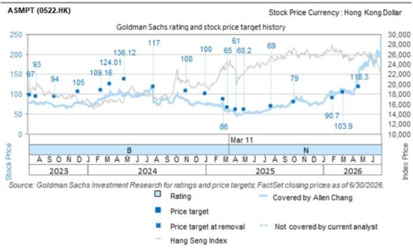

# ASMPT (0522.HK): 3Q26 收入预计环比增长0%至9%；2Q26业绩超预期；TCB有望受益于AI基础设施需求周期

ASMPT 3Q26收入指引为6.3亿至6.9亿美元（或49亿至54亿港元），同比增长35%至48%，环比增长0%至9%；中位数6.6亿美元（或52亿港元）高于我们此前预测的47亿港元及Visible Alpha一致预期的47亿港元。管理层对TCB的市场潜力持积极态度，并预计在AI相关需求推动下，SEMI和SMT板块在2026年将实现销售增长。管理层指出，公司在2Q26获得了领先IDM客户的订单，并预计在AI发展的推动下将实现强劲增长。2Q26收入（环比增长24%）高于管理层指引、GS预测及Visible Alpha一致预期；毛利率（42.4%）高于我们预期的39.4%和市场预期的40.1%。订单出货比为1.43，与上季度水平相当。净利润为3.35亿港元（GS预测为3.62亿港元/一致预期为3.32亿港元），略低于我们的预期，与Visible Alpha一致预期相符。

图表1：3Q26指引

| | 3Q26指引 | GS预测 | 一致预期 |
|---|---|---|---|
| 收入 | 6.3亿~6.9亿美元 | 47.29亿港元 | 47.43亿港元 |
| 毛利率 | | 40.9% | 39.7% |

来源：公司数据，GS全球研究，Visible Alpha一致预期数据

## 2Q26业绩

■ 收入高于GS预测/一致预期：收入为49亿港元（环比增长24%，同比增长52%），高于我们/市场（Visible Alpha）预期的45亿港元，并高于公司指引中位数（42亿至47亿港元）。

毛利率环比提升：毛利率为42.4%（环比提升292个基点/同比提升284个基点），高于我们/一致预期的39.4%/40.1%。在SMT和SEMI两个板块中，受产品组合和销量提升支撑，毛利率均实现环比增长。

■ 营业利润高于GS预测/一致预期：营业费用率为26.5%（2Q25为33.4%，1Q26为29.8%），低于我们预期的28.6%和市场预期的29.9%，主要得益于费用控制。营业利润为7.86亿港元（环比增长104%），分别高于GS预测/一致预期64%/71%。

■ 净利润低于GS预测/与一致预期持平：净利润为3.35亿港元，低于GS预测（3.62亿港元），与一致预期（3.32亿港元）持平。

订单出货比为1.43（上季度为1.43，1Q25为1.11）。2Q26集团订单为9.04亿美元（环比增长24%，同比增长87%）。

Allen Chang
+852-2978-2930 |
allen.k.chang@gs.com
GS（亚洲）有限责任公司

Verena Jeng
+852-2978-1681 | verena.jeng@gs.com
GS（亚洲）有限责任公司

Yifan Hu
+852-2978-0996 | yifan.hu@gs.com
GS（亚洲）有限责任公司

图表2：2Q26业绩概览（已公布）

| （百万港元） | 2Q26实际 | 2Q26GS预测 | 差异 | 2Q26一致预期 | 差异 | 1Q26 | 环比 | 2Q25 | 同比 |
|---|---|---|---|---|---|---|---|---|---|
| 收入 | 4,936 | 4,462 | 11% | 4,508 | 9% | 3,967 | 24% | 3,244 | 52% |
| 毛利润 | 2,092 | 1,756 | 19% | 1,808 | 16% | 1,566 | 34% | 1,283 | 63% |
| 营业利润 | 786 | 479 | 64% | 459 | 71% | 385 | 104% | 200 | 294% |
| 税前利润 | 645 | 483 | 34% | 527 | 23% | 445 | 45% | 132 | 388% |
| 净利润 | 335 | 362 | -7% | 332 | 1% | 254 | 32% | 131 | 155% |
| 每股收益 | 0.80 | 0.87 | -8% | 0.78 | 3% | 0.61 | 32% | 0.31 | 158% |
| **利润率** | | | | | | | | | |
| 毛利率 | 42.4% | 39.4% | | 40.1% | | 39.5% | | 39.6% | |
| 营业利润率 | 15.9% | 10.7% | | 10.2% | | 9.7% | | 6.2% | |
| 净利润率 | 6.8% | 8.1% | | 7.4% | | 6.4% | | 4.0% | |

来源：公司数据，GS全球研究，彭博

## 目标价方法及风险 - ASMPT

估值方法：我们对ASMPT给予中性评级，12个月目标价为206港元，基于29.5倍2030年预期市盈率（折现回2027年）。目标市盈率来源于同行业公司市盈率与净利润同比增速及营业利润率的关联性。

主要上行/下行风险：1）客户对先进封装工具的采用速度快于/慢于预期；2）汽车客户需求强于/弱于预期；3）传统IC封装及SMT设备需求强于/弱于预期。

| 0522.HK | 12个月目标价：206.00港元 | 现价：139.50港元 | 潜在空间：47.7% |
|---|---|---|---|
| 中性 | GS预测 | | |
| | | 12/25 | 12/26E | 12/27E | 12/28E |
| 市值：575亿港元/73亿美元 | 收入（百万港元） | 14,146.5 | 18,151.1 | 22,356.3 | 25,764.4 |
| 企业价值：552亿港元/70亿美元 | EBITDA（百万港元） | 1,183.7 | 2,616.8 | 3,814.9 | 4,482.4 |
| 3个月日均交易量：8.44亿港元/1.077亿美元 | 每股收益（港元） | 2.17 | 3.55 | 5.75 | 6.89 |
| 中国大中华区科技并购排名：3 | 市盈率（倍） | 31.2 | 39.3 | 24.3 | 20.2 |
| 租赁是否计入净债务及企业价值：否 | 市净率（倍） | 1.7 | 3.3 | 3.2 | 3.0 |
| | 股息率（%） | 2.1 | 1.7 | 2.7 | 3.2 |
| | 净债务/EBITDA（不含租赁，倍） | (1.9) | (0.9) | (0.7) | (0.7) |
| | CROCI（%） | 3.0 | 11.1 | 14.5 | 15.8 |
| | 自由现金流回报表现（%） | (0.5) | 1.2 | 2.0 | 3.5 |
| | | 3/26 | 6/26E | 9/26E | 12/26E |
| | 每股收益（港元） | 0.61 | 0.87 | 0.96 | 1.11 |

来源：公司数据，GS预测，FactSet。价格截至2026年7月28日收盘。

## 披露附录

## Reg AC

我们，Allen Chang、Verena Jeng和Yifan Hu，特此证明本报告中表达的所有观点准确反映了我们个人对相关公司及其证券的看法。我们还证明，我们的薪酬中没有任何部分直接或间接与本报告中表达的具体建议或观点相关。

除非另有说明，本报告封面所列人员为GS全球研究部门的分析师。

撰稿作者：Allen Chang GS（亚洲）有限责任公司，Verena Jeng GS（亚洲）有限责任公司，Yifan Hu GS（亚洲）有限责任公司。

除非另有说明，本报告撰稿作者披露中列出的个人为GS全球研究部门的分析师。

## GS因子概况

GS因子概况通过将股票的关键属性与市场（即我们的评级股票范围）及其行业同行进行比较，提供投资背景。所描述的四个关键属性是：增长、财务回报、倍数（例如估值）和综合（增长、财务回报和倍数的组合）。增长、财务回报和倍数是使用每只股票特定指标的标准化排名计算得出的。然后将指标的标准化排名平均并转换为相关属性的百分位数。每个指标的具体计算可能因财年、行业和地区而异，但标准方法如下：

增长基于股票的前瞻性销售增长、EBITDA增长和每股收益增长（对于金融股，仅每股收益和销售增长），较高的百分位数表示增长较高的公司。财务回报基于股票的前瞻性ROE、ROCE和CROCI（对于金融股，仅ROE），较高的百分位数表示财务回报较高的公司。倍数基于股票的前瞻性市盈率、市净率、价格/股息（P/D）、EV/EBITDA、EV/FCF和EV/债务调整后现金流（DACF）（对于金融股，仅市盈率、市净率和P/D），较高的百分位数表示以较高倍数交易的股票。综合百分位数计算为增长百分位数、财务回报百分位数和（100% - 倍数百分位数）的平均值。

财务回报和倍数使用GS分析师对未来至少三个季度后的财年末的预测。增长使用未来至少七个季度后的财年输入，与未来至少三个季度后的财年进行比较（所有指标均按每股计算）。

有关我们如何计算GS因子概况的更详细说明，请联系您的GS代表。

## 并购排名

在我们的全球覆盖范围内，我们使用并购框架检查股票，考虑定性因素和定量因素（可能因行业和地区而异），以纳入某些公司可能被收购的可能性。然后，我们将并购排名作为对我们评级覆盖范围内的公司从1到3进行评分的一种方式，其中1表示公司成为收购目标的可能性较高（30%-50%），2表示中等可能性（15%-30%），3表示低可能性（0%-15%）。对于排名为1或2的公司，根据我们的标准部门指南，我们将并购组成部分纳入我们的目标价。并购排名3被认为不重要，因此不计入我们的目标价，并且可能在研究中讨论或不讨论。

## Quantum

Quantum是GS专有数据库，提供详细的财务报表历史、预测和比率。它可用于对单个公司进行深入分析，或比较不同行业和市场的公司。

## 披露

ASMPT的评级相对于其覆盖范围内的其他公司：AAC、ACM Research、AMEC、ASMPT、AVC、AccoTest、Anji Micro、Asus、Auras、BOE、BYDE、Biren、CR Micro、Cambricon、Chenbro、中国移动（香港）、中国电信、中国铁塔股份有限公司、中国联通、中软国际、Compal、德赛西威、E Ink、E-Town Semis、亿航智能、Empyrean、Eoptolink、FOCI、Fositek、富士康工业互联网、技嘉、Gigadevice、广联达、HTC、海康威视、鸿海、地平线、华虹、华测导航、华勤技术（A股）、华勤技术（H股）、华海清科、Iluvatar、英诺赛科、浪潮、影石创新、Inventec、长电科技、Kematik、King Slide、金蝶、金山办公、LandMark、大立光、联想、领益智造、卓胜微、美图、MetaX、Mitac、Montage（A股）、Montage（H股）、北方华创、NSIG、Nexchip、OmniVision、和硕、小马智行（ADR）、小马智行（H股）、广达、RoboTechnik、锐捷网络、圣邦微、SICC、中芯国际（A股）、中芯国际（H股）、SZS、深信服、商汤科技、生益科技、深南电路、斯达半导、舜宇光学、TFC Optical、中科创达、通宇通讯、传音控股、UMT、UNIS、VPEC、Vanchip、VeriSilicon、Victory Giant、WNC、WUS、文远知行、纬创、Wiwynn、YJ Semitech、长飞光纤、用友网络、中兴通讯（A股）、中兴通讯（H股）、科大讯飞

## 公司特定监管披露

以下披露涉及GS集团（及其关联公司，“GS”）与本研究中提及的GS全球研究覆盖公司之间的关系。

截至本报告前一个月末，GS实益拥有普通股1%或以上（不包括根据美国证券法无需汇总的关联公司和业务部门持有的头寸）：ASMPT（139.50港元）

## 评级/投资银行关系分布

GS投资研究全球股票覆盖范围

| | 评级分布 | | | 投资银行关系 | | |
|---|---|---|---|---|---|---|
| | 买入 | 持有 | 卖出 | 买入 | 持有 | 卖出 |
| 全球 | 50% | 34% | 16% | 65% | 59% | 43% |

截至2026年7月1日，GS全球投资研究对3,104只股票有投资评级。GS将股票指定为买入和卖出，纳入各种区域投资清单；未如此指定的股票被视为中性。此类分配等同于FINRA规则要求的上述披露中的买入、持有和卖出。请参阅下面的“评级、覆盖范围和相关定义”。投资银行关系图反映了每个评级类别中GS在过去十二个月内提供过投资银行服务的公司百分比。

目标价和评级历史图表

所示目标价应结合所有先前发布的GS报告（可能包含或不包含目标价）以及公司、行业和金融市场的发展情况来考虑。

## 目标价历史表 ASMPT (0522.HK)

| 报告日期 | 目标价（港元） | 收盘价（港元） |
|---|---|---|
| 2026年7月13日 | 206.00 | 185.40 |
| 2026年4月22日 | 118.30 | 152.20 |
| 2026年3月5日 | 103.90 | 112.40 |
| 2026年1月30日 | 90.70 | 103.90 |
| 2025年10月2日 | 79.00 | 85.00 |
| 2025年7月23日 | 69.00 | 63.20 |
| 2025年5月1日 | 60.20 | 52.20 |
| 2025年4月6日 | 61.00 | 53.65 |
| 2025年3月11日 | 65.00 | 58.25 |
| 2025年2月26日 | 86.00 | 64.05 |
| 2025年1月1日 | 100.00 | 74.90 |
| 2024年11月1日 | 108.00 | 83.75 |
| 2024年7月25日 | 117.00 | 78.70 |
| 2024年4月24日 | 136.12 | 102.30 |
| 2024年3月12日 | 124.01 | 108.30 |
| 2024年2月29日 | 109.16 | 95.95 |
| 2024年2月12日 | 109.16 | 85.70 |
| 2023年12月3日 | 105.00 | 79.05 |
| 2023年9月21日 | 94.00 | 66.85 |

表中所示目标价未针对公司行为进行调整。

## 监管披露

## 美国法律法规要求的披露

请参阅上述公司特定监管披露，了解本报告中提及的公司所需的任何以下披露：待处理交易中的经理或联合经理；1%或其他所有权；特定服务的报酬；客户关系类型；先前期间的已管理/联合管理公开发行；董事职位；对于股票，做市和/或专家角色。GS可能作为本金交易本报告中讨论的发行人的债务证券（或相关衍生品）。

以下是额外要求的披露：所有权和重大利益冲突：GS政策禁止其分析师、向分析师报告的专业人员及其家庭成员持有分析师覆盖范围内任何公司的证券。分析师薪酬：分析师的薪酬部分基于GS的盈利能力，其中包括投资银行收入。分析师作为高级职员或董事：GS政策通常禁止其分析师、向分析师报告的人员或其家庭成员担任分析师覆盖范围内任何公司的高级职员、董事或顾问。非美国分析师：非美国分析师可能不是GS有限责任公司的关联人员，因此可能不受FINRA规则2241或FINRA规则2242关于与主题公司沟通、公开露面以及交易分析师所覆盖证券的限制。

## 美国以外司法管辖区法律法规要求的额外披露

以下披露是相关司法管辖区要求的，除非已根据美国法律在上述范围内作出。澳大利亚：GS澳大利亚有限公司及其关联公司不是澳大利亚的授权存款机构（该术语在1959年银行法（联邦）中定义），并且不提供银行服务，也不在澳大利亚开展银行业务。除非GS另有约定，本研究及其任何访问权限仅适用于澳大利亚公司法意义上的“批发客户”。在制作研究报告时，GS澳大利亚全球投资研究成员可能会参加由其研究报告主题的公司和其他实体主办或组织的现场访问和其他会议。在某些情况下，如果GS澳大利亚认为在特定情况下与现场访问或会议相关且合理，此类现场访问或会议的费用可能部分或全部由相关发行人承担。如果本文档内容包含任何金融产品建议，则仅为一般性建议，由GS在不考虑客户的目标、财务状况或需求的情况下编制。客户在根据任何此类建议采取行动之前，应考虑该建议是否适合其自身的目标、财务状况和需求。某些GS澳大利亚和新西兰利益披露的副本以及GS澳大利亚卖方研究独立性政策声明的副本可在以下网址获取：https://www.goldmansachs.com/disclosures/australia-new-zealand/index.html。巴西：有关CVM第20号决议的披露信息可在https://www.gs.com/worldwide/brazil/area/gir/index.html获取。在适用的情况下，根据CVM第20号决议第20条的定义，本研究报告内容的主要巴西注册分析师为本报告开头指定的第一作者，除非文本末尾另有说明。加拿大：此信息仅供您参考，在任何情况下均不应被解释为GS有限责任公司为在加拿大购买任何加拿大证券而进行的广告、要约或招揽。GS有限责任公司未在加拿大任何司法管辖区根据适用的加拿大证券法注册为交易商，通常不允许交易加拿大证券，并且可能被禁止在加拿大某些司法管辖区销售某些证券和产品。如果您希望在加拿大交易任何加拿大证券或其他产品，请联系GS加拿大公司（GS集团的关联公司）或其他注册的加拿大交易商。香港：可根据要求从GS（亚洲）有限责任公司获取本研究中提及的覆盖公司证券的进一步信息。印度：可从GS（印度）证券私人有限公司获取本研究中提及的主题公司或公司的进一步信息，研究分析师 - SEBI注册号INH000001493，地址：10th Floor, Ascent-Worli, Sudam Kalu Ahire Marg, Worli, Mumbai-400 025, India，公司识别号U74140MH2006FTC160634，电话+91 22 6616 9000，传真+91 22 6616 9001。GS可能实益拥有本研究报告主题公司或公司1%或以上的证券（该术语在1956年印度证券合同（监管）法第2(h)条中定义）。SEBI的注册和NISM的认证绝不保证中介机构的业绩或向读者提供任何回报保证。GS（印度）证券私人有限公司的合规官和读者投诉联系详情、年度合规审计报告副本以及其他相关信息和披露可在以下链接找到：https://www.goldmansachs.com/worldwide/india/research-analyst。日本：见下文。韩国：除非GS另有约定，本研究及其任何访问权限仅适用于金融服务和资本市场法意义上的“专业读者”。可从GS（亚洲）有限责任公司首尔分行获取本研究中提及的主题公司或公司的进一步信息。新西兰：GS新西兰有限公司及其关联公司不是新西兰的“注册银行”或“存款接受者”（定义见1989年新西兰储备银行法）。除非GS另有约定，本研究及其任何访问权限适用于“批发客户”（定义见2008年金融顾问法）。某些GS澳大利亚和新西兰利益披露的副本可在以下网址获取：https://www.goldmansachs.com/disclosures/australia-new-zealand/index.html。俄罗斯：在俄罗斯联邦分发的研究报告不是俄罗斯立法中定义的广告，而是信息和分析，其主要目的不是产品推广，并且不提供俄罗斯评估活动立法意义上的评估。研究报告不构成俄罗斯法律法规定义的个人化研究交流，不针对特定客户，并且是在未分析客户的财务状况、投资概况或风险概况的情况下准备的。GS对客户或任何其他人基于本研究报告可能做出的任何投资决策不承担任何责任。新加坡：GS（新加坡）私人有限公司（公司编号：198602165W），受新加坡金融管理局监管，接受对本研究的法律责任，如有任何与本相关的事宜，应联系该公司。台湾：此材料仅供参考，未经许可不得转载。读者应仔细考虑自身的投资风险。投资结果由个人读者负责。英国：在英国被归类为零售客户（定义见金融行为监管局规则）的人士，应结合先前GS关于本研究中提及的覆盖公司的研究报告阅读本研究，并应参考GS国际已发送给他们的风险警告。这些风险警告的副本以及本报告中使用的某些金融术语的词汇表，可应要求从GS国际获取。

欧盟和英国：关于欧盟委员会授权条例（EU）（2016/958）第6(2)条（包括该授权条例在英国脱离欧盟和欧洲经济区后转化为英国国内法律和法规）的披露信息，涉及研究交流客观呈现的技术安排以及特定利益或利益冲突迹象披露的技术标准，可在https://www.gs.com/disclosures/europeanpolicy.html获取，其中说明了与投资研究相关的利益冲突管理欧洲政策。

日本：GS日本有限公司是在关东财务局注册的金融工具交易商，注册号金商第69号，是日本证券业协会、日本金融期货协会、第二类金融工具交易商协会和日本投资管理协会的成员。股票买卖需收取与客户预先确定的佣金加消费税。有关日本证券交易所、日本证券业协会或日本证券金融公司要求的任何适用披露，请参阅公司特定披露。

## 评级、覆盖范围和相关定义

买入（B）、中性（N）、卖出（S）分析师建议将股票作为买入或卖出纳入各种区域投资清单。被指定为投资清单上的买入或卖出取决于股票相对于其覆盖范围的总回报潜力。任何未被指定为投资清单上的买入或卖出且具有有效评级（即，非评级暂停、未评级、早期生物技术、覆盖暂停或未覆盖）的股票被视为中性。每个区域管理区域信念清单，这些清单选自各自区域投资清单中评级为买入的股票，代表侧重于总回报潜力大小和/或在其各自覆盖区域内实现回报的可能性的研究交流。此类信念清单中股票的添加或移除由每个相应区域的投资审查委员会或其他指定委员会管理，并不代表分析师对此类股票投资评级的改变。

总回报潜力代表当前股价与目标价之间的上行或下行差异，包括在目标价相关时间范围内预期支付或预期的所有股息。所有覆盖的股票都需要目标价。总回报潜力、目标价和相关时间范围在每份添加或重申投资清单成员资格的报告中有说明。

覆盖范围：每个覆盖范围中所有股票的列表可通过主要分析师、股票和覆盖范围在https://www.gs.com/research/hedge.html获取。

未评级（NR）。当GS在涉及该公司的合并或战略交易中担任顾问角色时，当存在法律、监管或政策限制（由于GS参与交易）时，以及在某些其他情况下，根据GS政策，投资评级、目标价和盈利预测（如相关）将被移除。早期生物技术（ES）。当该公司没有已通过II期临床试验的药物、治疗或医疗设备，也没有分销后II期药物、治疗或医疗设备的许可时，根据GS政策，不分配投资评级和目标价。评级暂停（RS）。GS已暂停对该股票的投资评级和目标价，因为没有足够的基本面基础来确定投资评级或目标价。先前的投资评级和目标价（如有）不再对该股票有效，不应依赖。覆盖暂停（CS）。GS已暂停对该公司的覆盖。未覆盖（NC）。GS不覆盖该公司。

## 全球产品；分发实体

GS全球投资研究为GS客户在全球范围内制作和分发研究产品。位于GS全球各办事处的分析师对行业和公司以及宏观经济、货币、大宗商品和投资组合策略进行研究。本研究在澳大利亚由GS澳大利亚有限公司（ABN 21 006 797 897）分发；在巴西由GS巴西证券交易经纪公司分发；GS巴西公共沟通渠道：0800 727 5764 和/或 contatogoldmanbrasil@gs.com。工作日（节假日除外），上午9点至下午6点。GS巴西公众沟通渠道：0800 727 5764 和/或 contatogoldmanbrasil@gs.com。营业时间：周一至周五（节假日除外），上午9点至下午6点；在加拿大由GS有限责任公司分发；在香港由GS（亚洲）有限责任公司分发；在印度由GS（印度）证券私人有限公司分发；在日本由GS日本有限公司分发；在大韩民国由GS（亚洲）有限责任公司首尔分行分发；在新西兰由GS新西兰有限公司分发；在俄罗斯由GS有限责任公司分发；在新加坡由GS（新加坡）私人有限公司（公司编号：198602165W）分发；在美国由GS有限责任公司分发。GS国际已批准本研究在英国的分发。

GS国际（“GSI”），由审慎监管局（“PRA”）授权并由金融行为监管局（“FCA”）和PRA监管，已批准本研究在英国的分发。

欧洲经济区：GS欧洲银行（“GSBE”）是一家在德国注册的信贷机构，在单一监管机制内，受欧洲中央银行直接审慎监管，并在其他方面受德国联邦金融监管局（BaFin）和德国联邦银行监管，并在欧洲经济区内分发研究。

## 一般披露

本研究仅供我们的客户使用。除与GS相关的披露外，本研究基于我们认为可靠的当前公开信息，但我们不声明其准确或完整，并且不应依赖于此。本文所含信息、意见、估计和预测截至本文日期，如有更改，恕不另行通知。我们力求在适当的时候更新我们的研究，但各种法规可能阻止我们这样做。除某些定期发布的行业报告外，大部分报告根据分析师的判断不定期发布。

GS开展全球全方位服务、综合投资银行、投资管理和经纪业务。我们与全球投资研究覆盖的相当大比例的公司有投资银行和其他业务关系。GS有限责任公司，美国经纪交易商，是SIPC的成员（https://www.sipc.org）。

我们的销售人员、交易员和其他专业人士可能会向我们的客户和主要交易部门提供口头或书面的市场评论或交易策略，这些评论或策略反映了与本研究中表达的意见相反的意见。我们的资产管理领域、主要交易部门和投资业务可能做出与本研究中表达的建议或观点不一致的投资决策。

本报告中指定的分析师可能不时与我们的客户（包括GS销售人员和交易员）讨论，或在本报告中讨论，交易策略，这些策略涉及可能对本报告中讨论的股票市场价格产生近期影响的催化剂或事件，这种影响可能在方向上与分析师的已发布目标价预期相反。任何此类交易策略都不同于且不影响分析师对此类股票的基本股票评级，该评级反映了股票相对于其覆盖范围的总回报潜力，如本文所述。

我们和我们的关联公司、高级职员、董事和员工将不时持有本研究中提及的证券或衍生品（如有）的多头或空头头寸，作为本金进行交易，并买入或卖出，除非法规或GS政策另有禁止。

在GS安排的会议上归因于第三方演讲者（包括来自GS其他部门的个人）的观点不一定反映全球投资研究的观点，也不是GS的官方观点。

本文引用的任何第三方，包括任何销售人员、交易员和其他专业人士或其家庭成员，可能持有与本文指定分析师表达的观点不一致的上述产品的头寸。

本研究不构成在任何司法管辖区出售或招揽购买任何证券的要约，如果此类要约或招揽在该司法管辖区是非法的。它不构成个人建议，也不考虑个别客户的特定投资目标、财务状况或需求。客户应考虑本研究中的任何建议或推荐是否适合其特定情况，并在适当时寻求专业建议，包括税务建议。本研究中提及的投资的价格和价值以及从中获得的收入可能会波动。过往表现并非未来表现的指引，未来回报不保证，可能发生原始资本损失。汇率波动可能对某些投资的价值或价格或从中获得的收入产生不利影响。

某些交易，包括涉及期货、期权和其他衍生品的交易，会带来重大风险，并不适合所有读者。读者应查看当前的期权和期货披露文件，可从GS销售代表处或访问https://www.theocc.com/about/publications/character-risks.jsp和https://www.goldmansachs.com/disclosures/cftc_fcm_disclosures获取。在需要多次买卖期权的期权策略（如价差）中，交易成本可能很高。将应要求提供支持文件。

全球投资研究提供的不同服务水平：GS全球投资研究向您提供的服务水平和类型可能与向GS内部和其他外部客户提供的服务水平和类型不同，具体取决于多种因素，包括您个人对接收通信频率和方式的偏好、您的风险状况和投资重点及视角（例如，全市场、特定行业、长期、短期）、您与GS整体客户关系的规模和范围，以及法律和监管限制。例如，某些客户可能要求在某些特定证券的研究发布时收到通知，某些客户可能要求将分析师基本面分析中可用的特定数据通过数据馈送或其他方式以电子方式传送给他们。分析师基本面研究观点的任何变化（例如，对股票的评级、目标价或盈利预测的重大变化）都不会在任何客户之前传达，而是会在通过电子方式向我们的内部客户网站广泛发布的研究报告中包含此类信息，或通过其他必要方式，向所有有权接收此类报告的客户传达。

所有研究报告同时通过电子方式发布到我们的内部客户网站，向所有客户分发。并非所有研究内容都重新分发给我们的客户或提供给第三方聚合商，GS也不对第三方聚合商重新分发我们的研究负责。对于与一只或多只证券、市场或资产类别（包括相关服务）相关的研究、模型或其他数据，请联系您的GS代表或访问https://research.gs.com。

披露信息也可在https://www.gs.com/research/hedge.html获取，或联系研究合规部，地址：200 West Street, New York, NY 10282。

## © 2026 GS。

您仅可为自己使用而存储、显示、分析、修改、重新格式化并打印通过此服务提供给您的信息。未经GS明确书面同意，您不得转售或逆向工程此信息以计算或开发任何用于披露和/或营销的指数，或创建任何其他衍生作品或商业产品、数据或产品。未经GS明确书面同意，您不得以任何格式向任何第三方发布、传输或以其他方式复制此信息的全部或部分。前述限制包括但不限于使用、提取、下载或检索此信息的全部或部分，以训练或微调机器学习或人工智能系统，或作为任何此类系统的提示或输入来提供或复制此信息的全部或部分。
