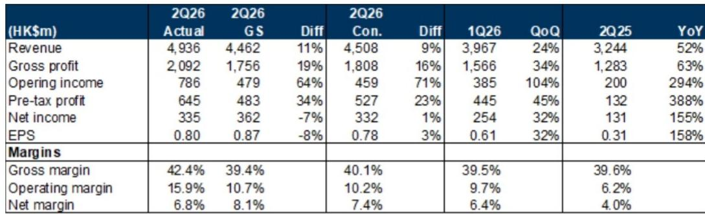
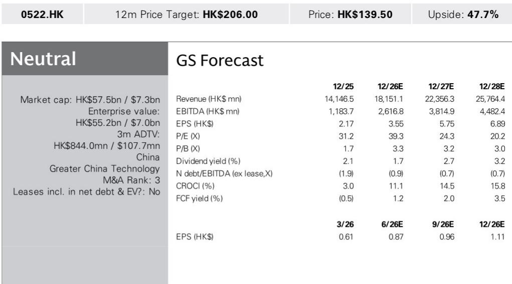

# ASMPT的TCB技术：从前沿探索到AI基础设施的核心驱动

ASMPT公布2026年第二季度营收49亿港元，较分析师预期高出11%，较市场一致预期高出9%。同时，公司对第三季度营收的指引中位数为6.6亿美元，较卖方和市场的预测均高出11%。公司并非仅仅从周期低谷中复苏，而是正借助热压键合（TCB）技术——这一支持AI加速器所需高带宽内存与逻辑堆叠的精密封装技术——转向结构性增长轨道。

数据所揭示的故事远不止单季度的超预期。毛利率环比扩大292个基点至42.4%，显著高于分析师预期的39.4%和市场一致预期的40.1%。营业利润环比飙升104%至7.86亿港元，分别超出预期64%和71%。SMT和SEMI两大业务板块均受益于有利的产品组合和更高的出货量，共同推动了利润率改善。营业费用率从去年同期的33.4%降至26.5%，印证了成本纪律正在放大经营杠杆。这并非由一次性因素驱动的利润率故事，而是ASMPT收入结构正向与AI基础设施相关的高价值设备转移的明证。

对于战略型观察者而言，最重要的并非季度超预期，而是指引和管理层评论中蕴含的前瞻信号。第三季度营收指引区间为6.3亿至6.9亿美元，意味着同比增长35%至48%。管理层明确表示，公司在第二季度获得了来自领先整合设备制造商的订单，并预计AI发展将推动强劲增长。订单出货比稳定在1.43，与上一季度持平，远高于2025年第一季度的1.11。第二季度集团订单达到9.04亿美元，环比增长24%，同比增长87%。连续两个季度订单出货比超过1.4，表明需求并非一次性脉冲，而是持续投入周期的开端。

## TCB正从新兴技术向核心收入驱动转型，ASMPT占据难以复制的市场地位

ASMPT近期表现中最具深远意义的发展，是领先IDM客户对TCB技术的加速采用。管理层虽未点名具体客户，但含义明确：全球最大的半导体制造商正在为组装先进逻辑与内存堆叠的设备下达量产级订单。TCB是一种在封装层面将芯片键合在一起的工艺，与传统大规模回流焊方法相比，具有更高的产出率和更精细的对准精度。随着AI加速器对内存带宽和计算与内存芯片间集成度的要求不断提高，TCB成为一项瓶颈技术——而ASMPT是少数具备成熟生产能力的供应商之一。

收入影响已清晰可见。包含TCB及其他先进封装设备的SEMI业务板块，为毛利率的环比扩张做出了贡献。当一家资本设备公司在产量增长的同时看到利润率扩张，通常意味着产品组合正转向具有更高附加值的专有系统。TCB符合这一特征。该技术需要与客户进行多年的工艺工程协作，由此产生的转换成本保护了ASMPT的定价能力。订单同比增长87%而订单出货比保持在1.4以上，表明客户并非仅下达现货订单，而是在承诺跨季度的产能建设。

对于观察者而言，战略含义十分直接。TCB已不再是未来收入的投机性来源，而是当下可见的成长动力。采用速度慢于预期的风险——分析师框架中提及的关键下行风险之一——正随着IDM客户每季度的订单而消退。客户加速采用先进封装工具的上行情景，如今已成为基准情景。

## 毛利率扩张是结构性的而非周期性的，因为收入结构正永久性地向高价值设备转移

第二季度42.4%的毛利率并非异常值。此前第一季度为39.5%，去年同期为39.6%。环比扩张292个基点，得益于SMT和SEMI两大板块的产品组合优化和销量增长。这种销量增长与产品组合改善的组合，正是一家公司产品组合在升级而非简单循环的典型特征。

分析其机制：SMT设备（用于在印刷电路板上贴装元件）的利润率通常低于SEMI设备（包括TCB及其他先进封装工具）。当两大板块均增长但SEMI增长更快时，综合利润率便会上升。分析师对第二季度毛利率的估计为39.4%，市场一致预期为40.1%。实际结果超出两者，因为产品组合的转变比任何模型预期的都更为显著。如果TCB订单继续加速，利润率轨迹应会随之走高。

过去一年中，营业费用率从33.4%降至26.5%，又增加了一层支撑。ASMPT在未按比例增加成本基础的情况下实现了更高的收入。第二季度营业利润率为15.9%，而第一季度为9.7%，去年同期为6.2%。这并非周期性的反弹，而是由更高价值的产品组合和严格的成本控制驱动的结构性利润率扩张周期的早期阶段。竞争压力或客户集中度可能限制利润率改善的风险依然存在，但当前轨迹表明，天花板高于市场已定价的水平。

## 稳定的1.43倍订单出货比意味着订单积压在增加而非见顶，可见性延伸至2027年

1.43倍的订单出货比意味着，本季度每确认1美元收入，公司就获得了1.43美元的新订单。当该比率连续两个季度保持在1.4以上时，表明需求增速快于公司出货能力。第二季度1.43的比率与第一季度持平，而第一季度本身已较2025年第一季度的1.11大幅改善。在较高水平上的连续稳定，比单次脉冲更具信息量。它表明订单管道正在深化而非趋于平稳。

第二季度集团订单达9.04亿美元，同比增长87%。作为参照，ASMPT 2025年全年营收约为141亿港元。如果当前订单率持续，公司年化订单将超过36亿美元，这意味着未来收入将远高于当前市场对2026年和2027年的一致预期。分析师对2026年和2027年的营收预测分别为182亿港元和224亿港元。如果订单势头持续，这些数字可能显得保守。

对资本配置的影响同样重要。一家订单出货比超过1.4且利润率不断扩大的公司，拥有投资于产能、研发和战略收购的财务灵活性。ASMPT在2025年的净债务与EBITDA比率为负值，意味着公司持有的现金多于债务。即使在收入增长之后，预计该比率到2028年仍将保持在1.0倍以下。资产负债表并非制约因素。制约因素是产能以及招聘和培训支持客户认证周期所需工程师的能力。

## 决策框架：关键不确定性已不再是需求，而是ASMPT扩大产能和维持利润率的能力

对于评估ASMPT的机构观察者而言，当前报价水平相对于其盈利能力可能被低估。但做出决策需要一个区分已知与不确定因素的框架。

已知因素：IDM客户的TCB订单正在加速。订单出货比可持续地保持在1.4以上。毛利率因产品组合和销量而扩张。经营杠杆正在改善。资产负债表强劲。分析师采用的贴现市盈率方法，将29.5倍倍数应用于2030年预估收益并贴现回2027年，其基础是同行市盈率与净利润增长率和营业利润率之和之间的相关性。该方法意味着，随着ASMPT的盈利增长和利润率轨迹改善，其估值应会上升。

不确定因素：ASMPT在不损害利润率的情况下扩大产能以满足需求的速度。公司目前处于先进封装设备供应受限的环境。如果无法足够快地扩大规模，客户可能会寻求双重采购或开发替代键合技术，这将随着时间的推移侵蚀ASMPT的市场份额。分析师明确将先进封装工具的采用速度更快或更慢列为主要风险。当前数据指向更快的采用，但风险不可忽视。

第二个不确定因素是汽车需求。ASMPT的SMT业务服务于汽车电子领域，若汽车周期弱于预期，可能部分抵消SEMI板块的强劲表现。分析师将此列为下行风险。第三个风险是传统IC封装和SMT需求，如果更广泛的半导体周期转向下行，这些需求可能走弱。这些风险真实存在但可控。TCB驱动的增长规模足够大，足以吸收传统市场的温和下行。

因此，决策框架围绕一个核心问题：TCB机遇代表的是多年结构性转变，还是为期两年的投入周期？如果是结构性的——由AI加速器、数据中心网络乃至最终边缘设备对更高带宽的持续需求驱动——那么随着盈利的复合增长，ASMPT当前的估值仍有倍数扩张的空间。如果是与特定一代AI基础设施相关的两年周期，那么到2028年，订单见顶的风险将变得重要。

第二季度业绩和第三季度指引的证据倾向于结构性解释。87%的订单同比增长、稳定的1.43倍订单出货比，以及管理层关于领先IDM客户订单的明确评论，都指向一个正在扩大而非收窄的需求环境。毛利率扩张并非一次性事件，而是产品组合永久性地向高价值设备转移的反映。经营杠杆是真实且可持续的。

对于相信AI基础设施投入将在未来三至五年持续增长的观察者而言，ASMPT提供了对这一建设浪潮中封装层的直接且被低估的敞口。技术已得到验证，客户已做出承诺，财务轨迹正在改善。剩余的风险在于规模化执行，而在资产负债表强劲、订单簿不断增长的情况下，这一风险值得承担。

*仅供参考。部分内容可能基于源材料通过AI辅助生成、翻译、总结或编辑，可能存在遗漏或错误。请独立核实。本文不构成任何专业建议。*

仅供参考。部分内容可能基于源材料通过AI辅助生成、翻译、总结或编辑，可能存在遗漏或错误。请独立核实。本文不构成任何专业建议。

