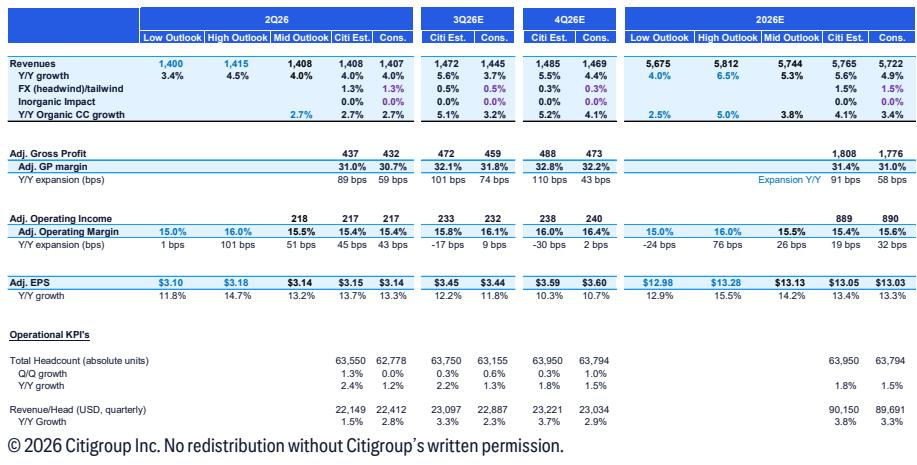
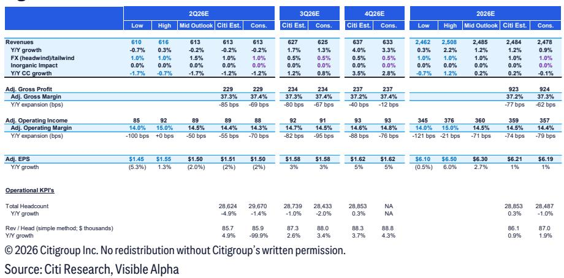
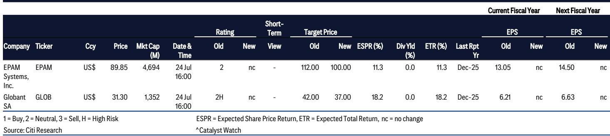

# The Digital Engineering Trough Is Near, But Only Companies That Convert AI Efficiency Into Revenue Share Will Recover Their Multiples

EPAM Systems entered 2026 expecting organic growth to accelerate. Instead, it encountered a cascade of exogenous shocks: a major client in Mexico pulled back IT spending due to US tariffs, and decision-making delays intensified amid Middle East turmoil. By the first-quarter earnings call, the company had already reduced its annual guidance. Globant faced a different but equally telling pressure—its smaller clients remained frozen, unable to unlock discretionary spending, while its flagship Engineering studio grew at only a mid-single-digit rate. These are not isolated disappointments. They are the signature of an industry caught between two forces: a macro environment that refuses to stabilize and a technology shift—generative AI—that has so far acted more as a pricing headwind than a growth catalyst.

The conventional narrative holds that digital engineering specialists like EPAM and Globant should benefit disproportionately from AI adoption. Their engineering heritage, their agility relative to the Indian-tier IT giants, and their exposure to innovation budgets rather than maintenance contracts all point in that direction. But the data tells a more complicated story. Valuations have compressed materially. Both companies are guiding for second-half acceleration, but the market is skeptical. The core question for observers is not whether these firms will survive the cycle—they will—but whether the structural changes underway will ultimately expand their addressable opportunity or simply compress margins and extend the trough.

The answer depends on three interrelated dynamics: the timing of discretionary demand recovery, the ability to translate AI-driven productivity gains into revenue growth rather than just margin relief, and the emergence of new, higher-value engagement models that can reset the growth trajectory. On each of these dimensions, the evidence is mixed but increasingly directional. The companies that can demonstrate they are taking share, not just waiting for the macro to improve, will be the ones whose multiples recover.

## The Second-Half Acceleration Is Plausible but Insufficient Without Visible Share Gains

Both EPAM and Globant have guided to a meaningful second-half improvement over first-half performance. For EPAM, first-quarter organic constant-currency revenue growth was 3.7% year-over-year, and second-quarter guidance stands at 2.7% at the midpoint. To hit the midpoint of the full-year guidance range of 2.5% to 5%, second-half revenues would need to rise approximately 4.4% year-over-year. For Globant, the implied acceleration is even sharper: first-quarter organic CC growth was negative 2.7%, second-quarter guidance is negative 1.2%, and the full-year midpoint implies second-half growth of roughly 4.3%.

These sequential improvements are mathematically achievable. For Globant, easier year-over-year comparisons—fourth-quarter 2025 growth was negative 6.5%—provide a mechanical tailwind. New large deals that have already been signed should begin billing in the second half. But the market has heard this narrative before. The risk is that the acceleration reflects base effects and backlog conversion rather than a genuine improvement in demand velocity. If the second half delivers only the guided numbers without evidence that the trajectory is sustainable into 2027, the valuation floor will not shift.

What observers really need is proof that these companies are winning share. EPAM has discussed ten initial client engagements for a new category of multi-year, large-scale AI-based consolidation deals. Winning just one or two of these would push the company into the upper half of its guidance range; winning several more would approach the high end. But the company can hit the midpoint without winning any. That optionality is valuable, but it also means that the base case does not require share gains. The second-half numbers themselves, while necessary to stabilize the stock, are not sufficient to re-rate the multiple. Only visible, incremental share wins will do that.

## AI Is Reshaping the P&L Through Revenue Per Headcount, Not Through Top-Line Acceleration

The most underappreciated development in the IT services space is the steady improvement in revenue per headcount at both EPAM and Globant. EPAM has posted four consecutive quarters of positive revenue-per-headcount growth, supported by a rising mix of fixed-price contracts—from 15.1% of revenues in the first quarter of 2024 to 21.7% in the first quarter of 2026. Globant has shown a similar pattern: revenue per employee rose 8% year-over-year in the first quarter of 2026 to approximately $90,000, also for four consecutive quarters, with fixed-price contracts increasing from roughly 25% to 30% of revenues over the same period.

This is not simply a pricing story. The mechanism is operational leverage from AI-native talent. Engineers who effectively use generative AI tools for fulfillment can complete more projects in the same amount of time. The industry-level pricing pressure from AI—clients demanding lower rates because they believe AI reduces the effort required—is real and acts as a headwind. But the productivity gains are more than offsetting that compression at the individual engagement level. The result is that effective bill rates are rising, not falling, for the firms that can deploy AI-native talent at scale.

This has direct implications for margins. EPAM demonstrated year-over-year adjusted gross margin expansion of 70 basis points in the first quarter of 2026, driven by a combination of geographic cost optimization, internal AI adoption, and the lapping of the NEORIS acquisition. Globant faces a more complex margin picture because its heavy exposure to Latin America—66% of technical talent, with 18% in Argentina, 22% in Colombia, and 26% in other LatAm countries—means that strengthening local currencies relative to the dollar create an operating cost headwind. The Mexican peso, Colombian peso, and Brazilian real have all appreciated significantly against the dollar year-over-year. But even here, the AI Pods initiative, which carries gross margins of 45% to 60% compared to the consolidated company's roughly 38%, provides a structural offset.

The strategic implication is clear: the margin story is becoming decoupled from the revenue growth story. Companies can show margin expansion even in a low-growth environment, provided they can continue to drive AI-enabled productivity and shift the contract mix toward fixed-price and outcome-based models. This is not a temporary phenomenon. It reflects a fundamental change in how IT services are delivered and priced. The firms that master this transition will emerge from the current trough with structurally higher margins, regardless of when top-line growth fully recovers.

## A New Service Model Is Emerging, and It Requires a Blend of Consulting and Execution That Few Firms Can Deliver

The most strategically significant development in the report is the emergence of engagement models that go beyond traditional project-based or time-and-materials work. Globant's AI Pods initiative is the clearest example. These are AI-native service units with task and industry expertise that bill based on outcomes rather than effort, using tokens to track client consumption. The annual recurring revenue from AI Pods was approximately $33 million in the first quarter of 2026, and Globant has guided for it to reach $60 million to $100 million by year-end, representing roughly 290% year-over-year growth at the midpoint. The model has already been incorporated into 40% of the top 20 revenue-generating accounts, up from 30% in the fourth quarter of 2025, with a long-term target of 70% penetration in that cohort.

EPAM is pursuing a parallel strategy through its push into AI-based vendor consolidation deals. These are multi-year, large-scale engagements where the client seeks to consolidate its AI transformation under a single provider. EPAM's heritage in shorter-duration, smaller-scale projects gives it a different starting point than Globant, but the strategic direction is the same: move up the value chain by offering integrated, outcome-based services that are harder to commoditize.

What makes these models genuinely new is that they require a blend of advanced consulting capability and AI-native execution talent that most IT services firms do not possess. Traditional consulting firms have the strategic depth but lack the engineering bench. Traditional IT services firms have the engineering bench but lack the consulting acumen to design proprietary AI use cases. The firms that can combine both—and embed them into recurring revenue models rather than one-off projects—are creating a new category of service that is uniquely defensible.

The implications for the competitive landscape are significant. If these models scale, they will not just improve margins for the incumbents. They will raise the barriers to entry for new competitors and reduce the substitutability of these firms' services in the eyes of clients. The AI-native recurring revenue stream is inherently stickier than project work, and it creates a data and learning advantage that compounds over time. For observers, the key metric to track is not just the absolute level of AI-related revenue but the penetration rate of these new models within the existing client base. That is the leading indicator of whether the business model is genuinely transforming.

## A Decision Framework for Navigating the IT Services Trough

For institutional observers evaluating EPAM and Globant at current valuations, the analytical challenge is to distinguish between cyclical headwinds that will pass and structural changes that will permanently alter the growth and margin profile. The following framework organizes the key variables into three tiers, ranked by their importance to the re-rating thesis.

The first tier is share gain visibility. The most direct path to multiple expansion is evidence that these companies are winning business that they would not have won in a prior cycle. For EPAM, that means conversion of the ten AI consolidation deals under discussion. For Globant, it means continued expansion of AI Pods penetration into the top account cohort and beyond. Without this evidence, the second-half acceleration will be read as a cyclical bounce, not a trend change. Observers should prioritize any disclosure of new large deal wins, particularly those that are net-new logos rather than expansions of existing relationships.

The second tier is the sustainability of revenue-per-headcount growth. This metric is the bridge between AI productivity and financial performance. If revenue per headcount continues to rise at the current pace—8% year-over-year for Globant, positive for four consecutive quarters at both firms—it signals that AI is genuinely expanding the value delivered per engineer, not just compressing costs. The key risk to watch is whether fixed-price contract growth begins to slow, which would indicate that clients are pushing back on the shift to outcome-based pricing. A deceleration in the fixed-price mix would be a negative signal for both margins and revenue visibility.

The third tier is the trajectory of gross margins, net of currency and acquisition effects. For EPAM, the 70-basis-point year-over-year expansion in the first quarter is encouraging, but the company needs to demonstrate that this is not just a function of easy comparisons or one-time acquisition integration benefits. For Globant, the margin story is more nuanced because of the currency headwind, but the AI Pods mix shift provides a clear pathway to structural improvement. If Globant can show gross margin expansion despite the FX pressure, that would be a powerful signal that the underlying operating leverage is real.

The decision rule is straightforward: if a company can show progress on all three tiers simultaneously, the trough is likely behind it and the multiple should re-rate toward historical averages. If progress is limited to one or two tiers, the stock may stabilize but will not shift. If none of the tiers show improvement, the current valuation floor will likely break lower as the market prices in a longer recovery timeline.

## Gross Margin Expansion Is Becoming Structurally Supported, But Only for Firms That Can Scale AI-Native Talent

The margin outlook for digital engineering firms is more constructive than the revenue growth trajectory would suggest. This is not a cyclical call. It reflects a structural shift in how labor costs, pricing, and productivity interact in an AI-enabled delivery model.

EPAM's adjusted gross margins expanded 70 basis points year-over-year in the first quarter of 2026 and are expected to show sequential strength throughout the year, driven by seasonality in billing days. But the more important driver is the ongoing recalibration of the delivery pyramid. EPAM is increasing its focus on improving profitability in critical geographies—India, Western Central Asia, and Latin America—while simultaneously benefiting from internal AI adoption that reduces the labor content per project. The company's AI-native business is already delivering profitability above the corporate average, and as this segment scales, the favorable mix shift should provide a tailwind to consolidated margins that extends into 2027 and beyond.

Globant's margin picture is more complex because of its geographic exposure. With 66% of technical talent in Latin America, the strengthening of the Mexican peso, Colombian peso, and Brazilian real against the dollar creates a direct operating cost headwind. The company estimates a 100-basis-point annual tailwind to revenues from the weaker dollar, but the margin impact is negative because costs are incurred in strengthening local currencies. This is a real and persistent drag that Globant must offset through other means.

The offset comes from the AI Pods initiative. The disclosed gross margin range of 45% to 60% for AI Pods, compared to the consolidated gross margin of approximately 38%, means that every percentage point of mix shift toward this model improves overall margins. With AI Pods annual recurring revenue guided to grow roughly 290% year-over-year while consolidated revenues are essentially flat on an organic constant-currency basis, the mix shift is happening rapidly. Over time, this should more than compensate for the currency headwind, provided the AI Pods model continues to scale and maintain its margin profile.

The broader point is that the industry's margin structure is being rewritten. The old model—arbitrage on labor costs, with margins driven by utilization rates and offshore mix—is giving way to a model where margins are driven by the ability to deploy AI-native talent that can deliver more output per unit of input. The firms that can recruit, train, and retain this talent at scale will have a structural margin advantage that is independent of the macro cycle. The firms that cannot will find their margins compressed from both sides: pricing pressure from clients and cost pressure from competition for scarce AI talent.

*For informational purposes only. Portions may be generated, translated, summarized, or edited with AI assistance based on source materials and may contain omissions or errors. Please verify independently. This is not professional advice.*

For informational purposes only. Portions may be generated, translated, summarized, or edited with AI assistance based on source materials and may contain omissions or errors. Please verify independently. This is not professional advice.

