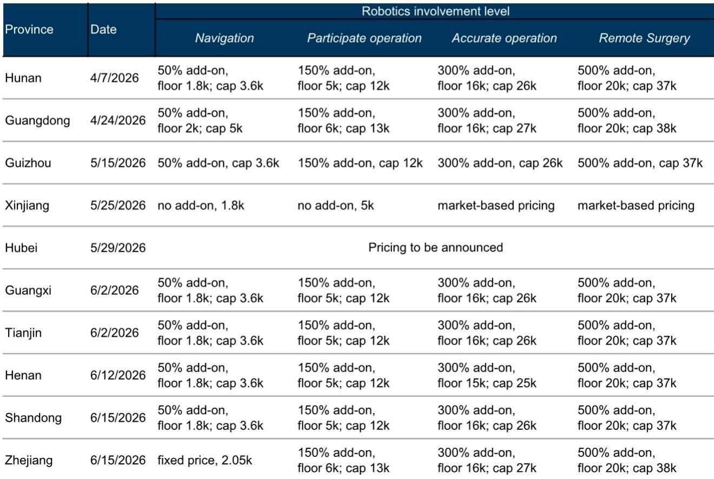
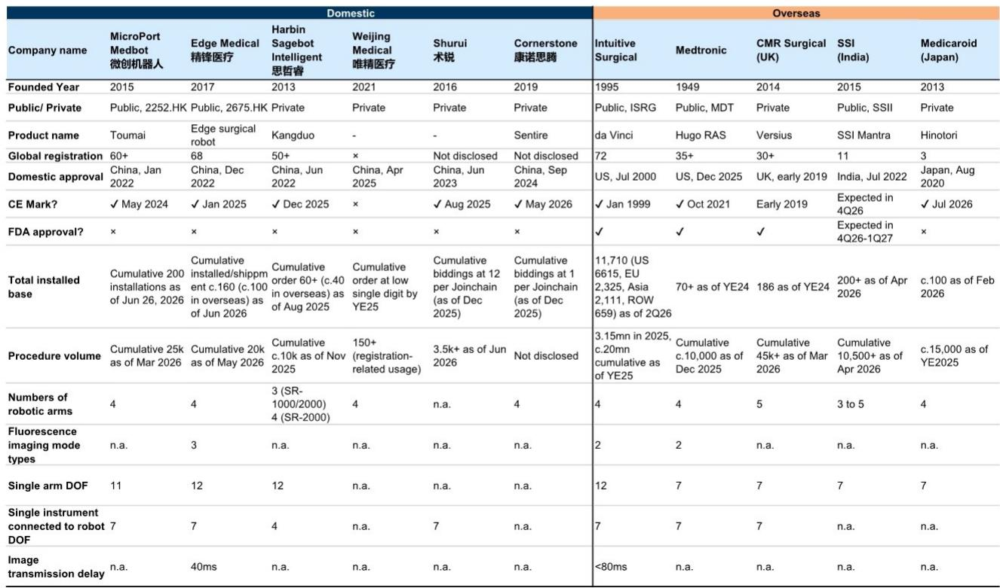
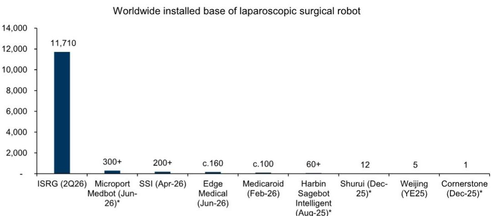

# 中国手术机器人：海外商业化进程加速，而非国内竞争，正成为研究核心逻辑

微创医疗机器人7月22日的盈利预告是一个重要节点。公司报告上半年实现盈利，同时收入同比增长约200-230%，得益于图迈系统的采用和海外收入同比增长超过450%。毛利率提升了超过15个百分点，受益于规模效应和有利的产品组合变化。这并非渐进式改善，而是财务表现的一次阶跃式变化，验证了许多研究者此前持谨慎态度的逻辑。市场一直关注国内订单验证、海外需求可持续性，以及直觉外科过去三个月报价下跌30%所带来的影响。然而，2026年上半年的运营数据显示，这些担忧虽然并非无关紧要，但已日益让位于一个更有力的叙事：中国手术机器人公司正在海外构建真实、可扩展的商业足迹。

图迈系统目前在全球已累计获得约300个商业订单，其中超过240个来自海外市场。年初至今已安装超过80套系统。瑞奇医疗预计，截至上半年末，累计安装或发货的系统将达到约160套，年初至今新增60套，其中约100套在海外。这些并非理想化的目标，而是有收入、毛利率扩张和手术量增长支撑的执行指标。截至2026年5月，瑞奇医疗的累计手术量已超过20,000例，每套已安装系统的年手术量在中国约为210例，海外约为100例——这一差距凸显了随着海外装机基础成熟，利用率提升的空间。

研究的问题已经转变。不再是中国手术机器人能否在全球竞争，而是市场是否已充分定价正在进行的海外商业化的速度和广度。

## 海外市场正在兑现，而国内招标仍受医院资本支出和配额限制

2026年上半年，国内招标量放缓至约30套，略低于2025年上半年的34套。随着国内参与者继续扩大份额，采购均价下降至人民币1330万元。值得注意的是，达芬奇在此期间仅获得约10个中标，意味着数量份额低于40%，并在中国仅安装了6套系统。这反映了来自本土企业的竞争加剧和持续的价格压力。但国内招标的总体疲软在很大程度上符合预期，考虑到医院资本支出环境较弱以及即将到来的B类资本设备集中采购框架。

更重要的结构性问题是，安装配额分配（而非设备定价）仍是国内需求的主要决定因素。仅靠降低设备价格，在医院采购仍受配额可用性限制的情况下，不会推动有意义的数量加速增长。因此，国内市场作为上行期权——如果下一轮分配周期中配额扩大加速，则具有价值，但在可预见的未来并非核心盈利驱动力。

相比之下，海外市场不受同样的行政限制。需求由临床需求、手术量增长以及手术机器人向渗透率较低的新地区扩张所驱动。印度和南美洲已成为关键增长市场。截至2026年6月，图迈在印度累计获得超过30个订单，在巴西和阿根廷各约20个。瑞奇医疗在印度和巴西各累计获得约10个订单。欧洲显示出令人鼓舞的早期进展：图迈已在意大利、西班牙、比利时、英国和法国获得订单，其中仅上半年就在西班牙安装了约10套商业系统。瑞奇医疗在波兰累计获得超过10个订单，在意大利超过5个。

展望未来，向发达市场的扩张仍在按计划进行。瑞奇医疗的目标是在2026年底至2027年初获得日本和韩国的批准，并正在英国、德国和法国建立直销能力，以支持进一步的订单增长。自2026年初以来，图迈新进入了超过十个国家或市场，包括沙特阿拉伯和韩国，并已在超过40个其他国家获得市场准入。这种扩张的地理广度并非散弹式方法；它反映了基于监管路径、外科医生培训基础设施和报销动态的审慎市场选择。

## 产品差异化，而非价格竞争，将决定长期市场份额

一个常见的研究者担忧是，日益激烈的国内竞争可能演变成电动汽车式的价格战，并最终蔓延至海外市场。2026年上半年的数据并不支持这种说法。该行业的管理团队强调，手术机器人的采购决策更多由产品能力、临床价值和生态系统发展驱动，而非仅靠前期定价。这与商品化硬件市场的竞争动态根本不同。

微创医疗机器人通过双产品策略瞄准不同的客户群体。高端图迈Pro的定价约为达芬奇的70%，而性价比更高的图迈SE相对于Pro有30%的折扣。这种细分使公司能够应对不同的医院预算和手术需求，而无需陷入价格战。除了定价，远程手术继续作为一项差异化能力，支持品牌建设、外科医生培训和海外网络扩张。图迈于2026年6月在欧洲获得远程手术的CE标志，进一步增强了其全球远程手术网络能力——这是直觉外科目前未大规模提供的功能。

瑞奇医疗的多孔加单孔平台提供了与同行不同的价值主张。公司继续投资于产品创新，目标是在明年推出其下一代系统，对标达芬奇5。微创医疗机器人计划在2026年底或2027年推出下一代图迈平台，融入新设计理念和人工智能功能。这些对下一代平台的投资并非防御性举措；它们是旨在保持技术领先地位和扩大可及手术市场的进攻性策略。

对研究者的启示是明确的：技术差异化、产品广度和持续创新是长期市场份额比单纯价格竞争更重要的决定因素。能够展示卓越临床结果、稳健外科医生培训计划和清晰产品路线的公司，将更有能力在新兴和发达市场占据份额，无论国内价格压力是否加剧。

## 评估中国手术机器人公司的决策框架

2026年上半年的证据使研究者能够构建一个结构化的框架来评估手术机器人的机会。三个维度最为重要。

第一，海外商业进展。最可靠的信号不仅是订单数量，而是从订单到安装再到手术量增长的进展。微创医疗机器人的240多个海外订单转化为年初至今超过80套已安装系统，管理层重申对全年交付200套安装的信心。瑞奇医疗预计截至上半年末，累计安装或发货的系统将达到约160套，年初至今新增60套。从订单到安装的转化率，以及随后每套已安装系统手术量的增长，是区分真正商业动能与标题驱动乐观情绪的指标。

第二，监管和市场准入广度。公司获得市场准入的国家和地区数量是未来订单流的领先指标。图迈的商业安装现已覆盖超过60个国家和地区。瑞奇医疗已进入全球68个国家和地区。新市场进入的速度——自2026年初以来图迈新增超过十个国家——表明监管障碍正在以比许多研究者假设更快的速度被克服。能够展示在不同监管体系下获得批准的可重复流程的公司将拥有结构性优势。

第三，产品路线图和创新管线。微创医疗机器人和瑞奇医疗的下一代平台旨在直接与达芬奇5竞争，而不仅仅是在价格上削弱它。人工智能能力、远程手术功能和单孔选项的融入代表了真正的技术差异化。研究者应评估每家公司的产品路线图是否针对手术机器人渗透率仍然较低的手术领域——如普外科、妇科和胸外科——而不是仅关注达芬奇长期占据主导地位的泌尿外科和妇科。

## 手术量增长和利用率提升提供价值的二阶导数

除了系统销售，手术量轨迹正成为日益重要的价值驱动力。截至2026年5月，瑞奇医疗的累计手术量超过20,000例，包括17,000例多孔和3,000例单孔手术，月手术量攀升至约1,500例。自2025年7月首次海外安装以来，在不到一年的时间里，海外累计手术量达到约5,000例，得益于约100套海外已安装或发货的系统，其中约50至60套是成熟的已安装系统。

国内外市场之间的利用率差距尤其具有启发性。目前每套已安装系统的年手术量海外约为100例，中国约为210例。这一差距反映了海外市场发展的早期阶段——系统较新，外科医生培训不够成熟，转诊模式仍在建立中。随着海外装机基础成熟，手术量向国内利用率水平收敛，来自可重复使用器械和配件的收入贡献将显著增加。这是系统订单数量本身无法完全捕捉的价值二阶导数。

对于微创医疗机器人，截至2026年6月约200套的图迈装机基础为经常性收入提供了不断增长的基础。对于瑞奇医疗，从20,000例累计手术量到更高月运行率的提升将由新系统安装和现有系统利用率提高共同驱动。管理层预计，在中国各省份标准化报销和收费实践的定价目录扩展的支持下，手术量将继续加速增长。

## 新的竞争格局正在形成，现有参与者正在应对

全球手术机器人的竞争动态正在发生变化。直觉外科2026年第二季度在中国的表现面临压力，仅新增两套系统安装——包括香港的一套达芬奇5——而去年同期为13套。管理层指出，中国仍具有挑战性，招标活动减少，来自中国本土品牌的竞争加剧，以及政策驱动的价格压力。收费代码变更和“十五五”规划配额流程的影响仍不确定。

这对直觉外科在中国而言并非暂时的周期性低迷。它反映了一种结构性转变，即本土企业通过有竞争力的定价、远程手术等差异化功能以及在新兴市场更快的监管批准，正在获得份额。该公司报价年初至今下跌37%，而标普500指数上涨8%，反映了市场对这一转变的认知。

与此同时，其他全球参与者也在推进自身布局。SSI的手术量已超过10,500例，截至2026年4月累计安装超过200套，公司预计分别在2026年第四季度和2026年第四季度至2027年第一季度获得CE标志和FDA批准。Medicaroid的Hinotori手术机器人于2026年7月获得CE标志。Cornerstone的Sentire内窥镜手术系统于2026年5月获得欧盟CE标志和新加坡卫生科学局认证。竞争格局正在扩大，但中国企业在市场进入速度和装机基础增长方面属于最快之列。

从竞争对比中得出的关键结论是，建立全球立足点的窗口期现已打开。能够在未来12至18个月内展示商业进展、监管广度和手术量增长的公司，将处于有利位置，以占据可能难以在后期被撼动的市场份额。2026年上半年的证据表明，微创医疗机器人和瑞奇医疗正以日益坚定的信心执行这一机会。

*仅供参考。部分内容可能基于源材料通过AI辅助生成、翻译、总结或编辑，可能存在遗漏或错误。请独立核实。本文不构成专业建议。*

仅供参考。部分内容可能基于源材料通过AI辅助生成、翻译、总结或编辑，可能存在遗漏或错误。请独立核实。本文不构成专业建议。

