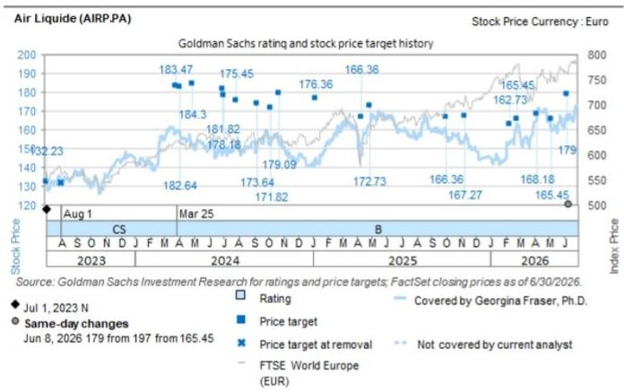

# Air Liquide (AIRP.PA): 1H26 Results Align with Expectations; Electronics Growth and Industrial Merchant Pricing Show Improvement; 2H Outlook Commentary Moderate vs. Market Expectations

Air Liquide reported 1H26 results this morning (July 28), with 2Q26 G&S comparable growth above Vara Consensus (3.3% vs. 2.9%) and 1H26 OIR 1% above Vara Consensus. We highlight our key takeaways below:

Comparable growth in 2Q26: G&S comparable growth of 3.3% came in above Vara Consensus, driven by slightly better Industrial Merchant and materially better Electronics growth. Comparable growth in Large Industries was in line with Visible Alpha Consensus (-0.3%) comparable growth vs. Consensus -0.2% and -0.2% in 1Q26). Industrial Merchant comparable growth of 3.8% was above Visible Alpha Consensus 3.3% and vs. 2.7% in 1Q26. Industrial Merchant pricing was 5.0% in 2Q26, up from 3.4% in Q126. Healthcare comparable growth was 4.4%, vs. Visible Alpha Consensus at 4.4%, and Electronics comparable growth accelerated to 9.5% vs. Visible Alpha Consensus at 4.6%.

Earnings in 1H: Group OIR of €2,845mn was 1% above Vara Consensus for a 20.9% margin (vs. 21.1% Vara Consensus and 21.5% in 2H25).

Cash performance: Operating cash flow in 1H26 came in at €3,372mn, a 13% increase y/y, and cash conversion (OCF/EBITDA) was 84% in 1H26 vs. 96% in 2H25 and 74% in 1H25.

Efficiency gains: Structural efficiencies reached €157mn in 2Q26 (€299mn for 1H26), up 11% from the €142mn in 1Q26.

Investment opportunities: The NTM investment opportunities increased to €4.8bn (vs. €4.5bn in 1Q26 and €4.1bn at in 2Q25), of which more than 50% represents opportunities in electronics (from 40%). Air Liquide reported an all-time high industrial decisions and >€1bn of EL successes in Carrier Gases.

FY26 Outlook: Air Liquide confirmed its FY26 guidance for further increased operating margin +100bps OIR margin improvement in FY26/27 and +560bps over 2022-27 as well as recurring net profit growth in 2026 at constant exchange rates.

## GS View

An in-line print. The guidance for comparable growth in 2H26 to be "similar to, or slightly higher than, that of H1" (2.6%) is softer than the 5%+ that consensus/GS are looking for. Some strong positives to take from the print today are the notable step up in EL comparable growth to close to 10%, as well as the step up in IM pricing sequentially. OIR margins are already tracking up 110 bps y/y vs. the 100bps improvement guided to for 2026. Cash came in line on OCF and a beat at FCF (due to lower capex). We expect investors to take well the strength of the backlog and NTM of opportunities, especially the clear momentum in Electronics/Carrier Gases projects. As we have seen for quality growth names reporting already this quarter, in-line might not be enough to support the shares today given the c.9% outperformance vs the SX4P YTD, even if there is a lot to like from a mid-term perspective.

## The conference call will be held at 10am UK time.

Exhibit 1: Air Liquide 2Q26 results vs. GSe and Consensus Gas & Services sub-segments on Visible Alpha; remainder on Vara Consensus

<table><tr><td colspan="10">Air Liquide Q2-26</td></tr><tr><td>Euro mn</td><td>2Q 2025 act</td><td>1Q 2026 act</td><td>2Q 2026 est</td><td>2Q 2026 act</td><td>% chg yoy</td><td>% chg qoq</td><td>Consensus</td><td>Actuals vs. GSe</td><td>Actuals vs. Consensus</td></tr><tr><td colspan="10">Sales</td></tr><tr><td>Gas &amp; Services</td><td>6,479</td><td>6,596</td><td>6,764</td><td>6,812</td><td>5.1%</td><td>3.3%</td><td>6,801</td><td>0.7%</td><td>0.2%</td></tr><tr><td>Comp growth (%)</td><td>1.8%</td><td>1.9%</td><td>3.3%</td><td>3.3%</td><td></td><td></td><td>2.9%</td><td>5 bps</td><td>40 bps</td></tr><tr><td>Large Industries</td><td>1,741</td><td>1,834</td><td>1,771</td><td>1,869</td><td>7.4%</td><td>1.9%</td><td>1,867</td><td>5.5%</td><td>0.1%</td></tr><tr><td>Comp growth (%)</td><td>1.0%</td><td>-0.9%</td><td>-1.0%</td><td>-0.3%</td><td></td><td></td><td>-0.2%</td><td>70 bps</td><td>-7 bps</td></tr><tr><td>Industrial Merchant</td><td>3,050</td><td>3,022</td><td>3,190</td><td>3,123</td><td>2.4%</td><td>3.3%</td><td>3,199</td><td>-2.1%</td><td>-2.4%</td></tr><tr><td>Comp growth (%)</td><td>1.8%</td><td>2.7%</td><td>4.5%</td><td>3.8%</td><td></td><td></td><td>3.3%</td><td>-70 bps</td><td>48 bps</td></tr><tr><td>Healthcare</td><td>1,088</td><td>1,112</td><td>1,132</td><td>1,132</td><td>4.0%</td><td>1.8%</td><td>1,147</td><td>0.0%</td><td>-1.3%</td></tr><tr><td>Comp growth (%)</td><td>4.8%</td><td>4.0%</td><td>4.5%</td><td>4.4%</td><td></td><td></td><td>4.4%</td><td>-10 bps</td><td>-5 bps</td></tr><tr><td>Electronics</td><td>600</td><td>628</td><td>672</td><td>688</td><td>14.7%</td><td>9.6%</td><td>652</td><td>2.4%</td><td>5.5%</td></tr><tr><td>Comp growth (%)</td><td>-1.6%</td><td>2.9%</td><td>7.0%</td><td>9.5%</td><td></td><td></td><td>4.6%</td><td>250 bps</td><td>493 bps</td></tr><tr><td>Total Group sales</td><td>6,694</td><td>6,786</td><td>6,986</td><td>7,042</td><td>5.2%</td><td>3.8%</td><td>7,030</td><td>0.8%</td><td>0.2%</td></tr><tr><td>Comp growth (%)</td><td>1.9%</td><td>1.8%</td><td>3.2%</td><td>3.5%</td><td>87.7%</td><td>90.0%</td><td>2.8%</td><td>25 bps</td><td>70 bps</td></tr></table>

Source: Vara Research, Visible Alpha Consensus Data, GS Global Investment Research

Exhibit 2: Air Liquide 1H26 results vs. GSe and Consensus Gas & Services sub-segments on Visible Alpha; remainder on Vara Consensus

<table><tr><td colspan="9">Air Liquide 1H 2026</td></tr><tr><td>Euro mn Sales</td><td>1H 25 Act.</td><td>2H 25 Act.</td><td>1H 2026 Est.</td><td>1H 2026 Act.</td><td>% chg yoy</td><td>% chg hoh</td><td>Consensus</td><td>Actuals vs. Consensus</td></tr><tr><td>Gas &amp; Services</td><td>13,309</td><td>12,776</td><td>13,360</td><td>13,408</td><td>0.7%</td><td>4.9%</td><td>13,396</td><td>0.1%</td></tr><tr><td>Comp growth (%)</td><td>1.8%</td><td>2.2%</td><td>2.6%</td><td>2.6%</td><td></td><td></td><td>2.4%</td><td>20 bps</td></tr><tr><td>Large industries</td><td>3,701</td><td>3,410</td><td>3,605</td><td>3,703</td><td>0.1%</td><td>8.6%</td><td>3,707</td><td>-0.1%</td></tr><tr><td>Comp growth (%)</td><td>0.3%</td><td>0.0%</td><td>-0.9%</td><td>-0.6%</td><td></td><td></td><td>-0.6%</td><td>-3 bps</td></tr><tr><td>Industrial Merchant</td><td>6,193</td><td>5,938</td><td>6,212</td><td>6,144</td><td>-0.8%</td><td>3.5%</td><td>6,216</td><td>-1.2%</td></tr><tr><td>Comp growth (%)</td><td>1.6%</td><td>2.7%</td><td>3.6%</td><td>3.2%</td><td></td><td></td><td>3.1%</td><td>15 bps</td></tr><tr><td>Healthcare</td><td>2,191</td><td>2,186</td><td>2,244</td><td>2,244</td><td>2.4%</td><td>2.7%</td><td>2,265</td><td>-0.9%</td></tr><tr><td>Comp growth (%)</td><td>5.0%</td><td>5.0%</td><td>4.2%</td><td>4.2%</td><td></td><td></td><td>4.4%</td><td>-19 bps</td></tr><tr><td>Electronics</td><td>1,224</td><td>1,242</td><td>1,300</td><td>1,317</td><td>7.6%</td><td>6.0%</td><td>1,280</td><td>2.9%</td></tr><tr><td>Comp growth (%)</td><td>0.9%</td><td>1.5%</td><td>4.9%</td><td>6.2%</td><td></td><td></td><td>3.0%</td><td>316 bps</td></tr><tr><td>Total Group sales</td><td>13,722</td><td>13,218</td><td>13,772</td><td>13,828</td><td>0.8%</td><td>4.6%</td><td>13,815</td><td>0.1%</td></tr><tr><td>Comp growth (%)</td><td>2.0%</td><td>2.1%</td><td>2.5%</td><td>2.6%</td><td></td><td></td><td>2.3%</td><td>30 bps</td></tr><tr><td></td><td></td><td></td><td></td><td></td><td></td><td></td><td></td><td></td></tr><tr><td>EBIT (recurring)</td><td>2,737</td><td>2,845</td><td>3,002</td><td>2,893</td><td>5.7%</td><td>1.7%</td><td>2,908</td><td>-0.5%</td></tr><tr><td>Group margin</td><td>19.9%</td><td>21.5%</td><td>21.8%</td><td>20.9%</td><td></td><td></td><td>21.1%</td><td>-13 bps</td></tr><tr><td></td><td></td><td></td><td></td><td></td><td></td><td></td><td></td><td></td></tr><tr><td>Operating cashflow</td><td>2,977</td><td>3,878</td><td>n/a</td><td>3,372</td><td>13.3%</td><td>-13.1%</td><td>3318</td><td>1.6%</td></tr><tr><td>Capital Expenditure</td><td>(1,836)</td><td>(2,007)</td><td>n/a</td><td>(1,828)</td><td>-0.4%</td><td>-8.9%</td><td>(1,970)</td><td>-7.2%</td></tr><tr><td>FCF</td><td>1,141</td><td>1,871</td><td>n/a</td><td>1,544</td><td>35.3%</td><td>-17.5%</td><td>1,348</td><td>14.5%</td></tr></table>

Source: Vara Research, Visible Alpha Consensus Data, GS Global Investment Research

## Valuation & Risks

## Valuation

We are Buy rated on Air Liquide, with a 12-month price target of €179. Our price target is derived using a two-stage DCF, assuming a WACC of 7.8% and 3.0% terminal growth rate.

## Risks

Downside risks to our view and price target include:

- Prolonged economic downturn on the back of global tariff regime impacting Air Liquide's end markets.
- Continued weakening of the USD against the EUR.
- Material delays in project start-ups.
- Pricing pressure in the European/US healthcare markets.
- Pricing pressure in Industrial Merchant.
- New entrants to the Industrial Merchant competitive landscape.
- Slower-than-expected US IP.
- Slower-than-expected build-out of decarbonization infrastructure/semiconductor fabs.
- Value-destructive M&A.

<table><tr><td>AIRP.PA</td><td>12m Price Target: €179.00</td><td colspan="2">Price: €177.18</td><td colspan="2">Upside: 1.0%</td></tr><tr><td>Buy</td><td colspan="5">GS Forecast</td></tr><tr><td></td><td></td><td>12/25</td><td>12/26E</td><td>12/27E</td><td>12/28E</td></tr><tr><td>Market cap: €112.4bn / $127.8bn</td><td>Revenue (€ mn)</td><td>26,940.0</td><td>28,006.9</td><td>29,700.9</td><td>31,422.6</td></tr><tr><td>Enterprise value:</td><td>EBIT (€ mn)</td><td>5,581.4</td><td>6,233.6</td><td>6,979.7</td><td>7,572.8</td></tr><tr><td>€122.5bn / $139.4bn</td><td>EPS (€)</td><td>5.90</td><td>6.60</td><td>7.49</td><td>8.18</td></tr><tr><td>3m ADTV: €159.4mn / $184.1mn</td><td>P/E (X)</td><td>26.7</td><td>26.8</td><td>23.7</td><td>21.7</td></tr><tr><td>France</td><td></td><td></td><td></td><td></td><td></td></tr><tr><td>Europe Chemicals</td><td>EV/EBITDA (ex lease,X)</td><td>13.6</td><td>14.1</td><td>12.9</td><td>12.0</td></tr><tr><td>M&A Rank: 3</td><td>Dividend yield (%)</td><td>2.1</td><td>2.0</td><td>2.1</td><td>2.2</td></tr><tr><td>Leases incl. in net debt &amp; EV?:</td><td>FCF yield (%)</td><td>2.5</td><td>3.1</td><td>2.6</td><td>2.9</td></tr><tr><td>Yes</td><td>CROCI (%)</td><td>8.9</td><td>9.0</td><td>9.4</td><td>9.6</td></tr><tr><td></td><td>N debt/EBITDA (ex lease,X)</td><td>1.1</td><td>0.9</td><td>0.8</td><td>0.7</td></tr><tr><td></td><td></td><td>12/25</td><td>6/26E</td><td>12/26E</td><td>6/27E</td></tr><tr><td></td><td>EPS (€)</td><td>3.01</td><td>3.17</td><td>3.43</td><td>3.65</td></tr></table>

Source: Company data, GS estimates, FactSet. Price as of 27 Jul 2026 close.

## Disclosure Appendix

## Reg AC

We, Georgina Fraser, Ph.D., Marcus von Scheele, Thomas Ward and Gabriel Simoes, hereby certify that all of the views expressed in this report accurately reflect our personal views about the subject company or companies and its or their securities. We also certify that no part of our compensation was, is or will be, directly or indirectly, related to the specific recommendations or views expressed in this report.

Unless otherwise stated, the individuals listed on the cover page of this report are analysts in GS' Global Investment Research division.

Contributing Authors: Georgina Fraser, Ph.D. GS International, Marcus von Scheele GS International, Thomas Ward GS International, Gabriel Simoes GS International.

Unless otherwise stated, the individuals listed in the Contributing Authors disclosure of this report are analysts in GS' Global Investment Research division.

## GS Factor Profile

The GS Factor Profile provides investment context for a stock by comparing key attributes to the market (i.e. our universe of rated stocks) and its sector peers. The four key attributes depicted are: Growth, Financial Returns, Multiple (e.g. valuation) and Integrated (a composite of Growth, Financial Returns and Multiple). Growth, Financial Returns and Multiple are calculated by using normalized ranks for specific metrics for each stock. The normalized ranks for the metrics are then averaged and converted into percentiles for the relevant attribute. The precise calculation of each metric may vary depending on the fiscal year, industry and region, but the standard approach is as follows:

Growth is based on a stock's forward-looking sales growth, EBITDA growth and EPS growth (for financial stocks, only EPS and sales growth), with a higher percentile indicating a higher growth company. Financial Returns is based on a stock's forward-looking ROE, ROCE and CROCI (for financial stocks, only ROE), with a higher percentile indicating a company with higher financial returns. Multiple is based on a stock's forward-looking P/E, P/B, price/dividend (P/D), EV/EBITDA, EV/FCF and EV/Debt Adjusted Cash Flow (DACF) (for financial stocks, only P/E, P/B and P/D), with a higher percentile indicating a stock trading at a higher multiple. The Integrated percentile is calculated as the average of the Growth percentile, Financial Returns percentile and (100% - Multiple percentile).

Financial Returns and Multiple use the GS analyst forecasts at the fiscal year-end at least three quarters in the future. Growth uses inputs for the fiscal year at least seven quarters in the future compared with the year at least three quarters in the future (on a per-share basis for all metrics).

For a more detailed description of how we calculate the GS Factor Profile, please contact your GS representative.

## M&A Rank

Across our global coverage, we examine stocks using an M&A framework, considering both qualitative factors and quantitative factors (which may vary across sectors and regions) to incorporate the potential that certain companies could be acquired. We then assign a M&A rank as a means of scoring companies under our rated coverage from 1 to 3, with 1 representing high (30%-50%) probability of the company becoming an acquisition target, 2 representing medium (15%-30%) probability and 3 representing low (0%-15%) probability. For companies ranked 1 or 2, in line with our standard departmental guidelines we incorporate an M&A component into our target price. M&A rank of 3 is considered immaterial and therefore does not factor into our price target, and may or may not be discussed in research.

## Quantum

Quantum is GS' proprietary database providing access to detailed financial statement histories, forecasts and ratios. It can be used for in-depth analysis of a single company, or to make comparisons between companies in different sectors and markets.

## Disclosures

The rating(s) for Air Liquide is/are relative to the other companies in its/their coverage universe: Air Liquide, Akzo Nobel, Arkema, BASF SE, Clariant, Croda, DSM-Firmenich, Evonik, Givaudan, Kerry, Lanxess AG, Novonesis, Syensqo, Symrise, Umicore

## Company-specific regulatory disclosures

The following disclosures relate to relationships between The GS Group, Inc. (with its affiliates, "GS") and companies covered by GS Global Investment Research and referred to in this research.

GS has received compensation for investment banking services in the past 12 months: Air Liquide (€177.18)

GS expects to receive or intends to seek compensation for investment banking services in the next 3 months: Air Liquide (€177.18)

GS has received compensation for non-investment banking services during the past 12 months: Air Liquide (€177.18)

GS had an investment banking services client relationship during the past 12 months with: Air Liquide (€177.18)

GS had a non-investment banking securities-related services client relationship during the past 12 months with: Air Liquide (€177.18)

GS had a non-securities services client relationship during the past 12 months with: Air Liquide (€177.18)

## Distribution of ratings/investment banking relationships

GS Investment Research global Equity coverage universe

<table><tr><td rowspan="2"></td><td colspan="3">Rating Distribution</td><td colspan="3">Investment Banking Relationships</td></tr><tr><td>Buy</td><td>Hold</td><td>Sell</td><td>Buy</td><td>Hold</td><td>Sell</td></tr><tr><td>Global</td><td>50%</td><td>34%</td><td>16%</td><td>65%</td><td>59%</td><td>43%</td></tr></table>

As of July 1, 2026, GS Global Investment Research had investment ratings on 3,104 equity securities. GS assigns stocks as Buys and Sells on various regional Investment Lists; stocks not so assigned are deemed Neutral. Such assignments equate to Buy, Hold and Sell for the purposes of the above disclosure required by the FINRA Rules. See 'Ratings, Coverage universe and related definitions' below. The Investment Banking Relationships chart reflects the percentage of subject companies within each rating category for whom GS has provided investment banking services within the previous twelve months.

## Price target and rating history chart(s)

  
The price targets shown should be considered in the context of all prior published GS, which may or may not have included price targets, as well as developments relating to the company, its industry and financial markets.

## Target price history table(s) Air Liquide (AIRP.PA)

<table><tr><td>Date of report</td><td>Target price (€)</td><td>Closing price (€)</td></tr><tr><td>08-Jun-26</td><td>179.00</td><td>165.38</td></tr><tr><td>07-May-26</td><td>182.00</td><td>160.64</td></tr><tr><td>07-Apr-26</td><td>185.00</td><td>165.00</td></tr><tr><td>25-Feb-26</td><td>182.00</td><td>162.09</td></tr><tr><td>10-Feb-26</td><td>179.00</td><td>153.96</td></tr><tr><td>11-Nov-25</td><td>184.00</td><td>156.00</td></tr><tr><td>02-Oct-25</td><td>183.00</td><td>160.53</td></tr><tr><td>28-Apr-25</td><td>190.00</td><td>162.00</td></tr><tr><td>11-Apr-25</td><td>183.00</td><td>153.04</td></tr><tr><td>08-Jan-25</td><td>194.00</td><td>143.31</td></tr><tr><td>24-Oct-24</td><td>197.00</td><td>152.64</td></tr><tr><td>08-Oct-24</td><td>189.00</td><td>153.55</td></tr><tr><td>10-Sep-24</td><td>191.00</td><td>153.62</td></tr><tr><td>29-Jul-24</td><td>193.00</td><td>150.45</td></tr><tr><td>03-Jul-24</td><td>196.00</td><td>149.27</td></tr><tr><td>30-Jun-24</td><td>200.00</td><td>146.62</td></tr><tr><td>29-Apr-24</td><td>223.00</td><td>152.40</td></tr><tr><td>05-Apr-24</td><td>221.00</td><td>154.96</td></tr><tr><td>25-Mar-24</td><td>222.00</td><td>158.03</td></tr></table>

Price targets shown in table(s) are unadjusted for corporate actions.

## Regulatory disclosures

## Disclosures required by United States laws and regulations

See company-specific regulatory disclosures above for any of the following disclosures required as to companies referred to in this report: manager or co-manager in a pending transaction; 1% or other ownership; compensation for certain services; types of client relationships; managed/co-managed public offerings in prior periods; directorships; for equity securities, market making and/or specialist role. GS trades or may trade as a principal in debt securities (or in related derivatives) of issuers discussed in this report.

The following are additional required disclosures: Ownership and material conflicts of interest: GS policy prohibits its analysts, professionals reporting to analysts and members of their households from owning securities of any company in the analyst's area of coverage. Analyst compensation: Analysts are paid in part based on the profitability of GS, which includes investment banking revenues. Analyst as officer or director: GS policy generally prohibits its analysts, persons reporting to analysts or members of their households from serving as an officer, director or advisor of any company in the analyst's area of coverage. Non-U.S. Analysts: Non-U.S. analysts may not be associated persons of GS & Co. LLC and therefore may not be subject to FINRA Rule 2241 or FINRA Rule 2242 restrictions on communications with a subject company, public appearances and trading in securities covered by the analysts.

## Additional disclosures required under the laws and regulations of jurisdictions other than the United States

The following disclosures are those required by the jurisdiction indicated, except to the extent already made above pursuant to United States laws and regulations. Australia: GS Australia Pty Ltd and its affiliates are not authorised deposit-taking institutions (as that term is defined in the Banking Act 1959 (Cth)) in Australia and do not provide banking services, nor carry on a banking business, in Australia. This research, and any access to it, is intended only for "wholesale clients" within the meaning of the Australian Corporations Act, unless otherwise agreed by GS. In producing research reports, members of Global Investment Research of GS Australia may attend site visits and other meetings hosted by the companies and other entities which are the subject of its research reports. In some instances the costs of such site visits or meetings may be met in part or in whole by the issuers concerned if GS Australia considers it is appropriate and reasonable in the specific circumstances relating to the site visit or meeting. To the extent that the contents of this document contains any financial product advice, it is general advice only and has been prepared by GS without taking into account a client's objectives, financial situation or needs. A client should, before acting on any such advice, consider the appropriateness of the advice having regard to the client's own objectives, financial situation and needs. A copy of certain GS Australia and New Zealand disclosure of interests and a copy of GS' Australian Sell-Side Research Independence Policy Statement are available at: https://www.goldmansachs.com/disclosures/australia-new-zealand/index.html. Brazil: Disclosure information in relation to CVM Resolution n. 20 is available at https://www.gs.com/worldwide/brazil/area/gir/index.html. Where applicable, the Brazil-registered analyst primarily responsible for the content of this research report, as defined in Article 20 of CVM Resolution n. 20, is the first author named at the beginning of this report, unless indicated otherwise at the end of the text. Canada: This information is being provided to you for information purposes only and is not, and under no circumstances should be construed as, an advertisement, offering or solicitation by GS & Co. LLC for purchasers of securities in Canada to trade in any Canadian security. GS & Co. LLC is not registered as a dealer in any jurisdiction in Canada under applicable Canadian securities laws and generally is not permitted to trade in Canadian securities and may be prohibited from selling certain securities and products in certain jurisdictions in Canada. If you wish to trade in any Canadian securities or other products in Canada please contact GS Canada Inc., an affiliate of The GS Group Inc., or another registered Canadian dealer. Hong Kong: Further information on the securities of covered companies referred to in this research may be obtained on request from GS (Asia) L.L.C. India: Further information on the subject company or companies referred to in this research may be obtained from GS (India) Securities Private Limited, Research Analyst - SEBI Registration Number INH000001493, 10th Floor, Ascent-Worli, Sudam Kalu Ahire Marg, Worli, Mumbai-400 025, India, Corporate Identity Number U74140MH2006FTC160634, Phone +91 22 6616 9000, Fax +91 22 6616 9001. GS may beneficially own 1% or more of the securities (as such term is defined in clause 2 (h) the Indian Securities Contracts (Regulation) Act, 1956) of the subject company or companies referred to in this research report. Registration granted by SEBI and certification from NISM in no way guarantee performance of the intermediary or provide any assurance of returns to investors. GS (India) Securities Private Limited compliance officer and investor grievance contact details, a copy of the annual compliance audit report and other relevant information and disclosures can be found at this link:

https://www.goldmansachs.com/worldwide/india/research-analyst. Japan: See below. Korea: This research, and any access to it, is intended only for "professional investors" within the meaning of the Financial Services and Capital Markets Act, unless otherwise agreed by GS. Further information on the subject company or companies referred to in this research may be obtained from GS (Asia) L.L.C., Seoul Branch. New Zealand: GS New Zealand Limited and its affiliates are neither "registered banks" nor "deposit takers" (as defined in the Reserve Bank of New Zealand Act 1989) in New Zealand. This research, and any access to it, is intended for "wholesale clients" (as defined in the Financial Advisers Act 2008) unless otherwise agreed by GS. A copy of certain GS Australia and New Zealand disclosure of interests is available at: https://www.goldmansachs.com/disclosures/australia-new-zealand/index.html. Russia: Research reports distributed in the Russian Federation are not advertising as defined in the Russian legislation, but are information and analysis not having product promotion as their main purpose and do not provide appraisal within the meaning of the Russian legislation on appraisal activity. Research reports do not constitute a personalized investment recommendation as defined in Russian laws and regulations, are not addressed to a specific client, and are prepared without analyzing the financial circumstances, investment profiles or risk profiles of clients. GS assumes no responsibility for any investment decisions that may be taken by a client or any other person based on this research report. Singapore: GS (Singapore) Pte. (Company Number: 198602165W), which is regulated by the Monetary Authority of Singapore, accepts legal responsibility for this research, and should be contacted with respect to any matters arising from, or in connection with, this research. Taiwan: This material is for reference only and must not be reprinted without permission. Investors should carefully consider their own investment risk. Investment results are the responsibility of the individual investor. United Kingdom: Persons who would be categorized as retail clients in the United Kingdom, as such term is defined in the rules of the Financial Conduct Authority, should read this research in conjunction with prior GS on the covered companies referred to herein and should refer to the risk warnings that have been sent to them by GS International. A copy of these risks warnings, and a glossary of certain financial terms used in this report, are available from GS International on request.

European Union and United Kingdom: Disclosure information in relation to Article 6 (
