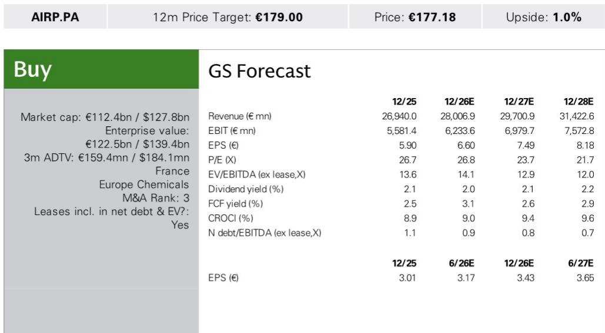
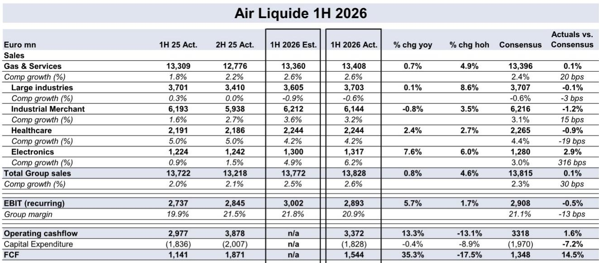
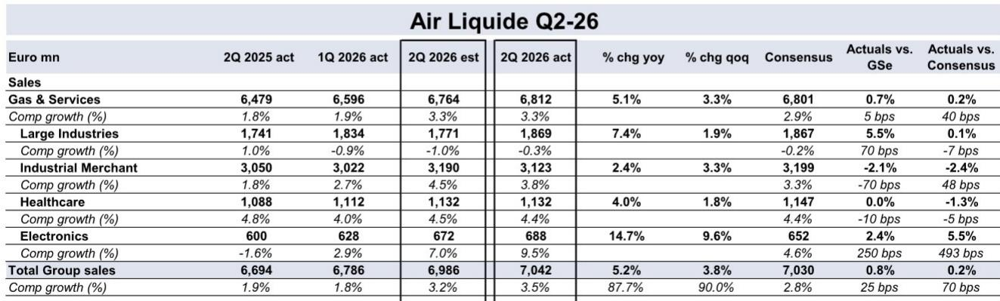

# GS：工业商业务与季度数据观察

Air Liquide 在7月28日公布2026年上半年业绩。第二季度气体与服务可比增长3.3%，高于Vara共识预期的2.9%。真正超出市场预期的不是整体数字，而是电子气业务增速从一季度的2.9%跃升至9.5%，几乎是共识预期4.6%的两倍。工业商业务定价也从一季度的3.4%提升至5.0%，两个信号叠加，说明这家工业气体巨头正在经历业务结构的实质性变化。

上半年集团经常性营业利润28.45亿欧元，利润率20.9%，比共识低约10个基点，但同比已提升110个基点，高于公司全年指引的100个基点改善幅度。经营现金流33.72亿欧元，同比增长13%，自由现金流因资本支出低于预期而超出共识14.5%。

## 1. 电子气业务增速接近10%，项目储备创历史新高

第二季度电子气可比增长9.5%，远超市场预期。更重要的是，未来12个月研究机会储备增至48亿欧元，高于一季度的45亿欧元和去年同期的41亿欧元。其中超过50%来自电子领域，而一年前这一比例约为40%。GS分析师指出，Air Liquide的工业决策和载气项目成功签约均创历史新高。

> **KC评论：** 电子气业务的加速不是一次性波动。项目储备中电子占比从40%升至50%以上，意味着未来2-3年的收入可见度在提升。对于关注半导体供应链的读者，这是工业气体公司从周期性业务转向结构性增长的信号。

## 2. 工业商定价连续两个季度回升

工业商业务第二季度可比增长3.8%，高于共识的3.3%。定价贡献5.0%，较一季度的3.4%明显改善。这是2025年以来定价能力的连续回升。工业商业务是Air Liquide收入占比最大的板块，定价改善直接推动利润率上行。

上半年工业商可比增长3.2%，略低于GS预期，但定价趋势已经确立。报告没有展开定价回升的具体驱动因素，但结合电子气业务的强劲表现，可以推断高端工业气体需求正在拉动整体定价水平。

## 3. 下半年指引偏保守，市场预期已部分反映

公司确认全年指引：2026年经常性营业利润率提升100个基点，2022-2027年累计提升560个基点。但管理层对下半年可比增长的表述是“与上半年相似或略高”，上半年可比增长为2.6%。GS指出，这一指引低于市场和分析师预期的5%以上。

GS认为，这份业绩本身有多个积极信号——电子气增速跃升、工业商定价改善、项目储备创新高——但考虑到Air Liquide报价年初至今已跑赢欧洲化工板块约9%，符合预期的业绩可能不足以推动报价进一步上行。中期视角下，项目储备和电子气业务的动能值得持续跟踪。

## 4. 现金流与资本支出节奏值得关注

上半年自由现金流15.44亿欧元，超出共识14.5%，主要原因是资本支出18.28亿欧元低于预期的19.7亿欧元。经营现金流转化率（OCF/EBITDA）为84%，低于下半年的96%但高于上半年的74%。结构性效率提升上半年达到2.99亿欧元，同比增长11%。

资本支出的节奏变化可能影响市场对自由现金流的预期。报告没有详细说明资本支出低于预期的原因，但项目储备持续增长意味着未来资本支出仍有上行空间。

For informational purposes only. Portions may be generated,translated,summarized,or edited with AI assistance based on source materials and may contain omissions or errors. Please verify independently. This is not investment,legal,tax,accounting,or other professional advice.

For informational purposes only. Portions may be generated,translated,summarized,or edited with AI assistance based on source materials and may contain omissions or errors. Please verify independently. This is not investment,legal,tax,accounting,or other professional advice.

