# 宏观观察

## 关于大型公司上市的研究问答

长鑫存储技术有限公司（CXMT），一家中国DRAM制造商，于7月27日在上交所科创板完成首次公开发行，募集资金86亿美元（若含超额配售权则为98亿美元）。在本期宏观观察中，我们就大型公司上市相关问题进行解答。

1. CXMT上市的历史背景？以86亿美元的发行规模和4840亿美元的市值（基于2026年7月27日收盘价）计算，这是A股科技板块规模最大的上市，在A股中排名第四（以美元计），在整体中国公司中按总市值排名第二。

2. 过去大型公司上市后表现如何？中国前50大公司上市首日和首月平均回报率超过30%，但市场和行业差异较大。

3. 大型公司上市的历史表现？主要指数在上市前往往有所调整，但上市后不久即回升。A股中这种V型走势更为明显，可能与个人读者参与度较高有关。

4. 对同行业公司是情绪提振还是资金分流？新上市公司的可比已上市公司在上市前通常横盘整理，但在上市后表现有所改善。

5. 宏观和市场流动性影响？流动性通常在上市日期前两周收紧，交易后现金周转率通常上升。

6. 快速纳入指数？根据上交所指数编制方法，新上市的大型公司可能在1-3个月内符合快速纳入科创50指数的条件，但纳入MSCI中国/沪深300指数可能需要12-18个月。

7. 模拟指数权重和潜在资金流？我们估算，以4840亿美元市值（截至7月27日收盘）计算，CXMT在首次纳入时约占科创50指数的7%。此外，我们的分析表明，假设一家市值在4000-6000亿美元的公司，到2027年第四季度累计可能带来120-170亿美元的被动买入。

8. 美国制裁风险？被列入1260H中国军事企业名单本身并不阻止美国人士交易该公司证券。

9. 中国IPO市场下一步？预计将保持活跃，根据预测，2026年下半年A股和H股的新股供应量分别为300亿美元和330亿美元。

10. 研究思路？我们筛选：（1）人工智能硬科技和半导体板块中可能受益于V型回升的标的；（2）可能面临被动指数卖出的现有指数成分股。

## 1) CXMT上市的历史背景？

- 长鑫存储技术有限公司（CXMT），一家中国存储芯片制造商，截至2025年第四季度约占全球DRAM市场份额的8%，于7月27日在上交所科创板完成IPO，募集资金86亿美元（含超额配售权可能达98亿美元）。

在其上市首日（7月27日），CXMT（688825 CH）收于49.00元人民币（较IPO发行价8.66元人民币上涨466%）。值得注意的是，根据上交所交易规则，科创板新股上市前5个交易日不设价格涨跌幅限制，此后每日涨跌幅限制为±20%。

以86亿美元的实际融资额（不含超额配售权）和4840亿美元的市值（截至7月27日收盘）计算，这是A股科技板块规模最大的上市，也是自1990年以来A股市场第四大（以美元计）。它也是A股市值最大的公司，在A股、H股和ADR整体中排名第二。

图表1：中国公司历史上三大上市地点的前50大IPO
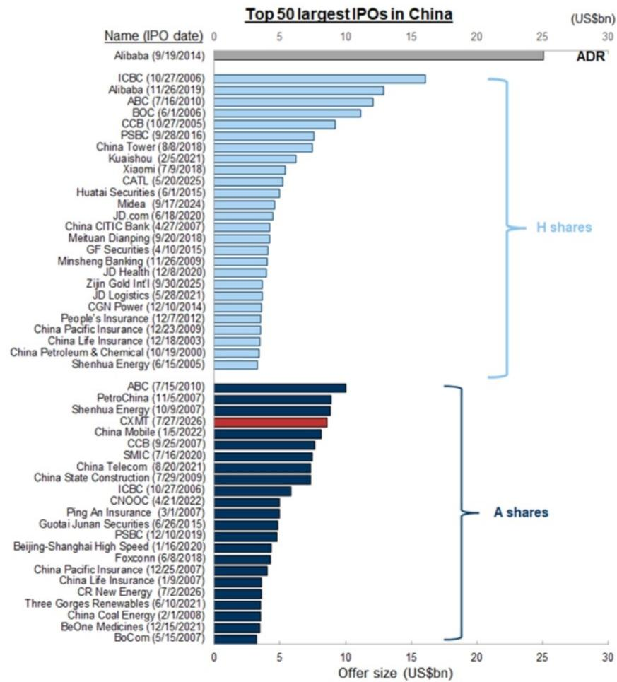
来源：彭博、Factset，GS全球投资研究部整理

## 2) 过去大型公司上市后表现如何？

以历史上中国境内外市场前50大IPO（22只A股、27只H股和1只ADR）为研究样本，我们注意到它们在上市后通常表现良好，首日平均上涨34%，前21个交易日平均上涨31%（相对发行价）。

它们在上市后也往往跑赢当地基准指数，A股平均1个月超额收益为49%，H股为18%。

然而，不同维度下的回报差异相当显著，A股上市通常跑赢境外上市，而医疗保健板块的IPO表现相对落后。

图表2：平均而言，大型中国公司上市后表现良好
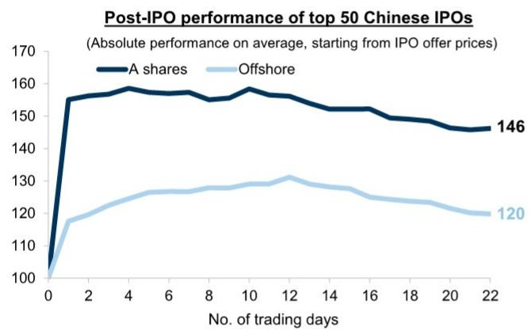
来源：万得、彭博，GS全球投资研究部整理

图表3：大型IPO通常跑赢当地基准指数，A股平均1个月超额收益为49%，H股为18%
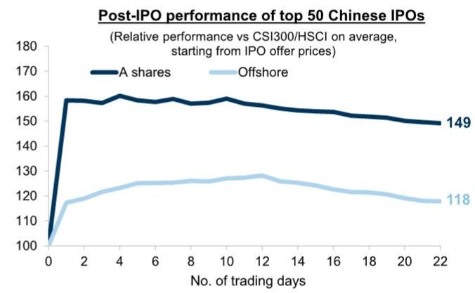
来源：万得、彭博，GS全球投资研究部整理

图表4：大型IPO跨行业上市后回报差异显著
中国前50大IPO上市后1个月回报
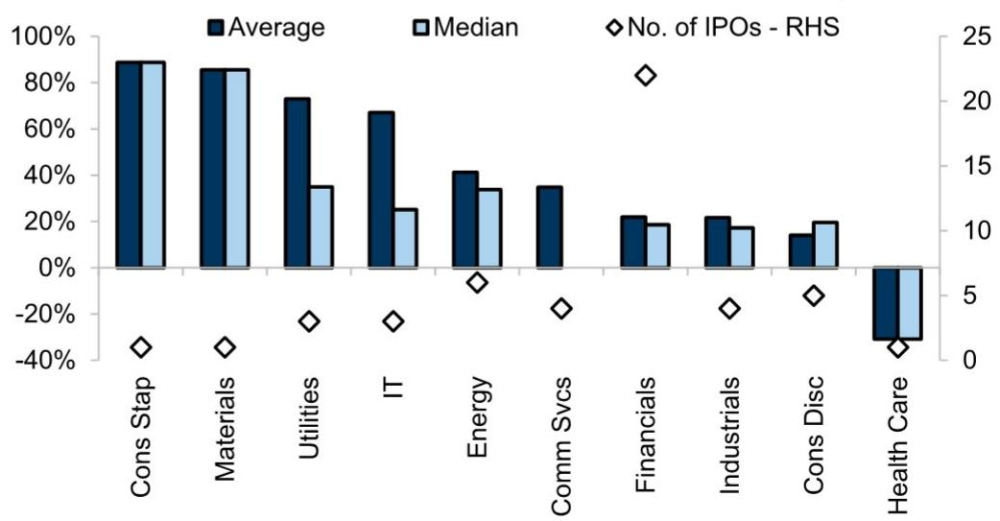
来源：万得、FactSet，GS全球投资研究部整理

## 3) 大型公司上市的历史表现？

在我们前50大中国IPO样本中，A股基准指数（沪深300）在新股发行前约一周往往表现偏软（平均下跌2%），跑输区域基准（MXAPJ）约1%。但指数通常在之后逆转短期弱势，事件后一周回升2%。

香港市场的上市前弱势似乎不那么明显，因为市场在发行前大多持平或区间交易，重要的是，基准指数在上市后通常表现良好，因为这些大型交易有时可被视为情绪和流动性的提振。

A股在指数层面的战术性"V型"模式，可能由于个人读者参与度较高，但考虑到过去十年进行的监管改革和IPO定价市场化/完善，这种模式可能会有所减弱。例如，2016年取消了个人读者全额申购资金冻结的要求，2023年也取消了23倍历史市盈率的隐含IPO定价上限，我们认为这两项措施都可能减少并有助于平滑大型IPO的流动性影响。

图表5：过去大型IPO发行日期前后呈现明显的"V型"模式
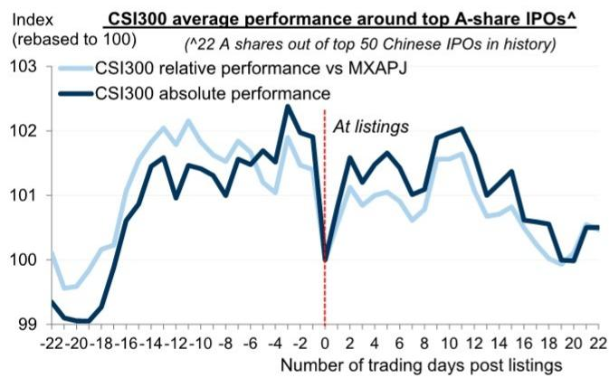
来源：Factset、彭博，GS全球投资研究部整理

图表6：香港市场在大型IPO后通常表现良好
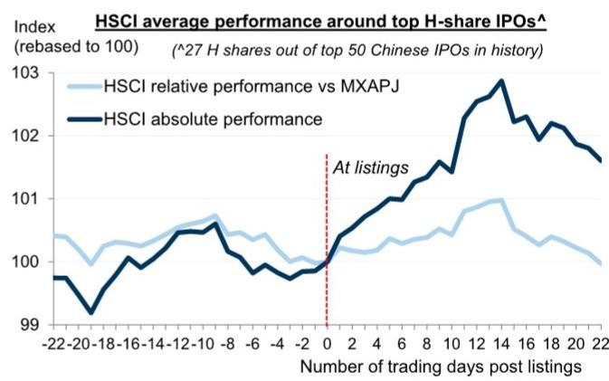
来源：Factset、彭博，GS全球投资研究部整理

## 4) 对同行业公司是情绪提振还是资金分流？

- 聚焦IPO所属行业，我们观察到，在A股和香港市场，现有的（已上市）可比公司在大型IPO上市前1个月通常横盘整理或回吐前期涨幅。然而，与它们可能成为新股资金来源的普遍看法相反，同行业公司在新股上市前通常能够保持稳定。

同样值得注意的是，与指数层面的V型交易模式类似，同行业公司在事件后往往表现更好，境外上市在IPO后1个月平均上涨2-3%，尽管A股的正向溢出效应不那么明显。这表明，在其他条件不变的情况下，成功的上市可被视为市场出清事件，并通常提振整体行业情绪。

图表7：大型IPO通常对境外市场的同行业公司有利
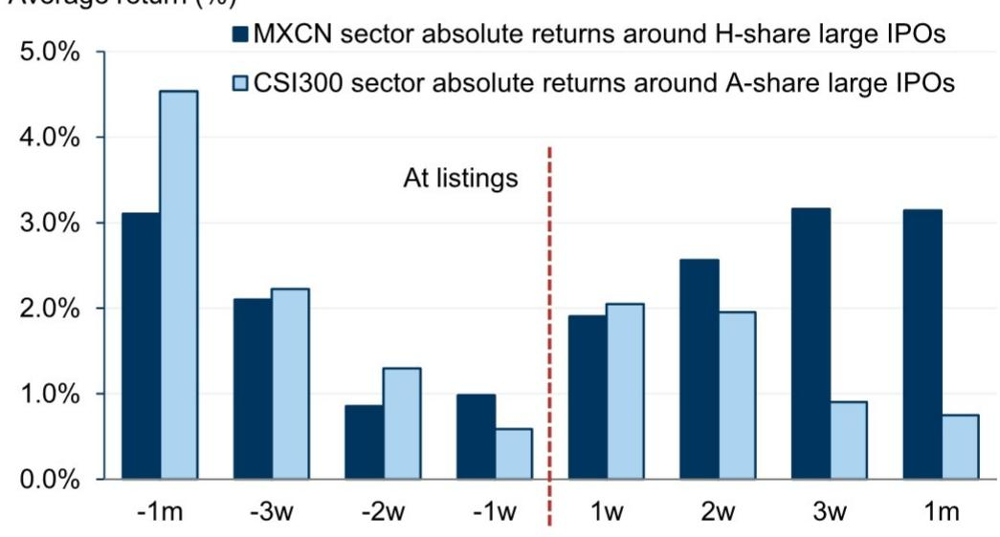
来源：Factset，GS全球投资研究部整理

## 5) 宏观和市场流动性影响？

在利率方面，我们注意到7天回购利率和1个月HIBOR等前端利率在大型IPO发行前往往上升，在实际上市日期前约2周达到峰值。这可能反映了IPO申购过程中资金冻结导致的暂时性流动性紧张。然而，这种情况通常在上市后不久缓解，因为（超额）流动性返回银行间体系，在香港，总结余往往随着港元即期汇率稳定而上升。

宏观流动性条件的宽松通常导致市场流动性和权益配置意愿的显著改善，A股和香港市场的现金周转率均明显增强，国内A股主动型基金在发行日期后权益敞口增加多达1个百分点。

图表8：前端利率通常在大型IPO上市前上升
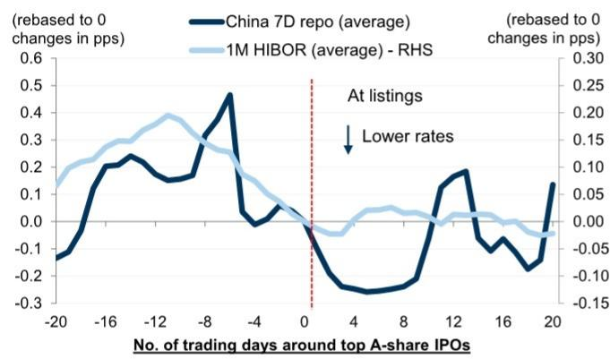
来源：万得，GS全球投资研究部整理

图表9：香港大型IPO上市后宏观流动性通常宽松

来源：彭博，GS全球投资研究部整理

图表10：A股重要IPO上市后市场成交额通常增强
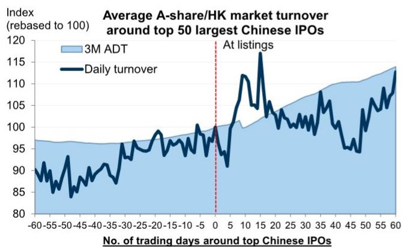
来源：彭博，GS全球投资研究部整理

图表11：境内公募基金在大型IPO上市后对权益的配置通常增加
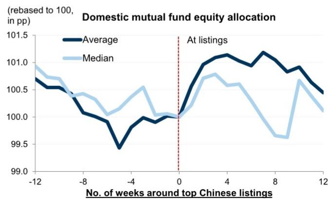
来源：万得，GS全球投资研究部整理

## 6) 快速纳入指数？

根据上交所发布的最新指数编制方法，新上市的大型公司最早可在上市后1个月符合快速纳入科创50指数的条件，但须经指数咨询委员会批准并满足其他市值要求（科创板总市值排名前三）。对于行业特定基准，该发行人可能在下一次定期指数调整时被纳入科创芯片和中华半导体芯片指数，通常在上市后1-2个季度内。

纳入上证A股指数是非A+H双重上市公司获得北向通资格的前提条件。如果新上市公司在上交所市值排名前十，可在上市后3个月内快速纳入该指数，从而为随后不久获得北向通资格铺平道路。否则，根据标准的1年上市历史规则，将在上市后12个月被纳入上证A股指数，并在次月获得北向通资格。

由于北向通资格是A股纳入MSCI的前提条件，如果该公司如上所述获得北向通资格，则可能有资格在下一个季度指数审议中被纳入MSCI。

对于沪深300和沪深A500等宽基指数，科创板成分股通常需满足1年上市历史要求。因此，新上市的科创板公司可在其上市一周年后的第一次半年度指数审议中被纳入这些指数。

图表12：上交所科创板新上市大型公司的快速纳入资格和准入标准

<table><tr><td></td><td>指数名称</td><td>成分股数量（当前）</td><td>被动跟踪规模（十亿美元）</td><td>是否符合快速纳入条件</td></tr><tr><td rowspan="9">境内指数</td><td>科创50</td><td>50</td><td>24.7</td><td>市值前三：1个月上市历史^市值前五：3个月上市历史</td></tr><tr><td>上证综指</td><td>2224</td><td>3.6</td><td>市值前十：3个月上市历史其他：1年上市历史</td></tr><tr><td>上证50</td><td>50</td><td>4.6</td><td>-</td></tr><tr><td>上证A股</td><td>2284</td><td>-</td><td>上交所市值前十：3个月上市历史其他：1年上市历史</td></tr><tr><td>沪深300</td><td>300</td><td>49.0</td><td>科创板：1年上市历史</td></tr><tr><td>沪深A500</td><td>500</td><td>29.9</td><td>科创板：1年上市历史</td></tr><tr><td>科创芯片</td><td>50</td><td>12.2</td><td>市值前五：3个月上市历史其他：6个月上市历史</td></tr><tr><td>沪深芯片</td><td>50</td><td>1.4</td><td>科创板：1年上市历史</td></tr><tr><td>中华半导体芯片</td><td>30</td><td>6.1</td><td>市值前三：3个月上市历史科创板其他：1年上市历史</td></tr><tr><td colspan="2">北向通</td><td>3265</td><td>-</td><td>前提条件：纳入上证A股指数 + 平均市值>50亿元人民币及流动性标准（非A+H、非不同投票权架构）</td></tr><tr><td rowspan="2">境外指数</td><td>MSCI中国</td><td>576</td><td>203.8^^</td><td>前提条件：北向通资格</td></tr><tr><td>MSCI中国A股</td><td>410</td><td>103.5</td><td>前提条件：北向通资格</td></tr></table>

注：^根据上证科创50指数编制方法，自上市以来日均市值排名前三的新上市公司可在交易1个月后快速纳入，但须经指数咨询委员会正式审议批准；^^MSCI中国的被动跟踪规模包括直接跟踪指数的资产以及跟踪更广泛区域和全球基准（如MSCI ACWI、新兴市场、亚洲除日本、亚太）的被动资产按中国在相关指数中的权重计算的比例部分。
来源：MSCI、恒生指数公司、上交所、FactSet，GS全球投资研究部

## 7) 模拟指数权重和潜在资金流？

大型公司上市在基准指数中的初始权重通常较小，随着更多股份流通而逐渐增加。基于CXMT当前4840亿美元的市值（截至7月27日收盘），我们估计该公司在首次纳入时约占科创50指数的7%。从主题角度看，这一纳入将使科创50指数的硬科技敞口小幅提升约1个百分点（从94%至95%），进一步巩固该基准指数作为人工智能硬科技和半导体/存储行业领先代表的地位。

- 考虑到跟踪科创50作为标的的主动和被动策略及委托管理规模超过1770亿元人民币/260亿美元，我们计算，假设一家市值4000-6000亿美元的公司，若其自由流通比例达到30%，可能获得19-25亿美元的资金流入。

此外，假设该公司在纳入这些指数后到2027年底自由流通比例达到30%，这样一家公司约占沪深300的3.0%-4.6%、MSCI中国的1.0%-1.4%、MSCI中国A股的5.5%-8.3%以及科创50指数的10.0%（科创50成分股最高权重）。在其他条件不变的情况下，这将导致到2027年第四季度累计约120-170亿美元的潜在被动资金流入该股。

图表13：大型半导体公司加入科创50将进一步巩固其作为中国领先"硬科技"代表的地位
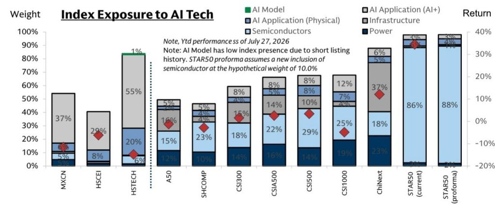
来源：万得、FactSet，GS全球投资研究部

图表14：大型A股IPO进入主要指数的模拟权重

<table><tr><td>（十亿美元）</td><td>规模</td><td colspan="4">累计被动资金流（模拟指数权重）</td></tr><tr><td>指数</td><td>被动</td><td>3个月</td><td>6个月</td><td>12个月</td><td>36个月</td></tr><tr><td>MSCI中国</td><td>204</td><td></td><td></td><td>20-29（1.0%-1.4%）</td><td>33-49（1.6%-2.4%）</td></tr><tr><td>MSCI中国A股</td><td>104</td><td></td><td></td><td>58-86（5.5%-8.3%）</td><td>96-144（9.2%-13.8%）</td></tr><tr><td>沪深300</td><td>49</td><td></td><td></td><td>15-22（3.0%-4.6%）</td><td>25-37（5.1%-7.6%）</td></tr><tr><td>科创50</td><td>25</td><td>14-21（5.8%-8.7%）</td><td>19-25（7.9%-10.0%）</td><td>~25（10.0%）</td><td>~25（10.0%）</td></tr><tr><td colspan="2">合计</td><td>14-21</td><td>19-25</td><td>120-170</td><td>180-260</td></tr></table>

*注：说明性被动资金流估算基于截至7月27日收盘市值4000-6000亿美元的假设范围。指数权重来自当前成分股数据。MSCI相关规模估算基于跟踪基准的基金自下而上汇总并调整中国配置，而沪深300和科创50规模数据来自万得。我们假设3/6/12/36个月后的自由流通比例分别为7%/9%/30%/50%。分析进一步假设该公司可能符合加速纳入相关境内指数的条件。
来源：MSCI、恒生指数公司、上交所、彭博，GS全球投资研究部

## 8) 美国制裁风险？

长鑫存储技术有限公司于2025年1月被列入中国军事企业名单（CMC），也称为由美国国防部管辖的1260H名单，截至2026年6月美国国防部最新更新仍在该名单上。

该名单禁止美国国防部直接从1260H指定实体购买商品、服务或技术。然而，CMC指定本身并不阻止美国人士投资或与相关公司进行证券交易。事实上，该名单包括几家大型中国上市公司，这些公司在全球权益基准指数中占有重要权重，并经常被美国和国际读者交易。

然而，如果股票被列入由美国财政部外国资产控制办公室（OFAC）管辖的非SDN中国军工复合体企业名单（NS-CMIC），美国读者投资中国公司的能力将受到限制。目前，NS-CMIC包含68家中国公司，但CXMT不在该名单上。

图表15：各类美国限制名单对商品贸易和证券投资的不同影响

<table><tr><td colspan="2">部门</td><td>名单</td><td>原因</td><td>后果</td><td>中国实体数量</td><td>示例</td><td>历史移除案例</td></tr><tr><td rowspan="4">商务部</td><td rowspan="4">工业和安全局（BIS）</td><td>被拒绝人员名单</td><td>违反EAR、IEEPA、ISA、AECA中的监管规定</td><td>不得以任何方式参与任何从美国出口的商品</td><td>12</td><td>Manten Electronics</td><td>中兴通讯曾于2018年被移除</td></tr><tr><td>未核实名单</td><td>BIS无法确认此类实体的最终用途真实性</td><td>无资格接收受出口管理条例（EAR）约束的物品；若BIS无法在规定时间内完成最终用户检查，将被移至实体名单</td><td>222</td><td>中国航发南方工业、立航科技、光启技术、昌河飞机工业、江西洪都航空</td><td>数十家公司已被移除，包括药明生物</td></tr><tr><td>实体名单</td><td>从事违反美国国家安全或利益的活动</td><td>对指定物品的出口、再出口和/或（国内）转让有特定许可要求</td><td>~1000</td><td>华为、军事医学科学院、中国交通建设、海康威视、长江存储</td><td>中微公司</td></tr><tr><td>军事最终用户（MEU）名单^^</td><td>被美国政府确定为"军事最终用户"</td><td>对指定物品（主要涉及美国国家安全）的出口、再出口和/或（国内）转让有特定许可要求</td><td>70</td><td>中国航发、中国航空工业</td><td>浙江完美新材料</td></tr><tr><td rowspan="3">财政部</td><td rowspan="2">外国资产控制办公室（OFAC）</td><td>特别指定国民（SDN）名单</td><td>各种原因，包括但不限于向受制裁方提供物质支持</td><td>美国资产和财产冻结；限制与美国的全部业务活动；可能适用次级制裁</td><td>885+</td><td>保利科技、武汉天喻信息、新疆生产建设兵团</td><td>中远海运油轮（大连）</td></tr><tr><td>非SDN中国军工复合体企业（NS-CMIC）名单</td><td>发展直接威胁美国的军事、情报和其他安全机构</td><td>限制美国人士购买或出售NS-CMIC名单上任何实体的公开交易证券</td><td>68</td><td>中国电信、中国移动、中国联通、海康威视、华为、中芯国际、中国交建、中国铁建、中国船舶、中广核、中核、中国航空工业</td><td>-</td></tr><tr><td>投资安全办公室（OIS）</td><td>对外投资安全计划（"反向CFIUS"）</td><td>解决美国在关注国家某些国家安全技术和产品中的投资</td><td>禁止或要求"美国人士"或其外国子公司对"涵盖的外国（即中国）人士"的某些投资进行通知</td><td colspan="2">主要涉及3个领域：半导体和微电子、量子信息技术、人工智能（AI）</td><td>-</td></tr><tr><td rowspan="2" colspan="2">国防部^^^</td><td>中共军事企业（CCMC）名单</td><td>根据NDAA第1237条定义的与中国军方的关系</td><td>特朗普第13959号行政令（证券投资禁令）提及，但拜登于2021年6月以财政部管理的NS-CMIC名单取代了该CCMC名单</td><td>43</td><td>中国商飞、中国船舶工业、高云半导体</td><td>箩筐技术、小米</td></tr><tr><td>中国军事企业（CMC）名单</td><td>根据NDAA第1260H条定义的与中国军方的关系（每年更新至2030年）</td><td>目前为"红旗警示"；禁止与美国政府签订新合同</td><td>188</td><td>阿里巴巴、百度、比亚迪、蔚来（2026年6月8日新增）、腾讯、宁德时代、中远、中国电信、中国联通、中国航空工业、商汤科技、CXMT、长江存储、奇虎360</td><td>中国铁建、中国船舶、IDG资本、中微公司、中芯国际香港、禾赛科技（恢复）等</td></tr><tr><td colspan="2">国土安全部</td><td>UFLPA实体名单</td><td>被强迫劳动执法工作组（FLETF）认定为存在强迫劳动的公司和组织</td><td>限制进口这些实体开采、生产或制造的所有商品</td><td>144</td><td>合盛硅业、和田泰达服装、大全新能源、新疆生产建设兵团</td><td>-</td></tr><tr><td colspan="2">管理和预算办公室（OMB）及国防部</td><td>美国生物安全法案（2025年12月签署成为法律）</td><td>基于其研究或多组学数据收集对国家安全的威胁</td><td>禁止联邦机构采购或获取这些实体的生物技术设备或服务</td><td>5</td><td>华大基因、华大智造、Complete Genomics、药明康德、药明生物</td><td>-</td></tr></table>

来源：工业和安全局、外国资产控制办公室、国防部、国土安全部
注：^包括实体和个人；^^将并入BIS实体名单；也称为国防部（DoD）

## 9) 中国IPO市场下一步？

根据万得数据，A股IPO储备目前包含200多家公司。创业板和科创板是这些待上市公司的两个主要平台（占总数的78%），反映了经济增长动力的逐步转变以及科技相关行业新兴公司的融资需求。

2026年上半年，超过70家公司登陆A股市场，通过IPO共募集710亿元人民币/100亿美元，占2026年中期A股市值的0.4%。包括增发和可转债在内，上半年新增权益供应总量接近670亿美元，根据我们的自上而下预测，2026年全年可能达到1500亿美元（2026年下半年IPO为300亿美元）。

香港的IPO市场也较为活跃，今年迄今已有100家公司完成首次上市，共募集350亿美元。新股上市主要集中在（硬）科技、工业和医疗保健领域，根据港交所统计，这些领域也主导着香港的IPO储备。根据我们的预测，2026年下半年香港新增权益供应可能超过300亿美元（包括上市后融资为600亿美元），我们近期重点介绍了读者在此市场中获取超额收益的3个具体IPO相关策略。详见此处。

图表16：超过200家境内公司正在进行A股上市流程
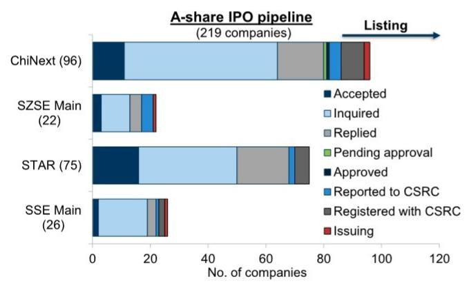
来源：万得，GS全球投资研究部整理

图表17：科技、工业和医疗保健是A股IPO储备的主要来源
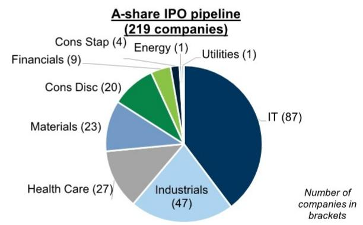
来源：万得，GS全球投资研究部整理

图表18：我们预计2026财年A股市场募集资金1500亿美元

来源：万得，GS全球投资研究部

## 10) 研究思路？

1. V型回升交易：大型公司上市的流动性和情绪影响可能在特定行业或主题可比公司中创造战术性交易机会。我们筛选半导体和科技硬件板块中评级为买入的公司，以便在CXMT上市后若出现V型模式时获取超额收益。

2. 指数纳入资金流：CXMT可能被纳入关键基准指数，这将推动境内外被动和主动委托的资金重新配置。具体而言，我们筛选现有的科创50成分股，如果CXMT的指数权重上升，这些股票可能面临权重稀释和指数再平衡卖出。

图表19：科技板块（不含太阳能）中评级为买入的公司，用于潜在的V型回升交易

<table><tr><td colspan="11">科技硬件或半导体</td><td>B</td></tr><tr><td>代码</td><td>名称</td><td>GICS行业组</td><td>报价</td><td>货币</td><td>总上市市值（十亿美元）</td><td>日均成交额（百万美元）</td><td>25-27E每股收益年复合增长率（%）</td><td>26E市盈率（倍）</td><td>26E市净率（倍）</td><td>26E股息率（%）</td><td>GS评级</td></tr><tr><td colspan="12">中国境内GS报告评级硬科技股票</td></tr><tr><td>601138 CG</td><td>工业富联</td><td>科技硬件</td><td>57</td><td>CNY</td><td>166</td><td>1808</td><td>51</td><td>18.4</td><td>5.4</td><td>2.3</td><td>B</td></tr><tr><td>688256 CG</td><td>寒武纪</td><td>半导体</td><td>1209</td><td>CNY</td><td>112</td><td>2161</td><td>119</td><td>119.1</td><td>41.7</td><td>0.1</td><td>B</td></tr><tr><td>688981 CG</td><td>中芯国际（A）</td><td>半导体</td><td>144</td><td>CNY</td><td>108</td><td>1403</td><td>36</td><td>172.4</td><td>7.6</td><td>0.0</td><td>B</td></tr><tr><td>300502 CS</td><td>新易盛</td><td>科技硬件</td><td>510</td><td>CNY</td><td>105</td><td>3344</td><td>76</td><td>36.3</td><td>20.0</td><td>0.3</td><td>B</td></tr><tr><td>002371 CS</td><td>北方华创</td><td>半导体</td><td>677</td><td>CNY</td><td>73</td><td>990</td><td>41</td><td>63.2</td><td>11.0</td><td>0.1</td><td>B</td></tr><tr><td>603986 CG</td><td>兆易创新</td><td>半导体</td><td>432</td><td>CNY</td><td>45</td><td>2802</td><td>109</td><td>46.8</td><td>11.3</td><td>0.4</td><td>B</td></tr><tr><td>600183 CG</td><td>生益科技</td><td>科技硬件</td><td>123</td><td>CNY</td><td>44</td><td>1025</td><td>59</td><td>51.2</td><td>14.6</td><td>1.3</td><td>B</td></tr><tr><td>688008 CG</td><td>澜起科技（A）</td><td>半导体</td><td>190</td><td>CNY</td><td>35</td><td>1870</td><td>47</td><td>61.5</td><td>13.9</td><td>0.4</td><td>B</td></tr><tr><td>300394 CS</td><td>天孚通信</td><td>科技硬件</td><td>214</td><td>CNY</td><td>34</td><td>2183</td><td>61</td><td>64.3</td><td>27.8</td><td>0.5</td><td>B</td></tr><tr><td>002463 CS</td><td>沪电股份</td><td>科技硬件</td><td>115</td><td>CNY</td><td>33</td><td>1286</td><td>54</td><td>37.3</td><td>11.4</td><td>0.6</td><td>B</td></tr><tr><td>002916 CS</td><td>深南电路</td><td>科技硬件</td><td>324</td><td>CNY</td><td>33</td><td>611</td><td>49</td><td>43.2</td><td>10.2</td><td>1.1</td><td>B</td></tr><tr><td>688012 CG</td><td>中微公司</td><td>半导体</td><td>343</td><td>CNY</td><td>32</td><td>1074</td><td>48</td><td>94.0</td><td>12.4</td><td>0.1</td><td>B</td></tr><tr><td>300476 CS</td><td>胜宏科技</td><td>科技硬件</td><td>224</td><td>CNY</td><td>32</td><td>1926</td><td>81</td><td>25.4</td><td>5.3</td><td>1.3</td><td>B*</td></tr><tr><td>688521 CG</td><td>芯原股份</td><td>半导体</td><td>225</td><td>CNY</td><td>17</td><td>888</td><td>-</td><td>332.8</td><td>33.5</td><td>0.0</td><td>B</td></tr><tr><td>002600 CS</td><td>领益智造</td><td>科技硬件</td><td>12</td><td>CNY</td><td>13</td><td>414</td><td>41</td><td>26.3</td><td>3.1</td><td>0.6</td><td>B</td></tr><tr><td>603296 CG</td><td>华勤技术（A）</td><td>科技硬件</td><td>73</td><td>CNY</td><td>9</td><td>258</td><td>26</td><td>20.0</td><td>3.6</td><td>1.5</td><td>B</td></tr><tr><td>688019 CG</td><td>安集科技</td><td>半导体</td><td>225</td><td>CNY</td><td>8</td><td>258</td><td>33</td><td>44.9</td><td>11.3</td><td>0.2</td><td>B</td></tr><tr><td>688234 CG</td><td>天岳先进</td><td>半导体</td><td>93</td><td>CNY</td><td>6</td><td>268</td><td>-</td><td>230.8</td><td>6.1</td><td>0.0</td><td>B</td></tr><tr><td>688802 CG</td><td>鑫芯半导体</td><td>半导体</td><td>821</td><td>CNY</td><td>2</td><td>242</td><td>-</td><td>8049</td><td>24.9</td><td>0.0</td><td>B</td></tr><tr><td>002792 CS</td><td>通宇通讯</td><td>科技硬件</td><td>24</td><td>CNY</td><td>2</td><td>265</td><td>22</td><td>297.8</td><td>-</td><td>0.1</td><td>B</td></tr><tr><td colspan="12">中国境外GS报告评级硬科技股票</td></tr><tr><td>1810 HK</td><td>小米</td><td>科技硬件</td><td>28</td><td>HKD</td><td>76</td><td>664</td><td>2</td><td>22.2</td><td>2.1</td><td>0.0</td><td>B</td></tr><tr><td>1347 HK</td><td>华虹半导体</td><td>半导体</td><td>143</td><td>HKD</td><td>44</td><td>550</td><td>127</td><td>152.2</td><td>4.7</td><td>0.0</td><td>B</td></tr><tr><td>992 HK</td><td>联想</td><td>科技硬件</td><td>21</td><td>HKD</td><td>34</td><td
