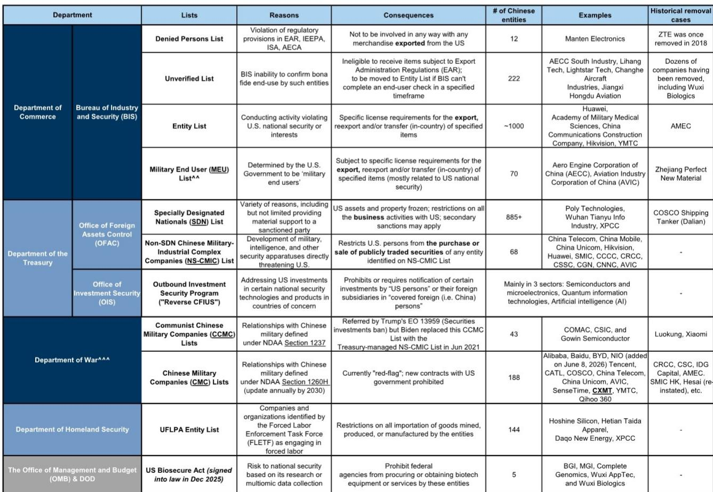
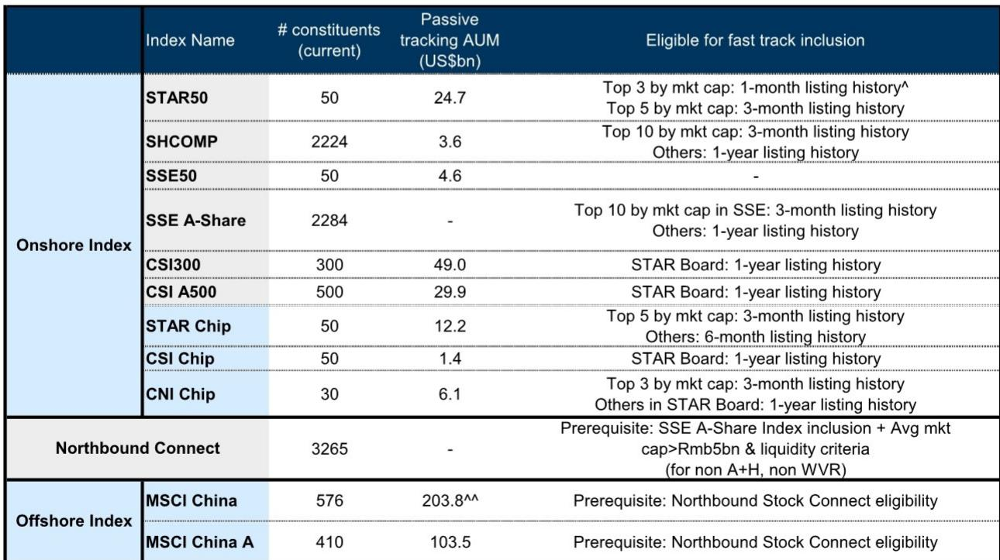

# GS：长鑫存储IPO后中国大型新股历史表现

长鑫存储（CXMT）于7月27日在科创板完成上市，募资86亿美元（含超额配售权可达98亿美元），上市首日报价较发行价上涨466%，市值达到4840亿美元。这是相关市场历史上最大的科技股IPO，也是相关市场自1990年以来第四大IPO（以美元计），同时成为全中国权益市场（相关市场、H股、ADR合计）中市值第二大的公司。GS在最新发布的《中国思考》系列报告中，基于历史数据回答了读者关于大型IPO的七个核心问题。

## 1. 历史数据显示大型IPO上市后短期表现强劲但分化显著

GS选取中国境内外市场历史上最大的50宗IPO作为研究样本（含22只相关市场、27只H股和1只ADR），发现这些大型新股上市后普遍表现良好：首日平均回报34%，上市后21个交易日平均回报31%。它们也倾向于跑赢当地基准指数，相关市场上市后1个月平均超额回报49%，H股为18%。

但回报分化同样显著。相关市场上市通常跑赢境外交易，而医疗健康板块的IPO在行业层面表现落后。报告强调，这些历史均值背后存在较高的市场和行业波动性，不能简单外推至单一案例。

## 2. 指数层面呈现“V型”走势，相关市场特征更为明显

在50宗最大IPO样本中，相关市场基准指数（沪深300）在发行前约一周平均下跌2%，跑输区域基准（MSCI亚太除日本指数）约1个百分点。但指数通常在发行后迅速反弹，一周后恢复2%的涨幅。这种“V型”模式在相关市场比相关市场更明显，报告认为可能与相关市场较高的散户参与度有关。

值得注意的是，过去十年的监管改革——包括2016年取消个人读者全额申购资金冻结要求、2023年取消23倍市盈率的隐性定价上限——可能已经减弱了大型IPO对流动性的冲击，使“V型”波动趋于平缓。

> **KC评论：** 历史“V型”模式的核心驱动是IPO申购阶段的资金冻结，而非新股上市本身。随着制度改进，这一模式可能弱化，但散户情绪驱动的短期波动仍然存在。

## 3. 行业可比公司往往在IPO后获得正面溢出效应

与市场普遍认为大型IPO会从同行业公司“抽血”的直觉相反，GS的数据显示，行业可比公司在IPO前1个月通常横盘或回吐涨幅，但在新股上市后反而表现更好。境外上市案例中，行业可比公司在IPO后1个月平均上涨2%-3%，尽管相关市场的正向溢出效应不那么明显。

报告认为，成功的大型IPO可以被视为市场出清事件，在同等条件下通常会提振整个板块的读者情绪，而非造成流动性虹吸。

## 4. 宏观流动性在IPO前后呈现先紧后松的规律

利率方面，7天回购利率和1个月HIBOR等短期利率指标通常在大型IPO发行前上升，在上市日前约2周达到峰值，反映申购资金冻结带来的暂时性流动性紧张。上市后，随着（超额）流动性返回银行间体系，情况通常迅速缓解。

流动性改善往往带来市场成交量和权益配置的明显提升：相关市场和相关市场现金换手率均显著增强，国内相关市场主动型产品在发行后权益仓位提升幅度可达1个百分点。这为读者提供了一个可观察的流动性节奏框架。

## 5. 指数纳入路径与潜在被动资金流入估算

根据上交所指数编制规则，市值排名科创板前三的新上市公司最快可在上市后1个月被快速纳入科创50指数。长鑫存储以当前市值计算，预计首次纳入时将占科创50指数约7%的权重，并将该指数的“硬科技”敞口从94%提升至95%。

对于更广泛的基准指数，科创板公司通常需要满足1年上市历史要求。GS估算，假设一家市值4000-6000亿美元的公司到2027年底自由流通比例达到30%，其在MSCI中国、沪深300、MSCI中国相关市场纳入后的累计被动资金流入可达120-170亿美元，时间窗口覆盖至2027年四季度。

报告同时指出，长鑫存储目前仅在美国国防部的1260H清单（中国军事企业清单）上，该清单本身不禁止美国人研究或交易该公司标的；它未被列入美国财政部OFAC管理的NS-CMIC清单，后者才是限制美国人研究中国公司的关键名单。

---

For informational purposes only. Portions may be generated,translated,summarized,or edited with AI assistance based on source materials and may contain omissions or errors. Please verify independently. This is not investment,legal,tax,accounting,or other professional advice.

For informational purposes only. Portions may be generated,translated,summarized,or edited with AI assistance based on source materials and may contain omissions or errors. Please verify independently. This is not investment,legal,tax,accounting,or other professional advice.

