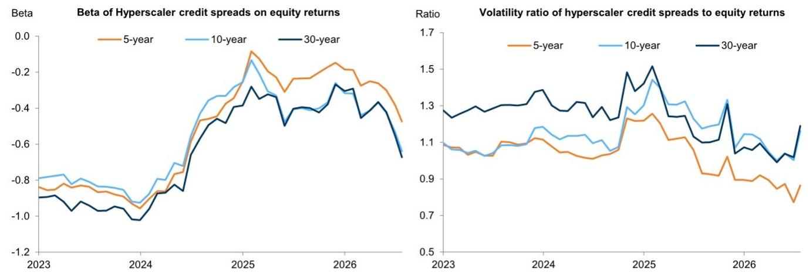
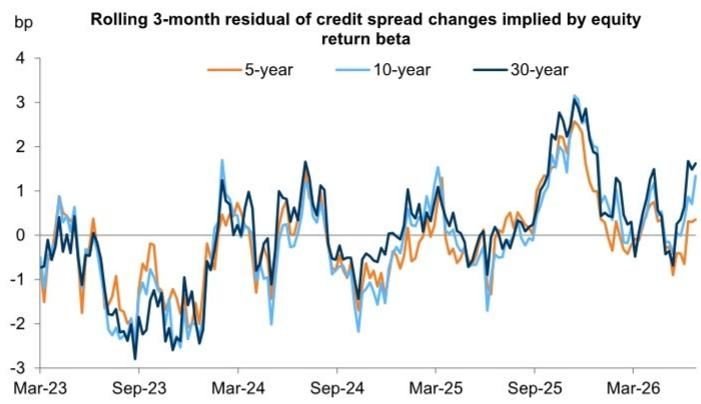

# 宏观环境每日观察：大型科技公司债券与权益的关联——更多发行、更高贝塔、对现金流的关注点不同

- 与AI相关的大规模资本支出重塑了大型科技公司债券与权益的联动方式。随着这些公司越来越多地通过债务融资进行投资，权益价值与波动的资产估值关联更紧密，同时在结构上推高了信用成本。

Shamshad Ali  
+1(212)902-6712 | shamshad.ali@gs.com GS & Co. LLC

由于期限溢价向上倾斜，债券对权益回报的贝塔值应随债券期限增加而上升。虽然基于回报表现的强劲需求抑制了更广泛市场中长久期债券的贝塔值，但AI资本支出周期提升了大型科技公司债券的贝塔值——尤其是在曲线长端利差波动明显的情况下。

随着大型科技公司远期自由现金流回报表现下降，信用利差已走阔。因此，债券未来的走向可能取决于远期自由现金流生成预期的改善。

尽管如此，改善的方式对债券与权益的相对价值更为重要。因资本支出减少而带来的自由现金流增长情景可能有利于债券，而净收入和经营现金流上升的情景可能有利于权益，因为读者可能将其解读为AI生态系统中额外价值积累的转折点（权益更易受该潜在上行空间影响）。

大型科技公司债券与权益：更多发行、更高贝塔、对现金流的关注点不同

对AI相关资本支出的日益关注推动了市场中的几个主题。在权益方面，不断上升的资本支出预期已开始主导未来收入生成，使得基础设施和“卖铲子”类公司（如能源供应商、半导体和芯片制造商）比投资于资本支出的大型科技公司权益及预期的最终受益者更受支撑。债券市场首先关注投资的规模和速度（因为这些投资越来越多地由债务资本融资），其次关注能够抵消巨额支出的投资回报的清晰度。

债券比权益更优先，具有有限期限，其上行空间主要限于利息支付和本金偿还。从历史上看，这意味着与日益主导权益回报的长期终值相背离，因为债券读者转而关注用于偿债的近期现金流和盈利。然而，大规模的AI投资正在改变这一格局。在本期宏观环境每日观察中，我们通过一系列指标（包括利差变化对权益回报的贝塔值）来审视大型科技公司长期债券与其权益之间的关系。我们发现，随着现金流回报表现大幅下降，大型科技公司长期利差走阔，在供应量大的时期表现逊于不断变化的权益贝塔值。近期，与较短期限相比，这种表现不佳在信用利差曲线的长端更为明显。现金流的改善可能推动利差收窄，但改善的方式——例如，改善是由削减支出还是由货币化/盈利能力加速推动——可能对债券/权益的相对价值更为重要。

## AI正在改变大型科技公司的债券-权益关系

向上倾斜的信用期限溢价和不断增加的利差久期通常意味着长久期债券与权益价格联动更紧密——从机制上看，即更高的贝塔值。然而，追求回报表现的负债驱动型读者的兴起，加上2022-2023年美联储加息周期中政策利率波动率上升，降低了长期债券的贝塔值，主要是通过降低波动率（图表1）。

图表1：近年来，长期信用利差对权益回报的贝塔值有所下降，主要是由于波动率降低

月度贝塔值回归不同期限美元IG利差变化对标普500指数，斜体将贝塔值分解为相关性和波动率比率

<table><tr><td>样本</td><td>3-5年</td><td>7-10年</td><td>15年以上</td></tr><tr><td>2015-2019</td><td>-2.5</td><td>-3.1</td><td>-2.6</td></tr><tr><td>相关性</td><td>-0.7</td><td>-0.8</td><td>-0.7</td></tr><tr><td>波动率比率</td><td>2.0</td><td>2.3</td><td>2.2</td></tr><tr><td>2021-2025</td><td>-1.7</td><td>-1.9</td><td>-1.7</td></tr><tr><td>相关性</td><td>-0.6</td><td>-0.7</td><td>-0.7</td></tr><tr><td>波动率比率</td><td>1.6</td><td>1.6</td><td>1.4</td></tr></table>

来源：iBoxx，彭博，GS全球投资研究

对AI的大规模投资进一步改变了这些债券的信用与权益关系。债券读者实际上是在做空公司偿付能力的看跌期权，而权益持有者则是做多，这有助于解释为何大规模投资日益推动资本结构中的回报差异。随着大型科技公司承诺更多投资，权益价值与日益不确定的资产估值联系更紧密，并且通过权益的结构模型，债券价格也是如此。

因此，AI相关债券的贝塔值略有上升，这与我们注意到的债券/权益关系的更广泛趋势相呼应。与更广泛的趋势相呼应，长期贝塔值因长期利差波动率上升而增加——尤其是相对于更为平稳的短端（图表2）。

  
图表2：鉴于后端利差波动率上升，大型科技公司长期债券具有更高的贝塔值 大型科技公司信用利差按期限划分的月度变化对大型科技公司权益月度回报的滚动2年贝塔值  
来源：iBoxx，彭博，GS全球投资研究  
大型科技公司后端利差的这种明显走阔与该群体远期自由现金流回报表现下降同时发生，这表明融资需求正在增长（图表3）。  
图表3：随着总体自由现金流回报表现优势减弱，大型科技公司债券出现抛售

  
来源：iBoxx，彭博，GS全球投资研究

## 自由现金流改善的驱动因素很重要

今年，债券平均表现逊于其历史权益贝塔值，近期在长端表现最为明显（图表4）。这在过去几个季度的新债务发行浪潮中出现并不令人意外。我们预计AI相关发行人的信用曲线将进一步陡峭化，因为这一多年发行周期仍在延续。

## 图表4：近期信用利差表现逊于其对权益的贝塔值

大型科技公司权益回报的周度利差变化时变贝塔值的滚动3个月平均残差

  
来源：iBoxx，彭博，GS全球投资研究

尽管如此，跨资产读者越来越关注长期债券和权益相对估值的未来路径，尤其是大型科技公司的盈利倍数目前处于相对于更广泛指数的多年低点。鉴于供应量增加以及随着对投资组合集中度的讨论变得更加重要而导致需求略有减弱，抑制后端大型科技公司债券波动率的技术因素已不复存在。我们认为，自由现金流生成的改善将支持利差收窄的观点，但改善的方式可能会推动持有大型科技公司权益与债券之间的相对价值。

通过减少资本支出和缩减投资来实现的自由现金流改善可能会压低大型科技公司的终值，因为读者可能担心回报无法验证投资——这种结果往往有利于债券。另一方面，在投资支出保持强劲的同时，净收入和经营现金流增长可能有利于权益，因为回报变得更加可见，并标志着AI生态系统中价值积累的转折点。

## 交易思路

## 跨资产最佳交易思路

有关定价、图表和先前建议列表，请访问我们的交易思路页面。

1. 做空SGD/MYR，于2026年1月24日开仓，价格3.13，目标2.90，止损3.30，当前交易于3.17。

2. 做多TRY、NGN和KZT兑USD，作为等权重篮子，于2026年2月18日开仓，价格0%，总回报目标7.5%，修订后止损1.5%，当前交易于4.8%。

3. 做多3年SOFR互换利差，于2026年4月17日开仓，价格-22.6bp，修订后目标-15bp（含carry），修订后止损-20bp，当前交易于-18.8bp。

4. 做空USD/EGP，于2026年4月24日开仓，价格0%，修订后总回报目标12%，修订后止损5%，当前交易于7.4%。

5. 做多5年Receiver on 3m 2s5s10s Receiver Fly（bp running），于2026年5月9日开仓，价格1bp，目标10bp，止损-5bp，当前交易于0bp。

6. 1年远期2s10s GBP OIS陡峭化，于2026年5月29日开仓，价格0.38，目标0.55，止损0.25，当前交易于0.29。

7. 做空THB/INR，于2026年6月12日开仓，价格2.91，目标2.70，止损3.05，当前交易于2.85。

8. 做多INR 30年债券，于2026年6月27日开仓，价格7.34%，目标6.90%，止损7.65%，当前交易于7.41%。

9. 2s10s NZD陡峭化，于2026年7月3日开仓，价格72bp，目标90bp，止损50bp，当前交易于73bp。

10. 2s10s CAD陡峭化，于2026年7月10日开仓，价格53bp，目标80bp，修订后止损50bp，当前交易于52bp。

11. 做空AUD/NZD，通过6个月（2027年1月14日）1.1650看跌期权，于2026年7月14日开仓，价格1.2000，当前交易于1.2107。

12. 做多NIFTY Banks vs. 做空NIFTY Pharma，于2026年7月15日开仓，价格100（本币INR），目标115，止损90，当前交易于99。

13. 做空GBP/USD，于2026年7月17日开仓，价格1.3452，目标1.3250，止损1.3400，当前交易于1.3289。

## 披露附录

## Reg AC

我，Shamshad Ali，特此证明本报告中表达的所有观点准确反映了我个人的观点，这些观点未受公司业务或客户关系考虑的影响。

除非另有说明，本报告封面所列人员为GS全球投资研究部门分析师。

撰稿作者：Shamshad Ali GS & Co. LLC。

除非另有说明，本报告撰稿作者披露中列出的人员为GS全球投资研究部门分析师。

## 披露信息

## 监管披露

## 美国法律法规要求的披露

有关本报告中提及公司的任何以下所需披露，请参见上述公司特定监管披露：待定交易中的经理或联合经理；1%或以上所有权；特定服务的报酬；客户关系类型；先前期间管理/联合管理的公开发行；董事职位；对于权益证券，做市和/或专家角色。GS作为本金交易或可能交易本报告中讨论的发行人的债务证券（或相关衍生品）。

以下是额外要求的披露：所有权和重大利益冲突：GS政策禁止其分析师、向分析师汇报的专业人员及其家庭成员持有分析师覆盖范围内任何公司的证券。分析师薪酬：分析师的薪酬部分基于GS的盈利能力，其中包括投资银行收入。分析师作为高管或董事：GS政策通常禁止其分析师、向分析师汇报的人员或其家庭成员担任分析师覆盖范围内任何公司的高管、董事或顾问。非美国分析师：非美国分析师可能不是GS & Co. LLC的关联人员，因此可能不受FINRA规则2241或FINRA规则2242关于与主题公司沟通、公开露面以及交易分析师所覆盖证券的限制。

## 美国以外司法管辖区法律法规要求的额外披露

以下披露是相关司法管辖区要求的，除非已根据美国法律法规在上文作出。澳大利亚：GS Australia Pty Ltd及其关联公司不是澳大利亚《1959年银行法》定义的授权存款机构，在澳大利亚不提供银行服务，也不从事银行业务。除非GS另有约定，本研究及其访问权限仅面向澳大利亚《公司法》定义的“批发客户”。在制作研究报告时，GS Australia全球投资研究成员可能参加由研究报告主题公司和其他实体主办或组织的现场访问和其他会议。在某些情况下，如果GS Australia认为在特定情况下与现场访问或会议相关是适当和合理的，此类现场访问或会议的费用可能部分或全部由相关发行人承担。如果本文档内容包含任何金融产品建议，则仅为一般性建议，由GS在未考虑客户目标、财务状况或需求的情况下编制。客户在根据任何此类建议采取行动前，应考虑该建议是否适合其自身目标、财务状况和需求。GS Australia和New Zealand的某些利益披露以及GS澳大利亚卖方研究独立性政策声明的副本可在以下网址获取：https://www.goldmansachs.com/disclosures/australia-new-zealand/index.html。巴西：有关CVM第20号决议的披露信息可在https://www.gs.com/worldwide/brazil/area/gir/index.html获取。在适用情况下，根据CVM第20号决议第20条定义，主要负责本研究报告内容的巴西注册分析师为本报告开头指定的第一作者，除非文本末尾另有说明。加拿大：此信息仅供您参考，在任何情况下均不应被解释为GS & Co. LLC为在加拿大购买加拿大证券而进行的广告、要约或招揽。GS & Co. LLC未在加拿大任何司法管辖区注册为适用加拿大证券法下的交易商，通常不被允许交易加拿大证券，并可能被禁止在加拿大某些司法管辖区销售某些证券和产品。如果您希望在加拿大交易任何加拿大证券或其他产品，请联系GS Canada Inc.（GS Group Inc.的关联公司）或其他注册的加拿大交易商。香港：可根据要求从GS (Asia) L.L.C.获取本研究中提及的覆盖公司证券的进一步信息。印度：可从GS (India) Securities Private Limited获取本研究中提及的主题公司或公司的进一步信息，研究分析师 - SEBI注册号INH000001493，地址：10th Floor, Ascent-Worli, Sudam Kalu Ahire Marg, Worli, Mumbai-400 025, India，企业识别号U74140MH2006FTC160634，电话+91 22 6616 9000，传真+91 22 6616 9001。GS可能实益拥有本研究报告提及的主题公司或公司1%或以上的证券（如印度《证券合同（监管）法》1956年第2(h)条所定义）。SEBI的注册和NISM的认证绝不保证中介机构的业绩或向读者提供任何回报保证。GS (India) Securities Private Limited合规官和读者投诉联系详情、年度合规审计报告副本以及其他相关信息和披露可在此链接获取：https://www.goldmansachs.com/worldwide/india/research-analyst。日本：见下文。韩国：除非GS另有约定，本研究及其访问权限仅面向《金融服务和资本市场法》定义的“专业读者”。可从GS (Asia) L.L.C.首尔分行获取本研究中提及的主题公司或公司的进一步信息。新西兰：GS New Zealand Limited及其关联公司不是新西兰《1989年新西兰储备银行法》定义的“注册银行”或“存款接受者”。除非GS另有约定，本研究及其访问权限面向《2008年金融顾问法》定义的“批发客户”。GS Australia和New Zealand的某些利益披露副本可在以下网址获取：https://www.goldmansachs.com/disclosures/australia-new-zealand/index.html。俄罗斯：在俄罗斯联邦分发的研究报告不是俄罗斯法律定义的广告，而是信息和分析，其主要目的不是产品推广，并且不提供俄罗斯评估活动法律意义上的评估。研究报告不构成俄罗斯法律法规定义的个性化研究交流，不针对特定客户，且未分析客户的财务状况、投资概况或风险状况。GS不对客户或任何其他人基于本研究可能做出的任何投资决策承担责任。新加坡：GS (Singapore) Pte.（公司编号：198602165W），受新加坡金融管理局监管，对本研究承担法律责任，如有任何与本相关的事宜，请联系该公司。台湾：此材料仅供参考，未经许可不得转载。读者应仔细考虑自身的投资风险。投资结果由个人读者自行负责。英国：在英国将被归类为零售客户的个人（定义见金融行为监管局规则）应结合先前GS关于本研究中提及的覆盖公司的研究阅读本研究，并应参考GS International已发送给他们的风险警告。这些风险警告的副本以及本报告中使用的某些金融术语的词汇表可向GS International索取。

欧盟和英国：有关欧盟委员会授权条例(EU) (2016/958)第6(2)条（包括该授权条例在英国脱离欧盟和欧洲经济区后作为英国国内法律和法规实施的部分）补充欧洲议会和理事会条例(EU) No 596/2014关于研究交流或推荐或暗示投资策略的其他信息客观呈现的技术安排以及特定利益或利益冲突指示披露的技术标准的披露信息，可在https://www.gs.com/disclosures/europeanpolicy.html获取，其中说明了与投资研究相关的利益冲突管理的欧洲政策。

日本：GS Japan Co., Ltd.是在关东财务局注册的金融工具交易商，注册号金商第69号，是日本证券业协会、日本金融期货协会、第二类金融工具业协会和日本投资管理协会的会员。股票买卖需支付与客户预先确定的佣金加消费税。有关日本证券交易所、日本证券业协会或日本证券金融公司要求的任何适用披露，请参见公司特定披露。

## 全球产品；分销实体

GS全球投资研究为GS客户在全球范围内制作和分发研究产品。位于GS全球各办事处的分析师对行业和公司进行研究，并对宏观经济、货币、大宗商品和投资组合策略进行研究。本研究由GS Australia Pty Ltd（ABN 21 006 797 897）在澳大利亚分发；由GS do Brasil Corretora de Títulos e Valores Mobiliários S.A.在巴西分发；GS巴西公共沟通渠道：0800 727 5764和/或contatogoldmanbrasil@gs.com。工作日（节假日除外），上午9点至下午6点。GS巴西公众沟通渠道：0800 727 5764和/或contatogoldmanbrasil@gs.com。营业时间：周一至周五（节假日除外），上午9点至下午6点；由GS & Co. LLC在加拿大分发；由GS (Asia) L.L.C.在香港分发；由GS (India) Securities Private Ltd.在印度分发；由GS Japan Co., Ltd.在日本分发；由GS (Asia) L.L.C.首尔分行在韩国分发；由GS New Zealand Limited在新西兰分发；由OOO GS在俄罗斯分发；由GS (Singapore) Pte.（公司编号：198602165W）在新加坡分发；由GS & Co. LLC在美国分发。GS International已批准本研究在英国的分发。

GS International（“GSI”），由审慎监管局（“PRA”）授权，受金融行为监管局（“FCA”）和PRA监管，已批准本研究在英国的分发。

欧洲经济区：GS Bank Europe SE（“GSBE”）是在德国注册的信贷机构，在单一监管机制下，受欧洲中央银行直接审慎监管，并在其他方面受德国联邦金融监管局（Bundesanstalt für Finanzdienstleistungsaufsicht, BaFin）和德意志联邦银行监管，并在欧洲经济区内分发研究。

## 一般披露

本研究仅供我们的客户使用。除与GS相关的披露外，本研究基于我们认为可靠的当前公开信息，但我们不保证其准确或完整，也不应依赖于此。本文所含信息、观点、估计和预测截至本文日期，如有更改，恕不另行通知。我们寻求适时更新我们的研究，但各种法规可能阻止我们这样做。除某些定期发布的行业报告外，大多数报告根据分析师的判断不定期发布。

GS开展全球全方位、综合性的投资银行、投资管理和经纪业务。我们与全球投资研究所覆盖的相当大比例的公司存在投资银行和其他业务关系。GS & Co. LLC，美国经纪交易商，是SIPC成员（https://www.sipc.org）。

我们的销售人员、交易员和其他专业人员可能向我们的客户和自营交易部门提供口头或书面的市场评论或交易策略，这些评论或策略反映的观点可能与本研究表达的观点相反。我们的资产管理领域、自营交易部门和投资业务可能做出与本研究的建议或观点不一致的投资决策。

除非法规或GS政策另有禁止，我们及我们的关联公司、高级职员、董事和员工可能不时持有本研究提及的证券或衍生品的多头或空头头寸，作为本金进行交易，并买卖这些证券或衍生品。

在GS组织的会议上归因于第三方演讲者（包括来自GS其他部门的个人）的观点不一定反映全球投资研究的观点，也不是GS的官方观点。

本文引用的任何第三方，包括任何销售人员、交易员和其他专业人员或其家庭成员，可能持有与本研究指定分析师表达的观点不一致的所述产品的头寸。

本研究侧重于跨市场、行业和板块的投资主题。它不试图区分我们描述的任何行业或板块内单个公司的前景或表现，也不提供对单个公司的分析。

本研究中与某个行业或板块内的权益或信用证券相关的任何交易建议反映了所讨论的投资主题，并非对任何此类证券的单独建议。

本研究不构成在任何司法管辖区出售或购买任何证券的要约或招揽，如果此类要约或招揽在该司法管辖区将是非法的。它不构成个人建议，也未考虑个别客户特定的投资目标、财务状况或需求。客户应考虑本研究中的任何建议或推荐是否适合其特定情况，并在适当情况下寻求专业建议，包括税务建议。本研究提及的投资的价格和价值以及从中获得的收入可能会波动。过往表现并非未来表现的指引，未来回报不保证，可能发生原始资本损失。汇率波动可能对某些投资的价值或价格或从中获得的收入产生不利影响。

某些交易，包括涉及期货、期权和其他衍生品的交易，会产生重大风险，并不适合所有读者。读者应审查当前的期权和期货披露文件，这些文件可从GS销售代表或https://www.theocc.com/about/publications/character-risks.jsp和https://www.goldmansachs.com/disclosures/cftc_fcm_disclosures获取。在需要多次买卖期权的期权策略（如价差策略）中，交易成本可能很高。将根据要求提供支持文件。

全球投资研究提供的不同服务级别：GS全球投资研究向您提供的服务级别和类型可能与向GS内部和其他外部客户提供的服务级别和类型不同，具体取决于多种因素，包括您个人对沟通频率和方式的偏好、您的风险状况和投资重点及视角（例如，全市场、特定板块、长期、短期）、您与GS整体客户关系的规模和范围，以及法律和监管限制。

例如，某些客户可能要求在特定证券的研究发布时收到通知，某些客户可能要求将分析师基础分析所依据的特定数据（这些数据可在我们的内部客户网站上获取）通过数据馈送或其他方式以电子方式传送给他们。分析师基础研究观点（例如，评级、目标价或权益证券盈利预测的重大变化）的任何变更，在通过电子方式在我们的内部客户网站上广泛发布的研究报告中包含此类信息之前，或通过其他必要方式向所有有权接收此类报告的客户传达之前，不会向任何客户传达。

所有研究报告同时通过电子方式在我们的内部客户网站上发布，并可供所有客户使用。并非所有研究内容都会重新分发给我们的客户或提供给第三方聚合商，GS也不对第三方聚合商重新分发我们的研究负责。有关一个或多个证券、市场或资产类别（包括相关服务）的研究、模型或其他数据，请联系您的GS代表或访问https://research.gs.com。

披露信息也可在https://www.gs.com/research/hedge.html或联系Research Compliance, 200 West Street, New York, NY 10282获取。

## © 2026 GS.

您仅可为自己使用而存储、显示、分析、修改、重新格式化并打印通过本服务提供给您的信息。未经GS明确书面同意，您不得转售或逆向工程此信息以计算或开发任何用于披露和/或营销的指数，或创建任何其他衍生作品或商业产品、数据或产品。未经GS明确书面同意，您不得以任何格式向任何第三方发布、传输或以其他方式复制此信息的全部或部分。前述限制包括但不限于使用、提取、下载或检索此信息的全部或部分，以训练或微调机器学习或人工智能系统，或作为任何此类系统的提示或输入来提供或复制此信息的全部或部分。
