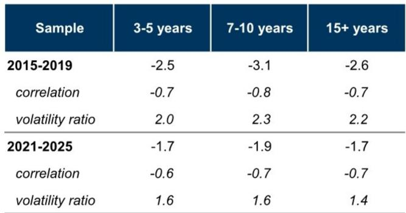
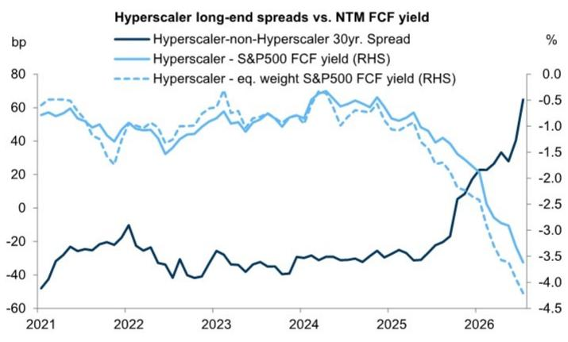

# 长期限超大规模企业信用债与权益的走势分化——自由现金流改善路径将决定哪类资产更优

超大规模企业信用债与权益之间的关系，已不再受过去数十年间定义其运行的结构性机制所主导。与人工智能相关的大规模资本支出，越来越多地通过债务而非留存收益来融资，这引入了一种新的运行模式：长期限信用利差与不断恶化的自由现金流回报表现同步变动，而权益价格则仍与不确定的终值资产估值挂钩。其结果是一种对所有跨资产观察者都重要的分化：信用债的表现弱于其历史权益贝塔值，尤其在长期限端，且随着新发行持续吸收需求，这一差距正在扩大。

这并非暂时的供需失衡。它反映了资本结构与人工智能投资周期互动方式的根本性转变。信用债持有者实际上是在做空公司偿付能力的看跌期权，而权益持有者则在做多。当超大规模企业承诺进行多年期、回报不确定的投资周期时，这两类索取权持有者对不同的信号做出反应。信用债关注近期现金流和偿债覆盖率；权益则对长期限的选择权价值进行折现。这两个时间维度之间的张力，已成为超大规模企业资本市场的决定性特征。

当前表现不佳的直接驱动因素很直接：超大规模企业群体的远期自由现金流回报表现已大幅下降，信用利差也随之扩大。但更重要的问题是接下来会发生什么。自由现金流的改善路径——无论是来自削减资本支出还是来自经营性现金流增长——将决定哪类资产能提供更优的风险调整后回报。这一区分并非学术问题。它是当前人工智能基础设施生态系统中观察者面临的核心相对价值问题。

## 长期限超大规模企业信用债对权益的贝塔值上升，由利差波动率升高驱动

信用债与权益之间的经典关系认为，鉴于信用风险期限溢价向上倾斜，长久期债券应与权益价格更紧密地联动。然而近年来，更广泛的投资级市场经历了这一贝塔值的压缩，原因是负债驱动型读者寻求回报表现以及政策利率波动率升高抑制了长期限利差波动。对于超大规模企业债券，情况则相反。

过去两年的贝塔值回归分析显示，长期限超大规模企业信用利差现在对权益回报表现出比短期限品种更高的敏感性。其机制并非相关性更高，而是波动率更高——具体而言，后端利差相对于权益回报的波动率有所上升，而前端利差仍相对稳定。这是市场正在对长期限现金流的不确定性（而不仅仅是近期再融资风险）进行定价的特征。

这一影响是结构性的，而非周期性的。随着人工智能资本支出周期延长，超大规模企业信用曲线的长期限端，将始终是资本结构中对投资情绪变化最敏感的点。将超大规模企业债券视为同质化信用品种的观察者，忽略了信用风险期限结构已成为人工智能投资不确定性被定价的主要渠道这一事实。

## 自由现金流回报表现下降驱动了当前走势，其恢复路径将决定相对价值

过去几个季度，超大规模企业的整体自由现金流回报表现已显著下降，且时间点与信用利差扩大高度吻合。这并非巧合。信用债持有者基于近期现金生成能力来评估偿债能力，而自由现金流回报表现下降的信号是明确的：资金缺口在扩大，杠杆率在上升。

但这一走势在曲线上并非均匀分布。表现最差的是长期限利差，其时变贝塔模型的残差已转为负值且持续。这种表现不佳与新一轮债务发行浪潮同时出现并不令人意外。关键在于，此前支撑超大规模企业后端债券的波动率抑制技术因素——在低利差波动环境下来自收益导向型读者的强劲需求——已经逆转。更重的供给和对组合集中度的日益担忧，已消除了这一支撑。

对于相对价值观察者而言，关键见解在于：自由现金流的改善可能导致利差收窄，但改善的构成将决定哪类资产受益更多。如果自由现金流改善是因为超大规模企业削减资本支出并缩减投资规模，那么权益的终值预期可能会下降，因为市场会将削减解读为人工智能投资回报不会如预期实现的信号。这一结果有利于信用债，因为偿债覆盖率提高，而权益估值并未相应上升。

相反，如果自由现金流改善是因为净利润和经营性现金流增长，同时投资支出保持强劲，那么权益将获得不成比例的收益。盈利能力上升伴随资本支出持续，表明人工智能投资的回报正变得可见，这可能会引发超大规模企业权益的重新定价。在此情景下，信用利差也会收窄，但相对回报优势将转向权益。

## 跨资产观察者的决策框架：将自由现金流路径映射到受益资产

观察者不应将“自由现金流是否会改善”这一问题视为二元赌注。更有用的框架是评估两种不同路径的概率，并据此进行布局。

路径一：自由现金流改善由资本支出削减驱动。此情景意味着超大规模企业正在回应观察者压力，以展示资本纪律。对信用债的信号是积极的——杠杆率稳定，覆盖率改善，利差收窄。对权益的信号是消极的——市场将资本支出削减解读为承认人工智能驱动的收入增长不足以证明支出的合理性。在此路径下，信用债在风险调整基础上表现优于权益。

路径二：自由现金流改善由经营性现金流增长驱动。此情景意味着超大规模企业正在以快于市场预期的速度将人工智能投资货币化。收入增长、利润率扩张或两者共同推动净利润上升，进而传导至自由现金流，即使资本支出仍处高位。对权益的信号是强烈积极的——终值上升，权益重新定价。信用债也受益，但权益的上行幅度可能超过债券可获得的利差压缩空间。

当前市场定价表明，观察者正在为路径一分配更高的概率，因为长期限信用利差的表现弱于其权益贝塔值。但如果超大规模企业财报显示人工智能服务收入加速增长，这一定价可能迅速转变。因此，相对价值交易并非静态。它需要持续重新评估数据支持的是哪条自由现金流路径。

## 多年期发行周期将持续陡化超大规模企业信用曲线

长期限利差表现不佳的结构性驱动因素不会消失。超大规模企业正处于多年期投资周期的早期至中期阶段，而债务资本市场是增量支出的主要资金来源。只要这一点不变，长期限超大规模企业债券的供给将超过传统信用债持有者的需求，曲线将保持陡峭。

这并非对信用事件的预测。超大规模企业是投资级信用主体，拥有强劲的商业模式和显著的定价能力。但债券市场的技术性因素正在对长期限利差产生不利影响。此前压缩长期限利差的收益寻求型买盘，已被一个对供给敏感的市场所取代，在这个市场中，每一笔新发行都在考验观察者基础的承接能力。

对于权益持有者而言，信用曲线的陡化是一个有用的信号。它表明债务市场正在为长期限的人工智能投资主题敞口要求更高的溢价。当长期债务成本相对于短期债务上升时，会降低超大规模企业延长期限的动机，这最终可能制约投资步伐。权益持有者应关注信用曲线动态，将其作为资本支出周期可能减速的领先指标。

对于信用债持有者而言，策略是在超大规模企业敞口中保持短久期。曲线前端提供了更稳定的风险回报特征，对长期限利差所特有的波动性敞口较小。只要供给管道依然沉重且自由现金流回报表现仍处低位，在曲线后端追逐收益的风险回报比并不具有吸引力。

*仅供参考。部分内容可能基于源材料通过人工智能辅助生成、翻译、总结或编辑，可能存在遗漏或错误。请独立核实。本文不构成专业建议。*

仅供参考。部分内容可能基于源材料通过人工智能辅助生成、翻译、总结或编辑，可能存在遗漏或错误。请独立核实。本文不构成专业建议。

