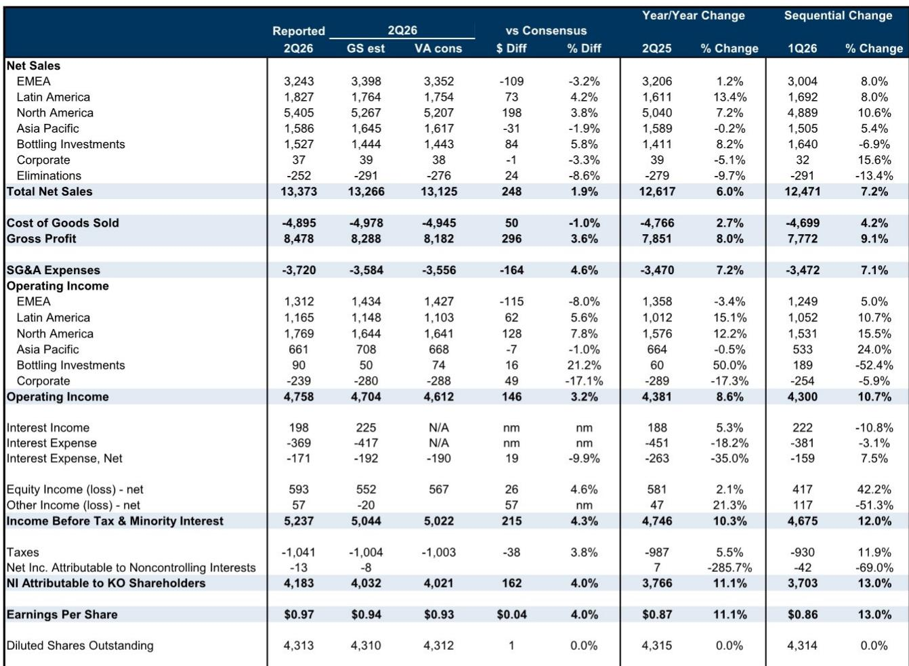
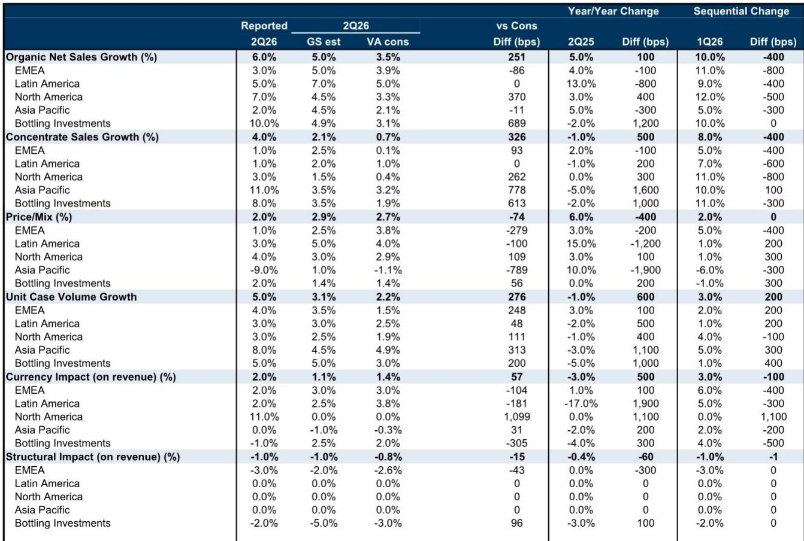
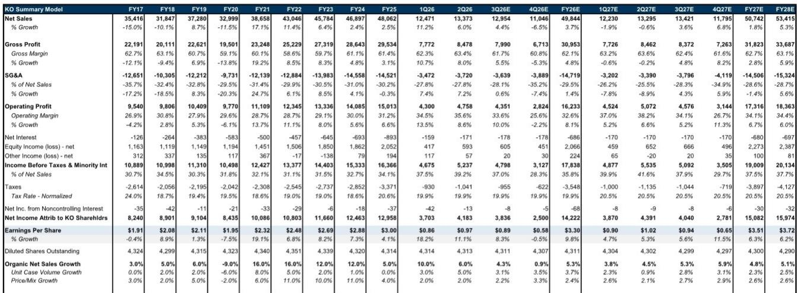

# Coca-Cola’s Q2 Beat Reveals a Strategy That Works Better Than the Market Price Suggests

Coca-Cola just delivered its strongest volume growth in 17 years excluding the pandemic era. Unit case volumes rose 5% in the second quarter, organic revenue growth hit 6% against consensus expectations of 3.5%, and earnings per share came in at $0.97 versus the $0.93 the market had priced in. The stock rose 5% on the day, outperforming the consumer staples sector by roughly 300 basis points.

Yet the company now trades at a 31% premium to the broader market, compared to its three-year historical average premium of just 9%. On a forward price-to-earnings basis, Coca-Cola commands an 8.5x premium over its closest rival, PepsiCo, far above the long-term historical average of roughly 1x. The market is paying for perfection. The question is whether the business can deliver it.

The tension that matters for observers is this: Coca-Cola’s operational momentum is real and durable, but the valuation already embeds an optimistic view of that momentum. Understanding where the company’s strategy creates genuine advantage, and where the second half of the year introduces real friction, is the only way to decide whether the current price is an opportunity or a trap.

## The Second-Quarter Beat Was Not Just Strong—It Was Structurally Different From Prior Outperformance

Coca-Cola’s 5% unit case volume growth in Q2 represented the strongest quarter in 17 years excluding the pandemic distortion. This is not a recovery bounce or a one-off promotional spike. The company gained value share across its global beverage categories, a sign that the growth was broad-based rather than concentrated in a single region or channel.

The quality of the beat matters as much as the magnitude. Concentrate sales grew 4%, trailing unit case volumes by roughly one percentage point, which reflects an expected inventory unwind following six additional days in the first quarter. That gap is mechanical, not a demand signal. Gross margins reached 63.4%, up approximately 120 basis points year over year and ahead of the consensus estimate of 62.3%. Operating margins expanded 85 basis points to 35.6%. The beat was driven by volume and margin expansion simultaneously, not by price increases masking volume weakness.

North America was the standout. Organic revenue growth of 7% in the region exceeded both the analyst estimate of 4.5% and the consensus of 3.3%. Coca-Cola leveraged two concurrent platforms—the FIFA World Cup and the America’s 250th anniversary—to activate locally relevant marketing across the country. The result was strong volume growth across trademark Coca-Cola, fairlife, Powerade, Fresca, Gold Peak, Smartwater, and Simply. This is not a one-brand story. The portfolio breadth allowed Coca-Cola to capture demand across price tiers and consumption occasions.

The implication is clear: Coca-Cola has rebuilt its volume engine after years of relying primarily on pricing and mix to drive revenue. That shift changes the risk profile of the business. Volume-led growth is more sustainable than price-led growth, especially in an environment where consumer affordability is under observation in key emerging markets.

## The Second-Half Guidance Raise Contains Hidden Friction That Observers Should Not Ignore

Coca-Cola raised its full-year organic revenue growth guidance to approximately 5%, up from the prior range of 4% to 5%. The company now expects foreign-exchange-neutral EPS growth of 7% to 8%, versus the previous 6% to 7%. On the surface, this is a confident signal from management.

The arithmetic tells a more nuanced story. First-half results delivered roughly 7.5% top-line growth and approximately 15% bottom-line growth. The implied second-half growth rates, based on the new guidance, are roughly 2% for revenue and 4% for earnings. That deceleration is not hypothetical. It is built into the numbers that management itself has provided.

Five specific headwinds explain the gap. First, concentrate sales are expected to lag unit case volumes by approximately one point in the third quarter, continuing the inventory normalization pattern from Q2. Second, the comparison base becomes meaningfully harder in the second half. Coca-Cola is now lapping year-over-year concentrate sales growth of roughly 2% in the second half of last year, compared to roughly flat growth in the first half. The fourth quarter of last year included a particularly challenging 4% concentrate growth rate, coinciding with inventory building that will not repeat. Third, the company’s affordability initiatives in Asia Pacific, particularly in India and China, are likely to weigh on price and mix in the near term as Coca-Cola prioritizes bringing incremental consumers into its ecosystem over maximizing per-unit revenue. Fourth, commodity pressures in tea and coffee, especially in the APAC region, will temper the pace of gross margin expansion. Fifth, the pending sale of Coca-Cola Beverages Africa, expected to close late in the third quarter or in the fourth quarter, will create a discrete accounting impact that complicates period-over-period comparisons.

None of these headwinds are fatal. Each is manageable and largely anticipated. But together they explain why the implied second-half growth rates are so much lower than the first half. Observers who extrapolate the Q2 beat linearly into the rest of the year will be disappointed, not because the business is deteriorating, but because the base effects and calendar mechanics are working against them.

## The Portfolio Strategy Has Shifted From Defensive Pricing to Offensive Volume, and That Changes the Earnings Quality

Coca-Cola’s long-term algorithm calls for organic revenue growth of 4% to 6%, with a balance between volume and price. For much of the past two years, the company relied more heavily on pricing to offset cost inflation. That dynamic has now reversed.

In Q2, price and mix contributed just 2% to organic growth, below the analyst estimate of 2.9% and the consensus of 2.7%. Volume drove the remainder. This is a deliberate strategic choice. Management has signaled a bias to invest in growth, including innovation and brand building, rather than extracting maximum short-term pricing power. At the recent NACS conference, the company showcased a pipeline of innovation that prioritizes bigger and bolder product strategies designed to engage new customers and retain existing ones.

The earnings quality implication is important. Volume-driven growth produces more predictable revenue streams because it is less dependent on the consumer’s willingness to accept price increases. It also creates operating leverage that flows through to margins more reliably than price-driven growth, which often requires higher marketing investment to sustain. Coca-Cola’s gross margin expanded 120 basis points in Q2 even as price and mix moderated. That is the signature of a business that is gaining scale efficiently.

The risk is that the volume gains are partially dependent on one-time events. The World Cup activation was a significant driver in Q2, and its impact will fade. The America’s 250th anniversary campaign is similarly time-bound. Coca-Cola needs to demonstrate that it can sustain this volume momentum without the tailwind of major global events. Management’s confidence in the guidance suggests they believe the underlying brand momentum is sufficient, but the second-half implied growth rates leave little room for error.

## The Valuation Premium Demands a Decision Framework That Weighs Momentum Against Multiple Expansion Risk

Coca-Cola trades at 25.5 times forward earnings. That is a 31% premium to the S&P 500, compared to a three-year historical average premium of 9%. Relative to PepsiCo, the premium is 8.5 times forward P/E, versus a long-term historical average of roughly 1 times.

The bull case is straightforward: the business is executing at a level that justifies a premium. Volume growth is the strongest in 17 years. Market share is expanding. Margins are improving. The balance sheet is strong, with net debt to EBITDA declining from 1.8 times to an expected 1.2 times by 2028. Free cash flow is projected to grow from $5.3 billion in 2025 to $13.5 billion in 2028, a compound annual growth rate of roughly 37%. The dividend remains well covered, with a payout ratio declining from 68% to 63% over the same period.

The bear case is equally direct: the premium already prices in this execution. For the stock to deliver further upside, Coca-Cola must not only hit its raised guidance but exceed it, and the second-half implied growth rates suggest that exceeding guidance will be difficult. The historical pattern of management conservatism, which the report explicitly notes, provides some comfort. Coca-Cola has a track record of raising guidance and then beating it. But the magnitude of the current premium means that even a slight miss would trigger multiple compression, and the stock would decline even if earnings grew.

The decision framework for observers should center on three variables. First, can Coca-Cola sustain volume growth above 3% without major event tailwinds? Second, will the affordability initiatives in APAC damage price and mix more than management expects? Third, does the premium relative to PepsiCo reflect a durable competitive advantage or a temporary divergence in execution?

On the first question, the evidence is encouraging but incomplete. The World Cup and anniversary campaigns were significant, but the company’s broad-based share gains suggest that underlying brand health is strong. The portfolio breadth across price tiers and categories provides a buffer against any single product or region slowing down. On the second question, the APAC affordability strategy is a deliberate trade-off. Coca-Cola is choosing volume over price in the near term to build a larger consumer base for the long term. That is the right strategic decision, but it will compress reported margins in the region for at least the next two quarters. On the third question, the premium relative to PepsiCo appears wide but not irrational. Coca-Cola’s volume momentum is meaningfully stronger. The analyst report models Coca-Cola unit case volume growth of 3.7% for the full year, compared to 0.9% for PepsiCo. A premium for superior growth is justified. The question is whether the magnitude of the premium already fully discounts that growth differential.

## The Second-Half Dynamics Create a Tactical Pause Point, Not a Strategic Reversal

The implied second-half growth rates of roughly 2% revenue and 4% earnings are achievable. The headwinds are known, manageable, and largely mechanical. The inventory normalization will resolve by year-end. The comparison base becomes easier again in early 2027. The APAC affordability investments will eventually pay off in higher lifetime consumer value. The Africa sale will simplify the portfolio and improve margins.

But the market is not pricing in a 2% revenue growth story. It is pricing in a story of sustained momentum and continued outperformance. The risk over the next two quarters is not that Coca-Cola will fail to deliver on its guidance. The risk is that the guidance itself implies a deceleration that the current valuation does not fully reflect.

For long-term observers who can look through the second-half noise, the strategic case for Coca-Cola remains intact. The company has rebuilt its volume engine, expanded margins, and strengthened its competitive position. The balance sheet provides flexibility for acquisitions or increased shareholder returns. The dividend is secure and growing. The business is structurally better positioned than it was two years ago.

For observers with a shorter time horizon, the current valuation leaves limited room for upside surprise and significant room for disappointment. The second-half data points will be scrutinized not against the guidance, which is achievable, but against the elevated expectations embedded in the stock price. The most likely outcome is that Coca-Cola delivers on its guidance, the stock trades sideways as the multiple compresses slightly, and the next leg of upside waits until 2027 when the base effects turn favorable again.

*For informational purposes only. Portions may be generated, translated, summarized, or edited with AI assistance based on source materials and may contain omissions or errors. Please verify independently. This is not professional advice.*

For informational purposes only. Portions may be generated, translated, summarized, or edited with AI assistance based on source materials and may contain omissions or errors. Please verify independently. This is not professional advice.

