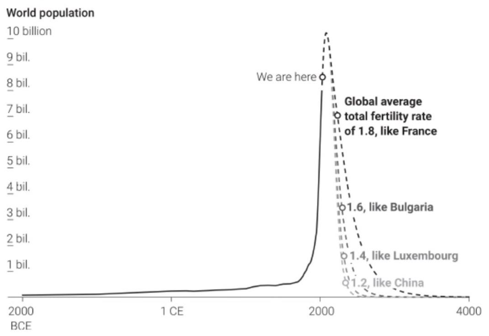
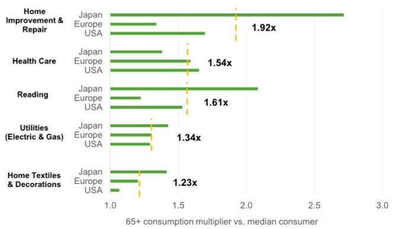
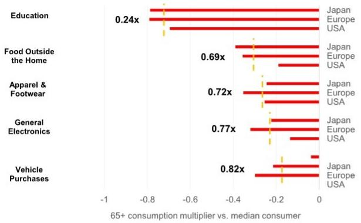
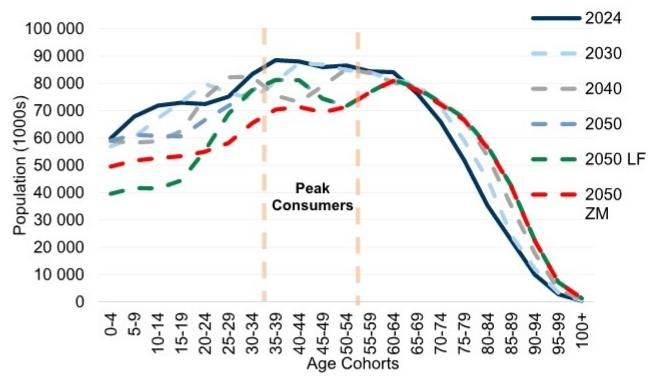
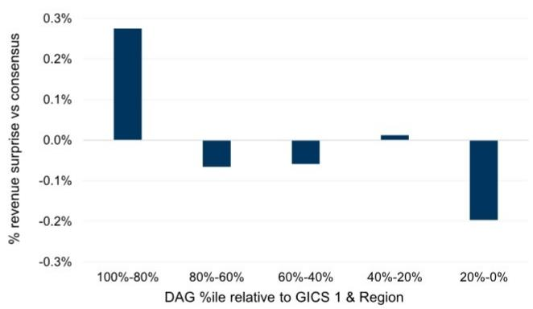

# 人口结构变化与需求趋势：老龄化与人口减少的驱动因素、误解及影响

2024年7月21日，我们举办了一场网络研讨会，邀请了德克萨斯大学奥斯汀分校经济学副教授、人口经济学家Dean Spears博士作为主讲嘉宾。Spears博士是《After the Spike: Population, Progress and the Case for People》一书的作者。我们讨论了人口增长的历史轨迹及其未来走向，并探讨了人口老龄化和减少对宏观环境、环境及社会的影响——涵盖了主讲人对人口减少利弊方面常见误解的看法。以下为主要观点总结：

1. 人口增长的速度有多快，下降的速度就可能有多快——人类目前已过出生高峰，正接近人口峰值：主讲人指出，数千年来，人类数量增长缓慢，公元元年时仅有约3亿人。但随着生存条件的改善——更好的营养、卫生条件以及儿童死亡率的降低——人口呈指数级增长，在19世纪初达到10亿，20世纪达到20亿，并在过去一个世纪中翻了两番。关键在于，从历史长河来看，出生率实际上一直在下降——1968年是人口增长最快的一年，此后从未达到过那样的速度。据主讲人介绍，人类在2012年达到了“出生高峰”，但尚未达到“人口峰值”，因为预期寿命仍在延长。任何持续低于更替水平（约每2名成年人生育2个孩子）的全球出生率，都将导致长期的人口减少。在总和生育率（TFR）为1.5（介于欧洲和美国水平之间）的情况下，每一代人都会显著减少，到第三代时几乎减半。

**图表1：任何长期平均低于2的出生率都将导致人口减少**
不同TFR情景下的世界人口（十亿）

来源：Spears等人（2024年）

2. 发达和发展中经济体的人口峰值均比预期来得更早，未来预测在很大程度上取决于生育率和反弹假设。据主讲人介绍，联合国预测全球人口将在2084年达到峰值，但这一预测基于一个假设：低生育率国家（日本、中国、大部分欧洲和拉丁美洲）的生育率将回升至约1.6，该假设基于21世纪初欧洲数据的模型，而这些数据已被证明不可持续。主讲人对生育率反弹持怀疑态度，他发现美国每个州的最新生育率数据都低于2010年，日本每个县的生育率也都低于十年前——这表明人口峰值将比联合国预测的2080年代更早到来。联合国自身的低生育率预测显示，全球人口将在2050年代达到峰值，这与我们通过交流了解到的许多人口学家的观点更为接近。联合国的基准估计表明，发达经济体的人口已经达到峰值。

重要的是，低生育率已不再是富裕国家的现象，目前三分之二的人口生活在出生率低于2的国家，包括墨西哥（低于美国）、印度（低于更替水平），以及整个拉丁美洲（约1.8）。据主讲人介绍，即使在印度北方邦等欠发达地区，许多年轻女性没有手机或互联网，她们也表示希望生育少于2个孩子，这削弱了单一原因的解释。撒哈拉以南非洲地区仍是一个关键问号，其TFR为4.3，但主讲人认为，其下降趋势与其人类发展阶段相符，并且可能会继续下降。关于生育率下降的最新趋势，详见《发达市场人口减少与AI崛起背景下出生率快速下降》。

3. 生育率下降的驱动因素广泛，没有单一解释，也没有“现成的”政策解决方案。据主讲人介绍，“以上所有”的答案可能是解释生育率下降的最佳起点，因为这种下降规模太大且具有全球性，任何单一解释（智能手机、宗教、晚婚/伴侣关系、女权主义）都不足以说明问题。主讲人指出，即使是印度和拉丁美洲等宗教和婚姻观念浓厚的社会，以及美国红州和蓝州，也显示出低生育率。在主讲人看来，统一的线索是生育孩子的机会成本正在上升，因为世界通过教育、职业，甚至休闲/多巴胺权衡（如电子游戏和流媒体）提供了更多机会。主讲人认为，目前还没有“现成的”解决生育率下降的方案，因为许多鼓励生育的政策（如婴儿奖金）效果有限。然而，学习仍处于早期阶段，主讲人认为，创造一个更平等、更公平的育儿社会可能会有所帮助，而将生育率恢复到更替水平并不需要牺牲平等进步，因为一些女性工资差距最大的经合组织国家恰恰显示出最低的生育率。

4. 关于人口减少的环境和社会效益的误解。与许多关于人口减少好处的看法相反，尽管人口在增长，人类仍在持续改善环境状况——主讲人指出，尽管人口增加，中国2013年的空气污染已大幅减少，人均排放量也显著下降等。此外，主讲人强调，脱碳需要立即采取行动，而人口结构变化则需要几十年的时间。现在减少出生对2050年减排几乎没有好处，因为今天未出生的孩子要再过20多年才会成为主要消费者。我们认为，关于如何在老龄化社会中优先分配政府资源的更广泛辩论将会加剧。这可能会影响对环境倡议的支持——尤其是在其效益不被视为立竿见影的情况下——因为退休和医疗等社会项目的财政支持可能会优先考虑。在社会层面，主讲人认为，应将他人视为通过更广泛的思想和商品交流实现双赢，而非竞争，避免人口减少并不需要倒退性别进步。更多人 = 更多思想、更多创造力、更多数据和更多对惠及全人类的投资（尤其是新药发现）的支持。

5. 人口减少的经济和创新影响：单位固定成本上升，经济选择减少。主讲人认为，固定成本和边际成本带来的规模效应（也称为偏好外部性）的核心经济效益将被削弱——庞大的人口有助于分摊固定成本，从而实现更多种类、定制化、更低价格和更好的基础设施。主讲人认为，更大的人口有助于分摊固定成本——从药物发现到电影制作——人口减少可能会随着时间的推移导致基础设施扩张减少。制药公司会将研发重新分配给较大的年龄组，电影因观众减少而无法制作，企业营业天数减少，并且可能围绕缩小的蛋糕展开破坏性竞争。我们认为，在市场或销量下降的情况下，公司需要考虑针对老龄化人口进行产品重新设计/重新配方，通过国际扩张来弥补国内人口下降，并推出新的服务产品以长期维持和提升客户价值。在AI方面，主讲人认为AI是对人类的补充（就像历史上的Excel或铅笔一样），尽管更少的人会导致更少的生产性人机配对。最后，他认为，财政压力（养老金、医疗保健）将迫使采取某种组合措施，如削减福利、延迟退休或提高税收。

## 老龄化与人口减少的经济及公司需求影响

在我们最近一期的《人口困境》系列研究中，我们评估了老龄化人口支出转变日益增长的影响，以及这些转变将如何影响产品、行业和公司需求。我们引入了人口驱动需求（DDD）框架——涵盖约3000家公司（可根据要求提供）——以识别哪些行业/公司在考虑产品差异化或公司战略转变之前，相对于2023年基线具有最大的人口驱动需求影响。

虽然老龄化、生育率快速下降和年轻人口减少的人口结构转变——发达经济体预计每年退休人员（65岁以上）增长400万，而核心消费者（35-55岁）从2030年开始每年加速减少300万（联合国）——长期以来一直是热门话题，但我们认为到本十年末可能会产生实质性影响，这可能推动产品需求的顺风/逆风，并影响公司围绕区域组合、产品组合和整合/并购的战略。

## 面临人口逆风的行业：

■ 服装和鞋类面临与年轻人口减少相关的重大逆风，年轻人口是历史上新服装的最大支出群体。
■ 汽车行业正处于战略十字路口，面临主要新驾驶年龄人口减少以及老年群体支出下降的问题。
■ 其他面临逆风的显著行业：教育、电子产品（个人电脑、平板电脑、电视）、外出就餐、机场、公共交通（车辆/铁路）。

## 受益于人口顺风的行业：

■ 我们认为，医疗保健将从老龄化中获得较强的人口需求。然而，医疗保健和医疗技术并不能免受人口结构变化的影响，因为老年人口的增长速度将从过去几十年放缓。
■ 休闲和娱乐：家装及家具、阅读、电视观看、邮轮、折扣零售商和宠物。
■ 住宅用电：支出数据显示，老年群体在公用事业上花费更多，用电量也更大，这可能是由于在家时间过多。
■ 老年生活与居家养老：70%的65岁以上老年人倾向于在家中养老，这为家庭医疗保健、远程医疗和数字设备带来了机遇。
■ 其他面临顺风的显著行业：包括家装及家具、阅读、零售——日用品和多品类。

我们的分析师强调的具有人口顺风的部分主题和报告评级公司（不包括所有人口受益者）——老年生活：Ventas；家装：家得宝、劳氏、宣伟；休闲与娱乐：Viking Holdings、嘉年华集团、皇家加勒比、华住集团（中国酒店）；折扣零售商：Ross Stores、TJX；医疗技术：施乐辉（在CL上）；医疗保健：HCA Healthcare、联合健康、Alignment Healthcare、Rede D'Or（巴西医院）、第一三共、希森美康。

更多信息，请阅读——GS SUSTAIN：从人口到需求：老龄化和人口减少将如何推动产品和公司需求的顺风/逆风。

## 图表2：受老龄化人口和支出转变影响的部分公司

## 主要老龄化人口受益者和受影响股票

行业受益者：

## 部分受影响股票：

## 医疗保健

医疗技术、制药：成分、年龄相关治疗、专注于年龄相关问题的医疗保健提供者

士卓曼控股
爱尔康
依视路陆逊梯卡
CareDx
波士顿科学
施乐辉
Denali Therapeutics
BioArctic
Neurocrine Biosciences
Twist Biosciences
赛默飞世尔科技
龙沙

## 老年生活与护理

长期护理设施、辅助生活、康复服务、独立生活技术

Brookdale Senior Living
Sonida Senior Living
Encompass Health
Ensign Group
SMS Co
Brightspring Health Services
Enhabit
InnovAge
Omega Healthcare Investors
Aedifica

## 娱乐与体验

休闲车、摩托车、邮轮、电视、宠物

Nine Entertainment Co
ITV

## 家装

家装、翻新 + 折扣和多品类零售

家得宝、劳氏、宣伟、Floor & Décor、翠丰、Wesfarmers

## 折扣与多品类零售

Tractor Supply Co
Williams-Sonoma
Ollie's Bargain Outlet
沃尔玛
Next Plc

来源：GS全球投资研究

## 人口到需求——图表总结

**图表3：在发达经济体，退休人员每年增长约400万，而核心消费者（35-55岁）在未来十年每年将减少约300万**
较发达地区各年龄段人口年度变化（百万），2010-2035年预测；2024年起为中位数估计

来源：联合国人口展望，GS全球投资研究整理

**图表4：65岁以上人群在家装、医疗保健、阅读、公用事业和装饰方面支出更多……各地区65岁以上消费乘数相对于中位数消费者最高的前5个类别**

来源：BLS、Eurostat、SBJ，GS全球投资研究整理

**图表5：……而在教育、外出就餐、服装鞋类、电子产品和车辆购买方面支出较少**
各地区65岁以上消费乘数相对于中位数消费者最低的5个类别

来源：BLS、Eurostat、SBJ，GS全球投资研究整理

**图表7：我们的DDD框架可以提供关于公司人口顺风和逆风的见解**
标题和国家层面的人口驱动需求增长，2030-2050年 vs 2023年

|  |  | 耐克公司 |  |  |
| :--- | :--- | :--- | :--- | :--- |
|  |  | 人口驱动需求 |  |  |
|  |  | 2030年 | 2040年 | 2050年 |
| 联合国基准情景 |  | 0.9% | 1.6% | 1.5% |
|  | 国家层面人口驱动需求影响 |  |  |  |
| 国家 | 收入占比 | 2030年 | 2040年 | 2050年 |
| 美国 | 36% | 2.6% | 6.0% | 8.5% |
| 中国 | 13% | -3.7% | -10.3% | -17.5% |
| 加拿大 | 6% | 5.0% | 9.7% | 13.1% |
| 日本 | 2% | -4.6% | -11.2% | -16.7% |
| 印度 | 2% | 5.4% | 10.8% | 12.7% |
| 其他 | 22% | 0.8% | 0.9% | 0.6% |

来源：FactSet，GS全球投资研究
2024-2050年中位数情景下0-100+岁各年龄段人口分布

**图表6：发达世界可能已达到35-55岁核心消费者人口峰值，未来在零移民/低生育率情景下将显著降低**

来源：联合国人口展望，GS全球投资研究整理
**图表8：人口前景较好的公司过去三年平均收入惊喜更高**
按DDD五分位数（GICS 1和地区相对）的修剪均值（80%）收入惊喜 vs 共识估计，2023-2025年

来源：FactSet，GS全球投资研究
