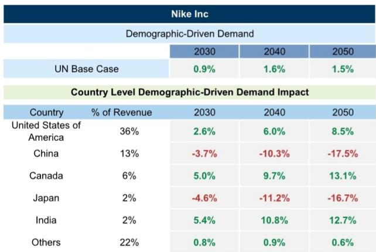
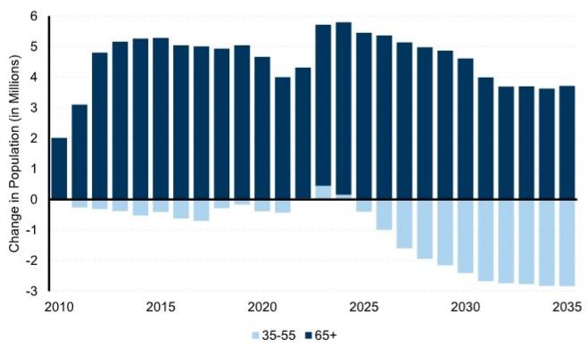

# 研究主题与行业变化观察

2012年已成为人类历史上的“峰值出生”年份。这是近期一场网络研讨会中，人口宏观环境学家Dean Spears提出的核心判断。自那一年起，全球每年新生儿数量开始趋势性下降，而人类总人口尚未见顶，只是因为寿命延长在延缓拐点到来。这份研究笔记的核心主张是：人口结构变化的速度和广度，正在被市场低估，其对产业需求的影响将在2030年前后变得显著。

报告指出，任何长期维持在2以下的总和生育率，都将导致人口调整。以1.5的生育率计算——介于欧洲与美国当前水平之间——每一代人规模将缩减近一半，到第三代人口减少近50%。这一数学推演并非遥远假设，而是正在发生的现实。

## 1. 低生育率已从富裕国家扩散至全球多数地区

报告强调，低生育率不再是富裕国家的专属现象。目前全球三分之二的人口生活在生育率低于2的国家，包括墨西哥、印度，以及整体约1.8的拉丁美洲。即使在印度北方邦等相对落后的地区，年轻女性期望的子女数量也已低于2个。这一发现削弱了将低生育率归因于单一因素的解释力——无论是智能手机、宗教、婚姻推迟还是女权主义，都无法单独解释这一全球性趋势。

报告认为，统一的解释线索是“养育孩子的机会成本”在持续上升。随着教育、职业乃至娱乐和数字媒体提供的替代选择增多，生育的隐性代价在提高。而目前没有任何“现成可用的”政策工具能有效逆转这一趋势。婴儿奖金等鼓励生育的政策，效果有限。

> **研究笔记：** 报告暗示，市场对人口问题的关注点可能需要从“发达国家老龄化”转向“全球性低生育率”。这意味着，依赖年轻人口增长的消费品类，其需求基础可能比预期更早、更广泛地受到侵蚀。

## 2. 联合国的人口峰值预测可能过于乐观

报告对联合国的人口预测提出了明确质疑。联合国基准情景预计全球人口在2084年达到峰值，但这一预测建立在一个关键假设上：低生育率国家（日本、中国、欧洲大部分地区及拉丁美洲）的生育率将回升至约1.6。这一假设基于2000年代初的欧洲数据模型，而该模型已被证明不可持续。

报告引用了两个具体证据：美国所有州的生育率均低于2010年水平；日本所有县（相当于中国的省）的生育率均低于十年前。这些数据指向一个结论：全球人口峰值可能比联合国预期的2080年代更早到来。联合国自身的低生育率预测情景显示，全球人口可能在2050年代见顶，这与许多人口学家的判断更为接近。

对于撒哈拉以南非洲这一关键变量——当前生育率约4.3——报告认为其下降趋势符合人类发展阶段预期，生育率将继续走低。

## 3. 人口调整的宏观环境后果：固定成本分摊基础被侵蚀

报告从宏观环境学角度提出了一个核心论点：人口规模带来的规模效应正在被削弱。大量人口能够分摊固定成本，从而支撑更多样化的产品、更低的单价和更好的基础设施。当人口调整时，这一机制将反向运行。

具体而言，制药公司会将研发资源重新分配给更大的年龄群体；电影可能因观众调整而无法制作；企业可能减少运营天数；市场可能陷入对调整蛋糕的竞争。报告认为，对于市场或销量处于下降通道的企业，需要重新考虑产品设计以瞄准老龄化人群，通过国际扩张弥补国内人口下降，并推出新服务以维持长期客户价值。

在人工智能方面，报告的观点相对克制：AI将补充人类，但更少的人意味着更少的生产性人机组合。

## 4. 产业需求的分化：哪些行业受益，哪些承压

报告引入了一个“人口驱动需求”框架，覆盖约3000家公司，以2023年为基准评估人口结构对产品需求的影响。核心发现是：发达地区退休人口（65岁以上）每年增加约400万，而核心消费人群（35-55岁）从2030年起每年减少约300万。

面临逆风的行业包括：服装鞋履（年轻人口减少）、汽车（新驾驶年龄人口下降）、教育、电子产品、外出就餐等。受益的行业则集中在：医疗保健（较强需求拉动）、居家养老及辅助生活设施、家居装修、休闲娱乐（邮轮、电视、宠物）、折扣零售，以及住宅用电。

报告还提供了一个具体案例：耐克。在其主要市场中，美国市场的人口结构对其需求有正面贡献，而中国和日本市场则构成显著仍在调整。到2050年，仅人口结构变化一项，就可能使耐克在中国市场的需求下降17.5%，在日本下降16.7%。

> **研究笔记：** 这一框架的价值在于将宏观人口趋势拆解为具体公司的收入不确定性敞口。读者可以据此评估，一家公司的区域收入分布是否与当地人口结构变化方向一致。报告还发现，人口结构展望较好的公司，过去三年收入超预期的幅度平均更高。

人口结构变化是慢变量，但其累积效应不可逆。当全球人口峰值比预期更早到来，而生育率回升被证明是难以实现的假设时，依赖人口增长的宏观环境和商业模式需要重新审视其底层逻辑。这份报告提供的不是短期交易信号，而是一个至少横跨十年的需求分析框架。

For informational purposes only. Portions may be generated,translated,summarized,or edited with AI assistance based on source materials and may contain omissions or errors. Please verify independently. This is not investment,legal,tax,accounting,or other professional advice.

