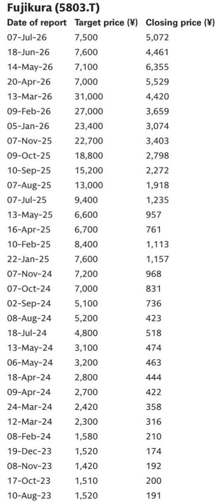
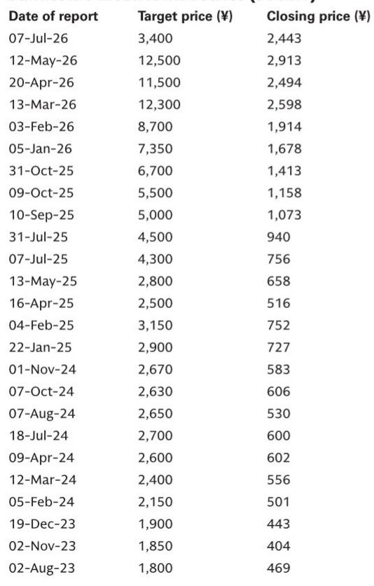
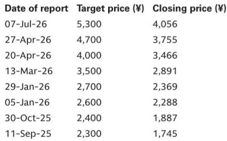

# GS：月度与季度数据变化观察

康宁在7月28日公布了2026财年第二季度业绩。公司整体核心销售额为47.38亿美元，高于彭博一致预期的46.44亿美元；核心每股收益0.78美元，也略高于市场预期的0.76美元。值得关注的信号来自光通信部门：该季度销售额20.72亿美元，同比增长32%，营业利润4.38亿美元，同比增长77%，两项指标均超出市场预期。然而，康宁当日报价下跌约19%。市场对AI相关公司的短期情绪已变得谨慎——即使业绩超预期，报价仍可能承压。

但这份GS研报的核心判断并非关于康宁本身，而是指向一个更具体的研究逻辑：日本光通信股与康宁之间的估值差距已拉大，未来存在重新定价的空间。截至报告发布日，藤仓、住友电工和古河电工的远期市盈率分别为26倍、19倍和22倍，而康宁为41倍。GS认为，一旦市场情绪稳定，日本厂商在高端光缆领域的战略定位将被重新认识。

## 1. 企业网络业务增长65%，数据中心需求接近弹性较高

康宁光通信部门内部呈现明显分化。企业网络子部门销售额12.69亿美元，同比增长65%，远超市场预期的10.57亿美元。公司表示，AI数据中心相关需求几乎同比弹性较高，订单仍在加速增长。而运营商网络子部门销售额8.03亿美元，同比仅增长1%，环比下降9%。康宁解释，这主要是客户项目时间调整所致；2026上半财年该子部门销售额仍同比增长17%。

长期来看，康宁预计运营商网络将维持中个位数增长，驱动力来自数据中心互联和光纤到户需求。这一判断与市场对电信资本开支节奏变化的担忧形成对比——康宁认为，DCI和FTTH的结构性需求足以支撑长期增长，而非依赖短期运营商研究周期。

## 2. 日本厂商避开大宗光纤竞争，转向高附加值产品

市场参与者对来自中国制造商的竞争存在担忧。GS在报告中指出，这正是日本厂商此前主动控制大宗光纤产能扩张的原因——该领域曾因供给过剩导致价格不确定性。日本厂商将资源集中于高附加值光缆和其他差异化产品，而非参与价格竞争。

> **KC评论：** 日本光通信厂商的估值折价，部分源于市场将其与大宗光纤商品周期挂钩。但它们的业务结构已发生变化：数据中心用高密度光缆、光互连等产品的利润率远高于普通光纤。如果这一转型被市场充分定价，估值体系可能从“周期股”切换到“AI基础设施股”。

康宁在业绩说明会上也确认，其大规模产能扩张基于长期客户合同，研究不确定性与回报的分配机制已经建立，并预计未来长期合同数量将进一步增加。这一模式降低了产能扩张的财务不确定性，也为日本厂商提供了可参照的行业基准。

## 3. 光电子与规模化网络需求预期未变，CPO/NPO仍是关键方向

关于CPO/NPO等光电子技术以及AI服务器机架内光互连等规模化网络需求，康宁表示自5月读者日以来，其判断没有显著变化。公司正在为下一代规模化网络的光学转型做准备。

这一表态意味着，市场对光互连技术路线的预期并未因短期报价波动而改变。对于藤仓、住友电工和古河电工等日本厂商而言，如果它们能在超高密度光缆或光电子组件领域建立技术优势，估值折价的收窄将不仅来自情绪修复，更来自基本面确认。

## 4. 可复用的观察框架：估值差与业务结构匹配度

GS这份报告提供了一个可供读者持续跟踪的分析框架：将目标公司的远期估值倍数与其业务结构中高附加值产品占比进行对照。当一家公司的估值倍数明显低于业务结构相似的海外同行，且其战略转型已被财报数据初步验证时，估值差收窄的可能性上升。

具体到日本光通信股，需要跟踪三个维度：数据中心相关收入占比及增速、长期合同覆盖范围、以及光电子技术（如CPO/NPO）的商业化进展。这三个维度共同决定了日本厂商能否从“光纤周期股”重新定价为“AI基础设施供应商”。

For informational purposes only. Portions may be generated,translated,summarized,or edited with AI assistance based on source materials and may contain omissions or errors. Please verify independently. This is not investment,legal,tax,accounting,or other professional advice.

For informational purposes only. Portions may be generated,translated,summarized,or edited with AI assistance based on source materials and may contain omissions or errors. Please verify independently. This is not investment,legal,tax,accounting,or other professional advice.

