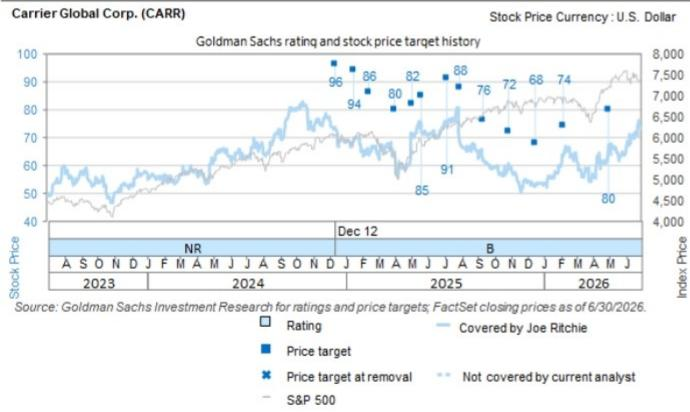

# Japan Technology: Hardware - Industrial Electronics: CARR 2Q: Observations for MELCO and Pana, cost trends worth monitoring

Carrier (covered by our US Multi-Industry sector analyst Joe Ritchie) announced 2Q26 results on July 28 (JST). Key observations were as follows. 1) In the Americas, channel inventory is down -25% yoy, and the company expects steady demand to continue into 2H. 2) In Europe, heat pumps remain active, growing +20% yoy. 3) Asia is also performing well, excluding China. From a sales perspective, we see positive implications for earnings at Mitsubishi Electric and Panasonic Holdings. On the other hand, for Carrier, rising raw material costs and other factors are affecting profit margins. We are constructive about both Mitsubishi Electric and Panasonic Holdings working to reduce fixed costs, but the impact of high costs also needs to be kept in mind. Additionally, regarding Mitsubishi Electric, we think the earnings outlook is positive for its Factory Automation (FA) business, as the group's specialized trading company RYODEN raised its full-year earnings guidance on July 28.

Ryo Harada
+81(3)4587-9865 | ryo.harada@gs.com
GS Japan Co., Ltd.

Carrier's results also confirmed robust data center demand, particularly in the Americas. In the DC air conditioning space, Mitsubishi Electric develops chillers mainly in Europe, but is looking to expand its business to the US, and we see potential for positive developments on this front.

Hiroki Muramatsu
+81(3)4587-9872 |
hiroki.muramatsu@gs.com
GS Japan Co., Ltd.

## Key observations from Carrier's results briefing

2Q sales came to US\$6,351 mn (Bloomberg consensus: US\$6,021 mn), with organic growth of +3% yoy.

2Q adjusted operating profits finished at US\$1,095 mn (consensus: US\$1,041 mn), down -6% yoy. The adjusted operating profit margin was 17.2% (-190 bps yoy). Higher volumes and productivity improvements contributed, but this was offset by rising raw material costs and an unfavorable business mix.

2Q orders were up by +40% yoy. Commercial HVAC was strong at +65% yoy, with particularly robust demand seen in data center-related business, up over +300% yoy. Carrier guides for FY26 data center sales of US\$2.0 bn, an upward revision from previous guidance of US\$1.5 bn. The product portfolio for CDUs (coolant distribution units) is expanding, and orders for CARR's QuantumLeap cooling solution are increasing.

The order backlog at the end of 2Q was over USD8 bn, up +40% yoy and +20% qoq.

Climate Solutions Americas (CSA) business: 2Q sales were US\$3,372 mn (consensus: US\$3,138 mn), with organic growth of +4% yoy. Residential (+9% yoy) and Light Commercial (+10% yoy) were strong. Residential channel inventory was down -25% yoy, and the company expects steady growth in 2H. Commercial was down -8% yoy due to shipment timing, but the company expects expansion in data center-related business in 2H26. Commercial orders doubled yoy, driven by data center-related orders, which were up over +300% yoy.

Climate Solutions Europe (CSE) business: 2Q sales were US\$1,324 mn (consensus: US\$1,307 mn), with organic growth of +3% yoy. Residential & Light Commercial (RLC) saw positive high-single-digit % growth yoy. The electrification trend continues, and heat pump sales performed well, up +20% yoy. While Commercial saw a mid-single-digit % decline, CARR expects a recovery in 2H26 on data center-related demand.

Climate Solutions Asia Pacific Middle East & Africa (CSAME) business: 2Q sales were US\$917 mn (consensus: US\$867 mn), with organic growth of +4% yoy. In China, RLC remained subdued, down -25% yoy. However, other regions excluding China were strong, with positive growth in India (+35% yoy), the Middle East (+35% yoy), Southeast Asia (+20% yoy), and Australia (+30% yoy).

The company raised its FY26 full-year guidance. Sales guidance was raised from US\$22 bn to US\$23 bn, and adjusted operating profit guidance from US\$3.4 bn to US\$3.5 bn.

## Price Target Risks and Methodology - Panasonic Holdings

We are Buy rated. Our 12-month target price is ¥5,000. We apply an EV/EBITDA multiple of 9.0X (FY3/28E base year, based on the historical correlation between EV/EBITDA and EBITDA margin). Risks: Companywide: (1) Slower-than-expected progress with fixed-cost reductions or insufficiently realized benefits from business reforms across the company as a whole, (2) weaker growth prospects due to the loss of key personnel during the fixed-cost reduction process, (3) slower-than-expected progress in revamping the business portfolio as a result of delays selecting buyers, (4) additional investment and depreciation burdens arising due to increased demand for cylindrical batteries, and (5) forex trends (we estimate that every ¥1 appreciation vs. the USD/EUR/CNY impacts annual adjusted operating profits by -¥0.9 bn/-¥1.0 bn/+¥4.7 bn, respectively). Lifestyle updates business: Weaker demand for residential/commercial air conditioners due to a downturn in the global economy, or the loss of market share to more popular or cheaper products at competitors. Panasonic Connect: (1) A slump in the company's aircraft services business if the "bring your own devices" trend were to become more common for in-flight entertainment on commercial aircraft, (2) weaker-than-expected sales growth at acquired company Blue Yonder (standalone basis), (3) major impairment losses on Blue Yonder if the calculation of its present value were to require a higher WACC due to rising interest rates, softer demand or other factors (indication of impairment is checked every quarter), and (4) a longer-than-anticipated decline in demand for various mounting systems used in process automation, such as the manufacture of PCs and smartphones. Panasonic Energy: Tesla opting to increase its use of batteries made by other companies, leading to stronger pricing pressures, a further slowdown in the EV market, or increased competition in the generative AI-related battery backup unit (BBU) business. Panasonic Industry: Weaker-than-expected factory automation-related demand, stiffer competition in the generative AI-related hybrid capacitor and circuit board material businesses, or a longer-than-expected downturn in demand for smartphones and other consumer electronics.

## Price Target Risks and Methodology - Mitsubishi Electric

Valuation methodology: We are Buy rated. Our 12-month target price of ¥7,400 is based on an FY3/28E EV/EBITDA of 14X (based on the correlation between EV/EBITDA and EBITDA margins of global competitors).

Key downside risks: Industrial automation systems (FA): Marginal profit growth on top-line expansion failing to offset higher depreciation from the company's new production facilities if the slowdown in orders is prolonged. Industrial automation systems (automotive equipment): A lack of progress exiting from the car multi-media business, challenges finding partners in the CASE business, or a sharp slowdown in production at client automakers. Home appliances (HVAC): Challenges achieving production scale due to difficulties procuring components and other factors, or deteriorating margins in the ATW business in a stronger competitive landscape. Power semiconductors: Inability to secure sufficient sales/orders to cover new capex, or more intense price competition on significant investment by Chinese companies and other rivals. Elevator & escalator business: Stalled new construction demand in China and other markets, or the outflow to third parties of high-margin maintenance contracts in the domestic business. Infrastructure systems: Project delays or larger-than-expected losses generated in the defense & space systems business. Companywide: Weaker prospects for synergies realized between businesses, and yen appreciation.

## Disclosure Appendix

## Reg AC

We, Ryo Harada and Hiroki Muramatsu, hereby certify that all of the views expressed in this report accurately reflect our personal views about the subject company or companies and its or their securities. We also certify that no part of our compensation was, is or will be, directly or indirectly, related to the specific recommendations or views expressed in this report.

Unless otherwise stated, the individuals listed on the cover page of this report are analysts in GS' Global Investment Research division.

Contributing Authors: Ryo Harada GS Japan Co., Ltd., Hiroki Muramatsu GS Japan Co., Ltd..

Unless otherwise stated, the individuals listed in the Contributing Authors disclosure of this report are analysts in GS' Global Investment Research division.

## GS Factor Profile

The GS Factor Profile provides investment context for a stock by comparing key attributes to the market (i.e. our universe of rated stocks) and its sector peers. The four key attributes depicted are: Growth, Financial Returns, Multiple (e.g. valuation) and Integrated (a composite of Growth, Financial Returns and Multiple). Growth, Financial Returns and Multiple are calculated by using normalized ranks for specific metrics for each stock. The normalized ranks for the metrics are then averaged and converted into percentiles for the relevant attribute. The precise calculation of each metric may vary depending on the fiscal year, industry and region, but the standard approach is as follows:

Growth is based on a stock's forward-looking sales growth, EBITDA growth and EPS growth (for financial stocks, only EPS and sales growth), with a higher percentile indicating a higher growth company. Financial Returns is based on a stock's forward-looking ROE, ROCE and CROCI (for financial stocks, only ROE), with a higher percentile indicating a company with higher financial returns. Multiple is based on a stock's forward-looking P/E, P/B, price/dividend (P/D), EV/EBITDA, EV/FCF and EV/Debt Adjusted Cash Flow (DACF) (for financial stocks, only P/E, P/B and P/D), with a higher percentile indicating a stock trading at a higher multiple. The Integrated percentile is calculated as the average of the Growth percentile, Financial Returns percentile and (100% - Multiple percentile).

Financial Returns and Multiple use the GS analyst forecasts at the fiscal year-end at least three quarters in the future. Growth uses inputs for the fiscal year at least seven quarters in the future compared with the year at least three quarters in the future (on a per-share basis for all metrics).

For a more detailed description of how we calculate the GS Factor Profile, please contact your GS representative.

## M&A Rank

Across our global coverage, we examine stocks using an M&A framework, considering both qualitative factors and quantitative factors (which may vary across sectors and regions) to incorporate the potential that certain companies could be acquired. We then assign a M&A rank as a means of scoring companies under our rated coverage from 1 to 3, with 1 representing high (30%-50%) probability of the company becoming an acquisition target, 2 representing medium (15%-30%) probability and 3 representing low (0%-15%) probability. For companies ranked 1 or 2, in line with our standard departmental guidelines we incorporate an M&A component into our target price. M&A rank of 3 is considered immaterial and therefore does not factor into our price target, and may or may not be discussed in research.

## Quantum

Quantum is GS' proprietary database providing access to detailed financial statement histories, forecasts and ratios. It can be used for in-depth analysis of a single company, or to make comparisons between companies in different sectors and markets.

## Disclosures

The rating(s) for Mitsubishi Electric and Panasonic Holdings is/are relative to the other companies in its/their coverage universe: Anritsu, Daihen, Fuji Electric Co., Fujikura, Furukawa Electric, Hitachi, Meidensha, Mitsubishi Electric, Panasonic Holdings, SWCC, Sumitomo Electric Industries

The rating(s) for Carrier Global Corp. is/are relative to the other companies in its/their coverage universe: 3M Co., ATS Corp., Allegion Plc, Carrier Global Corp., Cognex Corp., Core & Main Inc., Dover Corp., DuPont de Nemours Inc., EquipmentShare, Flowserve Corp., Forgent Power Solutions Inc., GE Vernova, Graco Inc., Honeywell International Inc., INNIO, ITT Inc., Illinois Tool Works, Ingersoll Rand Inc., Johnson Controls International Plc, Kennametal Inc., Lennox International Inc., Madison Air Solutions, Mirion Technologies Inc., Parker Hannifin Corp., RBC Bearings Inc., Regal Rexnord Corp., Rockwell Automation Inc., Roper Technologies Inc., Stanley Black & Decker Inc., Timken Co., Trane Technologies Plc, Vontier Corp., Zurn Elkay Water Solutions Corp., nVENT Electric Plc.

## Company-specific regulatory disclosures

The following disclosures relate to relationships between The GS Group, Inc. (with its affiliates, “GS”) and companies covered by GS Global Investment Research and referred to in this research.

GS beneficially owned 1% or more of common equity (excluding positions managed by affiliates and business units not required to be aggregated under US securities law) as of the month end preceding this report: Panasonic Corp. (\$7.24) and Panasonic Holdings (\$3,604)

GS has received compensation for investment banking services in the past 12 months: Carrier Global Corp. (\$69.33), Mitsubishi Electric (¥5,319), Panasonic Corp. (\$7.24) and Panasonic Holdings (¥3,604)

GS expects to receive or intends to seek compensation for investment banking services in the next 3 months: Carrier Global Corp. (\$69.33), Mitsubishi Electric (¥5,319), Panasonic Corp. (\$7.24) and Panasonic Holdings (¥3,604)

GS has received compensation for non-investment banking services during the past 12 months: Carrier Global Corp. (\$69.33)

GS had an investment banking services client relationship during the past 12 months with: Carrier Global Corp. (\$69.33), Mitsubishi Electric (¥5,319), Panasonic Corp. (\$7.24) and Panasonic Holdings (¥3,604)

GS had a non-investment banking securities-related services client relationship during the past 12 months with: Carrier Global Corp. (\$69.33), Mitsubishi Electric (¥5,319), Panasonic Corp. (\$7.24) and Panasonic Holdings (¥3,604)

GS had a non-securities services client relationship during the past 12 months with: Carrier Global Corp. (\$69.33), Mitsubishi Electric (¥5,319), Panasonic Corp. (\$7.24) and Panasonic Holdings (¥3,604)

GS makes a market in the securities or derivatives thereof: Carrier Global Corp. (\$69.33)

Distribution of ratings/investment banking relationships GS Investment Research global Equity coverage universe

<table><tr><td rowspan="2"></td><td colspan="3">Rating Distribution</td><td colspan="3">Investment Banking Relationships</td></tr><tr><td>Buy</td><td>Hold</td><td>Sell</td><td>Buy</td><td>Hold</td><td>Sell</td></tr><tr><td>Global</td><td>50%</td><td>34%</td><td>16%</td><td>65%</td><td>59%</td><td>43%</td></tr></table>

As of July 1, 2026, GS Global Investment Research had investment ratings on 3,104 equity securities. GS assigns stocks as Buys and Sells on various regional Investment Lists; stocks not so assigned are deemed Neutral. Such assignments equate to Buy, Hold and Sell for the purposes of the above disclosure required by the FINRA Rules. See 'Ratings, Coverage universe and related definitions' below. The Investment Banking Relationships chart reflects the percentage of subject companies within each rating category for whom GS has provided investment banking services within the previous twelve months.

## Price target and rating history chart(s)

  
The price targets shown should be considered in the context of all prior published GS, which may or may not have included price targets, as well as developments relating to the company, its industry and financial markets.

  
The price targets shown should be considered in the context of all prior published GS, which may or may not have included price targets, as well as developments relating to the company, its industry and financial markets.

  
The price targets shown should be considered in the context of all prior published GS, which may or may not have included price targets, as well as developments relating to the company, its industry and financial markets.

## Target price history table(s)

Carrier Global Corp. (CARR)  
Panasonic Holdings (6752.T)

<table><tr><td>Date of report</td><td>Target price ($)</td><td>Closing price ($)</td><td>Date of report</td><td>Target price (¥)</td><td>Closing price (¥)</td></tr><tr><td>10-Jul-26</td><td>85.00</td><td>69.34</td><td>07-Jul-26</td><td>5,000</td><td>4,400</td></tr><tr><td>30-Apr-26</td><td>80.00</td><td>67.17</td><td>29-May-26</td><td>4,220</td><td>3,700</td></tr><tr><td>06-Feb-26</td><td>74.00</td><td>63.92</td><td>30-Apr-26</td><td>4,000</td><td>3,203</td></tr><tr><td>16-Dec-25</td><td>68.00</td><td>53.44</td><td>19-Feb-26</td><td>2,600</td><td>2,525</td></tr><tr><td>28-Oct-25</td><td>72.00</td><td>58.74</td><td>04-Feb-26</td><td>2,500</td><td>2,194</td></tr><tr><td>11-Sep-25</td><td>76.00</td><td>62.30</td><td>19-Jan-26</td><td>2,450</td><td>2,351</td></tr><tr><td>30-Jul-25</td><td>88.00</td><td>68.20</td><td>05-Jan-26</td><td>2,300</td><td>2,079</td></tr><tr><td>07-Jul-25</td><td>91.00</td><td>74.64</td><td>30-Oct-25</td><td>2,100</td><td>1,924</td></tr><tr><td>21-May-25</td><td>85.00</td><td>72.09</td><td>23-Jul-25</td><td>2,000</td><td>1,506</td></tr></table>

Carrier Global Corp. (CARR)

<table><tr><td>Date of report</td><td>Target price ($)</td><td>Closing price ($)</td></tr><tr><td>05-May-25</td><td>82.00</td><td>70.81</td></tr><tr><td>02-Apr-25</td><td>80.00</td><td>65.04</td></tr><tr><td>12-Feb-25</td><td>86.00</td><td>63.60</td></tr><tr><td>16-Jan-25</td><td>94.00</td><td>69.74</td></tr><tr><td>12-Dec-24</td><td>96.00</td><td>73.54</td></tr></table>

<table><tr><td colspan="3">Panasonic Holdings (6752.T)</td></tr><tr><td>Date of report</td><td>Target price (¥)</td><td>Closing price (¥)</td></tr><tr><td>10-Feb-25</td><td>2,500</td><td>1,784</td></tr><tr><td>04-Feb-25</td><td>1,770</td><td>1,530</td></tr><tr><td>23-Jan-25</td><td>1,750</td><td>1,548</td></tr><tr><td>31-Oct-24</td><td>1,450</td><td>1,238</td></tr><tr><td>07-Oct-24</td><td>1,400</td><td>1,318</td></tr><tr><td>18-Jul-24</td><td>1,450</td><td>1,318</td></tr><tr><td>09-May-24</td><td>1,580</td><td>1,387</td></tr><tr><td>24-Apr-24</td><td>1,630</td><td>1,393</td></tr><tr><td>12-Mar-24</td><td>1,650</td><td>1,394</td></tr><tr><td>02-Feb-24</td><td>1,900</td><td>1,383</td></tr><tr><td>19-Dec-23</td><td>1,950</td><td>1,370</td></tr><tr><td>30-Oct-23</td><td>1,900</td><td>1,437</td></tr><tr><td>17-Oct-23</td><td>2,000</td><td>1,585</td></tr></table>

## Mitsubishi Electric (6503.T)

<table><tr><td>Date of report</td><td>Target price (¥)</td><td>Closing price (¥)</td></tr><tr><td>07-Jul-26</td><td>7,400</td><td>5,947</td></tr><tr><td>28-Apr-26</td><td>7,000</td><td>6,078</td></tr><tr><td>19-Feb-26</td><td>6,400</td><td>5,731</td></tr><tr><td>03-Feb-26</td><td>5,950</td><td>5,000</td></tr><tr><td>19-Jan-26</td><td>5,850</td><td>5,100</td></tr><tr><td>05-Jan-26</td><td>5,350</td><td>4,790</td></tr><tr><td>31-Oct-25</td><td>5,200</td><td>4,317</td></tr><tr><td>08-Oct-25</td><td>4,500</td><td>4,089</td></tr><tr><td>31-Jul-25</td><td>4,100</td><td>3,342</td></tr><tr><td>28-Apr-25</td><td>3,600</td><td>2,620</td></tr><tr><td>16-Apr-25</td><td>3,500</td><td>2,493</td></tr><tr><td>31-Oct-24</td><td>3,250</td><td>2,388</td></tr><tr><td>07-Oct-24</td><td>3,100</td><td>2,461</td></tr><tr><td>02-Sep-24</td><td>3,250</td><td>2,461</td></tr><tr><td>07-Aug-24</td><td>3,300</td><td>2,161</td></tr><tr><td>18-Jul-24</td><td>3,400</td><td>2,804</td></tr><tr><td>26-Apr-24</td><td>3,300</td><td>2,393</td></tr><tr><td>12-Mar-24</td><td>3,200</td><td>2,416</td></tr><tr><td>05-Feb-24</td><td>2,600</td><td>2,214</td></tr><tr><td>19-Dec-23</td><td>2,500</td><td>2,001</td></tr><tr><td>17-Oct-23</td><td>2,400</td><td>1,815</td></tr></table>

Price targets shown in table(s) are unadjusted for corporate actions.

## Regulatory disclosures

## Disclosures required by United States laws and regulations

See company-specific regulatory disclosures above for any of the following disclosures required as to companies referred to in this report: manager or co-manager in a pending transaction; $1\%$ or other ownership; compensation for certain services; types of client relationships; managed/co-managed public offerings in prior periods; directorships; for equity securities, market making and/or specialist role. GS trades or may trade as a principal in debt securities (or in related derivatives) of issuers discussed in this report.

The following are additional required disclosures: Ownership and material conflicts of interest: GS policy prohibits its analysts, professionals reporting to analysts and members of their households from owning securities of any company in the analyst's area of coverage. Analyst compensation: Analysts are paid in part based on the profitability of GS, which includes investment banking revenues. Analyst as officer or director: GS policy generally prohibits its analysts, persons reporting to analysts or members of their households from serving as an officer, director or advisor of any company in the analyst's area of coverage. Non-U.S. Analysts: Non-U.S. analysts may not be associated persons of GS & Co. LLC and therefore may not be subject to FINRA Rule 2241 or FINRA Rule 2242 restrictions on communications with a subject company, public appearances and trading in securities covered by the analysts.

Additional disclosures required under the laws and regulations of jurisdictions other than the United States
The following disclosures are those required by the jurisdiction indicated, except to the extent already made above pursuant to United States laws and regulations. Australia: GS Australia Pty Ltd and its affiliates are not authorised deposit-taking institutions (as that term is defined in the Banking Act 1959 (Cth)) in Australia and do not provide banking services, nor carry on a banking business, in Australia. This research, and any access to it, is intended only for “wholesale clients” within the meaning of the Australian Corporations Act, unless otherwise agreed by GS. In producing research reports, members of Global Investment Research of GS Australia may attend site visits and other meetings hosted by the companies and other entities which are the subject of its research reports. In some instances the costs of such site visits or meetings may be met in part or in whole by the issuers concerned if GS Australia considers it is appropriate and reasonable in the specific circumstances relating to the site visit or meeting. To the extent that the contents of this document contains any financial product advice, it is general advice only and has been prepared by GS without taking into account a client's objectives, financial situation or needs. A client should, before acting on any such advice, consider the appropriateness of the advice having regard to the client's own objectives, financial situation and needs. A copy of certain GS Australia and New Zealand disclosure of interests and a copy of GS' Australian Sell-Side Research Independence Policy Statement are available at: https://www.goldmansachs.com/disclosures/australia-new-zealand/index.html. Brazil: Disclosure information in relation to CVM Resolution n. 20 is available at https://www.gs.com/worldwide/brazil/area/gir/index.html. Where applicable, the Brazil-registered analyst primarily responsible for the content of this research report, as defined in Article 20 of CVM Resolution n. 20, is the first author named at the beginning of this report, unless indicated otherwise at the end of the text. Canada: This information is being provided to you for information purposes only and is not, and under no circumstances should be construed as, an advertisement, offering or solicitation by GS & Co. LLC for purchasers of securities in Canada to trade in any Canadian security. GS & Co. LLC is not registered as a dealer in any jurisdiction in Canada under applicable Canadian securities laws and generally is not permitted to trade in Canadian securities and may be prohibited from selling certain securities and products in certain jurisdictions in Canada. If you wish to trade in any Canadian securities or other products in Canada please contact GS Canada Inc., an affiliate of The GS Group Inc., or another registered Canadian dealer. Hong Kong: Further information on the securities of covered companies referred to in this research may be obtained on request from GS (Asia) L.L.C. India: Further information on the subject company or companies referred to in this research may be obtained from GS (India) Securities Private Limited, Research Analyst - SEBI Registration Number INH000001493, 10th Floor, Ascent-Worli, Sudam Kalu Ahire Marg, Worli, Mumbai-400 025, India, Corporate Identity Number U74140MH2006FTC160634, Phone +91 22 6616 9000, Fax +91 22 6616 9001. GS may beneficially own 1% or more of the securities (as such term is defined in clause 2 (h) the Indian Securities Contracts (Regulation) Act, 1956) of the subject company or companies referred to in this research report. Registration granted by SEBI and certification from NISM in no way guarantee performance of the intermediary or provide any assurance of returns to investors. GS (India) Securities Private Limited compliance officer and investor grievance contact details, a copy of the annual compliance audit report and other relevant information and disclosures can be found at this link:

https://www.goldmansachs.com/worldwide/india/research-analyst. Japan: See below. Korea: This research, and any access to it, is intended only for “professional investors” within the meaning of the Financial Services and Capital Markets Act, unless otherwise agreed by GS. Further information on the subject company or companies referred to in this research may be obtained from GS (Asia) L.L.C., Seoul Branch. New Zealand: GS New Zealand Limited and its affiliates are neither “registered banks” nor “deposit takers” (as defined in the Reserve Bank of New Zealand Act 1989) in New Zealand. This research, and any access to it, is intended for “wholesale clients” (as defined in the Financial Advisers Act 2008) unless otherwise agreed by GS. A copy of certain GS Australia and New Zealand disclosure of interests is available at: https://www.goldmansachs.com/disclosures/australia-new-zealand/index.html. Russia: Research reports distributed in the Russian Federation are not advertising as defined in the Russian legislation, but are information and analysis not having product promotion as their main purpose and do not provide appraisal within the meaning of the Russian legislation on appraisal activity. Research reports do not constitute a personalized investment recommendation as defined in Russian laws and regulations, are not addressed to a specific client, and are prepared without analyzing the financial circumstances, investment profiles or risk profiles of clients. GS assumes no responsibility for any investment decisions that may be taken by a client or any other person based on this research report. Singapore: GS (Singapore) Pte. (Company Number: 198602165W), which is regulated by the Monetary Authority of Singapore, accepts legal responsibility for this research, and should be contacted with respect to any matters arising from, or in connection with, this research. Taiwan: This material is for reference only and must not be reprinted without permission. Investors should carefully consider their own investment risk. Investment results are the responsibility of the individual investor. United Kingdom: Persons who would be categorized as retail clients in the United Kingdom, as such term is defined in the rules of the Financial Conduct Authority, should read this research in conjunction with prior GS on the covered companies referred to herein and should refer to the risk warnings that have been sent to them by GS International. A copy of these risks warnings, and a glossary of certain financial terms used in this report, are available from GS International on request.

European Union and United Kingdom: Disclosure information in relation to Article 6 (2) of the European Commission Delegated Regulation (EU) (2016/958) supplementing Regulation (EU) No 596/2014 of the European Parliament and of the Council (including as that Delegated Regulation is implemented into United Kingdom domestic law and regulation following the United Kingdom's departure from the European Union and the European Economic Area) with regard to regulatory technical standards for the technical arrangements for objective presentation of investment recommendations or other information recommending or suggesting an investment strategy and for disclosure of particular interests or indications of conflicts of interest is available at https://www.gs.com/disclosures/europeanpolicy.html which states the European Policy for Managing Conflicts of Interest in Connection with Investment Research.

Japan: GS Japan Co., Ltd. is a Financial Instrument Dealer registered with the Kanto Financial Bureau under registration number Kinsho 69, and a member of Japan Securities Dealers Association, Financial Futures Association of Japan Type II Financial Instruments Firms Association, and Investment Management Association of Japan. Sales and purchase of equities are subject to commission pre-determined with clients plus consumption tax. See company-specific disclosures as to any applicable disclosures required by Japanese stock exchanges, the Japanese Securities Dealers Association or the Japanese Securities Finance Company.

## Ratings, coverage universe and related definitions

Buy (B), Neutral (N), Sell (S) Analysts recommend stocks as Buys or Sells for inclusion on various regional Investment Lists. Being assigned a Buy or Sell on an Investment List is determined by a stock's total return potential relative to its coverage universe. Any stock not assigned as a Buy or a Sell on an Investment List with an active rating (i.e., a stock that is not Rating Suspended, Not Rated, Early-Stage Biotech, Coverage Suspended or Not Covered), is deemed Neutral. Each region manages Regional Conviction Lists, which are selected from Buy rated stocks on the respective region's Investment Lists and represent investment recommendations focused on the size of the total return potential and/or the likelihood of the realization of the return across their respective areas of coverage. The addition or removal of stocks from such Conviction Lists are managed by the Investment Review Committee or other designated committee in each respective region and do not represent a change in the analysts' investment rating for such stocks.

Total return potential represents the upside or downside differential between the current share price and the price target, including all paid or anticipated dividends, expected during the time horizon associated with the price target. Price targets are required for all covered stocks. The total return potential, price target and associated time horizon are stated in each report adding or reiterating an Investment List membership.

Coverage Universe: A list of all stocks in each coverage universe is available by primary analyst, stock and coverage universe at https://www.gs.com/research/hedge.html.

Not Rated (NR). The investment rating, target price and earnings estimates (where relevant) are removed pursuant to GS policy when GS is acting in an advisory capacity in a merger or in a strategic transaction involving this company, when there are legal, regulatory or policy constraints due to GS' involvement in a transaction, and in certain other circumstances. Early-Stage Biotech (ES). An investment rating and a target price are not assigned pursuant to GS policy when this company has neither a drug, treatment or medical device that has passed a Phase II clinical trial nor a license to distribute a post-Phase II drug, treatment or medical device. Rating Suspended (RS). GS has suspended the investment rating and price target for this stock, because there is not a sufficient fundamental basis for determining an investment rating or target price. The previous investment rating and target price, if any, are no longer in effect for this stock and should not be relied upon. Coverage Suspended (CS). GS has suspended coverage of this company. Not Covered (NC). GS does not cover this company.

## Global product; distributing entities

GS Global Investment Research produces and distributes research products for clients of GS on a global basis. Analysts based in GS offices around the world produce research on industries and companies, and research on macroeconomics, currencies, commodities and portfolio strategy. This research is disseminated in Australia by GS Australia Pty Ltd (ABN 21 006 797 897); in Brazil by GS do Brasil Corretora de Títulos e Valores Mobiliários S.A.; Public Communication Channel GS Brazil: 0800 727 5764 and / or contatogoldmanbrasil@gs.com. Available Weekdays (except holidays), from 9am to 6pm. Canal de Comunicação com o Público GS Brasil: 0800 727 5764 e/ou contatogoldmanbrasil@gs.com. Horário de funcionamento: segunda-feira à sexta-feira (exceto feriados), das 9h às 18h
