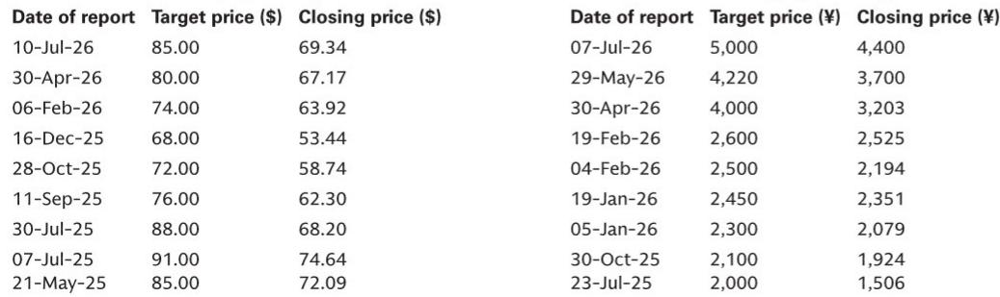
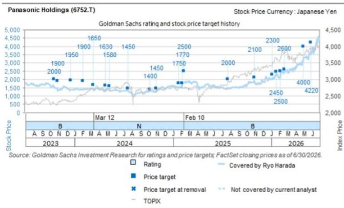
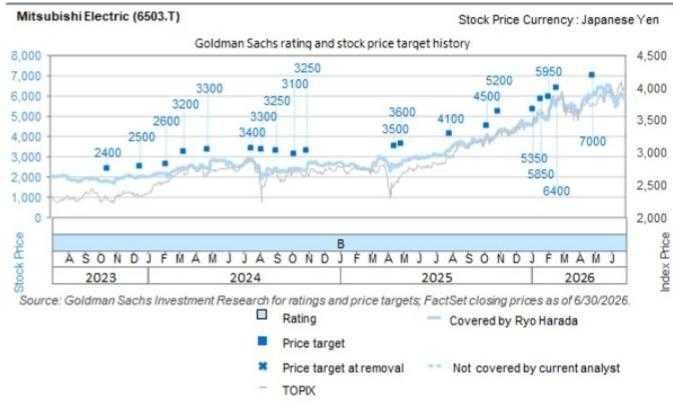

# GS：GS日本科技硬件工业电子-CARR2Q

Carrier 2026财年第二季度业绩于7月28日公布，数据超出市场预期。GS日本工业电子团队在最新报告中指出，这份财报对日本两家暖通空调与工业自动化企业——三菱电机和松下控股——具有明确的正面含义，但原材料成本上升带来的利润率不确定性同样值得关注。

Carrier当季销售额63.51亿美元，高于彭博一致预期的60.21亿美元；调整后营业利润10.95亿美元，同样超过市场预期的10.41亿美元。更关键的是订单数据：总订单同比增长40%，其中商用暖通空调增长65%，数据中心相关业务增幅超过300%。公司已将2026财年数据中心销售指引从15亿美元上调至20亿美元，期末订单积压超过80亿美元，同比增长40%，环比增长20%。

这些数字直接指向一个判断：全球暖通空调需求，尤其是数据中心冷却领域，正处于加速扩张阶段。对于在日本工业电子领域占据重要位置的三菱电机和松下控股而言，这意味着下游需求的支撑正在增强。

## 1. 美洲渠道库存下降25%，下半年需求预期继续走强

Carrier在美洲的Climate Solutions Americas业务当季销售33.72亿美元，有机增长4%。住宅业务增长9%，轻型商用增长10%。报告特别提到，住宅渠道库存同比下降25%，公司预计下半年将出现强劲增长。商用业务虽因出货时点同比下降8%，但订单弹性较高，数据中心相关订单增幅超过300%。

这一库存与订单的组合信号值得注意。渠道库存下降通常意味着去库存周期接近尾声，而订单的快速增长则预示着补库需求即将释放。对于三菱电机和松下控股而言，如果这一趋势延续，其北美暖通空调业务的出货量有望在下半年获得提振。

> **KC评论：** 渠道库存下降25%叠加订单弹性较高，是一个典型的“去库存结束、补库存启动”信号。读者在评估三菱电机和松下控股北美业务时，应关注其出货节奏与Carrier订单数据的匹配度，而非仅看季度营收同比变化。

## 2. 欧洲热泵增长20%，数据中心冷却需求成为新变量

Carrier的Climate Solutions Europe业务当季销售13.24亿美元，有机增长3%。住宅与轻型商用实现高个位数增长，热泵销售增长20%。商用业务虽出现中个位数下降，但公司预计下半年将因数据中心相关需求而复苏。

GS分析师指出，三菱电机目前在数据中心冷却领域主要在欧洲开发冷水机组，但正在寻求向美国市场扩张。Carrier的数据中心冷却产品组合正在扩大，包括冷却液分配单元和QuantumLeap冷却解决方案，订单增长迅速。这意味着三菱电机在数据中心冷却领域的业务拓展存在积极发展空间。

## 3. 亚洲市场除中国外表现强劲，印度和中东增长35%

Carrier的Climate Solutions Asia Pacific Middle East & Africa业务当季销售9.17亿美元，有机增长4%。中国住宅与轻型商用市场仍然仍在调整，同比下降25%。但其他区域表现强劲：印度增长35%，中东增长35%，东南亚增长20%，澳大利亚增长30%。

这一区域分化格局对日本企业的全球布局具有参考意义。松下控股和三菱电机在亚洲市场均有广泛业务覆盖，中国市场的持续仍在调整需要被其他区域的增长所对冲。报告认为，除中国外的亚洲市场表现良好，为两家公司提供了区域性的需求支撑。

## 4. 原材料成本上升与固定成本削减并存，利润率需持续观察

Carrier当季调整后营业利润率17.2%，同比下降190个基点。公司表示，销量增长和效率提升对利润有正面贡献，但被原材料成本上升和不利的业务组合所抵消。GS分析师对三菱电机和松下控股的固定成本削减努力持积极看法，但同时指出，成本上升的影响也需要纳入考量。

此外，三菱电机的工厂自动化业务也出现了正面信号。其集团旗下专业贸易公司RYODEN于7月28日上调了全年盈利指引，这被GS视为三菱电机FA业务盈利前景向好的佐证。

综合来看，Carrier的业绩数据为三菱电机和松下控股提供了需求侧的支撑证据，尤其是在数据中心冷却和热泵领域。但原材料成本对利润率的侵蚀，以及中国市场的持续仍在调整，仍是需要持续跟踪的变量。

For informational purposes only. Portions may be generated,translated,summarized,or edited with AI assistance based on source materials and may contain omissions or errors. Please verify independently. This is not investment,legal,tax,accounting,or other professional advice.

For informational purposes only. Portions may be generated,translated,summarized,or edited with AI assistance based on source materials and may contain omissions or errors. Please verify independently. This is not investment,legal,tax,accounting,or other professional advice.

