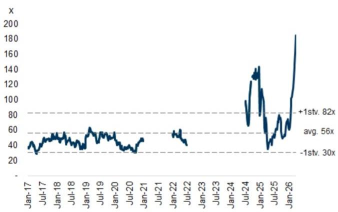
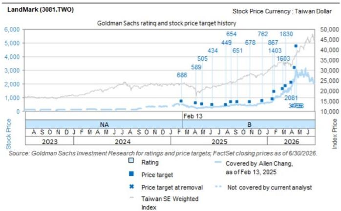

# LandMark (3081.TWO): 3Q26 季度环比增长，受益于800G / 1.6T 硅光子技术加速应用；产能扩张以把握强劲需求

LandMark 6月营收同比增长128% / 环比增长4%，达到新台币4.21亿元，较此前预期高出1%，推动2Q26营收达到新台币12亿元（同比增长121%，环比增长35%），反映出800G / 1.6T 硅光子光模块的强劲需求、更好的InP衬底供应以及LandMark的产能扩张。随着资本支出的持续投入和硅光子技术的渗透率提升，我们预计7月至9月将实现环比增长，分别为5% / 5% / 7%，对应营收新台币4.42亿元 / 4.64亿元 / 4.98亿元。

**产能扩张：** 6月中旬，LandMark宣布公司已从Aixtron获得总价值约新台币8.37亿元的设备，支持其在InP外延片和CW激光器方面的产能扩张。公司还指出，董事会已批准新台币30亿元的设备采购计划，支持公司进一步把握硅光子光模块的强劲需求。

Allen Chang
+852-2978-2930 |
allen.k.chang@gs.com
GS (Asia) L.L.C.

Verena Jeng
+852-2978-1681 | verena.jeng@gs.com
GS (Asia) L.L.C.

Ting Song
+852-2978-6466 | ting.song@gs.com
GS (Asia) L.L.C.

**图表1：我们预计LandMark 2026年7月营收同比增长144%至新台币4.42亿元**
LandMark月度/季度营收

|  | 2026年4月 | 2026年5月 | 2026年6月 | 2026年7月E | 2026年8月E | 2026年9月E | 4Q25 | 1Q26 | 2Q26 | 3Q26E |
|---|---|---|---|---|---|---|---|---|---|---|
| 营收（新台币百万元） | 395 | 405 | 421 | 442 | 464 | 498 | 642 | 904 | 1,221 | 1,403 |
| 同比增长 | 115% | 119% | 128% | 144% | 150% | 167% | 122% | 99% | 121% | 154% |
| 环比增长 | 15% | 3% | 4% | 5% | 5% | 7% | 16% | 41% | 35% | 15% |
| GS预估（新台币百万元） | 347 | 361 | 416 |  |  |  | 629 | 875 | 1,123 |  |
| 实际 vs. GS | 14% | 12% | 1% |  |  |  | 2% | 3% | 9% |  |

来源：公司数据，GS全球研究

**盈利预测调整：** 我们纳入LandMark 2Q26营收数据，并将2026年盈利预测上调1%，主要得益于800G/1.6T硅光子CW激光器营收增长，这受到强劲需求和供应改善的支撑。我们维持2027-29年预测不变。

**图表2：盈利预测调整**

| 新台币百万元 | 2026E |  | 2027E |  | 2028E |  | 2029E |  |
|---|---|---|---|---|---|---|---|---|
|  | 旧 | 新 | 差异% | 旧 | 新 | 差异% | 旧 | 新 | 差异% | 旧 | 新 | 差异% |
| 营收 | 4,992 | 5,047 | 1% | 9,370 | 9,365 | 0% | 14,719 | 14,713 | 0% | 22,078 | 22,080 | 0% |
| 毛利 | 2,746 | 2,778 | 1% | 5,234 | 5,232 | 0% | 8,387 | 8,384 | 0% | 12,580 | 12,582 | 0% |
| 营业利润 | 2,043 | 2,075 | 2% | 4,370 | 4,367 | 0% | 7,211 | 7,209 | 0% | 10,839 | 10,840 | 0% |
| 税前利润 | 2,138 | 2,169 | 1% | 4,467 | 4,464 | 0% | 7,342 | 7,340 | 0% | 10,970 | 10,971 | 0% |
| 净利润 | 1,710 | 1,736 | 1% | 3,573 | 3,571 | 0% | 5,873 | 5,872 | 0% | 8,776 | 8,777 | 0% |
| 利润率 |  |  |  |  |  |  |  |  |  |  |  |
| 毛利率 | 55.0% | 55.0% | 0ppts | 55.9% | 55.9% | 0ppts | 57.0% | 57.0% | 0ppts | 57.0% | 57.0% | 0ppts |
| 营业利润率 | 40.9% | 41.1% | 0.2ppts | 46.6% | 46.6% | 0ppts | 49.0% | 49.0% | 0ppts | 49.1% | 49.1% | 0ppts |
| 净利润率 | 34.3% | 34.4% | 0.1ppts | 38.1% | 38.1% | 0ppts | 39.9% | 39.9% | 0ppts | 39.7% | 39.8% | 0ppts |

来源：公司数据，GS全球研究

**估值：** 我们采用贴现市盈率方法（不变），对2029年每股盈利（EPS）应用61.0倍（不变）目标市盈率倍数，以10.5%的权益成本（beta 1.7倍，无风险利率1.6%，市场风险溢价5.1% - 均不变）折现回2027年。我们61.0倍的目标市盈率倍数源自光子学供应链中可比公司的PEG&M比率（不变），反映了产品组合升级和光学解决方案需求增长带来的行业重新定价。因此，我们12个月目标价为新台币4,307.00元（此前为新台币4,307.27元）。隐含的2028年市盈率75倍介于公司平均市盈率56倍和平均+1标准差市盈率82倍之间。

**图表3：LandMark贴现市盈率**

| （新台币百万元） | 2022 | 2023 | 2024 | 2025 | 2026E | 2027E | 2028E | 2029E | 2030E | 2031E | 2032E |
|---|---|---|---|---|---|---|---|---|---|---|---|
| 里程碑 | 5G基础设施周期 |  |  | AI数据中心中的硅光子 |  |  |  | CPO |  |  |  |
| 硅光子营收贡献 | 13% | 35% | 42% | 70% | 87% | 93% | 96% | 96% | 96% | 96% | 96% |
| 硅光子毛利贡献 | 15% | 25% | 41% | 71% | 90% | 95% | 97% | 97% | 97% | 97% | 97% |
| 营收 | 2,381 | 1,056 | 1,208 | 2,203 | 5,047 | 9,365 | 14,713 | 22,080 | 32,915 | 46,081 | 63,592 |
| 同比增长 | 27% | -56% | 14% | 82% | 129% | 86% | 57% | 50% | 49% | 40% | 38% |
| 毛利 | 759 | 138 | 239 | 941 | 2,778 | 5,232 | 8,384 | 12,582 | 18,756 | 26,258 | 36,300 |
| 毛利率 | 31.9% | 13.1% | 19.8% | 42.7% | 55.0% | 55.9% | 57.0% | 57.0% | 57.0% | 57.0% | 57.1% |
| 营业利润 | 335 | -280 | -112 | 508 | 2,075 | 4,367 | 7,209 | 10,840 | 16,193 | 22,762 | 31,666 |
| 同比增长 | -18% | -184% | -60% | -555% | 308% | 111% | 65% | 50% | 49% | 41% | 39% |
| 营业利润率 | 14% | -27% | -9% | 23% | 41% | 47% | 49% | 49% | 49% | 49% | 50% |
| 税前利润 | 378 | -264 | -68 | 525 | 2,169 | 4,464 | 7,340 | 10,971 | 16,323 | 22,893 | 31,797 |
| 净利润 | 330 | -212 | -55 | 411 | 1,736 | 3,571 | 5,872 | 8,777 | 13,059 | 18,314 | 25,437 |
| 每股盈利（新台币，摊薄） | 3.26 | -2.10 | -0.54 | 4.21 | 17.06 | 35.10 | 57.71 | 86.26 | 128.34 | 180.00 | 250.00 |
| 同比增长 | -2% | n.a. | n.a. | n.a. | 322% | 106% | 64% | 49% | 49% | 40% | 39% |
| 目标价隐含市盈率 |  |  |  |  | 253 | 123 | 75 | 50 | 34 | 24 | 17 |

| 2029年目标市盈率 | 61.0 |
|---|---|
| 目标倍数 x 每股盈利 | 5,262 |
| 折现回2027年；目标价（新台币） | 4,307.0 |
| 隐含2027年市盈率 | 123 |

| 权益成本假设 |  |
|---|---|
| Beta | 1.7 |
| 无风险利率 | 1.6% |
| 市场风险溢价 | 5.1% |
| 权益成本 | 10.5% |

来源：公司数据，GS全球研究

**图表4：LandMark 12个月远期市盈率**

来源：Eikon Datastream

**图表5：目标市盈率源自可比公司市盈率与净利润同比增长及营业利润率的相关性**

| 估值 | 2029年市盈率 | 2030年净利润同比增长 | 2030年营业利润率 | PEG&M |
|---|---|---|---|---|
| LandMark | 61 | 49% | 49% | 0.62 |
| 可比公司 | 2026年市盈率 | 2027年净利润同比增长 | 2027年营业利润率 | PEG&M |
| Mitac | 11 | 16% | 5% | 0.5 |
| HG Tech | 34 | 31% | 14% | 0.8 |
| Shennan | 35 | 47% | 19% | 0.5 |
| 平均 | 34 | 32% | 25% | 0.62 |

**图表6：LandMark损益表摘要**

| 新台币百万元 | 2023 | 2024 | 2025 | 2026E | 2027E | 2028E | 1Q25 | 2Q25 | 3Q25 | 4Q25 | 1Q26 | 2Q26E | 3Q26E | 4Q26E |
|---|---|---|---|---|---|---|---|---|---|---|---|---|---|---|
| **损益表** |  |  |  |  |  |  |  |  |  |  |  |  |  |  |
| 营收 | 1,056 | 1,208 | 2,203 | 5,047 | 9,365 | 14,713 | 455 | 553 | 553 | 642 | 904 | 1,221 | 1,403 | 1,518 |
| 毛利 | 138 | 239 | 941 | 2,778 | 5,232 | 8,384 | 147 | 240 | 241 | 313 | 495 | 670 | 773 | 839 |
| 营业利润 | (280) | (112) | 508 | 2,075 | 4,367 | 7,209 | 45 | 150 | 105 | 209 | 373 | 516 | 529 | 657 |
| 税前利润 | (264) | (68) | 525 | 2,169 | 4,464 | 7,340 | 53 | 121 | 124 | 227 | 397 | 539 | 553 | 681 |
| 净利润 | (212) | (55) | 411 | 1,736 | 3,571 | 5,872 | 42 | 97 | 99 | 190 | 318 | 432 | 442 | 544 |
| 每股盈利（新台币） | (2.10) | (0.54) | 4.21 | 17.06 | 35.10 | 57.71 | 0.42 | 0.95 | 0.97 | 1.87 | 3.12 | 4.24 | 4.34 | 5.35 |
| **利润率** |  |  |  |  |  |  |  |  |  |  |  |  |  |  |
| 毛利率 | 13.1% | 19.8% | 42.7% | 55.0% | 55.9% | 57.0% | 32.3% | 43.3% | 43.6% | 48.7% | 54.8% | 54.9% | 55.1% | 55.3% |
| 营业利润率 | -26.5% | -9.3% | 23.1% | 41.1% | 46.6% | 49.0% | 9.8% | 27.0% | 19.0% | 32.5% | 41.3% | 42.2% | 37.7% | 43.3% |
| 净利润率 | -20.0% | -4.5% | 18.7% | 34.4% | 38.1% | 39.9% | 9.3% | 17.5% | 17.9% | 29.6% | 35.1% | 35.3% | 31.5% | 35.9% |
| **同比增长** |  |  |  |  |  |  |  |  |  |  |  |  |  |  |
| 营收 | -56% | 14% | 82% | 129% | 86% | 57% | 40% | 103% | 71% | 122% | 99% | 121% | 154% | 136% |
| 毛利 | -82% | 73% | 294% | 195% | 88% | 60% | 638% | 503% | 171% | 247% | 237% | 180% | 221% | 168% |
| 营业利润 | na | na | na | 308% | 111% | 65% | 18% | na | 1176% | na | 734% | 245% | 404% | 214% |
| 净利润 | na | na | na | 322% | 106% | 64% | 20% | na | 1139% | 2233% | 651% | 346% | 346% | 186% |
| **环比增长** |  |  |  |  |  |  |  |  |  |  |  |  |  |  |
| 营收 |  |  |  |  |  |  | 57% | 22% | 0% | 16% | 41% | 35% | 15% | 8% |
| 毛利 |  |  |  |  |  |  | 63% | 63% | 1% | 30% | 58% | 35% | 15% | 8% |
| 营业利润 |  |  |  |  |  |  | -849% | 234% | -30% | 99% | 79% | 38% | 3% | 24% |
| 净利润 |  |  |  |  |  |  | 418% | 129% | 2% | 92% | 67% | 36% | 2% | 23% |
| EBITDA |  |  |  |  |  |  | 55% | 81% | -21% | 69% | 52% | 31% | 2% | 21% |

来源：公司数据，GS全球研究

**目标价风险与方法论 - LandMark Optoelectronics Corp.**

**估值：** 我们采用贴现市盈率方法，对2029年每股盈利应用61倍目标市盈率倍数，然后以10.5%的权益成本（beta 1.7倍，无风险利率1.6%，市场风险溢价5.1%）折现回2027年，得出12个月目标价新台币4,307元。我们的目标市盈率倍数基于与光子学供应链中可比公司相同的PEG&M比率。

**主要风险：** 硅光子渗透率低于预期；竞争强于预期；集成器件制造商内部提供外延片。

| 3081.TWO | 12个月目标价：新台币4,307.00元 | 价格：新台币1,805.00元 | 上行空间：138.6% |
|---|---|---|---|
|  |  | GS预测 |  |
|  |  | 12/25 | 12/26E | 12/27E | 12/28E |
| 市值：新台币1,754亿元 / 54亿美元 | 营收（新台币百万元）新 | 2,202.8 | 5,047.0 | 9,364.7 | 14,713.3 |
| 企业价值：新台币1,735亿元 / 54亿美元 | 营收（新台币百万元）旧 | 2,202.8 | 4,991.6 | 9,370.4 | 14,719.0 |
| 3个月日均交易量：新台币64亿元 / 2.012亿美元 | EBITDA（新台币百万元） | 842.9 | 2,442.2 | 4,756.7 | 7,617.8 |
| 台湾 | 每股盈利（新台币）新 | 4.21 | 17.06 | 35.10 | 57.71 |
| 大中华科技 | 每股盈利（新台币）旧 | 4.21 | 16.81 | 35.12 | 57.73 |
| 并购排名：3 | 市盈率（倍） | 85.8 | 105.8 | 51.4 | 31.3 |
| 租赁是否计入净债务及企业价值？：否 | 市净率（倍） | 9.1 | 43.4 | 37.1 | 29.9 |
|  | 股息回报表现（%） | 0.9 | 0.8 | 1.6 | 2.6 |
|  | 现金回报率（%） | 10.8 | 31.1 | 61.5 | 107.1 |
|  |  | 3/26 | 6/26E | 9/26E | 12/26E |
|  | 每股盈利（新台币） | 3.12 | 4.24 | 4.34 | 5.35 |

来源：公司数据，GS预估，FactSet。价格截至2026年7月27日收盘。

## 披露附录

## Reg AC

我们，Allen Chang、Verena Jeng和Ting Song，特此证明本报告中表达的所有观点准确反映了我们个人对标的公司及其证券的看法。我们还证明，我们的薪酬中没有任何部分直接或间接与本报告中表达的具体建议或观点相关。

除非另有说明，本报告封面所列人员为GS全球研究部门的分析师。

撰稿作者：Allen Chang GS (Asia) L.L.C.，Verena Jeng GS (Asia) L.L.C.，Ting Song GS (Asia) L.L.C.。

除非另有说明，本报告撰稿作者披露中列出的个人为GS全球研究部门的分析师。

## GS因子概况

GS因子概况通过将关键属性与市场（即我们的评级股票范围）及其行业同行进行比较，提供股票的研究背景。所描绘的四个关键属性是：增长、财务回报、倍数（例如估值）和综合（增长、财务回报和倍数的复合）。增长、财务回报和倍数通过使用每只股票特定指标的标准化排名计算得出。指标的标准化排名随后被平均并转换为相关属性的百分位数。每个指标的具体计算可能因财年、行业和地区而异，但标准方法如下：

增长基于股票的前瞻性销售增长、EBITDA增长和每股盈利增长（对于金融股，仅每股盈利和销售增长），百分位数越高表示公司增长越高。财务回报基于股票的前瞻性ROE、ROCE和CROCI（对于金融股，仅ROE），百分位数越高表示公司财务回报越高。倍数基于股票的前瞻性市盈率、市净率、价格/股息、EV/EBITDA、EV/FCF和EV/债务调整后现金流（对于金融股，仅市盈率、市净率和价格/股息），百分位数越高表示股票交易倍数越高。综合百分位数计算为增长百分位数、财务回报百分位数和（100% - 倍数百分位数）的平均值。

财务回报和倍数使用GS分析师对未来至少三个季度后的财年末的预测。增长使用未来至少七个季度后的财年输入，与未来至少三个季度后的财年进行比较（所有指标均基于每股基础）。

有关我们如何计算GS因子概况的更详细说明，请联系您的GS代表。

## 并购排名

在我们的全球覆盖范围内，我们使用并购框架审视股票，考虑定性因素和定量因素（可能因行业和地区而异），以纳入某些公司可能被收购的可能性。然后我们分配并购排名，作为对我们评级覆盖范围内的公司从1到3进行评分的方式，其中1表示公司成为收购目标的高概率（30%-50%），2表示中等概率（15%-30%），3表示低概率（0%-15%）。对于排名为1或2的公司，按照我们的标准部门指南，我们将并购组成部分纳入目标价。并购排名3被视为不重要，因此不计入我们的目标价，并且可能在研究中讨论或不讨论。

## Quantum

Quantum是GS的专有数据库，提供详细的财务报表历史、预测和比率。它可用于对单一公司进行深入分析，或比较不同行业和市场的公司。

## 披露

LandMark的评级相对于其覆盖范围内的其他公司：AAC、ACM Research、AMEC、ASMPT、AVC、AccoTest、Anji Micro、Asus、Auras、BOE、BYDE、Biren、CR Micro、Cambricon、Chenbro、中国移动（香港）、中国电信、中国铁塔、中国联通、中软国际、Compal、Desay SV、E Ink、E-Town Semis、EHang、Empyrean、Eoptolink、FOCI、Fositek、富士康工业互联网、Gigabyte、Gigadevice、Glodon Co.、HTC Corp.、海康威视、鸿海精密、地平线机器人、华虹半导体、华测导航、华勤技术（A股）、华勤技术（H股）、华海清科、Iluvatar、InnoScience、浪潮信息、Insta360、Inventec、长电科技、Kematik、King Slide、金蝶国际、金山办公、LandMark、大立光、联想集团、领益智造、卓胜微、美图公司、MetaX、Mitac、Montage（A股）、Montage（H股）、北方华创、NSIG、Nexchip、OmniVision、和硕联合、小马智行（ADR）、小马智行（H股）、广达电脑、RoboTechnik、锐捷网络、SG Micro、SICC、中芯国际（A股）、中芯国际（H股）、SZS、深信服、商汤科技、生益科技、深南电路、斯达半导、舜宇光学、TFC Optical、中科创达、通宇通讯、传音控股、UMT、UNIS、VPEC、Vanchip、VeriSilicon、Victory Giant、纬创资通、WUS、文远知行、纬颖科技、YJ Semitech、长飞光纤、用友网络、中兴通讯（A股）、中兴通讯（H股）、科大讯飞

## 公司特定监管披露

以下披露涉及GS集团（及其附属机构，“GS”）与GS全球研究覆盖的公司之间的关系，并在此研究中提及。

LandMark（新台币1,805.00元）无公司特定披露。

## 评级/投资银行关系分布

GS投资研究全球股票覆盖范围

|  | 评级分布 |  |  | 投资银行关系 |  |  |
|---|---|---|---|---|---|---|
|  | 买入 | 持有 | 卖出 | 买入 | 持有 | 卖出 |
| 全球 | 50% | 34% | 16% | 65% | 59% | 43% |

截至2026年7月1日，GS全球投资研究对3,104只股票有投资评级。GS将股票指定为买入和卖出，纳入各个地区的投资清单；未如此指定的股票被视为中性。为满足FINRA规则要求的上述披露，此类指定等同于买入、持有和卖出。请参阅下文“评级、覆盖范围及相关定义”。投资银行关系图表反映了每个评级类别中GS在过去十二个月内提供投资银行服务的标的公司的百分比。

## 目标价和评级历史图表

所示目标价应结合所有先前发布的GS报告（可能包含或不包含目标价）以及公司、行业和金融市场的发展情况来考虑。

## 目标价历史表格 LandMark (3081.TWO)

| 报告日期 | 目标价（新台币） | 收盘价（新台币） |
|---|---|---|
| 2026年4月23日 | 4,738.00 | 2,745.45 |
| 2026年4月16日 | 3,165.00 | 2,150.00 |
| 2026年4月2日 | 2,081.00 | 1,659.09 |
| 2026年3月12日 | 1,830.00 | 1,309.09 |
| 2026年3月2日 | 1,603.00 | 1,250.00 |
| 2026年1月30日 | 1,403.00 | 909.09 |
| 2026年1月22日 | 867.00 | 704.55 |
| 2025年12月14日 | 762.00 | 556.36 |
| 2025年10月29日 | 678.00 | 437.73 |
| 2025年9月11日 | 651.00 | 437.73 |
| 2025年8月18日 | 654.00 | 451.82 |
| 2025年7月30日 | 449.00 | 339.09 |
| 2025年6月9日 | 434.00 | 238.18 |
| 2025年5月1日 | 505.00 | 238.64 |
| 2025年4月8日 | 589.00 | 213.18 |
| 2025年2月13日 | 686.00 | 430.91 |

表格中所示目标价未针对公司行动进行调整。

## 监管披露

## 美国法律法规要求的披露

请参阅上述公司特定监管披露，了解本报告中提及的公司所需的任何以下披露：待处理交易中的主承销商或联合主承销商；1%或以上的所有权；特定服务的报酬；客户关系类型；先前期间管理/联合管理的公开发行；董事职位；对于股票，做市和/或专家角色。GS可能作为本金交易或可能作为本金交易本讨论的发行人的债务证券（或相关衍生品）。

以下是额外要求的披露：所有权和重大利益冲突：GS政策禁止其分析师、向分析师报告的专业人员及其家庭成员持有分析师覆盖范围内的任何公司的证券。分析师薪酬：分析师的薪酬部分基于GS的盈利能力，其中包括投资银行收入。分析师作为高级职员或董事：GS政策通常禁止其分析师、向分析师报告的人员或其家庭成员在分析师覆盖范围内的任何公司担任高级职员、董事或顾问。非美国分析师：非美国分析师可能不是GS & Co. LLC的关联人员，因此可能不受FINRA规则2241或FINRA规则2242关于与标的公司沟通、公开露面以及交易分析师所覆盖证券的限制。

## 美国以外司法管辖区法律法规要求的额外披露

以下披露是各司法管辖区要求的，除非已根据美国法律法规在上文作出。澳大利亚：GS Australia Pty Ltd及其附属机构不是澳大利亚的授权存款机构（如《1959年银行法》（联邦）所定义），在澳大利亚不提供银行服务，也不从事银行业务。除非GS另有约定，本研究及其任何访问仅面向《澳大利亚公司法》含义内的“批发客户”。在编制研究报告时，GS Australia全球投资研究部门的成员可能会参加由本研究标的公司和其他实体主办或组织的实地考察和其他会议。在某些情况下，如果GS Australia认为在实地考察或会议的具体情况下适当且合理，此类实地考察或会议的部分或全部费用可能由相关发行人承担。如果本文档内容包含任何金融产品建议，则仅为一般性建议，由GS在未考虑客户的目标、财务状况或需求的情况下编制。客户在根据任何此类建议采取行动前，应考虑该建议是否适合其自身的目标、财务状况和需求。某些GS Australia和New Zealand的利益披露声明以及GS的澳大利亚卖方研究独立性政策声明的副本可在以下网址获取：https://www.goldmansachs.com/disclosures/australia-new-zealand/index.html。巴西：有关CVM第20号决议的披露信息可在以下网址获取：https://www.gs.com/worldwide/brazil/area/gir/index.html。在适用的情况下，根据CVM第20号决议第20条的定义，本研究报告内容的主要巴西注册分析师为本报告开头指定的第一作者，除非文本末尾另有说明。加拿大：此信息仅供您参考，在任何情况下均不应被解释为GS & Co. LLC为在加拿大购买任何加拿大证券而进行的广告、要约或招揽。GS & Co. LLC未在加拿大任何司法管辖区根据适用的加拿大证券法注册为交易商，通常不允许交易加拿大证券，并可能被禁止在加拿大某些司法管辖区出售某些证券和产品。如果您希望在加拿大交易任何加拿大证券或其他产品，请联系GS Canada Inc.（GS集团公司的附属机构）或其他注册的加拿大交易商。香港：可根据要求从GS (Asia) L.L.C.获取本研究中提及的所覆盖公司证券的进一步信息。印度：可从GS (India) Securities Private Limited获取本研究中提及的标的公司的进一步信息，研究分析师 - SEBI注册号INH000001493，地址：10th Floor, Ascent-Worli, Sudam Kalu Ahire Marg, Worli, Mumbai-400 025, India，公司识别号U74140MH2006FTC160634，电话+91 22 6616 9000，传真+91 22 6616 9001。GS可能实益拥有本研究报告提及的标的公司1%或以上的证券（如1956年《印度证券合约（监管）法》第2(h)条所定义）。SEBI的注册和NISM的认证绝不保证中介机构的业绩或向读者提供任何回报保证。GS (India) Securities Private Limited的合规官和读者投诉联系详情、年度合规审计报告副本以及其他相关信息和披露可在以下链接找到：https://www.goldmansachs.com/worldwide/india/research-analyst。日本：见下文。韩国：除非GS另有约定，本研究及其任何访问仅面向《金融服务和资本市场法》含义内的“专业读者”。可从GS (Asia) L.L.C.首尔分行获取本研究中提及的标的公司的进一步信息。新西兰：GS New Zealand Limited及其附属机构不是新西兰的“注册银行”或“存款接受者”（如1989年《新西兰储备银行法》所定义）。除非GS另有约定，本研究及其任何访问面向“批发客户”（如2008年《金融顾问法》所定义）。某些GS Australia和New Zealand的利益披露声明副本可在以下网址获取：https://www.goldmansachs.com/disclosures/australia-new-zealand/index.html。俄罗斯：在俄罗斯联邦分发的研究报告不是俄罗斯立法所定义的广告，而是信息和分析，其主要目的不是产品推广，并且不提供俄罗斯立法关于评估活动含义内的评估。研究报告不构成俄罗斯法律法规所定义的个性化研究交流，不针对特定客户，并且在未分析客户的财务状况、投资概况或风险概况的情况下编制。GS不对客户或任何其他人基于本研究可能做出的任何投资决策承担责任。新加坡：GS (Singapore) Pte.（公司编号：198602165W），受新加坡金融管理局监管，接受对本研究的法律责任，如有任何由此产生或与之相关的事宜，应与其联系。台湾：此材料仅供参考，未经许可不得转载。读者应仔细考虑自身的投资风险。投资结果由个人读者自行负责。英国：在英国将被归类为零售客户（如金融行为监管局规则所定义）的人士，应结合先前关于本研究所涉公司的GS报告阅读本研究，并应参考GS International已发送给他们的风险警告。这些风险警告的副本以及本报告中使用的某些金融术语的词汇表，可向GS International索取。

欧盟和英国：关于欧洲委员会授权条例（EU）（2016/958）第6(2)条的披露信息（包括该授权条例在英国脱离欧盟和欧洲经济区后转化为英国国内法律和法规的情况），涉及研究交流或其他建议或暗示投资策略的信息的客观呈现技术安排以及特定利益或利益冲突迹象的披露，可在以下网址获取：https://www.gs.com/disclosures/europeanpolicy.html，其中说明了与投资研究相关的利益冲突管理的欧洲政策。

日本：GS Japan Co., Ltd.是在关东财务局注册的金融工具交易商，注册号Kinsho 69，是日本证券业协会、日本金融期货协会、第二类金融工具交易商协会和日本投资管理协会的成员。股票买卖需支付与客户预先确定的佣金加上消费税。有关日本证券交易所、日本证券业协会或日本证券金融公司要求的任何适用披露，请参阅公司特定披露。

## 评级、覆盖范围及相关定义

买入（B）、中性（N）、卖出（S）分析师建议将股票作为买入或卖出纳入各个地区的投资清单。被指定为投资清单上的买入或卖出取决于股票相对于其覆盖范围的总回报潜力。任何未被指定为投资清单上的买入或卖出且具有有效评级（即非评级暂停、未评级、早期生物技术、覆盖暂停或未覆盖）的股票被视为中性。每个地区管理区域信念清单，这些清单选自各自地区投资清单上的报告评级股票，代表侧重于总回报潜力大小和/或在其各自覆盖区域内实现回报的可能性的研究交流。此类信念清单中股票的添加或移除由每个相应地区的投资审查委员会或其他指定委员会管理，并不代表分析师对此类
