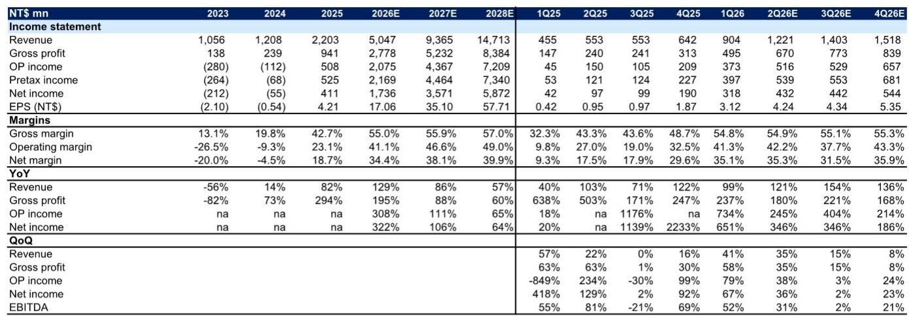
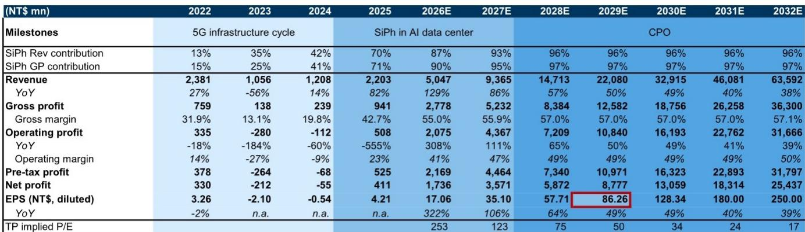
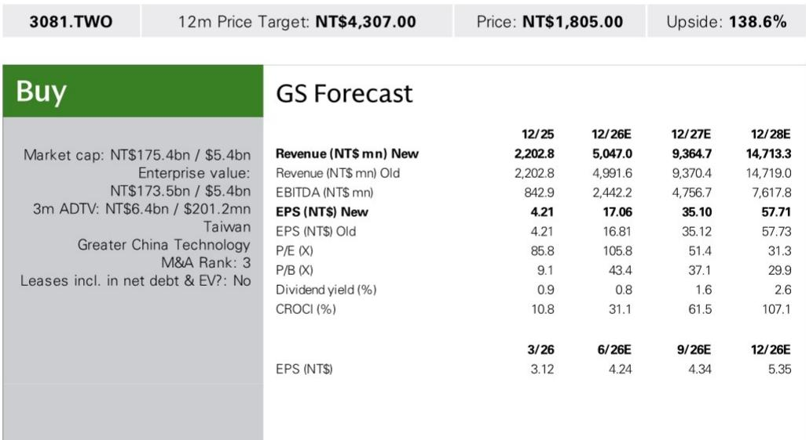

# GS：数字基础设施数据与主题变化观察

这份GS研究笔记的核心判断是：LandMark（3081.TWO）在2026年第二季度的营收增长，主要来自800G和1.6T硅光（SiPh）光学模块的强劲需求，以及InP衬底供应的改善和公司自身的产能扩张。报告认为，随着硅光渗透率提升和资本支出持续，公司营收在2026年7月至9月仍将保持环比增长。

报告提供了几个关键数据点。LandMark 2026年6月营收为4.21亿新台币，同比增长128%，环比增长4%，略高于GS此前预期。这带动2026年第二季度营收达到12.21亿新台币，同比增长121%，环比增长35%。GS据此将2026年全年营收预测上调1%至50.47亿新台币，但维持2027至2029年预测不变。

## 1. 产能扩张计划指向明确的设备采购

报告披露了LandMark在产能方面的具体动作。2026年6月中旬，公司宣布从Aixtron获得价值约8.37亿新台币的设备，用于支持InP外延片和CW激光器的产能扩张。此外，公司董事会已批准一项30亿新台币的设备采购计划。

这些数字本身值得关注。8.37亿新台币的设备采购发生在6月，而30亿新台币的董事会批准计划规模更大。报告没有详细说明这笔资金将如何分阶段使用，但结合公司对硅光模块需求的判断，产能扩张的节奏和规模是理解其未来营收增长的关键变量。

> **KC评论：** 设备采购金额和批准计划是观察产能落地的两个硬指标。报告没有给出具体的产能利用率或良率数据，但30亿新台币的采购计划相对于公司2025年全年22亿新台币的营收规模，是一个值得留意的资本支出信号。

## 2. 硅光收入占比已接近九成，产品结构变化明显

研报中的财务模型显示了一个清晰的产品结构变化趋势。2025年，硅光产品占LandMark营收的70%，到2026年这一比例预计升至87%，2027年进一步达到93%。在毛利贡献上，硅光的占比更高，2026年预计达到90%，2027年为95%。

这意味着公司的增长叙事已经从“是否采用硅光”转向“硅光渗透率能走多快”。报告也给出了一个时间框架：2024至2027年被定义为“AI数据中心中的硅光”阶段，而2028年之后则进入“CPO（共封装光学）”阶段。这两个阶段的营收增速预期不同——2026至2027年营收同比增长在86%至129%之间，而2028至2032年增速逐步节奏变化至38%至57%。

## 3. 估值框架建立在2029年盈利预期之上

GS采用贴现市盈率法进行估值，以2029年每股收益（EPS）为基础，应用61倍目标市盈率，并以10.5%的权益成本贴现回2027年。这个61倍的目标市盈率，来自与光子学供应链同行的PEG&M比率比较。

从报告提供的财务数据看，公司2025年EPS为4.21新台币，2026年预计为17.06新台币，2027年预计为35.10新台币，2028年预计为57.71新台币。这意味着估值倍数在2028年隐含市盈率约为75倍，介于公司历史平均市盈率56倍和平均加一个标准差82倍之间。报告也列出了主要不确定性：硅光渗透慢于预期、竞争加剧、以及IDM厂商内部生产外延片。

这份研报的核心价值在于，它提供了一个从设备采购、产品结构到长期估值的完整分析框架。对于关注光通信产业链的读者，LandMark的产能扩张节奏和硅光渗透率变化，是判断行业景气度的两个先行指标。

For informational purposes only. Portions may be generated,translated,summarized,or edited with AI assistance based on source materials and may contain omissions or errors. Please verify independently. This is not investment,legal,tax,accounting,or other professional advice.

