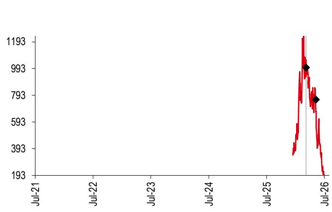

# 研究笔记：MiniMax（100 HK）

## 管理层会议要点

- 我们于2026年7月23日在上海与MiniMax的CEO、COO及资本市场团队进行了交流。以下是主要要点。

MiniMax（100 HK，HKD199.30）
（数据截至2026年7月23日）

**目标：** 在激烈的竞争环境中，MiniMax致力于追求卓越的智能水平与成本效率。鉴于需求持续强劲（例如每日数万亿次推理token），且MiniMax具备高效的推理能力（详见下文），开放平台有望实现可观的毛利率，其长期目标为实现较高的两位数百分比毛利率。

**模型策略：**
1.  **文本模型：** M3 Pro（参数规模约3万亿）计划于9-10月推出，激活参数约600亿（激活率约2%），并在token吞吐量、训练效率及KV缓存优化方面进一步提升。在使用8万亿数据进行训练后，M3 Pro已达到此前需用40万亿数据训练才能实现的M3智能水平。公司也已开始研究5万亿参数规模的模型。
2.  **多模态模型：** MiniMax认为原生多模态仍是重要方向，原因在于：i）其毛利率高于文本模型，ii）能显著提升用户生产力（可触及市场空间可观），iii）多模态输入理解可交叉促进文本模型能力的提升（例如M3 Pro也使用了部分高信息密度的多模态数据进行训练）。海螺3.0有望很快推出。

**AI基础设施策略：**
1.  **自主能力：** 自2025年9月起，MiniMax已自主研发算力与集群设施（仍计入运营支出）。目前，公司可在万卡级芯片集群上运行模型训练任务，并持续扩大集群规模。这有助于减少对云服务提供商的依赖。
2.  **成本效率：** 早期建设AI基础设施有助于MiniMax在芯片和内存价格上涨的背景下节约算力成本（例如，集群利用率高于行业平均水平，几乎所有集群可同时运行训练和推理任务）。
3.  **组织架构：** 管理层强调，公司拥有一支跨学科人才队伍，模型训练与算法团队协同工作，共同追求单一目标，而非各自为政，这有助于提升研发的上限。

有关完整的估值、风险及更多细节，请参阅我们此前的报告：MiniMax（100 HK）；M3模型进一步提升计算效率，2026年6月2日。

---

**股票研究**
互联网软件与服务

**中国**

分析师：Ritchie Sun, CFA
互联网研究分析师
香港上海HSBC银行有限公司
ritchie.k.h.sun@hsbc.com.hk
+852 2822 4392

## Charlene Liu

亚太互联网与游戏研究主管
香港上海HSBC银行有限公司新加坡分行
charlene.r.liu@hsbc.com.sg
+65 6658 0615

*受雇于HSBC证券（美国）公司的非美国关联机构，未根据FINRA规定注册/取得资格

# 附录

## 分析师认证

主要负责本报告的下述分析师、经济学家或策略师（包括任何作为报告某一部分或某几部分作者的具名分析师，以及在分部加总估值中被指定为子公司覆盖分析师的分析师）特此证明，其对相关证券或发行人的观点、其在具名部分中表达的任何观点或预测，以及本报告中表达的任何其他观点或预测（包括研究报告封底表达的任何观点），均准确反映其个人观点，且其薪酬的任何部分过去、现在或将来均不直接或间接与本研究报告中的具体推荐或观点相关：Ritchie Sun, CFA 和 Charlene Liu

## 重要披露

## 股票：股票评级及财务分析基础

HSBC及其关联机构（包括本报告发行人，“HSBC”）认为，读者买卖股票的决定应取决于个人情况，如读者现有持仓、风险承受能力及其他考虑因素，且读者在做出投资决策时会运用不同的纪律和投资期限。评级不应孤立地用作或依赖为研究交流。不同的证券公司使用多种评级术语以及不同的评级系统来描述其建议，因此读者应仔细阅读每份研究报告中使用的评级定义。此外，读者应仔细阅读整份研究报告，而不应从评级中推断其内容，因为研究报告包含有关分析师观点及评级基础的更完整信息。

## HSBC按以下基础分配评级：

目标价基于分析师对股票实际当前价值的评估，尽管我们预计市场价格需要6至12个月才能反映这一价值。当目标价高于当前股价20%以上时，该股票将被归类为买入；当高于当前股价5%至20%时，该股票可能被归类为买入或持有；当低于当前股价5%至高于5%时，该股票将被归类为持有；当低于当前股价5%至20%时，该股票可能被归类为持有或减持；当低于当前股价20%以上时，该股票将被归类为减持。

我们的评级会在发生任何“重大变化”（开始或恢复覆盖、目标价或预估变更）时根据这些区间重新校准。

上行/下行是目标价与股价之间的百分比差异。

## 长期研究线索的评级分布

## 截至2026年6月30日，HSBC发布的所有独立评级分布如下：

| 买入 | 61% |（其中13%在过去12个月内获得投资银行服务）|
| 持有 | 34% |（其中10%在过去12个月内获得投资银行服务）|
| 卖出 | 5% |（其中8%在过去12个月内获得投资银行服务）|

就上述分布而言，在从旧评级模型向当前评级模型过渡期间使用以下映射结构：在旧模型下，增持=买入，中性=持有，减持=卖出；在当前模型下，买入=买入，持有=持有，减持=卖出。两种模型下的评级定义，请参见上文“股票评级及财务分析基础”。

有关HSBC发布的非独立评级分布，请参见披露页面，网址为 http://www.hsbcnet.com/gbm/financial-regulation/investment-recommendations-disclosures。

## 长期研究线索的股价及评级变化

MiniMax（0100.HK）股价表现（港元）与HSBC评级历史

评级与目标价历史

| 起始 | 结束 | 日期 | 分析师 |
|---|---|---|---|
| 无 | 持有 | 2026年4月1日 | Ritchie Sun, CFA |
| 目标价 | 数值 | 日期 | 分析师 |
| 价格1 | 1000 | 2026年4月1日 | Ritchie Sun, CFA |
| 价格2 | 760 | 2026年6月2日 | Ritchie Sun, CFA |

来源：HSBC

来源：HSBC

要查看HSBC在过去12个月内发布的所有独立基本面评级/建议列表，以及我们发布非基本面建议（仅适用于固定收益和货币研究）的季度分布位置，请使用以下链接访问披露页面：

HSBC私人银行客户：www.research.privatebank.hsbc.com/Disclosures

所有其他客户：https://www.research.hsbc.com/A/Disclosures

## HSBC及分析师披露

披露清单

| 公司 | 代码 | 近期价格 | 价格日期 | 披露 |
|---|---|---|---|---|
| MINIMAX | 0100.HK | 196.00 | 2026年7月24日 | - |

来源：HSBC

1 HSBC在过去12个月内曾担任或联合担任该公司证券公开发行的管理人。
2 HSBC预计在未来3个月内将或寻求从该公司获得投资银行服务报酬。
3 在本报告发布时，HSBC证券（美国）公司是该发行人证券的做市商。
4 截至2026年6月30日，HSBC实益拥有该公司一类普通股证券的1%或以上。
5 该公司是HSBC的客户，或在过去12个月内曾是HSBC的客户和/或就投资银行服务向HSBC支付报酬。
6 该公司是HSBC的客户，或在过去12个月内曾是HSBC的客户和/或就非投资银行证券相关服务向HSBC支付报酬。
7 该公司是HSBC的客户，或在过去12个月内曾是HSBC的客户和/或就非证券服务向HSBC支付报酬。
8 覆盖分析师在过去12个月内已从该公司获得报酬。
9 覆盖分析师或其家庭成员持有该公司的财务权益，详见下文。
10 覆盖分析师或其家庭成员是该公司的管理人员、董事或监事会成员，详见下文。
11 在本报告发布时，HSBC是该发行人证券和/或该公司相关证券的非美国做市商。
12 截至2026年7月17日，根据SSR方法计算，HSBC实益持有该公司已发行总股本超过0.5%的净多头头寸。
13 截至2026年7月17日，根据SSR方法计算，HSBC实益持有该公司已发行总股本超过0.5%的净空头头寸。
14 HSBC前海证券有限公司持有该公司一类普通股证券的1%或以上。

HSBC及其关联机构将不时以主事人或代理身份向客户出售和购买本报告所涵盖公司的证券/工具（包括股权和债务，含衍生品），或担任本报告所述证券/工具的做市商或流动性提供者。

分析师、经济学家和策略师的薪酬部分参照HSBC的盈利能力，包括投资银行、销售与交易以及主事交易收入。

本分析的更新是否发布或在何时发布，未预先确定。

非美国分析师可能不是HSBC证券（美国）公司的关联人士，因此可能不受FINRA规则2241或FINRA规则2242关于与主题公司沟通、公开露面以及持有分析师交易证券的限制。

美国、欧盟、英国及其他司法管辖区实施的某些经济制裁法律可能禁止受这些法律约束的人士进行某些类型的投资，包括交易或处理特定发行人、行业或地区的证券。本报告不构成有关此类法律的建议，也不应被解释为诱导违反此类法律进行证券交易。

有关本报告提及的任何公司的披露，请参阅该公司最新发布的研究报告，网址为 www.hsbcnet.com/research。HSBC私人银行客户应联系其客户经理查询其他研究报告。如需了解用于制作本报告的专有模型的更多信息，请联系署名分析师。

HSBC可能使用经批准在HSBC内部采用的人工智能工具来开发其研究报告，利用这些技术分析大量数据、提高效率并改善整体用户体验。这包括但不限于释义、开发合适的标题和支持数据可视化。需要注意的是，虽然人工智能工具在报告创建的各个方面提供协助，但本文提出的所有研究交流和意见均由我们的研究分析师整理版制定和批准。报告的最终内容反映了我们研究分析师的专业判断和专业知识，确保符合监管标准并维护我们研究过程的完整性。

## 附加披露

1 本报告日期为2026年7月27日。
2 除非报告中注明不同日期和/或特定时间，本报告包含的所有市场数据均截至2026年7月23日收盘。
3 HSBC设有程序以识别和管理其研究业务中可能产生的任何潜在利益冲突。HSBC的分析师及其他参与研究和传播研究的人员，其管理汇报线独立于HSBC的投资银行业务。投资银行、主事交易和研究业务之间设有信息隔离程序，以确保任何保密和/或价格敏感信息得到适当处理。
4 您不得将本文档中的任何数据用于以下目的：(i) 确定贷款协议或其他金融合同或工具项下应付的利息或其他到期款项；(ii) 确定金融工具的买卖、交易或赎回价格，或金融工具的价值；和/或 (iii) 衡量金融工具或投资基金的业绩。

## 制作与分发披露

1. 本报告由作者于2026年7月27日07:48 GMT制作并签署。
2. 如需查看本报告首次分发的时间，请参见披露页面，网址为 https://www.research.hsbc.com/R/34/72tM7fC

# 免责声明

## 截至2026年5月13日的法律实体：

HSBC银行有限公司；HSBC欧洲大陆银行；HSBC欧洲大陆银行德国分行；HSBC中东银行有限公司，迪拜国际金融中心；HSBC中东银行有限公司迪拜分行；HSBC投资证券有限公司，伊斯坦布尔；香港上海HSBC银行有限公司，香港；香港上海HSBC银行有限公司新加坡分行；香港上海HSBC银行有限公司首尔证券分行；香港上海HSBC银行有限公司首尔分行；HSBC前海证券有限公司；HSBC证券（台湾）股份有限公司；HSBC证券及资本市场（印度）私人有限公司，孟买；HSBC银行澳大利亚有限公司；HSBC证券（美国）公司，纽约；HSBC墨西哥银行，多银行机构，HSBC金融集团；HSBC巴西银行

报告发行人
香港上海HSBC银行有限公司
香港皇后大道中1号16楼
电话：+852 2843 9111
传真：+852 2596 0200
网址：www.research.hsbc.com

本文件由香港上海HSBC银行有限公司（“HSBC”）在其香港受监管业务中为其机构及专业读者（定义见《证券及期货条例》（第571章））客户编制；除非另有许可，否则不拟向香港零售客户分发，也不应分发予香港零售客户。香港上海HSBC银行有限公司受香港金融管理局监管。香港收件人的所有查询必须联系您在香港的HSBC联系人。如果由HSBC关联机构的客户收到，则向其提供本文件须遵守该客户与该关联机构之间的业务条款。本文件不是也不应被解释为出售要约或购买或认购任何投资产品的要约邀请。HSBC基于其认为可靠但未独立验证的来源获取本文件信息；HSBC不作任何保证、陈述或担保，也不对其准确性或完整性承担任何责任或义务。所表达的意见仅为HSBC部门的意见，如有更改，恕不另行通知。研究分析师不时对覆盖的发行人进行实地考察。HSBC政策禁止研究分析师接受发行人为此类考察支付的差旅费用报销。HSBC及其关联机构和/或其管理人员、董事和员工可能持有本文件提及的任何证券（或任何相关投资）的头寸，并可能不时增加或处置任何此类证券（或投资）。HSBC及其关联机构可能担任本文件讨论的公司证券（或相关投资）的做市商或已承担包销承诺，可能以主事人身份向客户出售或购买这些证券，也可能已经或寻求为这些公司提供或寻求提供投资银行或包销服务。本文件旨在整体分发。除非适用法律允许，否则如果您希望使用HSBC集团服务进行本文件提及的任何投资交易，您必须联系您所在司法管辖区的HSBC集团成员。

在英国，本出版物由HSBC银行有限公司向其客户（定义见FCA规则）及其关联机构的客户分发。本文中的任何内容均不排除或限制HSBC银行有限公司根据《2000年金融服务与市场法》或FCA和PRA规则对客户承担的任何责任或义务。选择与英国HSBC银行有限公司非代表人士进行交易的收件人将不享受英国监管制度提供的保护。HSBC银行有限公司受金融行为监管局和审慎监管局监管。

在欧洲经济区，本出版物由HSBC欧洲大陆银行或收件人接受相关服务的其他HSBC关联机构分发。

在日本，本出版物由HSBC证券（日本）有限公司分发。不得出于任何目的进一步整体或部分分发。在韩国，本出版物由香港上海HSBC银行有限公司首尔证券分行或香港上海HSBC银行有限公司首尔分行向《金融投资服务与资本市场法》第9条规定的专业读者分发，仅供一般参考。本出版物不是《金融投资服务与资本市场法》定义下的招股说明书。不得出于任何目的进一步整体或部分分发。首尔证券分行和首尔分行均受韩国金融服务委员会和金融监督院监管。在新加坡，本出版物由香港上海HSBC银行有限公司新加坡分行向《2001年证券与期货法》第274条和第304条规定的机构读者或其他人士以及根据该法第275条和第305条规定条件的认可读者和其他人士分发，仅供一般参考。只有经济或货币报告拟分发给非《证券与期货法》定义的认可读者、专家读者或机构读者的人士。香港上海HSBC银行有限公司新加坡分行接受报告内容的法律责任。本出版物不是《证券与期货法》定义下的招股说明书。不得出于任何目的进一步整体或部分分发。香港上海HSBC银行有限公司新加坡分行受新加坡金融管理局监管。新加坡收件人应就本报告引起的或与之相关的任何事宜联系“香港上海HSBC银行有限公司新加坡分行”代表。请联系信息请参阅香港上海HSBC银行有限公司新加坡分行网站 www.business.hsbc.com.sg。在澳大利亚，本出版物由香港上海HSBC银行有限公司（ABN 65 117 925 970，AFSL 301737）向其“批发”客户（定义见《2001年公司法》）分发，仅供一般参考。当分发给零售客户时，本研究由HSBC银行澳大利亚有限公司（ABN 48 006 434 162，AFSL No. 232595）分发。这些实体均不表示本文件提及的产品或服务适用于澳大利亚人士，或根据当地法律对任何特定人士必然合适或适当。未考虑任何收件人的特定投资目标、财务状况或特定需求。

HSBC证券（美国）公司接受其非美国外国关联机构编制的本研究报告内容的责任。本文所含信息在任何情况下均不得解释为研究交流，也未针对收件人的需求进行定制。所有接收和/或访问本报告并希望就本文讨论的任何证券进行交易的美国人士，应在美国与HSBC证券（美国）公司而非其非美国外国关联机构（本报告的发行人）进行交易。HSBC墨西哥银行，多银行机构，HSBC金融集团，经墨西哥财政与公共信贷部及国家银行与证券委员会授权并受其监管。在巴西，本文件由HSBC巴西银行和/或其关联机构分发。根据巴西证券交易委员会第20/2021号决议的要求，关于(i) HSBC巴西银行和/或其关联机构；以及(ii) 负责编写本报告的分析师之间的潜在利益冲突，已在上文“HSBC及分析师披露”图表中说明。如果您是HSBC国际财富及卓越 banking（包括HSBC私人银行）的客户，您仅在以下情况下有资格接收本出版物：(i) 您已获适用的HSBC法律实体批准接收相关研究出版物；(ii) 您已同意适用的HSBC实体的获取研究条款和条件和/或客户声明；以及(iii) 您已同意该HSBC实体提供的任何互联网银行、网上银行、手机银行和/或投资服务的条款和条件，您将通过这些服务获取研究出版物（与(ii)合称“条款”）。如果您不符合上述资格要求，请忽略本出版物，如果您是国际财富及卓越 banking客户，请通知您的客户经理或拨打相关客户热线。本出版物的分发由您已同意条款的HSBC实体全权负责。接收研究出版物严格受条款以及国际财富及卓越 banking可能建议的适用于提供出版物的任何其他条件或免责声明约束。

如果您希望使用人工智能技术（计算、统计、机器学习或其他人工智能技术，从数据中推断或学习以发现模式、采取行动、做出决策或生成输出）来帮助您分析、总结或评估本出版物和/或HSBC向您提供的任何其他研究材料，您应事先征得HSBC同意，并且不得将本出版物和/或HSBC制作的任何其他研究材料上传到人工智能系统，或以其他方式在未经我们同意的情况下使用人工智能技术连接HSBC向您提供的研究服务。

© 版权所有 2026，香港上海HSBC银行有限公司，保留所有权利。未经香港上海HSBC银行有限公司事先书面许可，不得以任何形式或任何方式（电子、机械、影印、录音或其他方式）复制、存储在检索系统中或传播本出版物的任何部分。
