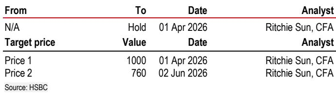

# MiniMax's M3 Pro Proves That Smarter Architecture, Not Bigger Models, Is the Winning Formula in AI

MiniMax is processing tens of trillions of inference tokens per day, yet its path to sustained profitability does not depend on scale alone. The company's management, in a recent meeting with analysts, laid out a strategy that hinges on an engineering paradox: achieve exceptional intelligence while simultaneously driving down cost per token. The central thesis is that the next phase of AI competition will be won not by the largest parameter count, but by the highest ratio of intelligence to compute cost. MiniMax's upcoming M3 Pro model, with only 60 billion activated parameters out of 3 trillion total, represents a deliberate bet that sparse activation and training efficiency can outperform brute-force scaling. This approach, if successful, could redefine the unit economics of foundation model businesses and reshape expectations for the sector.

The stakes are high. The AI infrastructure expansion has driven chip and memory prices upward, compressing margins for every model provider. Against this backdrop, MiniMax is pursuing self-sufficiency in computing power, building its own clusters of over 10,000 chips since September 2025, and running training and inference tasks concurrently to achieve above-industry-average cluster utilization. The company's argument is not merely about cost savings; it is about strategic control. By reducing reliance on cloud service providers and internalizing the full stack of model development, MiniMax aims to capture a structural cost advantage that its cloud-dependent competitors will find difficult to replicate. For observers, the question is whether this vertically integrated, efficiency-first model can translate into sustainable gross profit margins in the high double digits for its Open Platform business.

## The M3 Pro Achieves M3's Intelligence Level with 80% Less Training Data, Validating the Sparse Activation Thesis

The most striking data point from the management meeting concerns the M3 Pro's training trajectory. After training on 8 trillion tokens, the M3 Pro has already reached the intelligence level that the original M3 model only achieved after 40 trillion tokens. This is not a marginal improvement; it is a fivefold reduction in data requirements for equivalent capability. The mechanism behind this is the model's architecture, which uses only 60 billion activated parameters out of 3 trillion total, representing a 2% activation ratio. In plain terms, the model is designed to selectively engage only the neural pathways relevant to a given input, rather than firing all parameters on every query.

The implication for the industry is profound. If sparse activation can deliver comparable or superior intelligence with a fraction of the training compute, then the prevailing assumption that "bigger is always better" is no longer defensible. For MiniMax, this means lower training costs, faster iteration cycles, and the ability to deploy more capable models sooner. For competitors still pursuing dense, fully activated models, the M3 Pro's data efficiency creates a widening gap in cost per unit of intelligence. The company has also begun researching a 5 trillion parameter model, suggesting it sees further headroom in this architectural approach, not a ceiling.

## Native Multi-Modal Models Deliver Higher Gross Profit Margins and Cross-Pollinate Text Model Capabilities

MiniMax's commitment to native multi-modal models is not a diversification play; it is a margin and capability multiplier. Management explicitly stated that multi-modal models achieve higher gross profit margins than text-only models. The logic is straightforward: multi-modal inputs—combining text, images, audio, and video—command higher pricing power because they solve more complex, higher-value user problems. A user who needs to analyze a video feed alongside data is willing to pay more per token than a user who only needs text summarization.

But the strategic insight goes deeper. Multi-modal input understanding cross-pollinates back into the text model's capability. The M3 Pro, for instance, uses a portion of multi-modal data with high information density during its training. This means that the intelligence gained from processing images and audio is not siloed; it enriches the model's textual reasoning. The upcoming Hailuo 3 model, expected to launch soon, will likely push this integration further. For the business model, this creates a virtuous cycle: multi-modal data improves the text model, which in turn drives more usage and higher margins, funding further multi-modal research. The total addressable market for productivity-enhancing multi-modal applications is sizable, and MiniMax is positioning itself to capture a disproportionate share.

## Self-Built AI Infrastructure Creates a Structural Cost Advantage as Chip and Memory Prices Rise

Since September 2025, MiniMax has shifted from relying on cloud service providers to building its own computing clusters. The company now operates clusters of over 10,000 chips for model training and is actively expanding capacity. This is not a trivial capital decision. Self-built infrastructure is accounted for as operating expenditure, meaning the cost hits the income statement directly. However, management argues that this approach saves computing costs in the long run, precisely because chip and memory prices are rising.

The key metric here is cluster utilization rate. MiniMax claims its utilization is above industry average because nearly all clusters can run training and inference tasks concurrently. In most cloud setups, training and inference workloads are separated, leading to idle capacity. By designing clusters that can switch between the two, MiniMax extracts more value from each chip. This operational flexibility is a direct result of having the model training and algorithm teams sit together, collaborating on a single goal rather than working in silos. The organizational structure is not a nicety; it is a source of competitive advantage that enables faster optimization of the entire stack, from chip scheduling to model architecture.

## The Decision Framework: Three Levers Determine Which AI Model Providers Will Achieve Sustainable Margins

For observers and strategists evaluating AI companies, MiniMax's approach suggests a decision framework with three interdependent levers. The first is **architecture efficiency**, measured by the ratio of activated parameters to total parameters and the training data required to reach a given intelligence benchmark. Companies that achieve high sparse activation ratios, like MiniMax's 2%, will have structurally lower training and inference costs. The second lever is **infrastructure control**, measured by the degree of vertical integration in computing power. Companies that own their clusters and can run mixed workloads will be less exposed to rising chip prices and cloud margin compression. The third lever is **data cross-pollination**, measured by the extent to which multi-modal training data improves text model performance. Companies that can create a feedback loop between modalities will improve their core product at no additional cost.

Applying this framework, MiniMax scores highly on all three levers. Its M3 Pro demonstrates architecture efficiency that is five times better than its predecessor. Its self-built clusters and concurrent workload capability provide infrastructure control that cloud-dependent peers lack. And its native multi-modal strategy directly feeds into text model improvement. The implication is that MiniMax's long-term target of high double-digit gross profit margins for its Open Platform is not aspirational; it is a logical outcome of the structural advantages it is building. Competitors that rely on dense models, third-party cloud infrastructure, and text-only data will find it increasingly difficult to match MiniMax's unit economics as the market scales.

The M3 Pro's launch in September or October 2026 will be a critical test. If the model demonstrates intelligence parity or superiority with leading alternatives while maintaining its cost advantage, the thesis for MiniMax will strengthen considerably. If not, the company's path to high margins will be delayed. But the direction is clear: the winners in AI will be those who maximize intelligence per compute dollar, not those who maximize parameter count. MiniMax is making a disciplined, data-supported bet on that principle.

*For informational purposes only. Portions may be generated, translated, summarized, or edited with AI assistance based on source materials and may contain omissions or errors. Please verify independently. This is not professional advice.*

For informational purposes only. Portions may be generated, translated, summarized, or edited with AI assistance based on source materials and may contain omissions or errors. Please verify independently. This is not professional advice.

