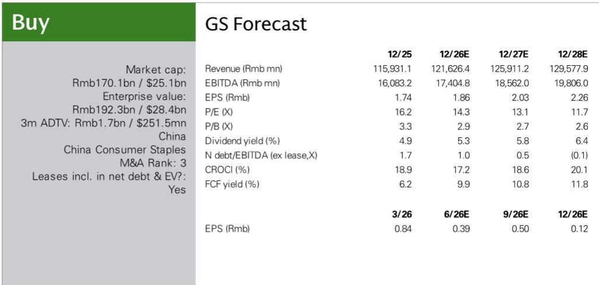
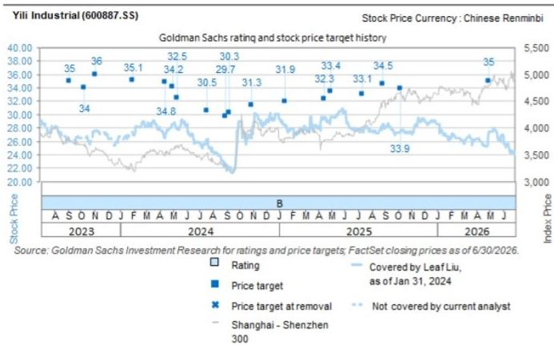

# GS：伊利与优然牧业及澳优业绩预告

伊利股份的两家关联公司在上周先后发布了业绩预告，方向截然相反。优然牧业预告2026年上半年净利润7.39亿至9.03亿元，较上年同期亏损2.97亿元实现扭亏；澳优则预告同期净亏损6.85亿至7.85亿元，而2025年上半年为盈利1.81亿元。GS在7月29日发布的报告中认为，这两份预告叠加在一起，市场更应关注优然牧业所传递的行业信号——中国原奶供需周期可能正在接近拐点。

优然牧业的扭亏并非一次性因素。报告拆解了三个驱动来源：生物资产公允价值损失大幅缩减，背后是原奶价格降幅收窄（最新数据显示原奶价格为3.05元/公斤，2025年末为3.02元/公斤），淘汰牛价格持续回升；饲料成本下降与单产提升带来的运营效率改善；以及核心经营利润的持续好转——销量规模扩大、产品升级和业务结构优化共同推高了毛利。

对伊利而言，按31.5%持股比例计算，优然牧业的盈利预告对应约2.33亿至2.84亿元联营企业回报表现，而2025年上半年这一科目约为亏损1.01亿元，同比提升约3.33亿至3.85亿元。这一数字已经高于GS对伊利2026年上半年全部联营回报表现1.68亿元的预测。报告还指出，伊利子公司博源研究在6月30日完成后认购优然牧业2.99亿股新股，持股比例从31.5%升至36.07%，这意味着下半年来自优然牧业的联营收益还将进一步增加。

> **KC评论：** 优然牧业与之前现代牧业的盈利预告形成呼应。两家上游牧业公司同时从亏损转向盈利，且都提到牛群去化、原奶价格降幅收窄、饲料成本下降这三个共同因素。这组证据比单一公司的预告更有说服力，指向的是行业层面的供需再平衡，而非个别公司的经营改善。

澳优的亏损预告则主要来自一次性因素。报告引述了澳优在业绩预告沟通会上的说明：库存优化、海外地缘政治紧张推高海运和空运成本、非现金资产减值。剔除这些项目后，澳优2026年上半年核心经营利润约为1.55亿至2.55亿元，与上年同期基本持平。渠道库存已下降超过40%，库存天数降至30天以下。公司目标是在2026年下半年实现收入高个位数同比增长并恢复盈利。

按伊利约60.2%的控股比例计算，澳优的亏损对伊利2026年上半年归母净利润的谨慎影响约为5.21亿至5.81亿元。报告测算，澳优收入约占伊利“奶粉及奶制品”板块收入的22%，占伊利总收入的6%——澳优收入下降约20%，对应伊利总收入约1.2%的谨慎影响，对奶粉板块收入约4%的谨慎影响。GS目前对伊利奶粉板块2026年上半年和下半年的收入增速预测分别为约6%和7%的正增长。

## 1. 上游盈利改善对下游竞争格局的含义

报告的核心判断并非仅关于伊利单季度业绩的加减法。GS认为，优然牧业和现代牧业先后扭亏，提供了“中国原奶供需周期正在接近拐点并走向再平衡”的进一步证据。如果上游牧业的盈利能力持续恢复，伊利和蒙牛来自上游研究的盈利影响将逐步减轻。这在中期的含义是：原奶成本趋于稳定后，下游液态奶市场的促销竞争强度可能下降，拥有上游资源的龙头企业将更受益。

## 2. 奶粉业务的一次性出清与下半年预期

澳优的亏损预告虽然数字较大，但报告将其定性为“阶段性调整和外部环境因素”的集中释放。渠道库存清理、SKU精简、运营效率提升这些动作，在财务上表现为一次性损失，但也在为下半年的轻装上阵做准备。报告指出，澳优核心经营利润基本稳定，且伊利主品牌“金领冠”仍在持续获取市场份额，这为奶粉板块的整体增长提供了支撑。

## 3. 一个可复用的观察框架：上游信号与下游业绩的传导链条

这份报告提供了一个观察中国乳制品行业的有用框架：上游牧业的盈利预告，可以作为判断原奶供需拐点的领先指标。当多家上游企业同时出现扭亏，且驱动因素来自牛群去化、原奶价格降幅收窄和饲料成本下降这三个可追踪的变量时，这组信号比单一公司的季度业绩更有参考价值。对于持有上游股权的下游企业，联营回报表现的变化是评估盈利弹性的一个直接窗口。

For informational purposes only. Portions may be generated,translated,summarized,or edited with AI assistance based on source materials and may contain omissions or errors. Please verify independently. This is not investment,legal,tax,accounting,or other professional advice.

For informational purposes only. Portions may be generated,translated,summarized,or edited with AI assistance based on source materials and may contain omissions or errors. Please verify independently. This is not investment,legal,tax,accounting,or other professional advice.

