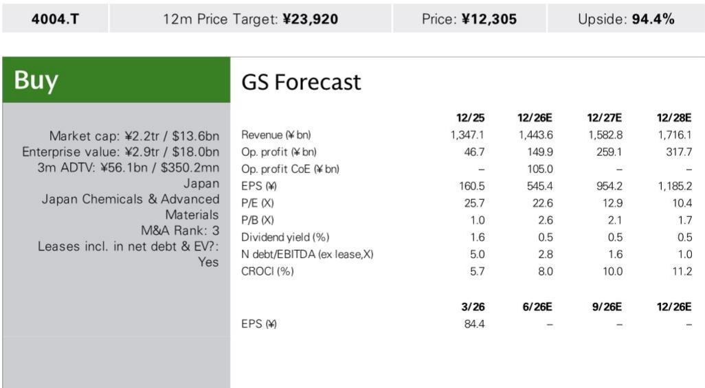
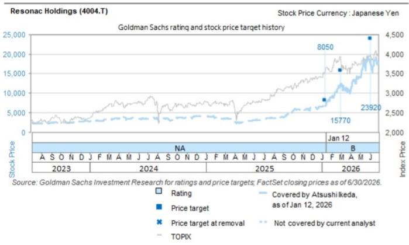

# GS：这一时间安排反映了公司对市场需求节奏的审慎判断——既不想错过AI

日本材料公司Resonac Holdings在两个月内第二次宣布扩大HD媒体产能，并首次明确披露已与硬盘制造商客户就研究额等额的涨价达成协议。GS在7月28日发布的报告中指出，这一做法在日本材料行业极为罕见，既验证了公司作为全球相对少见独立HD媒体供应商的议价能力，也意味着管理层在扩大供应规模的同时，同步改善了盈利结构。

Resonac计划在新加坡基地追加约150亿日元研究，将HD媒体年产能再增加2000万片，主要用于AI数据中心近线应用。新增产线将从2029年起根据市场需求分批投产。公司还利用部分闲置设备以提升研究效率。加上今年5月宣布的5000万片年产能扩张（2027年起分批投产），两轮扩产合计将使HD媒体总产能从目前的约1.6亿片提升至约2.3亿片，增幅约44%。

HD媒体是Resonac半导体与电子材料业务中仅次于覆铜板/预浸料的第二大收入来源。GS估算，在价格上调与中长期出货量增长的双重推动下，该业务对整体盈利的贡献将显著提升。

## 1. 外部数据支撑：近线HDD出货容量2025-2030年复合增长率达23%

报告引用外部研究机构数据指出，AI数据中心对近线硬盘的存储容量需求正以每年23%的速度增长。Resonac管理层将此作为追加研究的直接依据。GS认为，这一需求增速意味着现有产能规划仍有可能被进一步消化，而公司作为全球相对少见独立供应商，在供给端几乎没有直接竞争对手。

> **KC评论：** 近线HDD主要用于冷存储和温存储场景，AI训练和推理生成的大量非结构化数据正是这类存储的核心需求来源。23%的复合增长率意味着到2030年容量需求接近翻三倍，Resonac两轮扩产后的总产能增长44%仍可能只是阶段性匹配。

## 2. 涨价协议在日本材料行业极为罕见，反映公司议价地位

Resonac在公告中明确表示，已与硬盘制造商客户就本次研究额等额的涨价达成协议。虽然具体幅度和生效时间尚未披露，但GS指出，在日本材料行业，企业在产能扩张公告中主动披露已锁定客户涨价协议，几乎没有先例。

这一做法传递了两个信号：第一，客户认可Resonac作为相对少见独立供应商的技术不可替代性，愿意分担扩产成本；第二，管理层在研究决策上表现出更强的纪律性，不再单纯追求规模扩张，而是将回报表现与客户承诺挂钩。

## 3. 产能扩张节奏加快，但投产时间线拉长至2029年

与5月宣布的5000万片产能（2027年分批投产）不同，本次追加的2000万片产能要到2029年才开始陆续上线。GS认为，这一时间安排反映了公司对市场需求节奏的审慎判断——既不想错过AI存储的结构性增长窗口，也不愿一次性过度研究。

从财务角度看，两轮扩产的总研究额对应约7000万片新增产能，单位产能研究成本较此前有所下降，部分得益于闲置设备的再利用。这意味着即使需求增速低于预期，公司的资本支出不确定性也相对可控。

## 4. GS的估值框架：EV/GCI与CROCI/WACC的倍数关系

基于材料板块EV/GCI与CROCI/WACC的相关性，采用0.7倍现金回报倍数并附加30%的板块溢价。报告同时列出主要不确定性：半导体需求节奏变化、日元升值以及石墨电极业务盈利下滑。

从财务预测看，GS预计公司2026-2028财年营业利润将从1499亿日元增长至3177亿日元，净利润从每股545.4日元升至1185.2日元。净债务/EBITDA比率从2.8倍降至1.0倍，CROCI从8.0%提升至11.2%。这些数据表明，HD媒体业务的价格改善和产能扩张正在推动整体资本回报率的系统性提升。

For informational purposes only. Portions may be generated,translated,summarized,or edited with AI assistance based on source materials and may contain omissions or errors. Please verify independently. This is not investment,legal,tax,accounting,or other professional advice.

For informational purposes only. Portions may be generated,translated,summarized,or edited with AI assistance based on source materials and may contain omissions or errors. Please verify independently. This is not investment,legal,tax,accounting,or other professional advice.

