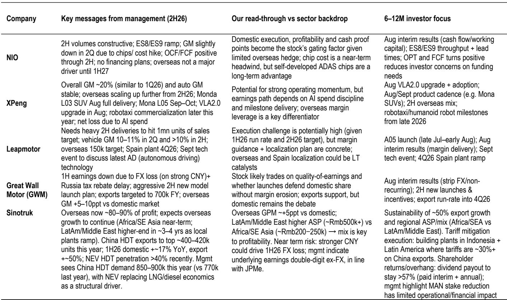

# 行业观察：中国汽车行业——管理层对二季度及2026下半年预期评论

中国汽车行业正在进入一个关键的分化期。近期与多家车企管理层交流后形成判断：2026年下半年，国内需求仍处于调整阶段，但竞争焦点已从“价格竞争”转向“产品+技术+渠道”的综合能力比拼。海外市场依然是结构性增长来源，但政策不确定性正在上升。

这份研究笔记的核心信号是：车企的盈利分化将加速，读者需要从“销量增长”转向“盈利质量”来评估企业。管理层普遍认同的四个策略方向——新产品周期驱动销量、通过产品组合和规模保利润、海外市场作为结构性增长点、以及用芯片/智驾/AI等技术建立差异化——在落地时会产生显著差异。

## 1. 国内需求调整，新产品周期成为关键变量

管理层普遍认为，2026年下半年国内需求仍缺乏宏观层面的反弹动力。消费者信心是核心约束，政策支持更多是边际改善而非周期逆转。在这种环境下，新产品是相对少见可信的增长路径。

但研究提醒，市场需要区分“真实终端销售”和“出货驱动的销量”。仅2026年上半年，中国市场就推出了约600款新车型。报告认为“80-20法则”可能适用——大多数新车型无法达到预期效果。这意味着，产品周期是必要条件，但不是充分条件。读者需要关注渠道库存、订单交付周期和激励力度等指标，以判断新车型的真实市场表现。

## 2. 成本变化从6月开始显现，三季度是利润不确定性观察窗口

多家车企管理层确认，存储芯片和原材料成本上涨正在影响利润。有公司量化了影响：仅存储芯片一项，单车成本增加约4000元。一季度库存缓冲消退后，二季度成为成本不确定性的转折点，三季度将是第一个“无缓冲”的利润观察窗口。

报告认为，车企能否在三季度维持毛利率，将是一个重要的判断信号。分化将取决于四个因素：垂直整合和采购能力、定价纪律、海外市场占比、以及通过新车型重新定价的能力。部分公司正在通过自研芯片来对冲成本不确定性，但效果需要时间验证。

## 3. 海外市场是结构性增长来源，但政策不确定性上升

海外市场被管理层普遍视为最清晰的结构性增长机会。有公司维持2026年海外销量约9万辆的目标（同比增长约100%），并声称海外毛利率是国内的两倍以上。另一家公司预计海外毛利率比国内高5-10个百分点。还有公司上半年海外销量约9.6万辆，重申全年15万辆的海外目标。

但欧盟的贸易政策正在成为新的变量。报告指出，欧盟可能进一步讨论对中国插电混动汽车加征关税，非关税壁垒也可能在2027年落地。有公司在西班牙的本地化工厂被视为一个结构性解决方案：通过本地化生产，理论上可以释放约24-25个百分点的毛利空间。这一策略对其他公司同样适用。

也有公司是海外策略的例外——管理层明确表示，2027年上半年之前海外不会成为主要驱动力，产品开发仍以国内市场优先。

## 4. 技术叙事正在分化：成本投入与财务回报的时间差

芯片、智驾、AI和机器人技术正在成为车企差异化竞争的新维度。但报告指出，读者在短期内看到的是成本和资本开支，而非财务回报。有公司明确表示，AI投入导致净亏损。另一家公司的自研芯片长期可降低单车成本超过1万元，但短期成本不确定性仍然存在。

这种“先投入、后回报”的时间差，意味着技术叙事本身不足以支撑公司估值。报告强调，盈利修正才是公司估值的核心驱动力。在行业节奏变化周期中，估值压缩，市场会为可见的盈利增长支付溢价。

> **观察评论：** 这份报告的核心观察框架是“盈利修正动量”。在需求调整、成本上升、竞争加剧的三重不确定性下，能够持续上调盈利预期的车企，才是市场愿意给予溢价的标的。读者需要从“销量故事”转向“盈利质量故事”，关注毛利率的稳定性、海外利润贡献、以及技术投入对利润表的实际影响。

## 5. 读者需要关注的三个验证节点

报告建议，未来6-12个月，读者应聚焦三个验证节点：

第一，8月中下旬的中期业绩，这是“产品周期叙事”第一次被审计的时刻——销量质量、产品组合和渠道状况将接受检验。

第二，新车型的交付节奏和订单转化率。部分公司的具体车型，这些车型的实际市场表现将决定各家公司的短期走势。

第三，三季度的毛利率数据。这是第一个没有成本缓冲的完整季度，将真实反映各车企的成本管控能力和定价权。

在海外市场，需要关注的是“零售执行能力”——品牌建设、售后服务、残值管理，而不仅仅是批发出货量。在欧盟政策方面，本地化能力将成为维持海外增长的关键战略变量。

For informational purposes only. Portions may be generated,translated,summarized,or edited with AI assistance based on source materials and may contain omissions or errors. Please verify independently. This is not investment,legal,tax,accounting,or other professional advice.

For informational purposes only. Portions may be generated,translated,summarized,or edited with AI assistance based on source materials and may contain omissions or errors. Please verify independently. This is not investment,legal,tax,accounting,or other professional advice.

