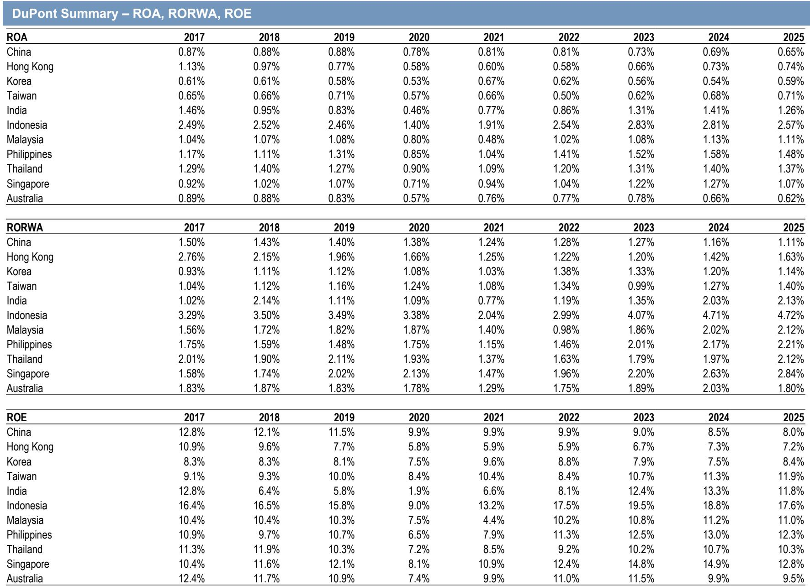
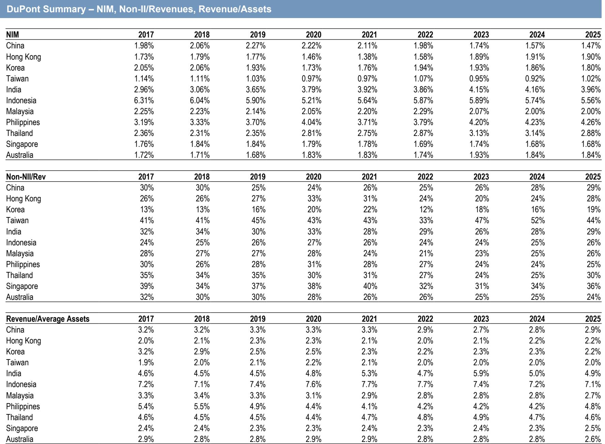
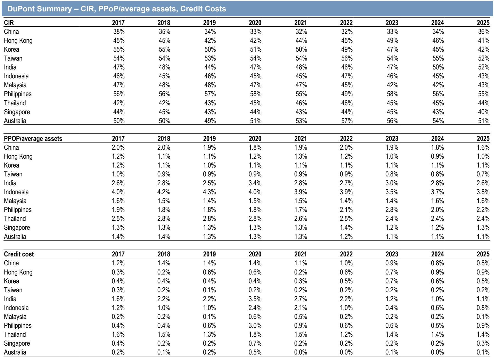

# 中国银行业资产负债表基础框架

理解一家银行，从资产负债表开始。近期发布的一份面向中国银行业的基础分析框架报告，标题直指“银行始于资产负债表”。这份报告的核心价值不在于给出具体公司判断，而在于它用一套统一的杜邦分析框架，将中国、香港、韩国、台湾、印度、印尼、马来西亚、菲律宾、泰国、新加坡和澳大利亚共11个市场的银行体系，从2017年到2025年的关键财务指标做了横向对比。

报告最值得关注的观察是：亚洲各市场银行的资产回报率（ROA）正在经历一轮明显的结构性分化。中国银行业的ROA从2017年的0.87%持续变化至2024年的0.69%，2025年预计进一步降至0.65%。而同期印度银行业ROA从0.46%的低点回升至1.41%，印尼则稳定在2.8%左右。这种分化背后，是净息差（NIM）、信用成本和收入结构三个变量的不同走向。

## 1. 中国银行业净息差持续变化，印度与印尼保持高位

报告中的净息差数据清晰展示了亚洲各市场的利率环境差异。中国银行业NIM从2019年2.27%的高点一路变化，2024年降至1.57%，2025年预计为1.47%。香港市场则走出相反轨迹，从2020年1.46%的低点回升至2024年的1.91%。印度和印尼是NIM最高的两个市场，2024年分别为4.16%和5.74%。

> **KC评论：** 净息差是银行盈利能力的重要变量。中国NIM持续变化，反映的是贷款利率仍在调整与存款成本刚性并存的结构性不确定性。印度和印尼的高NIM则受益于相对较高的政策利率和信贷定价能力。这张表格的价值在于，它把不同市场的利率周期差异做了量化，读者可以据此判断各市场银行收入端的不确定性来源。

## 2. 信用成本差异显著，中国和印度均呈下降趋势

信用成本是影响银行最终利润的另一关键变量。中国银行业的信用成本从2017年的1.2%持续下降至2024年的0.8%，2025年预计维持在这一水平。印度银行业的信用成本从2020年3.5%的高点大幅回落至2024年的1.0%。印尼从2021年2.1%降至2024年的0.6%。

报告中的杜邦分解显示，信用成本的下降是部分市场ROA改善的重要驱动力。以印度为例，其PPoP（拨备前利润）与平均资产之比在2023年为3.0%，2024年降至2.8%，但ROA却从1.31%升至1.41%，说明信用成本下降对利润的贡献超过了收入端的不确定性。

## 3. 收入结构分化：非利息收入占比与资产周转率

报告还提供了非利息收入占总收入的比例（Non-NII/Rev）和收入与平均资产之比（Revenue/Average Assets）两个指标。中国银行业的非利息收入占比从2017年的30%降至2024年的28%，2025年预计回升至29%。台湾市场这一比例最高，2024年达到52%，但波动较大。新加坡和澳大利亚的非利息收入占比也相对较高，2024年分别为34%和25%。

收入与平均资产之比方面，中国从2019年3.3%降至2024年的2.8%，2025年预计回升至2.9%。印尼和印度这一比率最高，2024年分别为7.2%和5.0%。这个指标综合反映了银行的市场定价能力和非利息收入贡献。

> **KC评论：** 非利息收入占比高并不一定意味着盈利能力更强，关键要看收入来源的稳定性和成本。台湾市场非利息收入占比虽高，但其ROA仅为0.68%，远低于印尼的2.81%。这说明非利息收入可能来自波动较大的交易或手续费收入。读者在分析银行收入结构时，需要进一步拆解非利息收入的构成。

## 4. 成本收入比与拨备前利润率的区域差异

报告中的成本收入比（CIR）数据显示，中国银行业从2017年的38%升至2024年的34%，2025年预计为36%。韩国从55%降至45%，新加坡从44%降至43%。印度从47%升至50%，印尼从46%降至45%。

PPoP与平均资产之比是衡量银行核心盈利能力的关键指标。中国从2019年的1.9%降至2024年的1.8%，2025年预计为1.6%。印尼从2019年的4.3%降至2024年的3.7%。印度从2023年的3.0%降至2024年的2.8%。这个指标排除了信用成本的影响，更能反映银行在利率和运营效率方面的真实表现。

综合来看，这份报告提供了一个可复用的观察框架：分析一家银行或一个市场时，应从净息差、信用成本、非利息收入占比和成本收入比四个维度入手，再通过杜邦分解将其汇总为ROA和ROE。对于中国银行业而言，净息差仍在调整和信用成本下降是两个方向相反的力量，最终ROA的走势取决于两者的相对速度。对于印度和印尼等市场，高NIM和低信用成本共同支撑了较高的ROA，但需要关注其可持续性。

For informational purposes only. Portions may be generated,translated,summarized,or edited with AI assistance based on source materials and may contain omissions or errors. Please verify independently. This is not investment,legal,tax,accounting,or other professional advice.

For informational purposes only. Portions may be generated,translated,summarized,or edited with AI assistance based on source materials and may contain omissions or errors. Please verify independently. This is not investment,legal,tax,accounting,or other professional advice.

