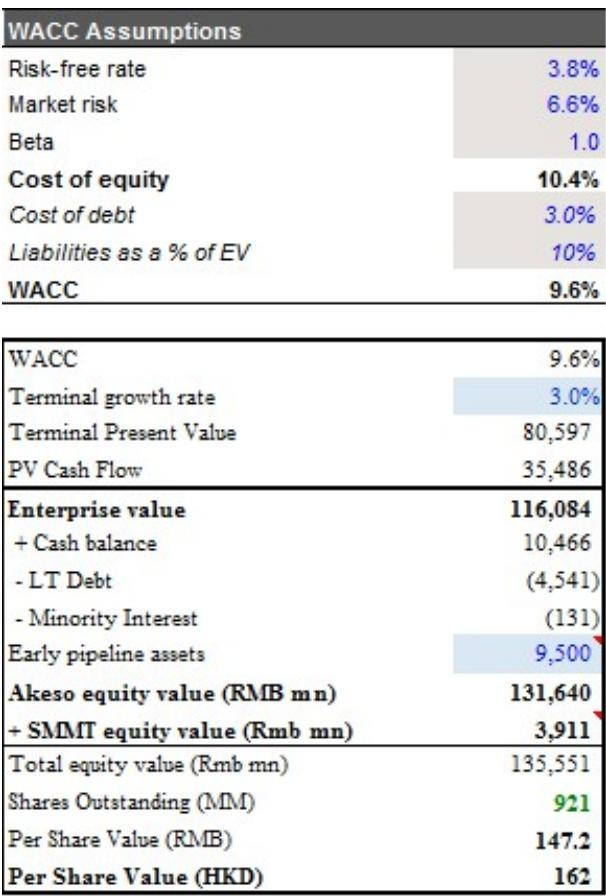
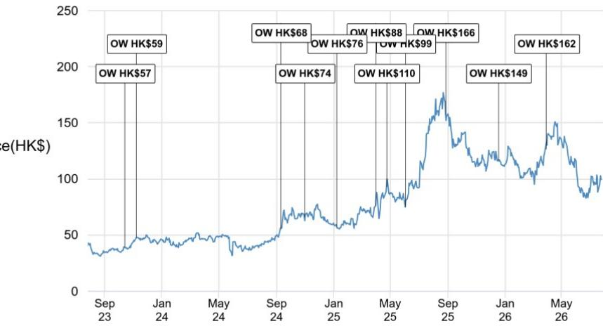

# Ivonescimab 的审批路径：需关注事件率慢于预期及鳞状队列的两阶段 OS 分析

Summit Therapeutics（康方生物旗下依沃西单抗的美国合作伙伴）公布了2026年第二季度业绩，其中披露了两项对该资产全球叙事具有核心意义的发展。第一项是关键的全球III期HARMOni-3试验的时间表修订。第二项是提交了一份高达3.8亿美元的新市价股权发行计划的招股说明书补充文件。这些事件共同促使观察者重新调整对依沃西单抗在非小细胞肺癌领域提交监管申请的时间、力度和资金安排的预期。

Summit确认，HARMOni-3在鳞状和非鳞状队列的入组均已完成。鳞状队列于2026年第一季度完成入组，非鳞状队列于第二季度完成。但管理层承认，事件率有所放缓，将鳞状队列无进展生存期分析的时间推迟至2026年下半年的中后期。这并非失败，但相对于先前的预期有所延迟，并且对市场应如何看待下一组数据解读具有影响。

比PFS延迟更重要的是，披露了鳞状队列的第二次中期总生存期分析，目前安排在2027年上半年。Summit管理层表示，2026年下半年第一次中期OS分析的alpha消耗将非常小，将该次分析定性为支持性，主要旨在显示曲线分离的证据，而非一个具有统计效力的风险比。2027年的第二次中期OS分析将具有更好的统计效力，中位随访时间预计在20多个月。管理层明确将其与HARMOni-6的21个月中位随访时间以及更新后的HARMOni分析中约23个月的西方随访时间进行了对标。

对于观察者而言，这种两阶段OS分析的结构是报告中最具战略意义的信号。这意味着2026年下半年将产生一个方向性信号，而非确定性结果。市场需要等到2027年上半年才能获得鳞状队列具有统计意义的OS解读。这个时间线比许多人预期的要长，并引入了一段不确定性时期，相关报价将需要在此期间消化。

## 两阶段OS分析在信号与证据之间划出清晰界限

Summit决定以最小的alpha消耗进行第一次中期OS分析，随后进行第二次更具效力的分析，这反映了一种深思熟虑的统计策略。管理层表示，第一次OS分析将是支持性的，预期传达的是方向性趋势，而非具有统计显著性的风险比。这在事件率慢于预期的肿瘤学试验中并不罕见，但这确实意味着2026年下半年将是一个解读而非定论的时期。

对于观察者而言，关键问题是什么构成足够的方向性信号。即使在低alpha消耗下，生存曲线出现清晰且早期的分离，也可能足以维持信心。但一个平坦或模糊的结果将带来显著压力，因为下一次获得有统计效力解读的机会要等到2027年上半年。市场将不得不忍受至少六个月的这种模糊性。

管理层对第二次中期OS分析的表述具有指导意义。他们预计中位随访时间在20多个月，并明确将其与HARMOni-6的21个月中位随访时间以及更新后的HARMOni分析中约23个月的随访时间进行比较。这些基准之所以相关，是因为HARMOni-6产生了在ASCO 2026全体会议上展示的OS数据，而市场对此感到失望。这意味着HARMOni-3的第二次中期OS分析将具有与先前数据截止点相当或略长的随访时间，并且该分析将有能力以更高置信度检测风险比。

对于非鳞状队列，Summit仍预计PFS分析将在2027年上半年进行。但尚不清楚该PFS分析是在鳞状队列第二次OS分析之前还是之后。这个顺序很重要，因为积极的非鳞状PFS结果可能在鳞状OS解读之前提供一个催化剂，而消极或模糊的结果则可能加剧不确定性。

## 3.8亿美元ATM申请表明Summit需要为更长的开发路径提供资金

截至2026年第二季度末，Summit持有约6.907亿美元现金，高于第一季度末的5.987亿美元。现金增加主要得益于先前ATM计划筹集的2.31亿美元，部分被约1.4亿美元的运营现金使用所抵消。第二季度非GAAP季度运营支出上升至1.518亿美元，反映了为进行中的试验而增加的研发支出。

考虑到这一现金消耗率，3.8亿美元的ATM计划覆盖了维持依沃西单抗试验开发至下一组数据解读及潜在监管提交所需资金缺口的重要部分。计算很简单：假设季度消耗率可能保持在1.5亿美元以上，Summit现有的现金跑道大约为四到五个季度。ATM提供了额外的灵活性，但也会稀释现有股东。

对于康方生物而言，依沃西单抗海外商业化的经济效益通过里程碑付款和特许权使用费实现。因此，Summit在不陷入困境的情况下为开发计划提供资金的能力直接关系到康方生物未来的收入流。一个资金充足的合作伙伴降低了项目延迟或试验执行不佳的风险。但需要筹集额外资金也表明Summit实现盈利的路径比最初预期的更远，这可能会影响向康方生物支付里程碑付款的时间和规模。

ATM申请并非疲弱的迹象，但它提醒人们，开发全球肿瘤学资产需要持续的资本投入。观察者应预期Summit将继续机会性地使用ATM，并且随着公司通过其多个数据解读为HARMOni-3计划提供资金，进一步的稀释是可能的。

## FDA审评时间表及ODAC小组的可能性增加了监管不确定性

Summit管理层承认，公司已向FDA提供了HARMOni的额外OS分析，但由该机构决定这些数据是否需要额外的审评时间，这可能会推迟PDUFA日期。管理层还表示，是否召集肿瘤药物咨询委员会进行审评是FDA的决定。

ODAC小组的可能性是一个重要的变量。ODAC审评通常针对具有新颖机制、边缘疗效或安全性问题的药物召开。依沃西单抗是一种靶向PD-1和VEGF的双特异性抗体，其机制既不新颖也非特别有争议。但考虑到OS数据的复杂性和多次中期分析，FDA仍可能决定有必要进行咨询委员会讨论。

如果召集ODAC小组，将使审评时间表增加数月，并引入一个可能显著影响报价的二元事件。风险在于，ODAC小组可能会突出数据的局限性，特别是如果2026年下半年的早期中期OS分析仅显示方向性趋势而非明确获益。

相反，如果FDA在没有ODAC小组的情况下接受数据，这将是一个积极信号，表明该机构对证据强度感到满意。但这一决定在审评进行之前不会知晓，这为观察者必须定价的增加了另一层不确定性。

## 评估未来18个月依沃西单抗风险回报的决策框架

本报告中的信息使观察者能够构建一个结构化的决策框架，用于评估未来18个月依沃西单抗的风险回报状况。该框架包含三个维度：数据质量、监管时间表和合作伙伴资金。

在数据质量方面，关键里程碑是2026年下半年的鳞状PFS分析、同期的第一次中期OS分析，以及2027年上半年的第二次中期OS分析。PFS分析是主要终点，将是第一个主要数据点。积极的PFS结果，即使伴随方向性但非统计显著的OS信号，也足以维持论点。消极的PFS结果将是一个重大挫折。

在监管时间表方面，关键变量是FDA是否需要额外的审评时间或ODAC小组。观察者应监测FDA与Summit的沟通，以寻找审评时间表正在延长的任何迹象。没有ODAC小组将是一个积极信号，而召集小组将引入二元风险。

在合作伙伴资金方面，关键问题是Summit的现金状况和新的ATM是否足以支持该计划直至第二次中期OS分析及潜在的监管提交。拥有6.907亿美元现金和3.8亿美元ATM，假设消耗率没有显著增加，Summit有资源继续运营至少六到八个季度。但如果消耗率加速或时间表进一步延长，可能需要额外融资。

对于康方生物而言，最重要的变量是2027年上半年第二次中期OS分析的强度。该解读将决定依沃西单抗在全球鳞状NSCLC市场是否有一条可行的审批路径。2026年下半年的第一次中期OS分析将提供一个早期信号，但不会是决定性的。观察者应预期该事件前后的波动，但不应将其视为最终结果进行交易。

在ASCO 2026上展示HARMOni-6 OS数据后，康方生物的报价已面临压力。当前报告并未改变基本论点，但它延长了时间表并增加了必须解决的变量数量。对于愿意经历未来18个月数据解读的观察者而言，风险回报仍然具有吸引力，但路径比六个月前更长且更不确定。

*仅供参考。部分内容可能基于源材料通过AI辅助生成、翻译、总结或编辑，可能存在遗漏或错误。请独立核实。这不是专业建议。*

仅供参考。部分内容可能基于源材料通过AI辅助生成、翻译、总结或编辑，可能存在遗漏或错误。请独立核实。这不是专业建议。

