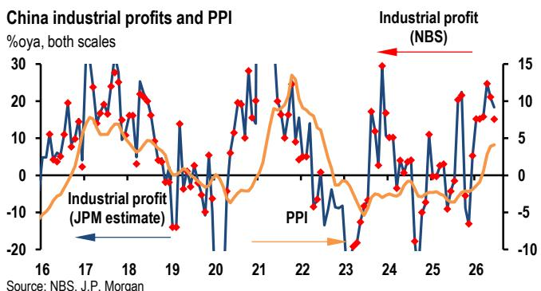
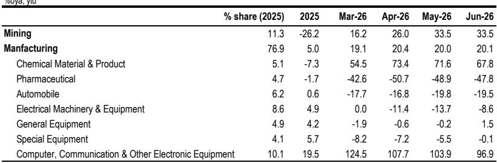
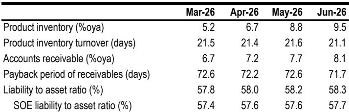

# 中国工业利润增长的结构性特征：多数行业并未同步受益

2026年上半年，中国工业利润同比增长18.7%的总体数据，似乎预示着广泛的复苏。然而，这一印象可能具有误导性。总体数字掩盖了正在加深的结构性分化。近93%的利润增长来自两个领域：与全球人工智能周期相关的技术制造业，以及受益于大宗商品价格上行的上游原材料行业。与此同时，下游消费品行业——家具、汽车、服装——利润出现收缩，降幅在14%至53%之间。这并非周期性回升，而是政策和科技驱动的利润集中，多数工业领域并未同步受益。

这一模式揭示了当前增长模式的内在机制。政府正将资本和政策支持引导至先进制造、人工智能基础设施和国家安全相关产业，而消费需求刺激仍以方向性引导为主。近期发布的扩大消费相关规划方向积极，但侧重于供给侧，缺乏详细的财政部署和实施机制。在国内需求实质性回暖之前，利润复苏将呈现行业分化格局，受益行业集中在少数领域，而这些领域并非劳动密集型，难以产生支撑广泛复苏所需的收入外溢效应。

## 人工智能与大宗商品行业驱动利润增长，形成集中化特征

2026年上半年，电子制造业利润同比增长96.9%，有色金属行业利润增长99.4%。这两个行业，连同石化加工和化工行业，贡献了总体利润增长的绝大部分。电子行业的繁荣与全球人工智能基础设施建设直接相关：集成电路、电子专用材料和数据中心互联设备的需求创造了强劲的增长动力，并带动了相关供应链。在大宗商品方面，人工智能和新能源产品需求的增长使铜和铝价格保持高位，而石油生产链中的石化加工行业从去年的亏损转为2026年的稳定盈利，化工行业利润增长67.8%。

这种集中化特征带来两方面影响。首先，总体利润增长高度依赖单一需求驱动因素。如果全球人工智能资本支出放缓或大宗商品价格调整，总体数据可能迅速变化。其次，这些行业的就业乘数相对于其产出有限。与消费品制造业相比，半导体工厂或石化工厂单位投资创造的价值较高，但提供的就业岗位相对较少。这意味着利润增长并未转化为广泛的工资和收入增长，而后者是支撑消费持续复苏的基础。

## 库存上升与现金周转放缓：总体数据之下的信号

虽然利润率从2025年底的5.31%提升至5.70%，但盈利质量指标值得关注。6月产成品库存同比增长9.5%，为2023年初以来最高水平。应收账款同比增长8.1%，表明企业更多以信用方式销售而非现金回款。库存销售比（三个月移动平均）呈上升趋势，显示生产增速超过终端需求增速。

这些指标反映出典型的被动库存积累模式。企业，尤其是上游和科技行业，为应对预期中的持续需求而维持高产量，但下游消化能力正在放缓。如果终端需求未能如期实现，去库存周期可能压缩利润并引发减产。消费品领域尤其值得关注，6月消费品生产者价格同比下降0.9%，而生产资料价格同比上涨5.5%。定价能力的差异表明，下游企业无法将投入成本上涨转嫁给终端消费者，利润空间进一步收窄。

## 消费品利润收缩：国内需求结构特征

下游行业利润数据较为明显。上半年家具利润同比下降52.7%，汽车利润下降19.5%，服装利润下降28.0%，文化、体育和娱乐用品利润下降13.8%。这些并非周期性波动，而是反映了居民消费的持续特征，且未见明显改善迹象。

其机制较为清晰：上游行业生产者价格上涨——受人工智能需求和商品供应约束推动——推高了消费品制造商的投入成本。但由于居民需求偏弱，这些制造商无法提高自身产品价格。结果是利润空间持续收窄。相关消费促进规划方向积极，但尚未提供提升可支配收入和消费者信心所需的财政转移、减税或社会保障体系增强措施。在这些措施落地之前，上游盈利与下游压力之间的差距可能进一步扩大。

## 政策方向：延续现有框架

上半年国内生产总值增长仍在年度目标区间内，6月经济活动数据显示三季度初动能有所增强，政策制定者面临调整方向的压力有限。预计近期重要会议将聚焦加快现有措施的执行，而非扩大财政规模。这意味着将继续侧重人工智能、先进制造和国家安全相关产业，消费支持力度相对有限。

对于观察者和企业战略制定者而言，这一政策立场具有明确含义。当前利润增长领先的行业将继续受益于政府采购、信贷分配和监管支持。然而，政策支持不会广泛扩展。下半年加速的财政部署主要投向基础设施和产业升级，而非居民收入支持。这强化了双速格局：科技和上游材料行业将保持活跃，而消费相关行业将继续面临压力。

## 应对双速利润环境的分析框架

对于企业战略制定者和观察者而言，关键问题在于如何在总体增长具有误导性、行业分化成为主要特征的环境中定位。结构化的分析框架包括三个评估维度。

第一，评估自身与全球人工智能和产业政策周期的关联度。与电子制造、集成电路、专用材料和数据中心基础设施有直接或间接关联的企业，将继续看到收入和利润的支撑因素。多年期的人工智能+和产业升级议程提供了政策可见性。然而，增长的集中化也意味着，全球人工智能资本支出的任何放缓或政府优先事项的调整都将产生较大影响。在这一领域内进行多元化配置是必要的。

第二，评估相对于投入成本上涨的定价能力。生产资料生产者价格指数上涨5.5%与消费品生产者价格指数下降0.9%之间的差距，定义了利润空间的变化。能够转嫁成本上涨的企业——通常拥有差异化产品、强势品牌或合同定价机制——将表现更好。处于同质化消费品领域、价格弹性较高的企业将继续面临压力。关键风险因素包括地缘局势：若再次升级，可能推高能源和原材料成本，进一步压缩无法调整价格的下游行业利润空间。

第三，将库存和应收账款周期作为先行指标进行监测。产成品库存和应收账款比率的上升是值得关注的信号。当库存销售比达到迫使去库存的水平时，对生产和就业的影响可能较为迅速。拥有精益供应链和较强现金周转能力的企业，更能应对调整。库存水平高、应收账款回收期长的企业面临流动性风险。

这意味着，在中国工业领域，单一策略已不再适用。行业选择、供应链定位和资产负债表韧性已成为决定性因素。总体利润增长数字虽然引人注目，但作为决策参考的价值有限。真正的洞察在于理解经济中哪些部分正在产生可持续的收益，哪些部分正受到结构性因素的挤压，而政策在短期内可能难以解决这些问题。

*仅供参考。部分内容可能基于原始材料通过人工智能辅助生成、翻译、总结或编辑，可能存在遗漏或错误。请独立核实。本文不构成专业建议。*

仅供参考。部分内容可能基于原始材料通过人工智能辅助生成、翻译、总结或编辑，可能存在遗漏或错误。请独立核实。本文不构成专业建议。

