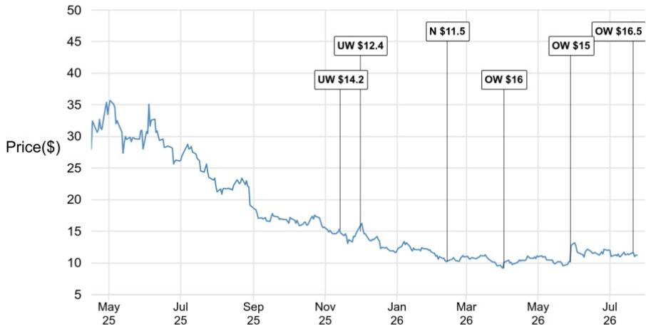
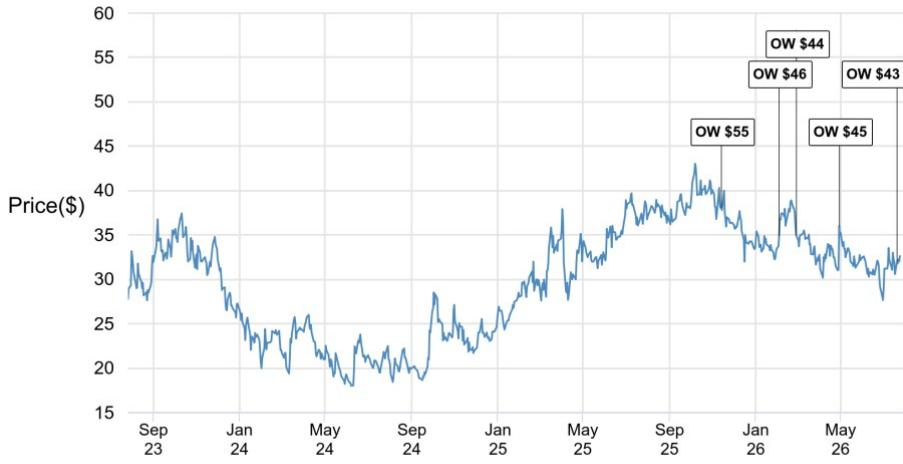
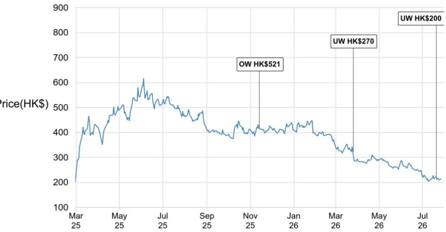

## 行业观察与品牌动态

### 加盟商经营情况调研：专家电话会议要点

我们于7月27日举办了一场专家电话会议，以评估最新的竞争格局。该专家在河北、河南、陕西、内蒙古和安徽运营着49家瑞幸咖啡门店、3家茶颜悦色门店和2家蜜雪冰城门店。他指出，第三方配送补贴的减少以及竞争加剧，对门店层面的运营表现产生影响。积极的一面是，我们看到瑞幸的平均售价和毛利率出现回升迹象，茶颜悦色的业绩也趋于稳定。以下是会议的主要要点。关于我们最新的观点，请参考我们1H26的行业前瞻报告。

### 瑞幸：领先地位稳固；平均售价和毛利率正在恢复

- 同店销售仍面临压力，而平均售价正在回升。专家表示，他管理的49家瑞幸门店中，大部分年初至今的GMV同比下降了10-15%，主要原因是需求相对温和以及来自新开门店和竞争对手的竞争加剧。杯量有所下降，但平均售价因以下因素而改善：(1) 9.9元促销活动减少，(2) 配送平台定价提高，以及(3) 通过推出新品实现的产品升级。配送占比已基本稳定在约50%（而去年补贴战期间曾高达约80%）。鉴于消费者已形成的配送习惯，进一步正常化的空间可能有限。

- 门店层面毛利率有所改善；较高的人工成本限制了净利率的扩张。门店层面毛利率在2026年第二季度已恢复至约35%（而去年配送战期间的范围较宽，约28-45%）。然而，更高的人员配置需求、不断上涨的社保成本、产品复杂性的增加以及更高的损耗，抵消了大部分收益。专家估计，每家门店每月新增的人工成本约为4-5千元人民币（即每年6-7万元人民币），这可能对净利率造成约1-2个百分点的潜在影响。他认为，对于日均销量约300杯的社区店，投资回收期现在约为3年或更长。

- 非咖啡饮品正成为一个有意义的增长点，但也增加了运营复杂性。非咖啡产品年初至今占总GMV的约30%，长期来看，随着瑞幸网络密度的增加和在低线城市的渗透率提高，这一比例可能升至40-50%。加盟商对此热情不高，因为新鲜水果的使用量更大，劳动强度更高，这增加了运营的复杂性。

- 产品升级支撑了平均售价，但SKU的扩张带来了权衡。瑞幸提供更多定制选项和优质咖啡豆选择，使对价格不敏感的消费者能够升级消费，从而提高客单价。然而，更广泛的SKU组合也增加了库存损失、损耗和门店层面的执行压力。

- 与其他咖啡和奶茶品牌相比，竞争优势依然存在。专家将瑞幸相对于库迪的优势主要归因于其更专业化的加盟开发和管理体系。虽然更多奶茶品牌正在进入现磨咖啡市场，但他认为瑞幸持续的产品迭代和品牌强化是关键的区别因素。

### 消费者研究

Jessie Xu AC
(852) 2800-8590
jessie.j.xu@JPM.com
JPM Securities (Asia Pacific) Limited/ JPM Broking (Hong Kong) Limited

Sylvia Hu

(86-21) 6106-6284

sylvia.hu@JPM.com

SAC Registration Number: S1730526010001

JPM Securities (China) Company Limited

2026年7月21日 : 行业观察与品牌动态：1H26
前瞻：茶饮品牌放缓，瑞幸加速 (链接)

### 茶颜悦色：同店销售下滑趋于稳定，但加盟商单店盈利仍是关键问题

- 业绩趋于稳定；冰淇淋业务仍处于早期阶段。专家观察到，茶颜悦色近期的GMV下滑已趋于稳定，这得益于更频繁的新品发布和较慢的门店扩张。新推出的冰淇淋业务在河北/天津仍处于起步阶段（已开设七家门店），每家门店约15万元人民币的资本支出被加盟商认为较高。

- 门店盈利具有高度季节性；抽成比例给加盟商回报带来压力。7月（旺季）的月GMV预计将超过40万元人民币，支撑约15-16%的门店层面利润率，但在淡季可能降至20-30万元人民币区间，利润率降至约8-9%。专家认为，当前的抽成比例仍然过高，可以进一步优化为阶梯式利润分享机制。

### 蜜雪冰城：在幸运咖盈利面临挑战的背景下，咖啡业务布局显得防御性

- 蜜雪冰城的咖啡策略显得防御性；幸运咖的盈利状况面临压力。专家管理的蜜雪冰城门店因其位于低线城市而未安装咖啡机。他认为，蜜雪冰城推动门店配备咖啡机，部分原因是幸运咖的盈利状况不佳，约70%的幸运咖加盟商处于亏损状态。他还指出，消费者降级消费的意愿有限：许多消费者宁愿多花2-3元人民币购买瑞幸，也不愿购买价格更低的幸运咖咖啡。

本报告讨论的公司（除非另有说明，本报告中的所有价格均以2026年7月24日市场收盘价为准）茶颜悦色(CHA/$11.20/OW)，瑞幸咖啡(LKNCY/$32.63/OW)，蜜雪集团 - H(2097.HK/HK$212.60[2026年7月27日]/UW)

分析师认证：本报告封面以“AC”标识的研究分析师证明（或者，当多位研究分析师主要负责本报告时，封面或文档内以“AC”标识的研究分析师分别证明，就其在本研究中涵盖的每个证券或发行人而言）：(1) 本报告中表达的所有观点准确反映了研究分析师对任何及所有标的证券或发行人的个人观点；(2) 研究分析师的任何部分薪酬过去、现在或将来都未直接或间接地与本研究报告中研究分析师表达的具体建议或观点相关联。对于封面列出的所有韩国研究分析师（如适用），他们还根据KOFIA的要求证明，研究分析师的分析是本着诚信原则进行的，并且观点反映了研究分析师本人的意见，没有受到不当影响或干预。

除非另有说明，本报告中列出的所有作者均为独立撰写研究报告的研究分析师。在欧洲，本报告中可能显示行业专家（销售和交易）作为联系人，但他们并非报告的作者，也不属于研究部门。

## 重要披露

- 做市商/流动性提供者：JPM是茶颜悦色、瑞幸咖啡或相关实体金融工具的做市商和/或流动性提供者。

- 做市商/流动性提供者（香港）：JPM Securities (Asia Pacific) Limited 和/或 JPM Broking (Hong Kong) Limited 和/或一家关联公司是蜜雪集团 - H 或相关实体和/或其权证或期权的做市商和/或流动性提供者，这些证券在香港联合交易所有限公司上市或交易。

- 客户：JPM目前拥有，或过去12个月内曾拥有以下实体作为客户：茶颜悦色、瑞幸咖啡或相关实体。

- 客户/非投资银行、证券相关：JPM目前拥有，或过去12个月内曾拥有以下实体作为客户，所提供的服务为非投资银行、证券相关：瑞幸咖啡或相关实体。

- 客户/非证券相关：JPM目前拥有，或过去12个月内曾拥有以下实体作为客户，所提供的服务为非证券相关：茶颜悦色或相关实体。

- 潜在投资银行报酬：JPM预计在未来三个月内将从茶颜悦色、瑞幸咖啡或相关实体收取或寻求投资银行服务的报酬。

• 非投资银行报酬已收：JPM在过去12个月内已从瑞幸咖啡或相关实体收取了除投资银行以外的产品或服务的报酬。

- 债务头寸：JPM可能持有茶颜悦色、瑞幸咖啡、蜜雪集团 - H 或相关实体的债务证券头寸（如有）。

公司特定披露：JPM确实并且寻求与其研究报告中所覆盖的公司开展业务。因此，读者应注意，该公司可能存在利益冲突，可能影响本报告的客观性。读者应将本报告视为做出投资决策的单一因素。重要披露，包括价格图表和信用意见历史表（如适用），可在以下网址获取：https://www.jpmm.com/research/disclosures，或致电1-800-477-0406，或发送电子邮件至research.disclosure.inquiries@JPM.com。

茶颜悦色 (CHA, CHA US) 价格图表

<table><tr><td>日期</td><td>评级</td><td>价格 ($)</td><td>目标价 ($)</td></tr><tr><td>2025年11月14日</td><td>UW</td><td>15.32</td><td>14.2</td></tr><tr><td>2025年12月1日</td><td>UW</td><td>14.99</td><td>12.4</td></tr><tr><td>2026年2月13日</td><td>N</td><td>10.20</td><td>11.5</td></tr><tr><td>2026年4月2日</td><td>OW</td><td>9.16</td><td>16</td></tr><tr><td>2026年5月29日</td><td>OW</td><td>10.16</td><td>15</td></tr><tr><td>2026年7月21日</td><td>OW</td><td>11.58</td><td>16.5</td></tr></table>

来源：Bloomberg Finance L.P. 和 JPM；价格数据已根据股票分割和股息进行调整。覆盖起始日期为2025年11月13日。所有股价均为前一个交易日市场收盘价。
瑞幸咖啡 (LKNCY, LKNCY US) 价格图表

<table><tr><td>日期</td><td>评级</td><td>价格 ($)</td><td>目标价 ($)</td></tr><tr><td>2025年11月14日</td><td>OW</td><td>38.08</td><td>55</td></tr><tr><td>2026年2月4日</td><td>OW</td><td>34.89</td><td>46</td></tr><tr><td>2026年2月28日</td><td>OW</td><td>34.98</td><td>44</td></tr><tr><td>2026年4月30日</td><td>OW</td><td>36.00</td><td>45</td></tr><tr><td>2026年7月21日</td><td>OW</td><td>32.05</td><td>43</td></tr></table>

来源：Bloomberg Finance L.P. 和 JPM；价格数据已根据股票分割和股息进行调整。覆盖起始日期为2025年11月13日。所有股价均为前一个交易日市场收盘价。
蜜雪集团 - H (2097.HK, 2097 HK) 价格图表

<table><tr><td>日期</td><td>评级</td><td>价格 (HK$)</td><td>目标价(HK$)</td></tr><tr><td>2025年11月14日</td><td>OW</td><td>417.80</td><td>521</td></tr><tr><td>2026年3月26日</td><td>UW</td><td>322.00</td><td>270</td></tr><tr><td>2026年7月21日</td><td>UW</td><td>222.60</td><td>200</td></tr></table>

来源：Bloomberg Finance L.P. 和 JPM；价格数据已根据股票分割和股息进行调整。覆盖起始日期为2025年11月13日。所有股价均为前一个交易日市场收盘价。

图表显示了JPM对这些股票的持续覆盖；当前的分析师可能在整个期间内并未覆盖这些股票。JPM评级或名称：OW = 增持，N = 中性，UW = 减持，NR = 未评级

## 股票研究评级、名称和分析师覆盖范围说明：

JPM使用以下评级系统：增持（在本报告所示目标价期间内，我们预计该股票的表现将优于研究分析师或其团队覆盖范围内股票的平均总回报）；中性（在本报告所示目标价期间内，我们预计该股票的表现将与研究分析师或其团队覆盖范围内股票的平均总回报一致）；减持（在本报告所示目标价期间内，我们预计该股票的表现将逊于研究分析师或其团队覆盖范围内股票的平均总回报。NR为未评级。在这种情况下，JPM已移除该股票的评级，以及（如适用）目标价，原因可能是缺乏足够的基本面依据，或出于法律、监管或政策原因。之前的评级和（如适用）目标价不应再被依赖。NR名称并非推荐或评级。一些被覆盖的股票有评级但没有目标价；在这些情况下，我们预计该股票的表现将优于/一致/逊于研究分析师或其团队在相关区域覆盖范围内股票的平均总回报。在我们的亚洲（除澳大利亚和印度外）和英国中小盘股票研究中，每只股票的预期总回报是与基准国家市场指数的预期总回报进行比较，而非与研究分析师的覆盖范围进行比较。如果本报告的重要披露部分未显示，认证研究分析师的覆盖范围可在JPM研究网站 https://www.JPMmarkets.com 上找到。

覆盖范围：Xu, Jessie : 百威亚太 (1876.HK), 华润饮料 - H (2460.HK), 茶颜悦色 (CHA), 中国飞鹤有限公司 (6186.HK), 中国蒙牛乳业 (2319.HK), 华润啤酒 (0291) (0291.HK), 东鹏饮料 - A (605499.SS), 东鹏饮料 - H (9980.HK), 古茗 - H (1364.HK), 海天味业 - A (603288.SS), 内蒙古伊利 - A (600887.SS), 贵州茅台 - A (600519.SS), 瑞幸咖啡 (LKNCY), 泸州老窖 - A (000568.SZ), 名创优品 - ADR (MNSO), 名创优品 - H (9896.HK), 蜜雪集团 - H (2097.HK), 农夫山泉 - H (9633.HK), 泡泡玛特 - H (9992.HK), 青岛啤酒 - A (600600.SS), 青岛啤酒 - H (0168.HK), 万洲国际 (0288) (0288.HK), 五粮液 - A (000858.SZ), 洋河股份 - A (002304.SZ), 百胜中国控股有限公司 (YUMC)

## JPM股票研究评级分布，截至2026年7月4日

<table><tr><td></td><td>增持 (买入)</td><td>中性 (持有)</td><td>减持 (卖出)</td></tr><tr><td>JPM全球股票研究覆盖*</td><td>53%</td><td>36%</td><td>12%</td></tr><tr><td>投行客户**</td><td>83%</td><td>80%</td><td>73%</td></tr><tr><td>JPMS股票研究覆盖*</td><td>51%</td><td>37%</td><td>12%</td></tr><tr><td>投行客户**</td><td>95%</td><td>92%</td><td>87%</td></tr></table>

\*请注意，由于四舍五入，百分比可能无法加总至100%。
\*\*在过去12个月内，JPM为其提供投资银行服务的每个“买入”、“持有”和“卖出”类别中标的公司的百分比。

仅出于FINRA评级分布规则的目的，我们的增持评级属于报告评级类别；我们的中性评级属于持有评级类别；我们的减持评级属于报告评级类别。请注意，标有NR的股票不包括在上表中。此信息截至最近一个日历季度末。

股票估值与风险：有关被覆盖公司或目标价的估值方法和风险，请参阅最新的公司特定研究报告，网址为 http://www.JPMmarkets.com，联系首席分析师或您的JPM代表，或发送电子邮件至 research.disclosure.inquiries@JPM.com。有关专有模型的实质性信息，请参阅公司特定研究报告中的财务摘要和公司概况表，这些资料可在我们客户网站的公司页面上获取，网址为 http://www.JPMmarkets.com。本报告还阐述了其中使用的基本假设。

## 研究交流历史：

过去12个月内JPM研究交流的历史记录可在 http://www.JPMmarkets.com 的研究与评论页面获取，您也可以按分析师姓名、行业或金融工具进行搜索。

分析师薪酬：负责编写本报告的研究分析师的薪酬基于多种因素，包括研究的质量和准确性、客户反馈、竞争因素以及公司整体收入。

非美国分析师注册：除非另有说明，本报告封面列出的非美国分析师是非美国JPM证券有限责任公司关联公司的员工，可能未根据FINRA规则注册为研究分析师，可能不是JPM证券有限责任公司的关联人士，并且可能不受FINRA规则2241或2242关于与被覆盖公司沟通、公开露面以及交易研究分析师账户持有的证券的限制。

## 其他披露

英国MIFID FICC研究分拆豁免：英国客户应参考英国MIFID研究分拆豁免，了解JPM实施FICC研究豁免的详细信息以及相关FICC研究分类的指导。

所有提供给客户的研究材料均同时在我们的客户网站JPM Markets上提供，除非相关法律特别允许。并非所有研究内容都会重新分发、通过电子邮件发送或提供给第三方聚合商。有关特定股票的所有研究材料，请联系您的销售代表。

本研究材料中提及中国、香港、台湾和澳门的任何长格式名称分别为中国大陆、香港特别行政区（中国）、台湾（中国）和澳门特别行政区（中国）。

JPM可能不时撰写关于受美国、欧盟、英国或其他相关司法管辖区的政府当局实施或管理的经济或金融制裁所针对的发行人或证券（受制裁证券）的文章。本报告中的任何内容均无意被解读为鼓励、促进、推动或以其他方式批准对这类受制裁证券的投资或交易。客户在做出投资决定时应了解自己的法律和合规义务。

本研究报告中讨论的任何数字或加密资产均受快速变化的监管环境影响。有关加密资产（包括比特币和以太坊）的相关监管建议，请参阅 https://www.JPM.com/disclosures/cryptoasset-disclosure。

本研究报告的作者可能未获许可在您的司法管辖区开展受监管的活动，如果未获许可，则不会声称自己能够这样做。

交易所交易基金（ETF）：JPM证券有限责任公司（“JPMS”）是几乎所有美国上市ETF的授权参与者。如果本报告中提及任何ETF，JPMS可能因分销这些ETF份额而赚取佣金和基于交易的报酬，并可能因执行其他与交易相关的服务（例如向ETF份额的卖空者提供证券借贷）而赚取费用。JPMS还可能为ETF本身提供服务，包括担任ETF的经纪商或交易商。此外，JPMS的关联公司可能为ETF提供服务，包括信托、托管、管理、借贷、指数计算和/或维护以及其他服务。

期权和期货相关研究：如果此处包含的信息涉及期权或期货相关研究，则此类信息仅提供给已收到适当期权或期货风险披露文件的人士。请联系您的JPM代表或访问 https://www.theocc.com/components/docs/riskstoc.pdf 获取期权清算公司的标准化期权的特征和风险副本，或访问 https://www.finra.org/sites/default/files/2020-08/Security_Futures_Risk_Disclosure_Statement_2020.pdf 获取证券期货风险披露声明副本。

银行间同业拆借利率（IBOR）和其他基准利率的变化：某些利率基准目前或将来可能受到持续的国际、国家和其他监管指导、改革和改革建议的影响。如需更多信息，请查阅：https://www.JPM.com/global/disclosures/interbank_offered_rates

私人银行客户：如果您作为JPM Chase & Co.及其子公司（“JPM私人银行”）提供的私人银行业务的客户接收研究，则研究由JPM私人银行提供给您，而非JPM的任何其他部门，包括但不限于JPM企业与投资银行及其全球研究部门。

负责制作和分发研究的法律实体：本材料作者（即Reg AC研究分析师）姓名下方标识的法律实体是负责制作本研究的法律实体。如果多位Reg AC研究分析师撰写了本材料，且其姓名下方标识了不同的法律实体，则这些法律实体共同负责制作本研究。如果分析师姓名下列出了多个法律实体，则除非另有说明，第一个法律实体负责制作。来自各个JPM关联公司的研究分析师可能对本材料的制作做出了贡献，但可能未获许可在您的司法管辖区开展受监管的活动（并且不会声称自己能够这样做）。除非下文法律实体披露中另有说明，本材料已由负责制作的法律实体分发，或者如果分析师姓名下列出了多个法律实体，则第一个法律实体将负责分发。如果您有任何疑问，请联系您所在司法管辖区的相关研究分析师或您所在司法管辖区分发本研究材料的实体。

## 法律实体披露和国家/地区特定披露：

阿根廷：JPM Chase Bank N.A Sucursal Buenos Aires 受阿根廷中央银行（“BCRA”）和阿根廷国家证券委员会（“CNV”- ALYC y AN Integral N°51）监管。
澳大利亚：JPM Securities Australia Limited (“JPMSAL”) (ABN 61 003 245 234/AFS Licence No: 238066) 受澳大利亚证券和投资委员会监管，并且是ASX Limited的市场参与者、ASX Clear Pty Limited的清算和结算参与者以及ASX Clear (Futures) Pty Limited的清算参与者。本材料由JPMSAL或其代表在澳大利亚仅向“批发客户”（定义见《2001年公司法》第761G条）发行和分发。所有涵盖的金融产品列表可在 https://www.jpmm.com/research/disclosures 找到。JPM力求覆盖对国内外读者基础具有相关性的所有全球行业分类标准（GICS）行业以及各种市值规模的公司。如适用，在对标的公司进行公开尽职调查的过程中，研究分析师团队有时可能通过公司拜访、与公司代表讨论、管理层演示等公司活动来执行此类尽职调查。JPMSAL发布的研究已根据JPM澳大利亚的研究独立性政策编制，该政策可在以下链接找到：JPM Australia - Research Independence Policy。
巴西：Banco JPM S.A. 受巴西证券委员会（CVM）和巴西中央银行监管。JPM监察员：0800-7700847 / 0800-7700810（听障人士专线）/ ouvidoria.jp.morgan@jpmchase.com。
加拿大：JPM Securities Canada Inc. 是一家注册投资交易商，受加拿大投资监管组织和安大略省证券委员会监管，并且是加拿大交易所的参与会员。本材料由JPM Securities Canada Inc.或其代表在加拿大分发。
智利：Inversiones JPM Limitada 是一家在智利注册的未受监管实体。
中国：JPM Securities (China) Company Limited 已获中国证监会批准开展证券投资咨询业务。
哥伦比亚：Banco JPM Colombia S.A. 受哥伦比亚金融监管局（SFC）监管。本材料中对哥伦比亚境外实体提供的产品或服务的任何引用仅用于描述目的。此类引用不构成，也不应被解释为在哥伦比亚领土内的促销活动或提供金融产品或服务，如适用的哥伦比亚法规所定义。
迪拜国际金融中心（DIFC）：JPM Chase Bank, N.A., Dubai Branch 受迪拜金融服务管理局（DFSA）监管，其注册地址为迪拜国际金融中心 - The Gate, West Wing, Level 3 and 9 PO Box 506551, Dubai, UAE。本材料由JPM Chase Bank, N.A., Dubai Branch 向根据DFSA规则被视为专业客户或市场对手方的人士分发。
欧洲经济区（EEA）：除非另有说明，研究在EEA由JPM SE（“JPM SE”）分发，JPM SE是一家由联邦金融监管局（Bundesanstalt für Finanzdienstleistungsaufsicht, BaFin）授权作为信贷机构的公司，并受BaFin、德国中央银行（Deutsche Bundesbank）和欧洲中央银行（ECB）共同监管。JPM SE是一家总部位于法兰克福的公司，注册地址为TaunusTurm, Taunustor 1, Frankfurt am Main, 60310, Germany。本材料已在EEA根据MiFID II第4条第1款第10项及附件二及其在各自母国的实施规定，向被视为专业读者（或同等资格）的人士（“EEA专业读者”）分发。非EEA专业读者不得依赖或依据本材料行事。本材料所涉及的任何投资或投资活动仅面向EEA相关人士，并且仅与EEA相关人士进行。
香港：JPM Securities (Asia Pacific) Limited（CE编号AAJ321）受香港金融管理局和香港证券及期货事务监察委员会监管，JPM Broking (Hong Kong) Limited（CE编号AAB027）受香港证券及期货事务监察委员会监管。JPM Chase Bank, N.A., Hong Kong Branch（CE编号AAL996）受香港金融管理局和香港证券及期货事务监察委员会监管，根据美国法律组织，承担有限责任。如果本材料的分发在香港是受监管活动，则本材料由JPM Securities (Asia Pacific) Limited 和/或 JPM Broking (Hong Kong) Limited 在香港分发。
印度：JPM India Private Limited（公司识别号 - U67120MH1992FTC068724），注册办事处位于JPM Tower, Off. C.S.T. Road, Kalina, Santacruz - East, Mumbai – 400098，已在印度证券交易委员会（SEBI）注册为“研究分析师”，注册号INH000001873。JPM India Private Limited 还注册为印度国家证券交易所和孟买证券交易所的会员（SEBI注册号 – INZ000239730）以及商人银行家（SEBI注册号 - MB/INM000002970）。电话：91-22-6157 3000，传真：91-22-6157 3990，网站：http://www.jpmipl.com。JPM Chase Bank, N.A. - Mumbai Branch 已获得印度储备银行（RBI）许可（许可证号 53/Licence No. BY.4/94；SEBI - IN/CUS/014/ CDSL : IN-DP-CDSL-444-2008/ IN-DP-NSDL-285-2008/ INBI00000984/ INE231311239）作为印度的指定商业银行，这是其在印度开展银行业务以及其他印度银行分行允许从事的活动的主要许可证。对于非本地研究材料，本材料不由JPM India Private Limited在印度分发。合规官：Ashutosh Sharma; ashutosh.j.sharma@jpmchase.com; +912261575002。申诉官：Ramprasadh K, jpmipl.research.feedback@JPM.com; +912261573000。SEBI的注册和NISM的认证绝不保证中介机构的业绩或向读者提供任何回报保证。请访问条款和条件以及最重要的条款和条件（MITC）。年度合规审计报告可在 http://www.jpmipl.com/#research 获取。
印度尼西亚：PT JPM Sekuritas Indonesia 是印度尼西亚证券交易所的会员，并在金融服务管理局（OJK）注册和监管。
韩国：JPM Securities (Far East) Limited, Seoul Branch 是韩国交易所（KRX）的会员。JPM Chase Bank, N.A., Seoul Branch 在韩国注册为外国银行分行（JPM Chase Bank, N.A.）。两个实体均受金融服务委员会（FSC）和金融监督院（FSS）监管。对于非宏观研究材料，本材料由JPM Securities (Far East) Limited, Seoul Branch 在韩国分发。
日本：JPM Securities Japan Co., Ltd. 和 JPM Chase Bank, N.A., Tokyo Branch 受日本金融厅监管。
马来西亚：本材料由JPM Securities (Malaysia) Sdn Bhd (18146-X) 在马来西亚发行和分发，该公司是马来西亚证券交易所的参与组织，并持有马来西亚证券委员会颁发的资本市场服务许可证。
墨西哥：JPM Casa de Bolsa, S.A. de C.V., JPM Grupo Financiero 是墨西哥证券交易所（“Bolsa Mexicana de Valores”）和机构证券交易所（“Bolsa Institucional de Valores”）的会员，并获授权由国家银行和证券委员会（“Comisión Nacional Bancaria y de Valores”）作为经纪交易商运营。
新西兰：本材料由JPMSAL在新西兰仅向“批发客户”（定义见《2013年金融市场行为法》）发行和分发。JPMSAL已根据《2008年金融服务提供商（注册和争议解决）法》注册为金融服务提供商。
菲律宾：JPM Securities Philippines Inc. 是菲律宾证券交易所的交易参与者，并且是菲律宾证券清算公司和证券读者保护基金的会员。它受证券交易委员会监管。
新加坡：本材料由JPM Securities Singapore Private Limited (JPMSS) [MDDI (P) 057/08/2025 and Co. Reg. No.: 199405335R] 和/或 JPM Chase Bank, N.A., Singapore branch (JPMCB Singapore) 在新加坡发行和分发，两者均受新加坡金融管理局监管。JPMSS是新加坡交易所证券交易有限公司的会员。本材料仅向《证券及期货法》（第289章）第4A条定义的认可读者、专家读者和机构读者在新加坡发行和分发。本材料无意向任何零售读者或任何不属于“认可读者”、“专家读者”或“机构读者”类别的其他读者发行或分发。新加坡的收件人如有任何与本材料相关的事宜，请联系JPMSS或JPMCB Singapore。
南非：JPM Equities South Africa Proprietary Limited 和 JPM Chase Bank, N.A., Johannesburg Branch 是约翰内斯堡证券交易所的会员，并受金融部门行为监管局（FSCA）监管。
台湾：JPM Securities (Taiwan) Limited 是台湾证券交易所的参与者（公司型），并受台湾证券期货局监管。与股权证券相关的材料由JPM Securities (Taiwan) Limited 在台湾发行和分发，受其许可证范围以及适用的台湾法律法规的约束。如果JPM Securities (Taiwan) Limited 制作关于非在台湾证券交易所或台北交易所上市证券（“非台湾上市证券”）的研究材料，这些材料不应构成适用台湾法规下的证券推荐，并且为免生疑问，JPM Securities (Taiwan) Limited 不担任非台湾上市证券的经纪商。根据《证券商推介客户买卖有价证券作业办法》（或其修订或补充）第7-1条第2款和/或其他适用法律法规，请注意，本材料的收件人不得从事与本材料相关的任何可能产生利益冲突的活动，除非本材料“重要披露”中另有披露。
泰国：本材料由JPM Securities (Thailand) Ltd. 在泰国发行和分发，该公司是泰国证券交易所的会员，并受财政部和证券交易委员会监管。注册地址为548 One City Center Building, 50th Floor, Ploenchit Road, Lymphini, Pathum Wan, Bangkok 10330。
英国：研究由JPM Securities plc（“JPMS plc”）在英国制作，该公司是伦敦证券交易所的会员，并受审慎监管局授权以及金融行为监管局和审慎监管局监管；或由JPM Markets Limited（“JPMML Ltd”）制作，该公司受金融行为监管局授权和监管。除非另有说明，本材料由JPMS plc在英国分发，并且仅针对英国境内的：(a) 具有投资相关事务专业经验的人士，属于《2000年金融服务和市场法（金融促销）令》2005年（“FPO”）第19(5)条的范围；(b) FPO第49条所述的人士（高净值公司、非法人协会或合伙企业、高价值信托的受托人等）；或 (c) 可以合法接收此通讯的任何其他人；所有此类人士均称为“英国相关人士”。非英国相关人士不得依赖或依据本材料行事。本材料所涉及的任何投资或投资活动仅面向英国相关人士，并且仅与英国相关人士进行。关于JPM EMEA防止和避免与研究制作相关的利益冲突政策的描述可在以下链接找到：JPM EMEA - Research Independence Policy。
美国：JPM Securities LLC（“JPMS”）是NYSE、FINRA、SIPC和NFA的会员。JPM Chase Bank, N.A. 是FDIC的会员。由非美国关联公司发布的材料由JPMS在美国分发，JPMS对其内容承担责任。
一般信息：可根据要求提供更多信息。本材料中的信息来自被认为可靠的来源。尽管已采取一切合理措施确风险自担材料中陈述的事实准确，并且其中包含的预测、意见和预期公平合理，但JPM Chase & Co.或其关联公司和/或子公司（统称JPM）对所提供材料的完整性或准确性不作任何陈述或保证，但有关JPM和研究分析师参与作为材料主题的发行人的披露除外。因此，不应依赖本材料中包含的信息的准确性、公平性或完整性。由于计算、调整、翻译成不同语言和/或适用的当地监管限制，本材料中的数据可能存在某些差异和/或内容有限。这些差异不应影响对材料中可能讨论的标的公司的整体分析、观点和/或建议。人工智能工具可能已用于准备本材料，包括协助数据分析、模式识别和内容起草。JPM对因使用本材料或其内容而产生的任何损失不承担任何责任，并且JPM或其各自的董事、高级职员或员工均不对本文件的内容负责，但相关司法管辖区的监管机构或该监管制度可能施加的责任和义务除外。本材料中包含的意见、预测或项目仅代表JPM截至材料日期的当前意见或判断，因此如有更改，恕不另行通知。可能会根据公司特定发展或公告、市场状况或任何其他公开信息，定期提供关于公司/行业的更新。无法保证未来的结果或事件与任何此类意见、预测或项目一致，这些意见、预测或项目仅代表一种可能的结果。此外，此类意见、预测或项目受某些未经验证的风险、不确定性和假设的影响，未来的实际结果或事件可能存在重大差异。本材料中提及的任何投资的价值或收入可能会波动和/或受汇率变化的影响。除非另有说明，所有定价均为所讨论证券的市场收盘价指示性价格。过往表现并不预示未来结果。因此，读者可能收回少于最初投资的金额。本材料不构成购买或出售任何金融工具的要约或招揽。此处的意见和建议未考虑个别客户的情况、目标或需求，也不构成对特定客户推荐特定证券、金融工具或策略。本材料可能包含关于结构性证券、期权、期货和其他衍生品的观点。这些是复杂的工具，可能涉及高风险，并且可能仅适合能够理解并承担相关风险的成熟读者。本材料的接收者必须就此处提及的任何证券或金融工具做出自己的独立决定，并应寻求他们认为必要的独立财务、法律、税务或其他顾问的建议。JPM可能基于研究分析师的观点和研究进行自营交易，也可能以与本材料所持观点不一致的方式为其自身账户或客户账户进行交易，并且JPM没有义务确保任何其他此类沟通被本材料的任何接收者知晓。JPM内部的其他人士，包括策略师、销售人员和其他研究分析师，可能持有与本材料所持观点不一致的观点。未参与本材料准备的JPM员工可能持有本材料中提及的证券（或此类证券的衍生品）并进行交易，其交易方式可能与本材料中讨论的方式不同。本材料在任何司法管辖区均不是对任何发行人、其产品或服务或其证券的广告或营销。

保密与安全通知：此传输可能包含根据适用法律享有特权、保密、法律特权和/或免于披露的信息。如果您不是预期的接收者，特此通知您，任何披露、复制、分发或使用此处包含的信息（包括任何依赖）均被严格禁止。尽管此传输及其任何附件被认为不含任何可能影响接收和打开它的任何计算机系统的病毒或其他缺陷，但接收者有责任确保其无病毒，并且JPM Chase & Co.、其子公司和关联公司（如适用）对因使用而产生的任何损失或损害不承担任何责任。如果您错误地收到此传输，请立即联系发件人并完全销毁该材料，无论是电子版还是硬拷贝格式。此消息受电子监控：https://www.JPM.com/disclosures/email

MSCI：此处某些信息（“信息”）经MSCI Inc.、其关联公司和信息提供商（“MSCI”）©2026许可复制。未经适当许可，不得复制或传播信息。MSCI对信息不作任何明示或暗示的保证（包括适销性或适用性），并在法律允许的范围内免除所有责任。信息不构成研究交流，除非是MSCI ESG Research的任何适用信息。另请参阅 msci.com/disclaimer

Sustainalytics：此处包含的某些信息、数据、分析和意见经Sustainalytics许可复制，并且：(1) 包含Sustainalytics的专有信息；(2) 除非特别授权，不得复制或重新分发；(3) 不构成研究交流，也不构成对任何产品或项目的认可；(4) 仅用于提供信息；(5) 不保证完整、准确或及时。Sustainalytics不对任何交易决策、损害或其他与其或其
