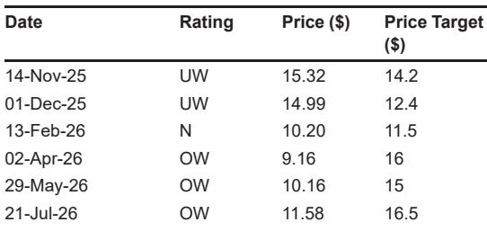
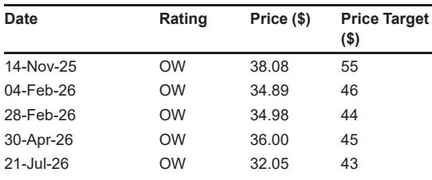

# 关于现制饮品行业的一份观察笔记

一份来自行业研究机构的专家交流纪要，提供了一个少见的视角：一位在五个省份运营49家瑞幸、3家茶颜悦色和2家蜜雪冰城的加盟商，对当前竞争态势的判断。报告的核心信号是，瑞幸正在经历一场“有代价的修复”——平均售价和毛利率在回升，但劳动力成本、SKU复杂度和回本周期在同步拉长。

这位加盟商管理的49家瑞幸门店，今年迄今GMV同比下降10%至15%。下滑并非完全来自需求调整，也来自瑞幸自身加密开店和同业竞争。但一个值得注意的变化是，杯量虽然下降，平均售价却在回升。报告归因于三个因素：9.9元促销减少、外卖平台定价提高、以及新品推动的消费升级。外卖占比已从去年价格战期间最高80%回落至约50%，加盟商认为进一步下降空间有限，因为消费者外卖习惯已经固化。

门店毛利率在2026年第二季度恢复到约35%，而去年价格战期间这一数字在28%至45%之间大幅波动。但毛利率改善并未完全转化为净利率提升。更高的用工需求、社保成本上升、产品复杂度增加以及损耗，正在抵消大部分收益。加盟商估算，每家门店每月新增劳动力成本约4000至5000元人民币，相当于每年6至7万元，可能对净利率造成1至2个百分点的影响。按日均300杯计算的社区门店，回本周期现在需要3年或更长。

> **观察评论：** 35%的门店毛利率和3年回本周期，这两个数字放在一起看更有意义。毛利率已经回到行业正常区间，但回本周期拉长意味着加盟商对新开店的意愿会自然降温，这反过来可能缓解瑞幸自身的同店分流不确定性。

非咖啡饮品正在成为瑞幸的增长杠杆，但加盟商态度并不积极。非咖啡产品今年迄今占总GMV约30%，随着网络密度增加和低线城市渗透率提升，长期可能升至40%至50%。然而，这些产品对鲜果使用和人工操作的要求更高，增加了门店运营复杂度。同样，瑞幸通过更多定制选项和精品咖啡豆选择来提升客单价，但更宽的SKU组合也带来了更高的库存损失和损耗。

茶颜悦色的表现正在企稳，但加盟商单位宏观环境模型仍是核心问题。报告显示，茶颜悦色近期GMV下滑幅度收窄，得益于更频繁的新品推出和更慢的门店扩张。新推出的冰淇淋业务在河北和天津仅开设了7家门店，每家约15万元人民币的资本开支被加盟商认为偏高。茶颜悦色门店宏观环境呈现高度季节性：7月旺季单月GMV可超过40万元，门店利润率约15%至16%；淡季GMV降至20至30万元，利润率下滑至8%至9%。加盟商认为当前抽成比例仍然过高，可以进一步优化为阶梯式利润分享机制。

蜜雪冰城的咖啡策略被报告描述为“防御性”。这位加盟商管理的蜜雪冰城门店因位于低线城市，尚未安装咖啡机。他认为蜜雪冰城推动门店配备咖啡机，部分原因是幸运咖的盈利状况不佳——约70%的幸运咖加盟商处于亏损状态。他还观察到，消费者向下替代的意愿有限：许多消费者宁愿多花2至3元购买瑞幸，也不愿选择价格更低的幸运咖咖啡。

这份报告的价值不在于给出一个简单的“谁赢谁输”的判断，而在于揭示了现制饮品行业当前最真实的矛盾：头部品牌在修复定价和毛利率，但修复的成本正在向加盟商转移。瑞幸的竞争领先地位仍然稳固——加盟商将其相对于库迪的优势归结为更专业的加盟开发和管理体系——但门店层面的执行不确定性正在累积。茶颜悦色需要解决加盟商利润模型的高度波动性。蜜雪冰城则面临咖啡子品牌盈利不足、消费者不愿向下替代的双重困境。

For informational purposes only. Portions may be generated,translated,summarized,or edited with AI assistance based on source materials and may contain omissions or errors. Please verify independently. This is not investment,legal,tax,accounting,or other professional advice.

For informational purposes only. Portions may be generated,translated,summarized,or edited with AI assistance based on source materials and may contain omissions or errors. Please verify independently. This is not investment,legal,tax,accounting,or other professional advice.

