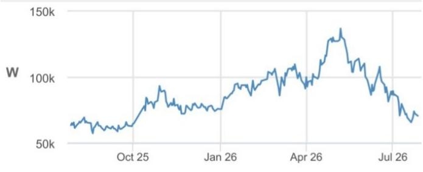
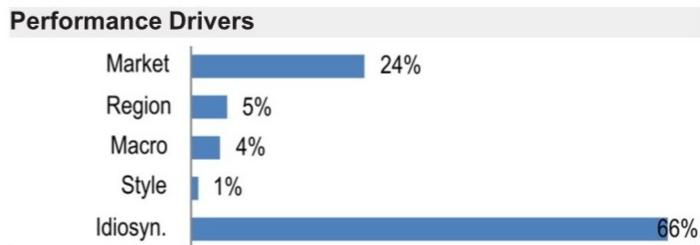
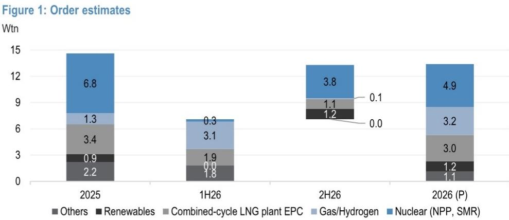

# 研究笔记

## Doosan Enerbility

## 第二季度表现符合预期；订单进展顺利，燃气轮机订单强劲；Doosan 为行业首选

Doosan Enerbility 第二季度营业利润为 3140 亿韩元，高于市场预期（JPMe/BBGe 分别为 2830 亿/2790 亿韩元），主要得益于 Bobcat 在北美建筑设备需求稳健背景下的超预期贡献；母公司营业利润为 970 亿韩元，基本符合预期（略低于 JPMe 的 1050 亿韩元）。母公司第二季度订单接收额为 4.3 万亿韩元，全年订单目标 13.3 万亿韩元（完成率 53%），主要由燃气轮机相关订单推动（已完成 5.0 万亿韩元，全年目标 6.2 万亿韩元，含联合循环燃气 EPC）。上半年燃气轮机订单合计 12 台燃气轮机、6 台蒸汽轮机和 5 份长期服务协议，管理层提及供应紧张以及 2030-31 年交付窗口的高可见度谈判。核电方面评论积极（韩国第 12 次基本计划预计年底前公布；美国长周期订单可见度），而小型模块化反应堆仍是关键关注点，因约 1 万亿韩元的年度目标需在下半年实现。

- **第二季度营业利润超预期，Bobcat 贡献显著；母公司基本符合预期，燃气轮机引领订单。** Doosan 第二季度营业利润为 3140 亿韩元，高于 JPMe/BBGe（2830 亿/2790 亿韩元），主要得益于 Doosan Bobcat 在美国建筑设备需求稳健背景下的超预期贡献。母公司营业利润为 970 亿韩元，略低于 JPMe（1050 亿韩元）。母公司第二季度订单接收额为 4.3 万亿韩元，公司全年订单目标 13.3 万亿韩元（完成率 53%），由强劲的燃气轮机相关订单推动（已完成 5.0 万亿韩元，全年目标 6.2 万亿韩元，含联合循环燃气电厂 EPC）。我们认为下半年增量燃气轮机订单可能为全年订单带来上行空间，而主要下行风险集中于小型模块化反应堆，管理层约 1 万亿韩元的年度订单目标需在下半年实现。

- **燃气轮机最新动态。** Doosan 上半年获得 12 台燃气轮机、6 台蒸汽轮机和 5 份长期服务协议订单，同时维持 2030 年累计 71 台、2034 年累计 110 台的目标。管理层提及 2030-31 年交付窗口的高可见度谈判，并预计未来五年供应将持续紧张，尽管生产排期紧凑，仍将支撑额外订单动能。

- **核电最新动态。** 在韩国，管理层预计第 12 次基本计划将于年底前公布，西南大型项目（支持半导体晶圆厂和数据中心建设）可能带来上行空间。在美国，管理层预计今年将从西屋电气项目获得长周期材料订单。在小型模块化反应堆方面，公司目标在下半年获得 NuScale 订单，同时与其他小型模块化反应堆设计公司就长周期材料供应和主要子组件订单的讨论仍在继续。

- **维持积极展望。** 我们上调 2026-28 年营业利润预期 1-7%，主要反映第二季度业绩后对 Bobcat 的上调。Doosan 仍是核电 EPC 覆盖范围内的首选，其订单簿持续扩大，并在大型核电、小型模块化反应堆和燃气轮机之间拥有均衡的业务组合。我们认为韩国对美投资公告是关键的行业催化剂，Doosan 有望在不同情景下受益。

## 积极展望

034020.KS, 034020 KS  
价格（2026年7月27日）：70,600 韩元  
目标价（2027年12月）：130,000 韩元

韩国汽车、电动汽车电池、核电及公用事业

Sonny Lee AC (82-2) 758 5716 sonny.lee@JPM.com

Seri Yoon  
(82-2) 758 5704  
seri.yoon@JPM.com  
JPM Securities (Far East) Limited, Seoul Branch

<table><tr><td colspan="4">主要变化（财年截至12月）</td></tr><tr><td></td><td>此前</td><td>当前</td><td>变化</td></tr><tr><td>调整后每股收益 - 2026E (韩元)</td><td>512</td><td>628</td><td>22.8%</td></tr></table>

<table><tr><td colspan="4">调整后每股收益 (韩元)</td></tr><tr><td></td><td>2025A</td><td>2026E</td><td>2027E</td></tr><tr><td>第一季度</td><td>(107)</td><td>1A</td><td>163</td></tr><tr><td>第二季度</td><td>204</td><td>246</td><td>246</td></tr><tr><td>第三季度</td><td>(78)</td><td>187</td><td>266</td></tr><tr><td>第四季度</td><td>114</td><td>194</td><td>372</td></tr><tr><td>全年</td><td>132</td><td>628</td><td>1,048</td></tr></table>

## 风格暴露

<table><tr><td rowspan="2">量化因子</td><td rowspan="2">当前 %排名</td><td colspan="4">历史 %排名 (1=最高)</td></tr><tr><td>6个月</td><td>1年</td><td>3年</td><td>5年</td></tr><tr><td>价值</td><td>95</td><td>90</td><td>91</td><td>67</td><td>47</td></tr><tr><td>成长</td><td>18</td><td>73</td><td>50</td><td>14</td><td>55</td></tr><tr><td>动量</td><td>89</td><td>36</td><td>11</td><td>53</td><td>1</td></tr><tr><td>质量</td><td>85</td><td>86</td><td>80</td><td>13</td><td>100</td></tr><tr><td>低波动</td><td>78</td><td>82</td><td>78</td><td>83</td><td>100</td></tr><tr><td>ESGQ</td><td>15</td><td>18</td><td>87</td><td>97</td><td>-</td></tr></table>

价格表现  
  
— 034020.KS 价格 (韩元)

<table><tr><td></td><td>年初至今</td><td>1个月</td><td>3个月</td><td>12个月</td></tr><tr><td>相对</td><td>-6.9%</td><td>-13.3%</td><td>-45.3%</td><td>7.1%</td></tr></table>

<table><tr><td colspan="2">公司数据</td></tr><tr><td>流通股数 (百万)</td><td>641</td></tr><tr><td>52周价格区间 (韩元)</td><td>139,200-51,100</td></tr><tr><td>市值 (百万美元)</td><td>30,996</td></tr><tr><td>汇率</td><td>1,459.00</td></tr><tr><td>自由流通比例 (%)</td><td>61.5%</td></tr><tr><td>3个月日均成交量 (百万)</td><td>7.16</td></tr><tr><td>3个月日均成交额 (百万美元)</td><td>503.9</td></tr><tr><td>波动率 (90天)</td><td>77</td></tr><tr><td>指数</td><td>KOSPI</td></tr><tr><td>彭博分析师评级 (买入 | 持有 | 卖出)</td><td>24|0|0</td></tr></table>

关键指标（财年截至12月）

<table><tr><td>单位：十亿韩元</td><td>FY25A</td><td>FY26E</td><td>FY27E</td><td>FY28E</td></tr><tr><td colspan="5">财务预测</td></tr><tr><td>收入</td><td>17,058</td><td>17,458</td><td>19,243</td><td>22,571</td></tr><tr><td>调整后 EBITDA</td><td>1,320</td><td>1,778</td><td>2,266</td><td>2,770</td></tr><tr><td>调整后 EBIT</td><td>763</td><td>1,194</td><td>1,575</td><td>2,081</td></tr><tr><td>调整后净利润</td><td>85</td><td>402</td><td>671</td><td>990</td></tr><tr><td>调整后每股收益</td><td>132</td><td>628</td><td>1,048</td><td>1,545</td></tr><tr><td>彭博每股收益</td><td>165</td><td>516</td><td>925</td><td>1,336</td></tr><tr><td>经营活动现金流</td><td>752</td><td>815</td><td>1,592</td><td>1,893</td></tr><tr><td>FCFF</td><td>349</td><td>115</td><td>892</td><td>1,143</td></tr><tr><td colspan="5">利润率与增长</td></tr><tr><td>收入同比增长 (%)</td><td>5.1%</td><td>2.3%</td><td>10.2%</td><td>17.3%</td></tr><tr><td>EBITDA 利润率</td><td>7.7%</td><td>10.2%</td><td>11.8%</td><td>12.3%</td></tr><tr><td>EBITDA 同比增长 (%)</td><td>(12.5%)</td><td>34.7%</td><td>27.4%</td><td>22.2%</td></tr><tr><td>EBIT 利润率</td><td>4.5%</td><td>6.8%</td><td>8.2%</td><td>9.2%</td></tr><tr><td>净利润率</td><td>0.5%</td><td>2.3%</td><td>3.5%</td><td>4.4%</td></tr><tr><td>调整后每股收益增长</td><td>(23.9%)</td><td>374.8%</td><td>66.8%</td><td>47.5%</td></tr><tr><td colspan="5">比率</td></tr><tr><td>调整后税率</td><td>37.2%</td><td>32.7%</td><td>27.5%</td><td>27.5%</td></tr><tr><td>利息覆盖倍数</td><td>5.5</td><td>8.1</td><td>11.3</td><td>14.7</td></tr><tr><td>净债务/权益</td><td>0.2</td><td>0.2</td><td>0.1</td><td>0.1</td></tr><tr><td>净债务/EBITDA</td><td>2.0</td><td>1.4</td><td>0.7</td><td>0.4</td></tr><tr><td>ROCE</td><td>3.6%</td><td>5.9%</td><td>8.0%</td><td>9.8%</td></tr><tr><td>ROE</td><td>1.1%</td><td>5.0%</td><td>7.9%</td><td>10.6%</td></tr><tr><td colspan="5">估值</td></tr><tr><td>FCFF 回报表现</td><td>0.8%</td><td>0.3%</td><td>2.0%</td><td>2.5%</td></tr><tr><td>股息回报表现</td><td>0.0%</td><td>0.0%</td><td>0.0%</td><td>0.0%</td></tr><tr><td>EV/收入</td><td>3.0</td><td>3.5</td><td>3.0</td><td>2.5</td></tr><tr><td>EV/EBITDA</td><td>38.4</td><td>34.4</td><td>25.1</td><td>20.1</td></tr><tr><td>调整后市盈率</td><td>533.5</td><td>112.4</td><td>67.4</td><td>45.7</td></tr></table>

## 投资主题与估值总结

## 投资主题

Doosan Enerbility 全年订单目标 13.3 万亿韩元进展顺利，主要由强劲的燃气轮机订单推动。上半年燃气轮机订单合计 12 台燃气轮机、6 台蒸汽轮机和 5 份长期服务协议，管理层提及供应紧张以及 2030-31 年交付窗口的高可见度谈判。管理层对核电的评论积极（韩国第 12 次基本计划预计年底前公布；美国长周期订单可见度），而小型模块化反应堆仍是关键关注点，因约 1 万亿韩元的年度目标需在下半年实现。

## 估值

我们的 2027 年 12 月目标价 130,000 韩元基于分部加总估值法，其中核心业务采用上行周期倍数 1.9 倍 2028E 价格/订单簿。

<table><tr><td>因子</td><td>6个月相关性</td><td>1年相关性</td></tr><tr><td>市场：MSCI 亚太（除日本）</td><td>0.60</td><td>0.49</td></tr><tr><td>地区：韩国</td><td>0.06</td><td>0.26</td></tr><tr><td colspan="3">宏观：</td></tr><tr><td>JPM 中国 A 股情绪</td><td>0.08</td><td>0.15</td></tr><tr><td>新兴央行利率</td><td>0.07</td><td>0.11</td></tr><tr><td>JPM 新兴市场预测修正</td><td>-0.06</td><td>-0.10</td></tr><tr><td colspan="3">量化风格：</td></tr><tr><td>成长</td><td>0.03</td><td>-0.14</td></tr><tr><td>质量</td><td>-0.26</td><td>-0.11</td></tr><tr><td>低波动</td><td>-0.06</td><td>0.11</td></tr></table>

表 1：Doosan：2026 年第二季度回顾 单位：十亿韩元，%

<table><tr><td rowspan="2"></td><td colspan="5">2026年第二季度</td><td rowspan="2">2025年第二季度</td><td rowspan="2">同比</td><td rowspan="2">2026年第一季度</td><td rowspan="2">环比</td></tr><tr><td>实际</td><td>JPMe</td><td>BBG</td><td>vs. JPMe</td><td>vs. BBG</td></tr><tr><td>收入</td><td>4,725</td><td>4,487</td><td>4,691</td><td>5%</td><td>1%</td><td>4,569</td><td>3%</td><td>4,261</td><td>11%</td></tr><tr><td>母公司</td><td>2,233</td><td>2,099</td><td></td><td>6%</td><td></td><td>2,268</td><td>-2%</td><td>1,896</td><td>18%</td></tr><tr><td>Bobcat</td><td>2,448</td><td>2,327</td><td></td><td>5%</td><td></td><td>2,237</td><td>9%</td><td>2,247</td><td>9%</td></tr><tr><td>燃料电池</td><td>44</td><td>135</td><td></td><td>-67%</td><td></td><td>128</td><td>-66%</td><td>145</td><td>-69%</td></tr><tr><td>营业利润</td><td>314</td><td>283</td><td>279</td><td>11%</td><td>13%</td><td>271</td><td>16%</td><td>234</td><td>35%</td></tr><tr><td>母公司</td><td>97</td><td>105</td><td></td><td>-7%</td><td></td><td>92</td><td>5%</td><td>57</td><td>71%</td></tr><tr><td>Bobcat</td><td>292</td><td>209</td><td></td><td>39%</td><td></td><td>208</td><td>41%</td><td>207</td><td>41%</td></tr><tr><td>燃料电池</td><td>-51</td><td>0</td><td></td><td>n.m.</td><td></td><td>-2</td><td>n.m.</td><td>-1</td><td>n.m.</td></tr><tr><td>营业利润率</td><td>6.7%</td><td>6.3%</td><td>5.9%</td><td></td><td></td><td>5.9%</td><td></td><td>5.5%</td><td></td></tr><tr><td>净利润</td><td>226</td><td>163</td><td>64</td><td>38%</td><td>252%</td><td>198</td><td>14%</td><td>60</td><td>276%</td></tr><tr><td>净利润率</td><td>4.8%</td><td>3.6%</td><td>1.4%</td><td></td><td></td><td>4.3%</td><td></td><td>1.4%</td><td></td></tr></table>

来源：公司数据，彭博金融信息，JPM 预测。

  
来源：公司数据

表 2：Doosan：预测修正 单位：十亿韩元，%

<table><tr><td rowspan="2"></td><td colspan="3">2026E</td><td colspan="3">2027E</td><td colspan="3">2028E</td></tr><tr><td>此前</td><td>当前</td><td>变化</td><td>此前</td><td>当前</td><td>变化</td><td>此前</td><td>当前</td><td>变化</td></tr><tr><td>销售额</td><td>17,060</td><td>17,458</td><td>2%</td><td>19,240</td><td>19,243</td><td>0%</td><td>22,484</td><td>22,571</td><td>0%</td></tr><tr><td>营业利润</td><td>1,119</td><td>1,194</td><td>7%</td><td>1,542</td><td>1,575</td><td>2%</td><td>2,065</td><td>2,081</td><td>1%</td></tr><tr><td>营业利润率</td><td>6.6%</td><td>6.8%</td><td></td><td>8.0%</td><td>8.2%</td><td></td><td>9.2%</td><td>9.2%</td><td></td></tr><tr><td>净利润</td><td>585</td><td>679</td><td>16%</td><td>972</td><td>997</td><td>3%</td><td>1,359</td><td>1,372</td><td>1%</td></tr><tr><td>净利润率</td><td>3.4%</td><td>3.9%</td><td></td><td>5.1%</td><td>5.2%</td><td></td><td>6.0%</td><td>6.1%</td><td></td></tr><tr><td>归属母公司净利润</td><td>328</td><td>402</td><td>23%</td><td>670</td><td>671</td><td>0%</td><td>990</td><td>990</td><td>0%</td></tr></table>

来源：JPM 预测。

表 3：Doosan：主要财务数据摘要  
Doosan：主要财务数据摘要

<table><tr><td></td><td>2023</td><td>2024</td><td>2025</td><td>2026E</td><td>2027E</td><td>2028E</td><td>2029E</td></tr><tr><td>订单簿：核心业务</td><td>16,050</td><td>16,004</td><td>23,244</td><td>29,196</td><td>38,272</td><td>44,012</td><td>48,875</td></tr><tr><td>新订单接收：核心业务</td><td>8,886</td><td>7,133</td><td>14,728</td><td>13,700</td><td>18,200</td><td>17,700</td><td>18,200</td></tr><tr><td colspan="8">财务数据</td></tr><tr><td>销售收入</td><td>17,590</td><td>16,233</td><td>17,058</td><td>17,458</td><td>19,243</td><td>22,571</td><td>24,464</td></tr><tr><td>同比</td><td>14%</td><td>-8%</td><td>5%</td><td>2%</td><td>10%</td><td>17%</td><td>8%</td></tr><tr><td>Doosan Enerbility</td><td>7,652</td><td>7,367</td><td>7,882</td><td>7,748</td><td>9,124</td><td>11,960</td><td>13,337</td></tr><tr><td>Doosan Fuelcell</td><td>261</td><td>412</td><td>455</td><td>427</td><td>499</td><td>509</td><td>519</td></tr><tr><td>Doosan Bobcat</td><td>9,701</td><td>8,502</td><td>8,829</td><td>9,460</td><td>9,933</td><td>10,430</td><td>10,951</td></tr><tr><td>营业利润</td><td>1,467</td><td>1,018</td><td>763</td><td>1,194</td><td>1,575</td><td>2,081</td><td>2,249</td></tr><tr><td>Doosan Enerbility</td><td>225</td><td>244</td><td>302</td><td>408</td><td>724</td><td>1,086</td><td>1,211</td></tr><tr><td>Doosan Fuelcell</td><td>2</td><td>-2</td><td>-105</td><td>-64</td><td>-17</td><td>0</td><td>0</td></tr><tr><td>Doosan Bobcat</td><td>1,381</td><td>865</td><td>690</td><td>975</td><td>1,043</td><td>1,227</td><td>1,288</td></tr><tr><td>营业利润率</td><td>8%</td><td>6%</td><td>4%</td><td>7%</td><td>8%</td><td>9%</td><td>9%</td></tr><tr><td>Doosan Enerbility</td><td>3%</td><td>3%</td><td>4%</td><td>5%</td><td>8%</td><td>9%</td><td>9%</td></tr><tr><td>Doosan Fuelcell</td><td>1%</td><td>0%</td><td>-23%</td><td>-15%</td><td>-3%</td><td>0%</td><td>0%</td></tr><tr><td>Doosan Bobcat</td><td>14%</td><td>10%</td><td>8%</td><td>10%</td><td>11%</td><td>12%</td><td>12%</td></tr><tr><td>净利润</td><td>518</td><td>395</td><td>205</td><td>679</td><td>997</td><td>1,372</td><td>1,509</td></tr><tr><td>净利润率</td><td>3%</td><td>2%</td><td>1%</td><td>4%</td><td>5%</td><td>6%</td><td>6%</td></tr><tr><td>归属母公司净利润</td><td>56</td><td>111</td><td>85</td><td>402</td><td>671</td><td>990</td><td>1,107</td></tr></table>

来源：公司数据，JPM 预测。

<table><tr><td>2025年第一季度</td><td>2025年第二季度</td><td>2025年第三季度</td><td>2025年第四季度</td><td>2026年第一季度</td><td>2026年第二季度E</td><td>2026年第三季度E</td><td>2026年第四季度E</td></tr><tr><td colspan="4"></td><td colspan="4"></td></tr><tr><td>3,749</td><td>4,569</td><td>3,880</td><td>4,860</td><td>4,261</td><td>4,725</td><td>4,153</td><td>4,319</td></tr><tr><td>-9%</td><td>10%</td><td>14%</td><td>6%</td><td>14%</td><td>3%</td><td>7%</td><td>-11%</td></tr><tr><td>1,576</td><td>2,268</td><td>1,678</td><td>2,360</td><td>1,896</td><td>2,233</td><td>1,860</td><td>1,760</td></tr><tr><td>100</td><td>128</td><td>91</td><td>136</td><td>145</td><td>44</td><td>95</td><td>143</td></tr><tr><td>2,054</td><td>2,237</td><td>2,161</td><td>2,377</td><td>2,247</td><td>2,448</td><td>2,269</td><td>2,496</td></tr><tr><td>142</td><td>271</td><td>137</td><td>212</td><td>234</td><td>314</td><td>317</td><td>329</td></tr><tr><td>-1</td><td>92</td><td>43</td><td>168</td><td>57</td><td>97</td><td>130</td><td>123</td></tr><tr><td>-12</td><td>-2</td><td>-16</td><td>-76</td><td>-1</td><td>-51</td><td>-5</td><td>-7</td></tr><tr><td>196</td><td>208</td><td>138</td><td>148</td><td>207</td><td>292</td><td>227</td><td>250</td></tr><tr><td>4%</td><td>6%</td><td>4%</td><td>4%</td><td>5%</td><td>7%</td><td>8%</td><td>8%</td></tr><tr><td>0%</td><td>4%</td><td>3%</td><td>7%</td><td>3%</td><td>4%</td><td>7%</td><td>7%</td></tr><tr><td>-12%</td><td>-1%</td><td>-17%</td><td>-56%</td><td>-1%</td><td>-115%</td><td>-5%</td><td>-5%</td></tr><tr><td>10%</td><td>9%</td><td>6%</td><td>6%</td><td>9%</td><td>12%</td><td>10%</td><td>10%</td></tr><tr><td>-21</td><td>198</td><td>-24</td><td>53</td><td>60</td><td>226</td><td>191</td><td>202</td></tr><tr><td>-1%</td><td>4%</td><td>-1%</td><td>1%</td><td>1%</td><td>5%</td><td>5%</td><td>5%</td></tr><tr><td>-69</td><td>131</td><td>-50</td><td>73</td><td>1</td><td>158</td><td>120</td><td>124</td></tr></table>

# 投资主题、估值与风险

Doosan Enerbility（积极展望；目标价：130,000 韩元）

## 投资主题

Doosan Enerbility 全年订单目标 13.3 万亿韩元进展顺利，主要由强劲的燃气轮机订单推动。上半年燃气轮机订单合计 12 台燃气轮机、6 台蒸汽轮机和 5 份长期服务协议，管理层提及供应紧张以及 2030-31 年交付窗口的高可见度谈判。管理层对核电的评论积极（韩国第 12 次基本计划预计年底前公布；美国长周期订单可见度），而小型模块化反应堆仍是关键关注点，因约 1 万亿韩元的年度目标需在下半年实现。

## 估值

我们的 2027 年 12 月目标价 130,000 韩元基于分部加总估值法，其中核心业务采用上行周期倍数 1.9 倍 2028E 价格/订单簿。

## Doosan：目标价推导

单位：十亿韩元，韩元，倍

<table><tr><td colspan="2"></td><td>价值</td><td>备注</td></tr><tr><td>Doosan Enerbility</td><td>(a)</td><td>83,623</td><td></td></tr><tr><td>2028E 订单簿</td><td></td><td>44,012</td><td>仅 Enerbility 订单簿</td></tr><tr><td>目标价/订单簿</td><td></td><td>1.9倍</td><td>上行周期倍数</td></tr><tr><td>研究价值</td><td>(b)</td><td>4,317</td><td></td></tr><tr><td>Doosan Bobcat</td><td></td><td>2,969</td><td>48.2% 持股 x 市值</td></tr><tr><td>Doosan Fuelcell</td><td></td><td>618</td><td>30.3% 持股 x 市值</td></tr><tr><td>Doosan Skoda Power</td><td></td><td>730</td><td>67.0% 持股 x 市值</td></tr><tr><td>研究价值折让</td><td>(c)</td><td>50%</td><td></td></tr><tr><td>目标市值</td><td>(a)+(b)x(1-c)</td><td>85,782</td><td></td></tr><tr><td>目标价</td><td></td><td>130,000</td><td></td></tr></table>

来源：彭博金融信息，JPM 预测

## 评级与目标价风险

评级与目标价的主要下行风险包括：1）预期的大型核电项目可能出现延迟；2）若干小型模块化反应堆客户进展出现不利变化（例如审批或技术问题）。

来源：公司报告及 JPM 预测。

Doosan Enerbility：财务数据摘要

<table><tr><td>利润表</td><td>FY25A</td><
