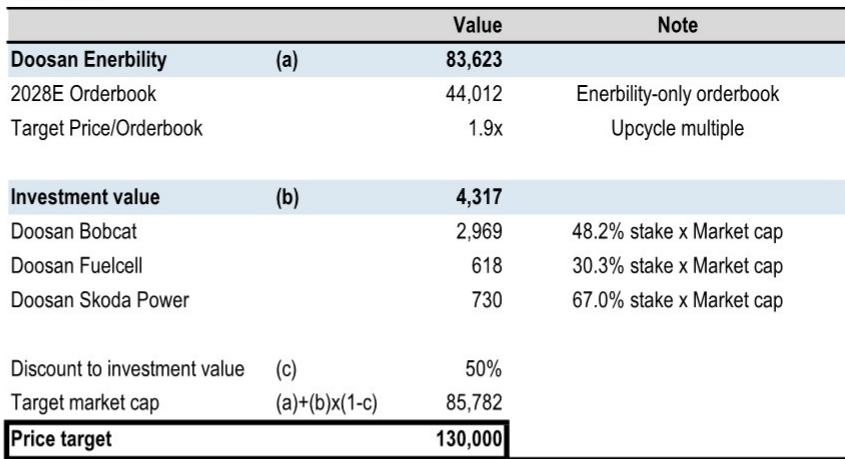
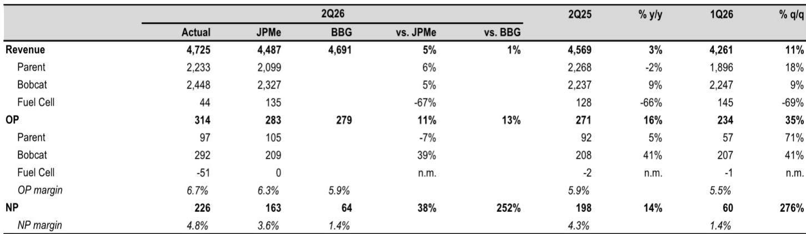

# Doosan Enerbility 的多重增长引擎：燃气轮机与Bobcat正驱动市场尚未充分定价的转折点

Doosan Enerbility 公布2026年第二季度营业利润为3140亿韩元，显著高于市场共识预期的2790亿韩元及投行自身预测的2830亿韩元。这一超预期表现并非来自此前备受关注的核电业务，而是来自建筑设备子公司Doosan Bobcat——其贡献了2920亿韩元营业利润，远超预期的2090亿韩元。母公司层面，970亿韩元营业利润略低于1050亿韩元的预期，但整体业绩超预期凸显了一个关键点：公司盈利轨迹正由比当前市场定价更广泛的引擎所塑造。

市场一直聚焦于核电和小型模块化反应堆（SMR）叙事，但本季度的数据揭示了盈利转折点实际发生的不同图景。燃气轮机订单的节奏表明全年指引可能偏保守。Bobcat在美国建筑设备需求中的韧性提供了大多数分析师低估的底部支撑。虽然核电催化剂仍然重要，但它们并非当前推动盈利修正的主要驱动力。投行已将2026-2028年营业利润预期上调1-7%，其中最大幅度的上调来自Bobcat板块。

这不是一家等待单一催化剂的公司。它拥有多元化的订单簿、多年的积压订单以及多个已在运转的盈利驱动因素。对于观察者而言，问题在于当前估值是否充分反映了这些趋势的复合效应。

## 燃气轮机订单周期已进入结构性上升，而非周期性波动

Doosan母公司第二季度订单接收额达4.3万亿韩元，上半年总量已达到全年指引13.3万亿韩元的53%。订单构成比总量更重要。仅燃气轮机相关订单就已达到5.0万亿韩元，而全年目标为6.2万亿韩元，这意味着公司在六个月内已完成年度燃气轮机订单目标的81%。

基础数据证实了这一趋势正在加速。仅上半年，Doosan就获得了12台燃气轮机、6台蒸汽轮机和5份长期服务协议的订单。管理层维持了到2030年累计71台、到2034年累计110台的目标，但上半年的订单节奏表明这些目标可能偏保守。更重要的是，管理层明确指出供应紧张，且2030-2031年交付时段的谈判已进入后期阶段，可见度很高。这不是一两个季度就会消退的需求激增。它反映了全球燃气轮机制造能力的结构性短缺，而Doosan是少数能够填补这一空白的供应商之一。

对盈利的影响是直接的。燃气轮机订单具有多年的收入确认周期。今天记录的订单将在未来数年通过利润表体现，形成可见且复合的收入流，而这尚未完全反映在共识预期中。投行的预期修正已部分捕捉了这一提升，但如果下半年燃气轮机订单保持当前速度，上行风险仍然存在。

## Bobcat：市场忽视的盈利引擎，其贡献不容忽视

Doosan Bobcat第二季度贡献了2920亿韩元营业利润，而投行预期为2090亿韩元。这一39%的超预期并非一次性事件。Bobcat的营业利润已连续三个季度保持在2000亿韩元以上，利润率从第一季度的9%扩大至第二季度的12%。尽管存在工业活动放缓的广泛叙事，美国建筑设备需求仍保持韧性，Bobcat在紧凑型设备领域的市场地位使其对基础设施和非住宅建筑支出具有差异化敞口。

投行将2026年营业利润预期上调了7%，其中最大的驱动因素来自Bobcat。母公司层面的能源业务仅出现小幅预期调整。这是一个关键细节。那些主要将Doosan Enerbility视为核电或燃气轮机故事的观察者，可能忽视Bobcat约占合并收入的一半以及利润的更大比例。第二季度，Bobcat贡献了总营业利润的93%，同时贡献了52%的收入。

Bobcat面临的风险是美国经济衰退导致建筑设备需求大幅下降。当前预期并未计入这一情景，投行的预测假设了持续韧性。但第二季度的超预期表明，即使需求放缓，下行幅度可能小于担忧。只要美国经济避免急剧收缩，Bobcat的利润率仍有空间，且子公司的现金生成能力为母公司的投资周期提供了缓冲。

## 核电与SMR：真实但时机不确定的催化剂，上行空间集中在后期

管理层对核电的评论是建设性的，但缺乏燃气轮机前景所具备的近期确定性。在韩国，第12次电力供应基本计划预计年底前出台，而支持半导体晶圆厂和数据中心建设的西南大型项目代表着潜在上行空间。在美国，管理层认为今年西屋电气项目的长周期材料订单具有可见度，这将是公司核电设备业务向前迈出的切实一步。

小型模块化反应堆仍是最受关注但确定性最低的驱动因素。Doosan的目标是在2026年下半年获得NuScale订单，并正在与其他SMR设计公司就长周期材料供应和主要子组件订单进行持续讨论。但公司年度SMR订单目标约为1万亿韩元，该目标尚未实现。下半年将是决定性的。如果Doosan未能获得有意义的SMR订单，其核电溢价可能压缩。如果成功，订单簿和估值的上行空间可能相当可观。

投行的分类加总估值对2028年核心业务订单簿（44万亿韩元）采用1.9倍市净率，并对子公司研究价值应用50%的折价。该折价反映了控股公司结构以及核电和SMR时机的不确定性。目标价为70,600韩元，但这一回报取决于订单簿按预期复合增长以及折价随着催化剂实现而收窄。

## 观察框架：三种情景，一种不对称结果

当前格局适用于一个三情景框架，以阐明风险回报计算。

在基准情景中，燃气轮机订单保持当前速度，Bobcat利润率维持在10-11%附近，核电催化剂按计划推进，第12次基本计划和美国长周期订单实现。在此情景下，投行的盈利转折点得以实现。这是当前预期反映的情景，不需要SMR有任何超常表现。

在乐观情景中，燃气轮机订单因供应紧张进一步加速，Bobcat利润率因美国需求持续而超预期上行，Doosan在下半年获得1万亿韩元SMR目标。在此情景下，订单簿增长快于预期，盈利修正复合增长，控股公司折价随着SMR可见度提高而收窄。

在悲观情景中，美国经济衰退打击Bobcat盈利，燃气轮机订单下半年放缓，SMR订单未能实现。在此情景下，盈利转折点延迟，订单簿增长停滞，股价向资产基础回落。下行风险真实存在，但受公司订单积压和燃气轮机结构性需求的限制。

不对称性很明显。基准情景和乐观情景都提供显著上行空间，而悲观情景则被现有订单簿以及Bobcat和燃气轮机的多元化部分对冲。SMR的期权价值是免费的看涨期权。如果实现，回报将被放大。如果没有，其余业务仍支撑当前估值。

## 盈利转折点已在财务数据中显现，市场尚未定价

财务预测讲述了一家处于转型期的公司的故事。收入预计从2025年的17.1万亿韩元增长至2028年的22.6万亿韩元，年复合增长率约10%。但利润率扩张更为显著。营业利润率预计同期从4.5%扩大至9.2%，驱动因素来自订单簿转化过程中向高利润率燃气轮机和核电设备收入的组合转变。每股收益预计从2025年的132韩元增长至2028年的1,545韩元，增长近12倍。

这些数字并非空想。它们基于已到位的订单簿和基本可见的生产计划。投行在第二季度后的预期修正幅度不大，表明超预期来自Bobcat而非核心业务的基本面重估。这意味着随着燃气轮机订单持续流入以及核电管道变得更加清晰，进一步的预期修正很可能发生。

当前超过500倍的滚动市盈率没有意义，因为它反映了盈利低谷年份。2026年预期市盈率112倍仍然较高，但到2027年降至67倍，到2028年降至46倍。这一压缩是股价实现回报的机制。市场正在定价转折点，但并未定价随之而来的复合增长。

Doosan Enerbility 不是对单一技术或单一市场的投机性押注。它是一家多元化的工业公司，拥有多年的订单周期、燃气轮机的结构性供应优势、韧性的设备业务以及真实但尚未定价的核电期权。第二季度业绩证实盈利转折点正在发生，而非遥远的未来。市场的注意力一直放在错误的催化剂上。真正的故事已经体现在数据中。

*仅供参考。部分内容可能基于源材料通过AI辅助生成、翻译、总结或编辑，可能存在遗漏或错误。请独立核实。本文不构成专业建议。*

仅供参考。部分内容可能基于源材料通过AI辅助生成、翻译、总结或编辑，可能存在遗漏或错误。请独立核实。本文不构成专业建议。

