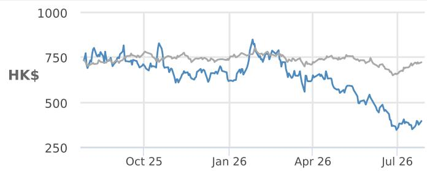
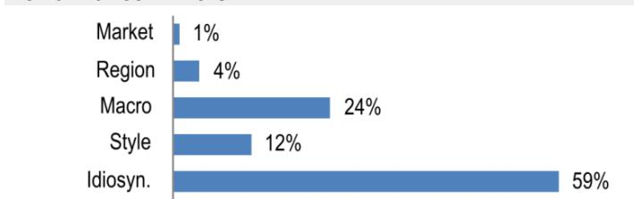

# Laopu Gold - H

## 2Q performance review; ongoing efforts to support 2H recovery

Laopu announced a 1H26 positive profit alert on 27 July (adjusted NP up 83-85%). Together with the pre-announced 1Q26 alert, this indicates 2Q earnings of Rmb510mn-760mn, below our baseline expectation of cRmb800mn and the market expectation of cRmb900mn-1bn. We think the difference was due mainly to: (1) likely lower-than-expected 2Q SSSG – we estimate 2Q SSS down 14-50% vs. our baseline of -20%; and (2) a likely lower-than-expected NPM of 19.2-22.2% vs. our baseline of 21.8%, as higher-than-expected expenses offset robust GPM (JPMe >45%) due to a relatively high fixed salary mix and increased investment into brand. That said, we highlight several objective factors that affected 2Q, including sales pulled forward into 1Q ahead of price increases, unexpected gold price volatility (falling 17% from peak to trough in 2Q) delaying purchase decisions, and elevated volatility in traditional weak season. We expect 2H to recover, supported by Laopu's active efforts to navigate the gold volatility since 2Q, including: (1) a more flexible strategy in new product launches; (2) further enhancement of consumer experience; and (3) upgrades in the channel network. We cut 2026E-28E earnings by 14-19% to factor in the impact of gold volatility on SSSG. Our revised DCF-based PT of HK\$1,064 implies a 19x 2027E P/E. We see Laopu as well positioned to benefit from experience-led growth with a systematic approach (disciplined store count, a DTC model and differentiated service quality, upheld by a highly selective/trained team).

\- Efforts to navigate gold volatility: (1) accelerated new product launches: Laopu announced 9 new collections in January-June, with the integration of more gemstones into designs (such as sapphire) and the introduction of new elements (such as prayer wheel and Greek cross) vs. 8 new collections announced in 2025 and 4 in 1H; (2) a lower threshold for gifts with purchase since April, e.g., threshold for 5g gold coin gifts down to ticket size >Rmb250k from Rmb500k; (3) enhanced experience, such as the optimization of after-sales service (separate queue for after-sales services currently vs. one queue for both purchase and after-sales services previously) and the enhancement of VIC management; and (4) channel upgrades, including upgrades of 8-12 domestic stores (better locations, such as Shanghai Plaza 66, taking over the former store space of Valentino on 2F), exhibitions of Laopu Classic Collections (e.g., exhibition in Shanghai IFC opened on 19 June), and 4-6 new overseas stores (mainly in 2H26).

\- 2026E sales/earnings +39%/+46% yoy, indicating 2H sales/earnings +19%/+7%, improving from 2Q. We expect top-line growth to be supported by: (1) ASP growth (2-3 price adjustments; product mix shift toward large-weight products); (2) the ramp-up of new boutiques (10 new boutiques in 2025, mostly after May) and the optimization of existing boutiques; (3) more frequent product launches; and (4) overseas expansion. We expect 1ppt NPM expansion, driven mainly by 5ppt GPM expansion, given Laopu's effective price adjustment mechanism, offsetting a 3.9ppt increase in the selling-expense-to-sales ratio, given the step up in brand investment.

## Overweight

6181.HK, 6181 HK

Price (27 Jul 26): HK\$396.40

Price Target (Dec-26): HK\$1,064.00
Prior (Dec-26): HK\$1,296.00

## China

## Consumer

Qian Yao AC
(86-21) 6106 6277
qian.q.yao@JPM.com
SAC Registration Number: S1730521050001

Carson Fan
(86-21) 6106-6294
rong.fan@JPM.com
SAC Registration Number: S1730522070002
JPM Securities (China) Company Limited

<table><tr><td colspan="4">Key Changes (FYE Dec)</td></tr><tr><td></td><td>Prev</td><td>Cur</td><td> $\Delta$ </td></tr><tr><td>Revenue - 26E (Rmb mn)</td><td>43,128</td><td>37,883</td><td>-12.2%</td></tr><tr><td>Revenue - 27E (Rmb mn)</td><td>54,666</td><td>44,765</td><td>-18.1%</td></tr></table>

Style Exposure

<table><tr><td rowspan="2">Quant Factors</td><td rowspan="2">Current %Rank</td><td colspan="4">Hist %Rank (1=Top)</td></tr><tr><td>6M</td><td>1Y</td><td>3Y</td><td>5Y</td></tr><tr><td>Value</td><td>5</td><td>49</td><td>59</td><td>87</td><td></td></tr><tr><td>Growth</td><td>6</td><td>1</td><td>1</td><td>57</td><td></td></tr><tr><td>Momentum</td><td>87</td><td>27</td><td>1</td><td></td><td></td></tr><tr><td>Quality</td><td>7</td><td>2</td><td>9</td><td>42</td><td></td></tr><tr><td>Low Vol</td><td>97</td><td>98</td><td>99</td><td></td><td></td></tr></table>

14 Jun 2026 Laopu: Underappreciated efforts to navigate the gold volatility; sensitivity analysis; attractive valuation

28 Apr 2026 Laopu: Resilient demand; likely no financial needs in the near term

24 Mar 2026 Laopu: Strategic resilience amid current gold market volatility

23 Mar 2026 Laopu: First Take

8 Mar 2026 China Jewelry & Sportswear: Takeaways from luxury expert call: gold jewelry and sportswear shine YTD

26 Feb 2026 Laopu: Robust CNY

5 Feb 2026 Laopu: The pre-CNY consumption glint; positive in 2026; top pick

18 Jan 2026 China Sports, Beauty & Jewelry: 2026: Seeking Alpha Led by Experience

Price Performance  

— 6181.HK Price (HK\$) HSI (rebased)

<table><tr><td></td><td>YTD</td><td>1m</td><td>3m</td><td>12m</td></tr><tr><td>Abs</td><td>-35.9%</td><td>6.8%</td><td>-30.5%</td><td>-48.2%</td></tr><tr><td>Rel</td><td>-34.2%</td><td>-4.3%</td><td>-27.7%</td><td>-46.8%</td></tr></table>

Company Data

<table><tr><td>Shares O/S (mn)</td><td>172</td></tr><tr><td>52-week range (HK$)</td><td>898.00-342.80</td></tr><tr><td>Market cap ($ mn)</td><td>8,680</td></tr><tr><td>Exchange rate</td><td>7.84</td></tr><tr><td>Free float (%)</td><td>34.6%</td></tr><tr><td>3M ADV (mn)</td><td>1.15</td></tr><tr><td>3M ADV ($ mn)</td><td>67.4</td></tr><tr><td>Volatility (90 Day)</td><td>62</td></tr><tr><td>Index</td><td>HSI</td></tr><tr><td>BBG ANR (Buy | Hold | Sell)</td><td>32|1|2</td></tr></table>

Key Metrics (FYE Dec)

<table><tr><td>Rmb in millions</td><td>FY25A</td><td>FY26E</td><td>FY27E</td><td>FY28E</td></tr><tr><td colspan="5">Financial Estimates</td></tr><tr><td>Revenue</td><td>27,303</td><td>37,883</td><td>44,765</td><td>52,114</td></tr><tr><td>Adj. EBITDA</td><td>6,889</td><td>9,908</td><td>12,185</td><td>15,356</td></tr><tr><td>Adj. EBIT</td><td>6,549</td><td>9,496</td><td>11,550</td><td>14,514</td></tr><tr><td>Adj. net income</td><td>4,868</td><td>7,122</td><td>8,683</td><td>10,955</td></tr><tr><td>Adj. EPS</td><td>28.25</td><td>41.33</td><td>50.39</td><td>63.57</td></tr><tr><td>BBG EPS</td><td>27.70</td><td>46.28</td><td>53.92</td><td>61.76</td></tr><tr><td>Cashflow from operations</td><td>(6,848)</td><td>10,979</td><td>2,953</td><td>13,514</td></tr><tr><td>FCFF</td><td>(6,887)</td><td>10,138</td><td>1,943</td><td>12,322</td></tr><tr><td colspan="5">Margins and Growth</td></tr><tr><td>Revenue Growth Y/Y (%)</td><td>221.0%</td><td>38.7%</td><td>18.2%</td><td>16.4%</td></tr><tr><td>Gross margin</td><td>37.6%</td><td>42.6%</td><td>40.8%</td><td>41.6%</td></tr><tr><td>EBITDA margin</td><td>25.2%</td><td>26.2%</td><td>27.2%</td><td>29.5%</td></tr><tr><td>EBIT margin</td><td>24.0%</td><td>25.1%</td><td>25.8%</td><td>27.9%</td></tr><tr><td>Adj. EPS growth</td><td>198.3%</td><td>46.3%</td><td>21.9%</td><td>26.2%</td></tr><tr><td colspan="5">Ratios</td></tr><tr><td>Adj. tax rate</td><td>23.7%</td><td>23.7%</td><td>23.7%</td><td>23.7%</td></tr><tr><td>Interest cover</td><td>49.5</td><td>68.1</td><td>81.1</td><td>99.6</td></tr><tr><td>Net debt/Equity</td><td>0.4</td><td>NM</td><td>NM</td><td>NM</td></tr><tr><td>Net debt/EBITDA</td><td>0.7</td><td>NM</td><td>NM</td><td>NM</td></tr><tr><td>ROCE</td><td>42.7%</td><td>35.6%</td><td>33.9%</td><td>33.5%</td></tr><tr><td>ROE</td><td>64.8%</td><td>52.4%</td><td>45.4%</td><td>42.1%</td></tr><tr><td colspan="5">Valuation</td></tr><tr><td>FCFF yield</td><td>(11.7%)</td><td>17.2%</td><td>3.3%</td><td>20.9%</td></tr><tr><td>Dividend yield</td><td>6.3%</td><td>3.6%</td><td>4.4%</td><td>5.6%</td></tr><tr><td>EV/Revenue</td><td>2.5</td><td>1.6</td><td>1.4</td><td>1.0</td></tr><tr><td>EV/EBITDA</td><td>10.0</td><td>6.2</td><td>5.1</td><td>3.5</td></tr><tr><td>Adj. P/E</td><td>12.1</td><td>8.3</td><td>6.8</td><td>5.4</td></tr></table>

## Summary Investment Thesis and Valuation

## Investment Thesis

Founded in 2009, Laopu Gold is a niche China heritage gold brand and one of the few Chinese jewelry brands positioned in the luxury segment. While Laopu has only 45 boutiques (as of 2025), it has 85%+ sales exposure to tier 1/new tier 1 cities, the highest single-store sales and a pricing premium vs. other Chinese local brands.

We expect Laopu to deliver a sales/NP CAGR of 24%/31% over 2025-28, given: (1) a fast-growing China heritage gold segment; (2) store network expansion opportunities in both China and overseas; and (3) SSSG supported by enhanced brand equity, penetration based on innovation and a strong value proposition vs. international brands, and an outstanding retail experience.

## Valuation

Our DCF-based Dec-26 PT of HK\$1,064 implies a 19x 2027E P/E. We derive our 9.4% WACC assuming a 4.3% risk-free rate, 7% risk premium, 11.7% cost of equity and terminal growth rate of 3.0%.

Performance Drivers  

<table><tr><td>Factors</td><td>6M Corr</td><td>1Y Corr</td></tr><tr><td>Market: MSCI Asia Pac ex JP</td><td>0.30</td><td>0.18</td></tr><tr><td>Region: China</td><td>0.30</td><td>-0.14</td></tr><tr><td colspan="3">Macro:</td></tr><tr><td>JPM GBI-EM Global Div</td><td>0.30</td><td>0.37</td></tr><tr><td>JPM EM Currency(EMCI) Fixing</td><td>0.25</td><td>0.30</td></tr><tr><td>JPM EMBI Global Spread</td><td>-0.21</td><td>-0.23</td></tr><tr><td colspan="3">Quant Styles:</td></tr><tr><td>Value</td><td>0.15</td><td>0.36</td></tr><tr><td>Size</td><td>-0.44</td><td>-0.33</td></tr><tr><td>Growth</td><td>-0.25</td><td>-0.32</td></tr></table>

Table 1: Laopu 1H26 key financials

<table><tr><td rowspan="2">Rmb mn</td><td colspan="2">1Q26</td><td colspan="2">2Q26</td><td colspan="2">1H26</td><td rowspan="2">1Q25</td><td rowspan="2">2Q25</td><td rowspan="2">1H25</td></tr><tr><td>Lower end</td><td>Upper end</td><td>Lower end</td><td>Upper end</td><td>Lower end</td><td>Upper end</td></tr><tr><td>Revenue</td><td>16,500</td><td>17,500</td><td>2,300</td><td>3,950</td><td>19,800</td><td>20,450</td><td>8,401</td><td>3,953</td><td>12,354</td></tr><tr><td>yoy growth</td><td>96%</td><td>108%</td><td>-42%</td><td>0%</td><td>60%</td><td>66%</td><td></td><td></td><td></td></tr><tr><td>-&gt; SSSG</td><td>95%</td><td>105%</td><td>-50%</td><td>-14%</td><td>51%</td><td>56%</td><td></td><td></td><td></td></tr><tr><td>Net profit/adjusted net profit</td><td>3,600</td><td>3,800</td><td>510</td><td>760</td><td>4,310</td><td>4,360</td><td>1,542</td><td>726</td><td>2,268</td></tr><tr><td>yoy growth</td><td>133%</td><td>146%</td><td>-30%</td><td>5%</td><td>83%</td><td>85%</td><td></td><td></td><td></td></tr><tr><td>-&gt; NPM</td><td>21.8%</td><td>21.7%</td><td>22.2%</td><td>19.2%</td><td>21.8%</td><td>21.3%</td><td>18.4%</td><td>18.4%</td><td>18.4%</td></tr></table>

Source: Laopu 1H26 and 1Q26 profit alert, JPM estimates, as of 27 July 2026. Note: Red text = actual/reported numbers; blue text = historical assumptions.

## Estimate changes

We cut our 2026-28 earnings estimates by 14-19% due to: (1) the impact of gold volatility on SSSG; and (2) increase in A&P expenses.

Table 2: Estimate changes

<table><tr><td rowspan="2">Rmb mn</td><td colspan="3">Current</td><td colspan="3">Prior</td><td colspan="3">Diff.</td></tr><tr><td>2026E</td><td>2027E</td><td>2028E</td><td>2026E</td><td>2027E</td><td>2028E</td><td>2026E</td><td>2027E</td><td>2028E</td></tr><tr><td>Revenue</td><td>37,883</td><td>44,765</td><td>52,114</td><td>43,128</td><td>54,666</td><td>68,981</td><td>-12.2%</td><td>-18.1%</td><td>-24.5%</td></tr><tr><td>EBIT</td><td>9,496</td><td>11,550</td><td>14,514</td><td>11,079</td><td>14,171</td><td>17,985</td><td>-14.3%</td><td>-18.5%</td><td>-19.3%</td></tr><tr><td>Net income</td><td>7,122</td><td>8,683</td><td>10,955</td><td>8,320</td><td>10,679</td><td>13,585</td><td>-14.4%</td><td>-18.7%</td><td>-19.4%</td></tr><tr><td>EPS (Rmb)</td><td>41.33</td><td>50.39</td><td>63.57</td><td>48.28</td><td>61.97</td><td>78.84</td><td>-14.4%</td><td>-18.7%</td><td>-19.4%</td></tr><tr><td>GPM</td><td>42.6%</td><td>40.8%</td><td>41.6%</td><td>39.1%</td><td>39.2%</td><td>39.2%</td><td>3.5%</td><td>1.7%</td><td>2.5%</td></tr><tr><td>EBIT margin</td><td>25.1%</td><td>25.8%</td><td>27.9%</td><td>25.7%</td><td>25.9%</td><td>26.1%</td><td>-0.6%</td><td>-0.1%</td><td>1.8%</td></tr><tr><td>Net margin</td><td>18.8%</td><td>19.4%</td><td>21.0%</td><td>19.3%</td><td>19.5%</td><td>19.7%</td><td>-0.5%</td><td>-0.1%</td><td>1.3%</td></tr></table>

Source: JPM estimates, as of 27 July 2026.

## Investment Thesis, Valuation and Risks

Laopu Gold Co., Ltd. - H (Overweight; Price Target: HK\$1,064.00)

## Investment Thesis

Founded in 2009, Laopu Gold is a niche China heritage gold brand and one of the few Chinese jewelry brands positioned in the luxury segment. While Laopu has only 45 boutiques (as of 2025), it has 85%+ sales exposure to tier 1/new tier 1 cities, the highest single-store sales and a pricing premium vs. other Chinese local brands.

We expect Laopu to deliver a sales/NP CAGR of 24%/31% over 2025-28, given: (1) a fast-growing China heritage gold segment; (2) store network expansion opportunities in both China and overseas; and (3) SSSG supported by enhanced brand equity, penetration based on innovation and a strong value proposition vs. international brands, and an outstanding retail experience.

## Valuation

Our DCF-based Dec-26 PT of HK\$1,064 implies a 19x 2027E P/E. We derive our 9.4% WACC assuming a 4.3% risk-free rate, 7% risk premium, 11.7% cost of equity and terminal growth rate of 3.0%.

DCF valuation

<table><tr><td>Rmb in millions</td><td>2027E</td><td>2028E</td><td>2029E</td><td>2030E</td><td>2031E</td><td>2032E</td><td>2033E</td><td>2034E</td><td>2035E</td></tr><tr><td>Sales</td><td>44,765</td><td>52,114</td><td>58,843</td><td>67,258</td><td>75,737</td><td>83,778</td><td>88,574</td><td>92,206</td><td>95,949</td></tr><tr><td>EBIT</td><td>11,550</td><td>14,514</td><td>16,418</td><td>18,799</td><td>21,207</td><td>23,500</td><td>24,890</td><td>25,957</td><td>27,058</td></tr><tr><td>Tax rate %</td><td>24%</td><td>24%</td><td>24%</td><td>24%</td><td>24%</td><td>24%</td><td>24%</td><td>24%</td><td>24%</td></tr><tr><td>NOPAT</td><td>8,807</td><td>11,067</td><td>12,519</td><td>14,335</td><td>16,171</td><td>17,920</td><td>18,979</td><td>19,793</td><td>20,633</td></tr><tr><td>D&amp;A</td><td>635</td><td>842</td><td>1,038</td><td>1,232</td><td>1,434</td><td>1,637</td><td>1,825</td><td>1,982</td><td>2,116</td></tr><tr><td>W.C. change</td><td>-6,516</td><td>1,563</td><td>-5,637</td><td>-4,717</td><td>-4,346</td><td>-6,227</td><td>-5,560</td><td>-6,144</td><td>-7,150</td></tr><tr><td>Capex</td><td>-1,124</td><td>-1,309</td><td>-1,478</td><td>-1,689</td><td>-1,902</td><td>-2,104</td><td>-2,225</td><td>-2,316</td><td>-2,410</td></tr><tr><td>as % of sales</td><td>-2.5%</td><td>-2.5%</td><td>-2.5%</td><td>-2.5%</td><td>-2.5%</td><td>-2.5%</td><td>-2.5%</td><td>-2.5%</td><td>-2.5%</td></tr><tr><td>FCFF</td><td>1,802</td><td>12,163</td><td>6,442</td><td>9,161</td><td>11,356</td><td>11,225</td><td>13,020</td><td>13,314</td><td>13,188</td></tr><tr><td>NPV of FCFF</td><td>61,570</td><td></td><td></td><td></td><td></td><td></td><td></td><td></td><td></td></tr><tr><td>PV of terminal value</td><td>104,038</td><td></td><td></td><td></td><td></td><td></td><td></td><td></td><td></td></tr><tr><td>Net debt</td><td>-2,760</td><td></td><td></td><td></td><td></td><td></td><td></td><td></td><td></td></tr><tr><td>Minority</td><td>-</td><td></td><td></td><td></td><td></td><td></td><td></td><td></td><td></td></tr><tr><td>Equity value</td><td>168,368</td><td></td><td></td><td></td><td></td><td></td><td></td><td></td><td></td></tr><tr><td># of shares O/S (millions)</td><td>172</td><td></td><td></td><td></td><td></td><td></td><td></td><td></td><td></td></tr><tr><td>Value per share (Rmb)</td><td>977</td><td></td><td></td><td></td><td></td><td></td><td></td><td></td><td></td></tr><tr><td>Value per share (HK$)</td><td>1,064</td><td></td><td></td><td></td><td></td><td></td><td></td><td></td><td></td></tr></table>

Source: JPM estimates.

## Risks to Rating and Price Target

Downside risks include: weaker-than-expected consumer sentiment; slower-than-expected same-store sales growth and channel expansion; competition; and product quality.

Laopu Gold - H: Summary of Financials

<table><tr><td>Income Statement</td><td>FY24A</td><td>FY25A</td><td>FY26E</td><td>FY27E</td><td>FY28E</td></tr><tr><td>Revenue</td><td>8,506</td><td>27,303</td><td>37,883</td><td>44,765</td><td>52,114</td></tr><tr><td>COGS</td><td>(5,004)</td><td>(17,029)</td><td>(21,727)</td><td>(26,482)</td><td>(30,413)</td></tr><tr><td>Gross profit</td><td>3,501</td><td>10,274</td><td>16,156</td><td>18,282</td><td>21,701</td></tr><tr><td>SG&amp;A</td><td>(1,509)</td><td>(3,699)</td><td>(6,588)</td><td>(6,647)</td><td>(7,087)</td></tr><tr><td>Adj. EBITDA</td><td>2,154</td><td>6,889</td><td>9,908</td><td>12,185</td><td>15,356</td></tr><tr><td>D&amp;A</td><td>(181)</td><td>(339)</td><td>(412)</td><td>(635)</td><td>(842)</td></tr><tr><td>Adj. EBIT</td><td>1,973</td><td>6,549</td><td>9,496</td><td>11,550</td><td>14,514</td></tr><tr><td>Net Interest</td><td>(30)</td><td>(139)</td><td>(145)</td><td>(150)</td><td>(154)</td></tr><tr><td>Adj. PBT</td><td>1,947</td><td>6,384</td><td>9,340</td><td>11,388</td><td>14,367</td></tr><tr><td>Tax</td><td>(473)</td><td>(1,516)</td><td>(2,218)</td><td>(2,704)</td><td>(3,412)</td></tr><tr><td>Minority Interest</td><td>0</td><td>0</td><td>0</td><td>0</td><td>0</td></tr><tr><td>Adj. Net Income</td><td>1,473</td><td>4,868</td><td>7,122</td><td>8,683</td><td>10,955</td></tr><tr><td>Reported EPS</td><td>9.47</td><td>28.25</td><td>41.33</td><td>50.39</td><td>63.57</td></tr><tr><td>Adj. EPS</td><td>9.47</td><td>28.25</td><td>41.33</td><td>50.39</td><td>63.57</td></tr><tr><td>DPS</td><td>6.35</td><td>21.54</td><td>12.44</td><td>15.17</td><td>19.14</td></tr><tr><td>Payout ratio</td><td>67.0%</td><td>76.3%</td><td>30.1%</td><td>30.1%</td><td>30.1%</td></tr><tr><td>Shares outstanding</td><td>156</td><td>172</td><td>172</td><td>172</td><td>172</td></tr><tr><td>Balance Sheet</td><td>FY24A</td><td>FY25A</td><td>FY26E</td><td>FY27E</td><td>FY28E</td></tr><tr><td>Cash and cash equivalents</td><td>733</td><td>2,068</td><td>9,977</td><td>9,174</td><td>18,040</td></tr><tr><td>Accounts receivable</td><td>801</td><td>1,280</td><td>3,964</td><td>2,233</td><td>4,982</td></tr><tr><td>Inventories</td><td>4,088</td><td>16,044</td><td>9,647</td><td>18,649</td><td>13,847</td></tr><tr><td>Other current assets</td><td>212</td><td>1,157</td><td>1,157</td><td>1,157</td><td>1,157</td></tr><tr><td>Current assets</td><td>5,833</td><td>20,549</td><td>24,745</td><td>31,213</td><td>38,025</td></tr><tr><td>PP&amp;E</td><td>113</td><td>175</td><td>509</td><td>816</td><td>1,110</td></tr><tr><td>LT investments</td><td>-</td><td>-</td><td>-</td><td>-</td><td>-</td></tr><tr><td>Other non current assets</td><td>391</td><td>528</td><td>734</td><td>916</td><td>1,089</td></tr><tr><td>Total assets</td><td>6,337</td><td>21,253</td><td>25,988</td><td>32,
