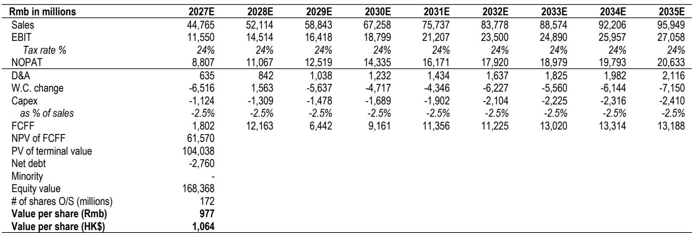
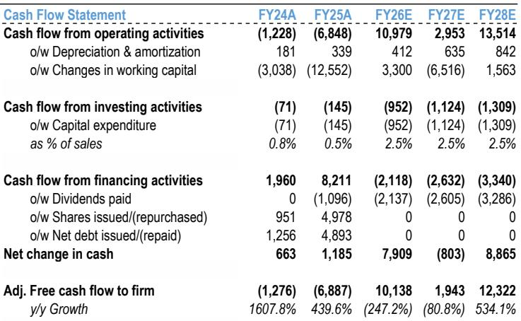
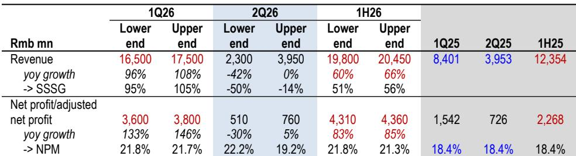

# JPM：老铺黄金业务与季度数据观察

老铺黄金7月27日发布上半年盈利预告，调整后净利润同比增长83%至85%。结合此前一季度预告推算，二季度净利润落在5.1亿至7.6亿元人民币区间，低于JPM此前约8亿元的基准预期，也低于市场约9亿至10亿元的共识。报告认为，二季度同店销售增速低于预期——估算同比下滑14%至50%，以及净利率低于预期，是业绩偏差的主要原因。

但JPM同时指出，二季度存在几个客观扰动因素：部分消费在涨价前被提前至一季度释放、金价在二季度从高点回落约17%导致购买决策延迟、以及传统淡季叠加高波动。报告认为，老铺黄金自二季度以来已采取一系列主动措施来应对金价波动，这些努力在下半年有望推动反弹。

> **KC评论：** 二季度同店销售下滑幅度区间较宽（-14%至-50%），说明报告对短期趋势的判断仍有不确定性。但更值得关注的是，老铺在二季度实际已加速新品发布、调整赠品门槛、优化门店服务流程，这些动作在下半年才会逐步反映在收入端。

## 1. 二季度业绩偏差来自同店销售与费用双重挤压

根据盈利预告数据，老铺黄金二季度收入约23亿至39.5亿元，同比变化区间为-42%至0%。JPM估算，二季度同店销售增速在-50%至-14%之间，远低于一季度95%至105%的水平。净利率方面，二季度在19.2%至22.2%之间，低于报告此前21.8%的基准预期。

报告认为，净利率低于预期的原因并非毛利率出现变化——JPM估算二季度毛利率超过45%，处于较高水平——而是固定薪酬占比偏高以及品牌投入增加带来的费用不确定性。二季度金价从高点回落约17%，在传统淡季中进一步压制了消费意愿。

## 2. 应对金价波动的四类措施已在二季度落地

报告详细列出了老铺黄金自二季度以来采取的应对措施。新品发布节奏明显加快：2026年上半年推出9个新系列，而2025年全年为8个、2025年上半年仅为4个。新系列中融入了更多宝石元素，如蓝宝石，并引入转经轮、希腊十字等新设计元素。

赠品门槛从4月起下调：5克金币的赠送门槛从单笔消费50万元降至25万元。门店服务流程也在优化，售后单独排队取代了过去购买与售后共用一条队列的做法。渠道方面，老铺计划升级8至12家国内门店，包括在上海恒隆广场接手此前华伦天奴的铺位，并在上海国金中心开设经典系列展览。海外方面，计划新增4至6家门店，主要集中在下半年。

## 3. 下半年收入与利润预计环比改善，全年指引下调

JPM预计，老铺黄金2026年全年收入同比增长约39%，净利润同比增长约46%。这意味着下半年收入同比增长约19%，净利润同比增长约7%，较二季度明显改善。支撑下半年增长的因素包括：2至3次价格调整带来的均价提升、产品结构向大克重倾斜、2025年新开10家门店（多数在5月后）的爬坡效应、以及海外扩张。

报告将2026至2028年净利润预测下调14%至19%，主要反映金价波动对同店销售的影响以及品牌投入增加。下调后，2026年收入预测为379亿元，净利润为71亿元，对应2027年预期市盈率约19倍。

> **KC评论：** 老铺黄金目前只有45家门店，但85%以上销售来自一线和新一线城市，单店产出在国内珠宝品牌中最高。报告判断其核心逻辑并非短期同店波动，而是“体验驱动增长”的系统性能力——包括严格的门店数量控制、直营模式、差异化服务质量和高度精选的团队。二季度数据虽然偏差，但报告认为这些结构性因素并未改变。

For informational purposes only. Portions may be generated,translated,summarized,or edited with AI assistance based on source materials and may contain omissions or errors. Please verify independently. This is not investment,legal,tax,accounting,or other professional advice.

For informational purposes only. Portions may be generated,translated,summarized,or edited with AI assistance based on source materials and may contain omissions or errors. Please verify independently. This is not investment,legal,tax,accounting,or other professional advice.

