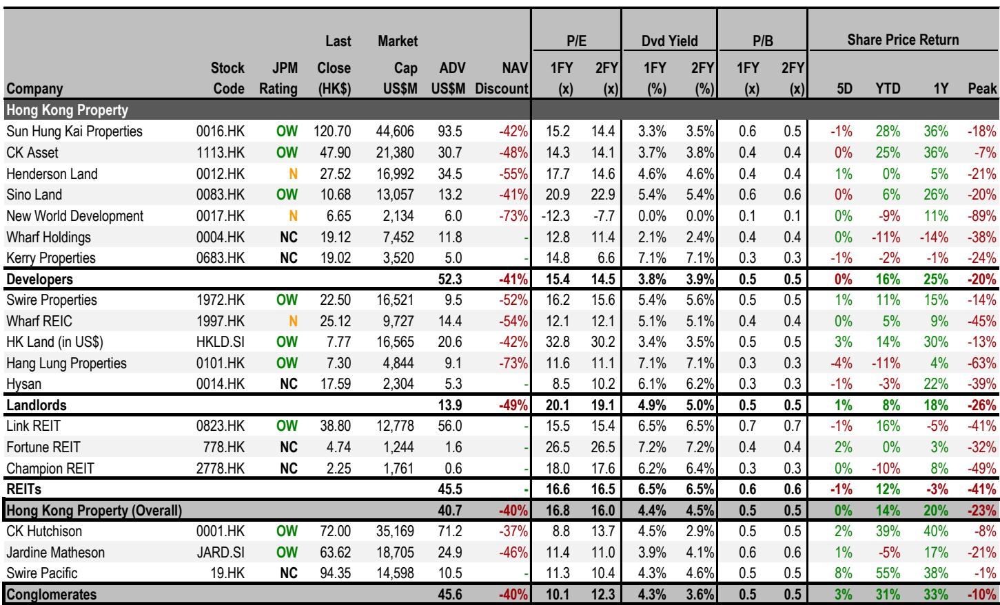
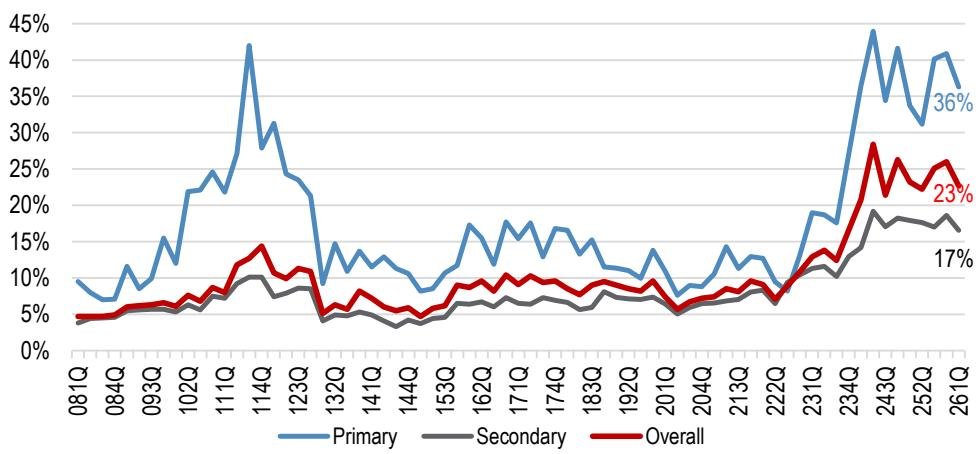
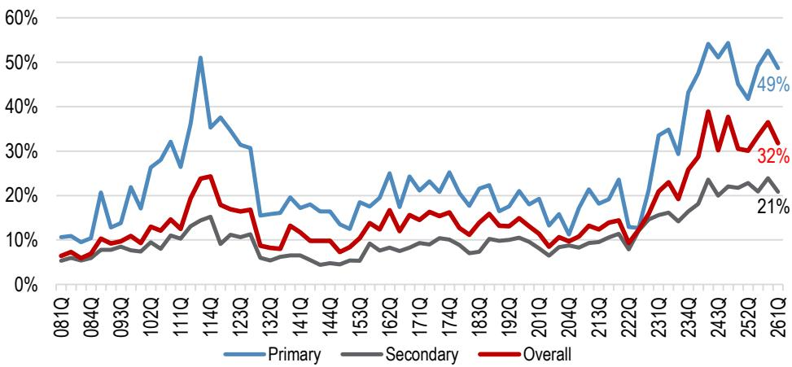

# JPM：城市与住房数据变化观察

2026年7月24日，中国财政部发布关于离岸信托个人所得税的公告，对境内税收居民通过离岸信托持有的资产增值及收益征收20%所得税，并设置追溯条款和反避税措施。JPM在最新研究报告中评估了这一政策对香港房地产市场的潜在影响。报告的核心判断是：新规方向性谨慎，但实际影响有限，预计通过内地控制的离岸信托购买的香港住宅交易占比不足2%，不足以改变当前房价上升周期。

## 1. 新规追溯至2023年，反避税条款覆盖已获外国国籍者

新规并非突然出台。彭博在2025年3月已有报道，但最终版本比市场预期更严格。追溯条款要求自2023年1月起未缴税款须在90天内申报补缴。反避税措施的关键在于：即便个人已取得外国国籍或长期居留权，只要其主要宏观环境利益来源仍在中国境内，仍可能被认定为境内税收居民。这意味着单纯通过身份变更来规避纳税义务的做法不再有效。

> **KC评论：** 报告特别指出，新规并非专门针对香港房地产，而是覆盖所有离岸资产类型，包括新加坡房产和境外股权研究。对香港住宅而言，持有成本上升是事实，但与其他离岸资产相比，相对吸引力并未出现变化。

## 2. 住宅交易影响估算：极端情景下销售减少不足2%

JPM通过两个维度估算影响范围。一是公司买家占比，2026年前四个月香港住宅交易中公司买家占4.5%。二是其中由内地税收居民控制的公司比例，报告估计低于50%。据此推算，即使极端假设下所有通过离岸信托购买的内地买家完全停止交易，对整体住宅销售的影响也不到2%。

从区域看，启德新区因内地买家比例相对较高，可能受到更大影响。但报告强调，多数被归类为“内地买家”的购房者实际已在香港居住或持有香港身份证，未必属于“境内税收居民”范畴。按拼音姓氏统计的内地买家占交易量约23%、交易额约32%，但其中非本地居住的内地买家估计仅占总交易量的5-10%、交易额的10-15%。

## 3. 商业地产资本回收节奏可能有所调整

新规对商业地产的影响路径略有不同。近年来内地企业通过离岸信托收购香港写字楼的案例增多，如李宁收购港湾东、阿里巴巴收购铜锣湾One Causeway Bay。新规同样适用于持有商业资产的离岸信托，可能降低大宗交易活跃度，进而影响地产公司通过资产出售实现资本回收的节奏。报告认为对租赁市场影响有限，但交易层面的节奏变化值得关注。

## 4. 一个尚未完全明确的执行不确定性：CRS与户籍认定

报告提出了一个更广泛的潜在不确定性：如果税务机关将税收居民的认定范围扩大至所有持有内地户籍的个人，即便其在香港长期工作生活，也可能面临对香港房产租金收益和资本利得的征税。目前房地产尚未纳入CRS（共同申报准则）信息交换范围，执行层面存在不确定性，但这一方向值得持续跟踪。

> **KC评论：** 报告给出了一个可复用的观察框架：区分“公司买家占比”和“内地控制比例”两个维度来估算政策影响。对于关注香港住宅市场的读者，后续应追踪公司买家交易占比变化，以及启德等特定区域的数据，这比笼统的“内地买家”统计更能反映政策实际影响。

For informational purposes only. Portions may be generated,translated,summarized,or edited with AI assistance based on source materials and may contain omissions or errors. Please verify independently. This is not investment,legal,tax,accounting,or other professional advice.

