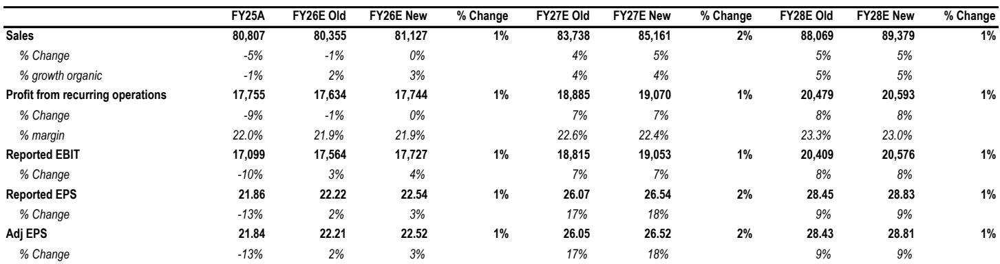
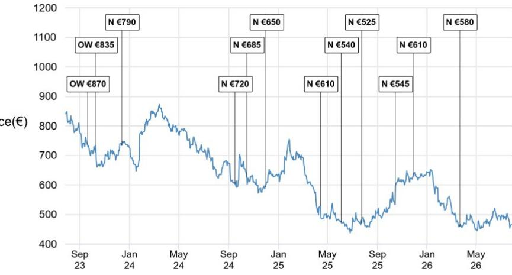
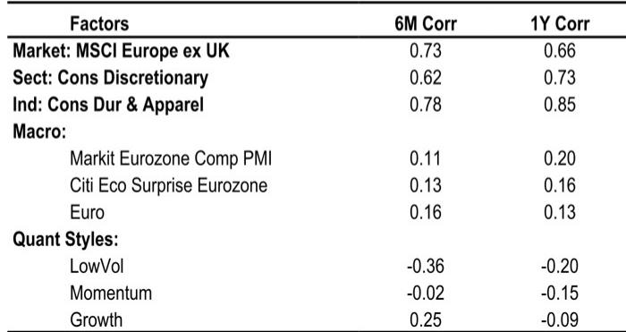

# JPM：LVMH时尚皮具回归小幅业务与近期数据观察

LVMH 在 7 月 27 日发布了 2026 年上半年财报。JPM分析师在第一时间发布的研报中给出了一个核心判断：集团第二季度有机销售增长 3%，略高于该行预期的 2%，但真正值得关注的信号在于，核心的时尚与皮具部门在连续七个季度下滑后终于重回正增长。不过，这份增长的质量和可持续性，仍是当前最大的不确定因素。

这份报告的关键信息在于，LVMH 的增长并非全面开花，而是呈现出明显的品类和区域分化。硬奢和高端成衣表现强劲，而软奢仍在消化过去几年的过度提价和扩张。同时，美国消费者成为增长主力，而中国消费者需求依然平淡。这些细节，比整体数字更能说明当前奢侈品市场的真实状态。

## 1. 时尚皮具部门增长质量低于预期，但迪奥品牌出现积极信号

第二季度，LVMH 时尚与皮具部门有机销售同比增长约 1%，与JPM预期一致，但低于市场普遍预期的 2%。考虑到上年同期基数较低（下降 9%），这个增幅并不算强劲。不过，报告指出，迪奥品牌的表现出现了明显加速，重新回到正增长且高于部门平均水平。JPM分析师认为，这是一个积极信号，表明消费者对迪奥在 Jonathan Anderson 主导下的创意更新正在做出回应，尤其是女装成衣和手袋系列。但管理层也承认，创意更新和供应链转型“有些复杂”。

> **KC评论：** 迪奥的复苏是这份财报中为数不多的结构性亮点，但需要关注其供应链能否跟上创意节奏。如果迪奥能持续跑赢部门平均，它可能成为 LVMH 时尚皮具部门未来几个季度的重要增长引擎。

## 2. 硬奢和高端成衣持续受益，软奢仍在消化过去过度扩张

报告揭示了一个清晰的品类分化：手表与珠宝部门第二季度有机销售增长 11%，超出JPM预期的 8%，其中蒂芙尼和宝格丽均实现中十位数增长。选择性零售部门增长 6%，主要由丝芙兰驱动。葡萄酒与烈酒部门也意外增长 5%，得益于中国对干邑需求的改善。

相比之下，时尚皮具部门的表现则显得仍在调整。JPM分析师指出，这与同行数据形成对比——历峰集团同期销售增长 20%，杰尼亚集团直营渠道增长 17%，甚至斯沃琪也增长了 9%。分析师认为，这印证了品类驱动分化的判断：硬奢和高端成衣继续受益于健康的奢侈品消费趋势，而软奢仍在消化过去在定价、品牌升级和销量增长方面的过度行为。

## 3. 美国消费者成为增长主力，中国消费者需求依然平淡

从区域看，第二季度增长主要由美国消费者贡献，实现高个位数增长。欧洲和中国消费者均持平，日本消费者也持平（上一季度为低至中个位数下降），中东消费者仍为负增长但较第一季度有所改善。报告特别指出，中国消费者的需求越来越集中在购物节期间，这增加了预测难度。

JPM分析师认为，这种区域分化与品类分化叠加，使得其他软奢品牌（如开云集团和爱马仕）短期内加速增长的难度加大。爱马仕可能面临更严峻的基数不确定性，而开云集团则面临皮革制品整体需求疲软的环境。

## 4. 成本控制支撑利润率，但汇率仍是影响

报告中最积极的信号来自利润率。上半年集团 EBIT 利润率为 22.5%，略高于JPM预期的 22.1%，主要得益于严格的运营费用控制。时尚皮具部门上半年 EBIT 利润率下降 60 个基点至 34.1%，但完全由汇率影响所致，按固定汇率计算，利润率持平。

管理层预计下半年汇率对营收有小幅正面影响，但对利润率的谨慎影响将与上半年持平（受库存周转时间差影响，尤其在手表与珠宝部门）。基于上半年的利润率超预期和更有利的汇率假设，JPM将全年盈利预测上调约 1%。但分析师同时下调了时尚皮具部门下半年的增长预期，预计第三季度增长 1%（此前预期 3.5%），第四季度增长 2.5%（此前预期 4%），全年该部门销售按固定汇率计算将持平。

这份报告的核心启示在于：LVMH 正在通过成本控制稳住利润，但核心业务的增长动力仍不充分。JPM更新公司观点，认为在当前报价水平上，盈利预测的小幅上调可能为报价提供一定支撑，但不足以改变市场对该股的谨慎看法。LVMH 当前交易在 2027 年预期市盈率 17.5 倍，较奢侈品板块平均 19.5 倍有约 10% 的折价。

For informational purposes only. Portions may be generated,translated,summarized,or edited with AI assistance based on source materials and may contain omissions or errors. Please verify independently. This is not investment,legal,tax,accounting,or other professional advice.

For informational purposes only. Portions may be generated,translated,summarized,or edited with AI assistance based on source materials and may contain omissions or errors. Please verify independently. This is not investment,legal,tax,accounting,or other professional advice.

