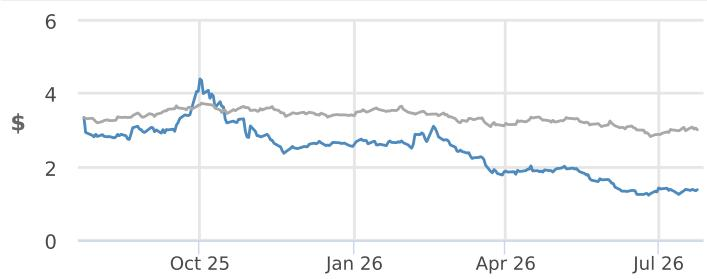
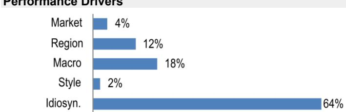
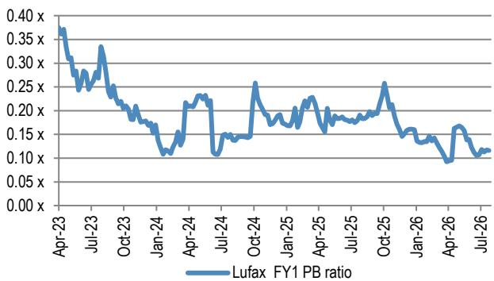
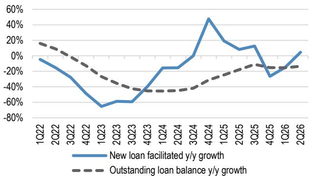
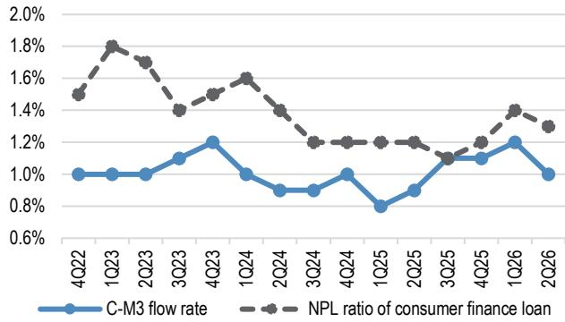
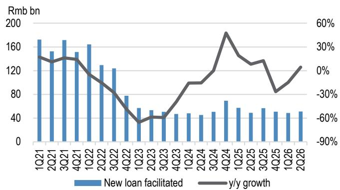
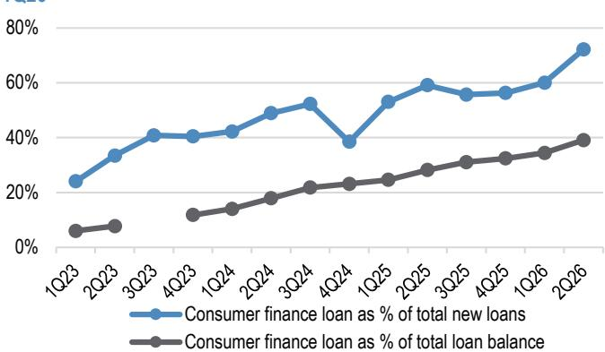
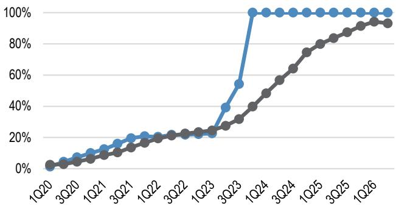
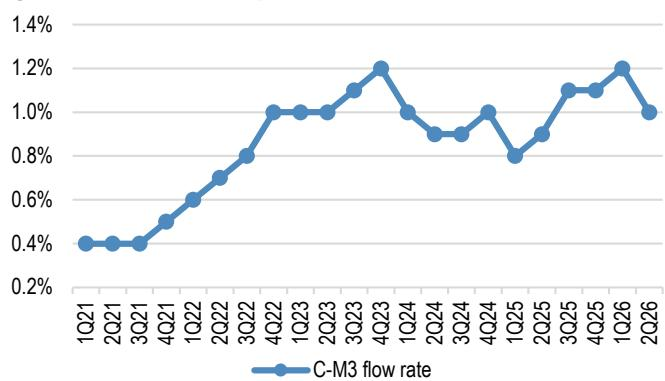
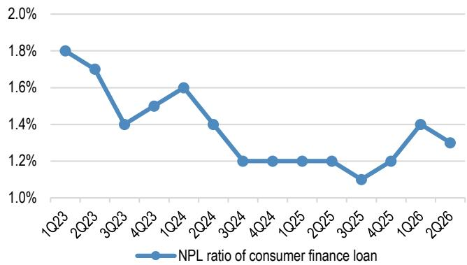

## Lufax Holding

## 运营拐点显现，估值处于历史低位；上调评级

我们上调Lufax评级，因其2026年第二季度运营更新显示，贷款增长改善及领先资产质量指标向好，为估值修复提供了更清晰的路径。Lufax对进一步贷款定价监管的抵御能力也相对较强，因其内部回报表现低于同业。我们认为，当前0.1倍前瞻市净率及仅相当于2025年末现金37%的市值，低估了其运营复苏及资产负债表的潜在价值。8月的中期业绩有望通过提升盈利可见度成为催化剂，而任何股东回报举措都将带来额外上行空间。

- **基本面拐点显现，估值处于低位，上调评级。** 新增贷款增速从2026年第一季度的同比下降14.8%回升至第二季度的同比增长4.6%；未偿还贷款收缩幅度环比放缓至3%。领先资产质量指标亦有所改善：C-M3环比下降20个基点至1.0%，D30下降30个基点至5.8%，消费金融不良贷款率微降10个基点至1.3%。我们认为，当前仅0.1倍前瞻市净率的估值，尚未充分反映正在显现的基本面复苏。

- **较低的贷款定价提供了相对监管韧性。** 内部回报表现上限的不确定性仍是行业主要监管隐忧。然而，Lufax 2025年新增贷款综合内部回报表现仅为18.6%，低于同业平均约21.8%；其消费金融贷款内部回报表现为17.2%，远低于20%的上限。因此，若监管进一步收紧，Lufax面临的定价与利润率压力预计将小于内部回报表现较高的同业。

- **中期业绩有望提升盈利可见度；资本回报提供额外上行空间。** 8月发布的2026年上半年业绩，应在运营复苏后提供更清晰的损益表信息。Lufax市值仅为2025年末现金的37%，且公司在2024-2025年产生了正向经营现金流。我们未在基准情形中假设特别股息或回购，但任何更清晰的资本管理承诺，若伴随中期业绩发布，将提供额外的估值重估潜力。

- **下调预测，但风险回报比改善支持评级上调。** 我们下调2026/27/28年新增贷款预测6%，下调总营业收入2%/4%/5%，部分被较低的运营费用及减值损失所抵消；净利润预测仅下调1%/3%/1%。我们将目标价估值日期滚动至2027年末，并下调目标价至2.00美元。

- **管理层变动仍是关注点。** 首席财务官及三位非执行董事的辞职，为Lufax的治理及内控重置增添了不确定性。但我们认为，改善的运营轨迹及处于低位的估值，足以补偿这一风险；同时，任命一位具备丰富风险管理及内控经验的独立董事，方向上是积极的。

## ▲ 增持

此前：中性
LU, LU US
价格（2026年7月24日）：1.38美元

▼ 目标价（2027年12月）：2.00美元
此前（2026年12月）：2.10美元

## 中国

## 银行与金融服务

Lincoln Yu AC
(852) 2800 8523
lincoln.yu@JPM.com
JPM Securities (Asia Pacific) Limited/ JPM Broking (Hong Kong) Limited

Katherine Lei AC
(852) 2800-8552
katherine.lei@JPM.com
JPM Securities (Asia Pacific) Limited/ JPM Broking (Hong Kong) Limited

Peter Zhang
(852) 2800-8557
peter.zhang@JPM.com
JPM Securities (Asia Pacific) Limited/ JPM Broking (Hong Kong) Limited

Haomin Chen
(86-21) 6106 6347
haomin.chen@JPM.com
SAC Registration Number: S1730524080002
JPM Securities (China) Company Limited

<table><tr><td colspan="4">主要变化（财年截至12月）</td></tr><tr><td></td><td>此前</td><td>当前</td><td>变化</td></tr><tr><td>调整后每ADR收益 - 26E (人民币)</td><td>(0.07)</td><td>(0.08)</td><td>-5.9%</td></tr><tr><td>调整后每ADR收益 - 27E (人民币)</td><td>1.82</td><td>1.77</td><td>-2.8%</td></tr></table>

风格暴露

<table><tr><td rowspan="2">量化因子</td><td rowspan="2">当前百分位排名</td><td colspan="4">历史百分位排名 (1=最高)</td></tr><tr><td>6个月</td><td>1年</td><td>3年</td><td>5年</td></tr><tr><td>价值</td><td>6</td><td>3</td><td>11</td><td>3</td><td>12</td></tr><tr><td>成长</td><td>97</td><td>100</td><td>100</td><td>96</td><td>54</td></tr><tr><td>动量</td><td>14</td><td>49</td><td>17</td><td>99</td><td>91</td></tr><tr><td>质量</td><td>92</td><td>92</td><td>92</td><td>72</td><td>27</td></tr><tr><td>低波动</td><td>85</td><td>93</td><td>100</td><td>98</td><td>96</td></tr></table>

价格表现

— LU 价格 (美元) — MSCI-Cnx (重新基准)

<table><tr><td></td><td>年初至今</td><td>1个月</td><td>3个月</td><td>12个月</td></tr><tr><td>相对</td><td>-46.1%</td><td>7.8%</td><td>-28.1%</td><td>-58.8%</td></tr><tr><td>相对</td><td>-34.6%</td><td>5.2%</td><td>-20.0%</td><td>-48.7%</td></tr></table>

公司数据

<table><tr><td>流通股数 (百万)</td><td>895</td></tr><tr><td>52周价格区间 (美元)</td><td>4.57-1.20</td></tr><tr><td>市值 (百万美元)</td><td>1,235</td></tr><tr><td>汇率</td><td>1.00</td></tr><tr><td>自由流通比例 (%)</td><td>-</td></tr><tr><td>3个月日均成交量 (百万股)</td><td>1.11</td></tr><tr><td>3个月日均成交额 (百万美元)</td><td>1.7</td></tr><tr><td>波动率 (90天)</td><td>51</td></tr><tr><td>指数</td><td>MXCNX</td></tr><tr><td>彭博分析师评级 (买入 | 持有 | 卖出)</td><td>0|1|0</td></tr></table>

关键指标 (财年截至12月)

<table><tr><td>人民币百万元</td><td>FY25A</td><td>FY26E</td><td>FY27E</td><td>FY28E</td></tr><tr><td colspan="5">财务预测</td></tr><tr><td>财富管理交易及服务费</td><td>85</td><td>78</td><td>80</td><td>88</td></tr><tr><td>零售信贷促成服务费</td><td>5,503</td><td>3,586</td><td>2,943</td><td>2,785</td></tr><tr><td>投资收益</td><td>1,655</td><td>1,894</td><td>1,894</td><td>1,894</td></tr><tr><td>担保收入及其他</td><td>6,690</td><td>5,980</td><td>5,168</td><td>4,937</td></tr><tr><td>净利息收入</td><td>13,194</td><td>14,485</td><td>17,001</td><td>19,382</td></tr><tr><td>净收入</td><td>27,128</td><td>26,022</td><td>27,087</td><td>29,087</td></tr><tr><td>总运营费用</td><td>(10,786)</td><td>(10,436)</td><td>(10,937)</td><td>(11,778)</td></tr><tr><td>调整后拨备前利润</td><td>16,341</td><td>15,586</td><td>16,150</td><td>17,309</td></tr><tr><td>调整后税前利润</td><td>(578)</td><td>455</td><td>2,411</td><td>3,842</td></tr><tr><td>调整后净利润</td><td>(2,098)</td><td>(67)</td><td>1,587</td><td>2,589</td></tr><tr><td>调整后每ADR收益</td><td>(2.42)</td><td>(0.08)</td><td>1.77</td><td>2.89</td></tr><tr><td>彭博每股收益</td><td>(2.64)</td><td>-</td><td>1.82</td><td>2.94</td></tr><tr><td>每股股息</td><td>0.00</td><td>0.00</td><td>0.00</td><td>0.00</td></tr><tr><td>每ADR账面价值</td><td>91.68</td><td>92.04</td><td>93.92</td><td>96.93</td></tr><tr><td>总资产</td><td>208,115</td><td>207,715</td><td>218,701</td><td>232,941</td></tr><tr><td colspan="5">利润率与增长</td></tr><tr><td>净利率</td><td>(7.7%)</td><td>(0.3%)</td><td>5.9%</td><td>8.9%</td></tr><tr><td>调整后每ADR收益增长</td><td>(56.4%)</td><td>(96.9%)</td><td>(2453.2%)</td><td>63.1%</td></tr><tr><td colspan="5">比率</td></tr><tr><td>调整后税率</td><td>(196.3%)</td><td>30.0%</td><td>30.0%</td><td>30.0%</td></tr><tr><td>成本收入比</td><td>39.8%</td><td>40.1%</td><td>40.4%</td><td>40.5%</td></tr><tr><td>股息支付率</td><td>0.0%</td><td>0.0%</td><td>0.0%</td><td>0.0%</td></tr><tr><td>净资产回报表现</td><td>(2.6%)</td><td>(0.1%)</td><td>2.0%</td><td>3.1%</td></tr><tr><td>总资产回报表现</td><td>(1.0%)</td><td>(0.0%)</td><td>0.7%</td><td>1.1%</td></tr><tr><td colspan="5">估值</td></tr><tr><td>股息率</td><td>0.0%</td><td>0.0%</td><td>0.0%</td><td>0.0%</td></tr><tr><td>调整后市盈率</td><td>不适用</td><td>不适用</td><td>5.3</td><td>3.2</td></tr></table>

## 投资论点摘要与估值

Lufax是一家领先的科技赋能平台，专注于零售及中小企业融资。我们将其评级从中性上调至增持，因其2026年第二季度更新显示基本面正在复苏，新增贷款重回正增长，领先资产质量指标改善。我们也认为，鉴于其贷款内部回报表现低于同业，Lufax对进一步监管收紧具有相对韧性。我们认为，当前0.1倍前瞻市净率及仅相当于2025年末现金37%的市值，低估了其改善的运营轨迹及可观的资产负债表潜在价值。主要风险包括：进一步监管收紧、信用成本正常化慢于预期、管理层持续变动及证券诉讼。

## 估值

我们基于市净率-净资产回报表现模型得出2027年12月目标价2.00美元，假设股权成本为19.8%，正常化净资产回报表现为7.6%，终值日期为2028年12月31日。我们的估值对正常化净资产回报表现假设较为敏感：正常化净资产回报表现每上升/下降1个百分点，目标价将相应上升/下降约39%；而股权成本每下降/上升1个百分点，目标价将相应上升/下降约7-8%。

业绩驱动因素

<table><tr><td>因素</td><td>6个月相关性</td><td>1年相关性</td></tr><tr><td>市场：MSCI亚太（除日本）</td><td>0.27</td><td>0.28</td></tr><tr><td>地区：中国</td><td>0.26</td><td>0.41</td></tr><tr><td colspan="3">宏观：</td></tr><tr><td>新兴市场央行利率</td><td>-0.14</td><td>-0.27</td></tr><tr><td>JPM新兴市场债券全球利差</td><td>-0.42</td><td>-0.25</td></tr><tr><td>JPM全球市场情绪</td><td>0.23</td><td>0.20</td></tr><tr><td colspan="3">量化风格：</td></tr><tr><td>质量</td><td>0.09</td><td>-0.16</td></tr><tr><td>动量</td><td>-0.37</td><td>-0.12</td></tr><tr><td>规模</td><td>-0.30</td><td>-0.11</td></tr></table>

## 上调Lufax至增持：增长与资产质量在估值低位出现拐点

- **基本面复苏初现，估值处于低位。** Lufax仅以0.1倍前瞻市净率交易，接近历史低点（图1），而运营轨迹正在改善。新增贷款在2026年第二季度恢复至同比增长4.6%，而第一季度为下降14.8%，2025财年全年为持平；未偿还贷款收缩幅度环比放缓（图2）。资产质量亦出现改善迹象：领先指标C-M3流动率环比下降20个基点至1.0%，30天逾期率改善30个基点至5.8%，消费金融不良贷款率下降10个基点至1.3%。尽管近期净资产回报表现仍处低位，但我们认为，业务量与资产质量的拐点降低了盈利轨迹的下行风险，并支持估值从当前低位实现重估。

- **较低的贷款定价提供了对潜在进一步监管收紧的更强韧性。** 内部回报表现上限的不确定性仍是行业的主要监管隐忧，特别是目前适用于小额贷款公司的4倍贷款市场报价利率上限，是否会最终扩展至其他资金提供方。近期一次行业自律会议（链接）强化了这一担忧，该会议指出整体定价仍相对较高，并要求主要平台提供数据以进行行业范围基线评估，并向金融监管机构提交专项报告。虽然这并不代表新的定价规则，但我们认为，这一信息收集工作可能为未来的定价指引或更广泛的贷款促成费率上限奠定基础。在此背景下，我们认为Lufax比同业更具优势：其2025年新增贷款综合内部回报表现仅为18.6%，低于同业平均约21.8%（表1）；其消费金融贷款内部回报表现为17.2%，远低于当前20%的上限。因此，若贷款利率监管进一步收紧，Lufax面临的定价与利润率压力预计将小于内部回报表现较高的平台。

- **下一个催化剂在8月中期业绩，有望提升盈利可见度并提供股东回报的潜在空间。** 我们预计Lufax将于8月发布2026年上半年中期报告。与2026年第一季度及第二季度运营更新不同，中期业绩应提供关键的损益表信息，并在全担保模式转型接近完成之际，提供更清晰的盈利可见度。这有助于验证贷款增长、资产质量及费率的复苏是否正在转化为盈利改善。Lufax的资产负债表提供了额外的上行空间：当前市值仅为2025年末现金的约37%，而公司在2024年及2025年均产生了正向经营现金流。虽然我们未在基准情形中假设资本回报公告，但任何股息、回购或更清晰的资本管理承诺，都将构成额外上行空间，并可能加速估值从当前低位实现重估。回顾此前，Lufax曾设有半年度股息框架，目标总派息率为净利润的20-40%，但因2025财年报告亏损而未派息。

图1：Lufax交易于0.1倍前瞻市净率，接近历史低点...

来源：彭博财经有限合伙

图2：...而其新增贷款增长在2026年第二季度改善至同比增长+4.6%，未偿还贷款余额收缩放缓至同比下降-13.5%

来源：公司数据。

图3：资产质量正在改善，早期指标C-M3流动率在2026年第二季度环比正常化20个基点，消费金融贷款不良贷款率环比微降10个基点

来源：公司数据。

表1：Lufax新增贷款内部回报表现低于同业，使其对监管收紧更具韧性

<table><tr><td>新增贷款平均内部回报表现</td><td>2022</td><td>2023</td><td>2024</td><td>2025</td></tr><tr><td>Lufax</td><td>19.8%</td><td>19.4%</td><td>18.9%</td><td>18.6%</td></tr><tr><td>QFIN</td><td>22.4%</td><td>21.7%</td><td>21.5%</td><td>20.8%</td></tr><tr><td>FinVolution</td><td>23.6%</td><td>22.3%</td><td>22.2%</td><td>22.0%</td></tr><tr><td>Lexin</td><td>24.6%</td><td>23.9%</td><td>23.9%</td><td>22.7%</td></tr></table>

来源：公司数据。

表2：充裕的现金头寸与低估值带来资产负债表价值释放的潜在空间

<table><tr><td colspan="2">人民币百万元</td></tr><tr><td>Lufax当前市值</td><td>8,098</td></tr><tr><td>2025年末银行存款</td><td>22,086</td></tr><tr><td>市值占现金头寸比例</td><td>37%</td></tr><tr><td>2025年末总权益</td><td>82,041</td></tr><tr><td>股价对2025年末账面价值</td><td>0.10倍</td></tr></table>

来源：公司数据，彭博财经有限合伙。注：市值截至2026年7月27日。

## 2026年第二季度运营更新

## 积极方面

- **新增贷款重回正增长，受消费金融支撑。** 2026年第二季度新增贷款总额环比增长5%，同比增长4.6%，达到511亿元人民币，扭转了第一季度15%的同比收缩（图4）。消费金融放款额环比增长26%，同比增长28%，达到369亿元人民币，占新增贷款总额的72%，高于第一季度的60%（图5）。这表明，2025年下半年监管收紧后的收缩正在开始缓解，业务组合持续向消费金融倾斜。

- **未偿还贷款余额显现初步企稳迹象。** 截至2026年第二季度末，未偿还贷款总额环比下降3%至1,673亿元人民币，较第一季度6%的环比收缩有所改善，但余额仍同比下降13.5%。消费金融贷款环比增长10%，同比增长20%，达到654亿元人民币，占贷款总额的比例升至约39%，而第一季度为34%。累计借款人数量环比增长6%至3,140万。

- **领先资产质量指标改善。** C-M3环比下降20个基点至1.0%，扭转了第一季度的恶化趋势（图8）。改善是广泛的：一般无担保贷款的C-M3从1.2%降至1.0%，有担保贷款从1.0%改善至0.9%。D30也环比下降30个基点至5.8%，无担保及有担保贷款的逾期率均有所改善。消费金融不良贷款率从2026年第一季度末的1.4%降至1.3%（图10）。

- **尽管整体数据有所下降，风险承担转型持续推进。** 剔除消费金融子公司，Lufax的风险承担比例环比上升170个基点至95.7%，表明向全担保模式的转型接近完成。然而，包含消费金融子公司的比例环比微降1个百分点至93.2%，我们理解这主要反映了消费金融子公司下推荐量的增加，而非基础转型的逆转。这仍对信贷业务费率构成支撑，该费率已随风险承担转型的推进，从2024财年的9.6%上升至2025财年的12.7%。

## 待观察方面

- **管理层变动在治理重置的关键阶段增加了不确定性。** 首席财务官兼执行董事席通转先生与三位具有母公司平安背景的非执行董事一同辞职，自7月25日起生效。尽管离职董事均提及个人工作安排，并确认与董事会无分歧，但同期离职增加了Lufax近期管理层的不稳定性，而此时公司仍在回应香港交易所对其调查及内控审查的意见。任命具备丰富风险管理、内控及董事会经验的詹伟钦先生为独立非执行董事，方向上是积极的，但常任首席财务官尚未任命，目前由内部团队暂代相关职责。

- **尽管领先指标改善，滞后逾期率仍处高位。** 2026年第二季度D90环比上升30个基点至3.7%，其中无担保贷款上升30个基点至3.9%，因早期逾期继续向后迁移。因此，我们预计C-M3及D30的改善将滞后转化为更低的报告逾期率及信用成本。尽管如此，领先指标的拐点增强了我们对资产质量压力正接近峰值的信心。

## 对同业的启示

- **对QFIN在资产质量与增长方面具有积极启示。** Lufax的C-M3环比下降20个基点至1.0%，D30改善30个基点至5.8%，印证了QFIN在2026年第一季度评论中提到的，C-M2在3月已恢复至2025年7月/8月水平，并在4-5月略有改善。Lufax新增贷款重回正增长也表明，随着信用状况企稳，行业可能正在重获运营动能。尽管滞后的D90仍处高位，但我们认为此次更新支持资产质量的进一步改善及QFIN在2026年第二季度贷款增长的逐步复苏。

图4：2026年第二季度新增贷款总额同比增长5%或环比增长5%，较第一季度同比下降15%进一步企稳

来源：公司数据。

图5：2026年第二季度消费金融贷款占新增贷款的72%，高于第一季度的60%

来源：公司数据。

图6：2026年第二季度未偿还贷款余额同比下降13%，较第一季度同比下降15%有所放缓

来源：公司数据。

图7：自2023年第四季度以来，所有新增贷款均采用全担保模式，2026年第二季度未偿还贷款的风险承担部分微降至93.2%

风险承担贷款占新增贷款比例（不含消费金融子公司）
风险承担贷款占未偿还贷款总额比例
来源：公司数据。

图8：C-M3流动率从2026年第一季度的1.2%改善至第二季度的1.0%

来源：公司数据。

图9：2026年第二季度D30比率降至5.8%，而D90比率微升至3.7%

来源：公司数据。

图10：2026年第二季度消费金融贷款不良贷款率微降至1.3%

来源：公司数据。

表3：2026年第二季度关键运营趋势

<table><tr><td>人民币百万元</td><td>2Q25</td><td>3Q25</td><td>4Q25</td><td>1Q26</td><td>2Q26</td><td>环比</td><td>同比</td></tr><tr><td>未偿还贷款余额</td><td>193,400</td><td>189,600</td><td>183,800</td><td>172,500</td><td>167,300</td><td>-3.0%</td><td>-13.5%</td></tr><tr><td>累计借款人（百万）</td><td>27.8</td><td>28.5</td><td>29.1</td><td>29.6</td><td>31.4</td><td>6.1%</td><td>12.9%</td></tr><tr><td>促成新增贷款</td><td>48,900</td><td>56,900</td><td>51,000</td><td>48,800</td><td>51,100</td><td>4.7%</td><td>4.6%</td></tr><tr><td>第三方担保贷款比例</td><td>16.2%</td><td>12.5%</td><td>8.6%</td><td>5.7%</td><td>6.8%</td><td>1.1个百分点</td><td>-9.4个百分点</td></tr><tr><td>表内贷款比例</td><td>53.5%</td><td>不适用</td><td>61.1%</td><td>不适用</td><td>不适用</td><td>不适用</td><td>不适用</td></tr><tr><td>未偿还贷款风险承担比例</td><td>83.7%</td><td>87.4%</td><td>91.4%</td><td>94.2%</td><td>93.2%</td><td>-1.0个百分点</td><td>9.5个百分点</td></tr><tr><td>新增贷款风险承担比例</td><td>100.0%</td><td>100.0%</td><td>100.0%</td><td>100.0%</td><td>100.0%</td><td>0.0个百分点</td><td>0.0个百分点</td></tr><tr><td>信贷业务费率</td><td>不适用</td><td>13.0%</td><td>不适用</td><td>不适用</td><td>不适用</td><td>不适用</td><td>不适用</td></tr><tr><td>C-M3 总贷款</td><td>0.9%</td><td>1.1%</td><td>1.1%</td><td>1.2%</td><td>1.0%</td><td>-20个基点</td><td>10个基点</td></tr><tr><td>D30 无担保贷款</td><td>4.4%</td><td>5.1%</td><td>5.6%</td><td>6.4%</td><td>6.1%</td><td>-30个基点</td><td>170个基点</td></tr><tr><td>D30 有担保贷款</td><td>5.3%</td><td>5.1%</td><td>5.3%</td><td>5.4%</td><td>5.0%</td><td>-40个基点</td><td>-30个基点</td></tr><tr><td>D30 总贷款</td><td>4.6%</td><td>5.1%</td><td>5.6%</td><td>6.1%</td><td>5.8%</td><td>-30个基点</td><td>120个基点</td></tr><tr><td>D90 比率 无担保贷款</td><td>2.5%</td><td>2.9%</td><td>3.4%</td><td>3.6%</td><td>3.9%</td><td>30个基点</td><td>140个基点</td></tr><tr><td>D90 有担保贷款</td><td>3.2%</td><td>2.9%</td><td>3.3%</td><td>3.0%</td><td>3.1%</td><td>10个基点</td><td>-10个基点</td></tr><tr><td>D90 总贷款</td><td>2.7%</td><td>2.9%</td><td>3.4%</td><td>3.4%</td><td>3.7%</td><td>30个基点</td><td>100个基点</td></tr><tr><td>消费金融贷款不良贷款率</td><td>1.2%</td><td>1.1%</td><td>1.2%</td><td>1.4%</td><td>1.3%</td><td>-10个基点</td><td>10个基点</td></tr></table>

来源：公司数据。

## 关键预测调整

- **基于2026年第二季度运营更新，** 我们下调2026/27/28财年新增贷款预测5.6%，反映了尽管第二季度恢复同比正增长，但复苏轨迹更为审慎。因此，我们将2026E/27E/28E财年总营业收入下调1.7%/3.8%/4.8%，部分被较低的运营费用及减值损失所抵消，使得我们的非国际财务报告准则调整后净利润预测基本不变，分别为3.19亿元人民币/17亿元人民币/27亿元人民币，下调1.2%/2.6%/1.4%。我们的信贷业务费率假设基本维持不变，分别为13.7%/14.7%/14.9%。

- **尽管盈利预测小幅下调，** 我们将Lufax评级从中性上调至增持，因为新增贷款重回增长及领先资产质量指标的改善，增强了我们对基本面复苏的信心，而该股仍以低位估值交易。我们将目标价估值日期从2026年末滚动至2027年末，并下调目标价至2.00美元。新目标价意味着较7月24日收盘价1.38美元有45%的上行空间。

表4：关键预测调整汇总

<table><tr><td rowspan="2">人民币百万元</td><td colspan="3">FY26E</td><td colspan="3">FY27E</td><td colspan="3">FY28E</td></tr><tr><td>此前</td><td>当前</td><td>变化</td><td>此前</td><td>当前</td><td>变化</td><td>此前</td><td>当前</td><td>变化</td></tr><tr><td>技术平台收入总额</td><td>3,712</td><td>3,664</td><td>-1.3%</td><td>3,143</td><td>3,023</td><td>-3.8%</td><td>3,020</td><td>2,873</td><td>-4.9%</td></tr><tr><td>净利息收入</td><td>14,828</td><td>14,485</td><td>-2.3%</td><td>17,796</td><td>17,001</td><td>-4.5%</td><td>20,506</td><td>19,382</td><td>-5.5%</td></tr><tr><td>担保收入</td><td>4,790</td><td>4,725</td><td>-1.4%</td><td>4,055</td><td>3,901</td><td>-3.8%</td><td>3,897</td><td>3,707</td><td>-4.9%</td></tr><tr><td>其他（含投资收益）</td><td>3,149</td><td>3,149</td><td>0.0%</td><td>3,161</td><td>3,161</td><td>0.0%</td><td>3,125</td><td>3,125</td><td>0.0%</td></tr><tr><td>总营业收入</td><td>26,479</td><td>26,022</td><td>-1.7%</td><td>28,155</td><td>27,087</td><td>-3.8%</td><td>30,547</td><td>29,087</td><td>-4.8%</td></tr><tr><td>运营成本</td><td>(10,677)</td><td>(10
