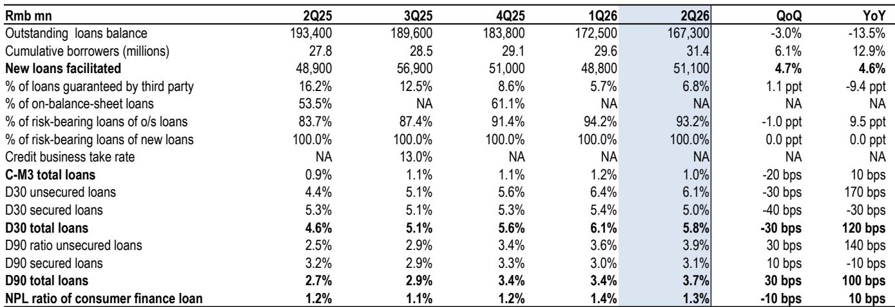
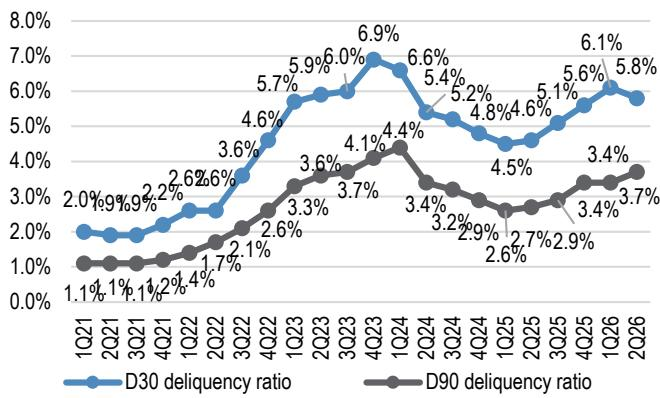
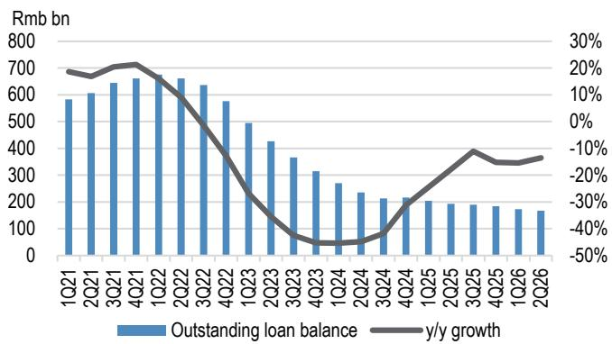

# JPM：研究主题与行业变化观察

JPM在7月发布的一份报告中上调了对陆金所控股的评级，从中性调整为观点偏积极。核心依据来自该公司2026年第二季度的运营数据更新：新增贷款恢复同比增长，领先资产质量指标出现改善。报告认为，当前估值未能充分反映这一运营复苏和资产负债表提供的选择权价值。

陆金所第二季度新增贷款同比增长4.6%，扭转了第一季度14.8%的同比下滑。贷款余额的季度环比调整幅度也从第一季度的6%收窄至3%。资产质量方面，早期不确定性指标C-M3环比下降20个基点至1.0%，30天逾期率下降30个基点至5.8%，消费资金不良贷款率下降10个基点至1.3%。这些数据出现在公司报价处于历史低位附近——当前市净率仅约0.1倍，市值相当于2025年末现金储备的37%。

> **KC评论：** 报告判断的核心逻辑是运营数据已经触底回升，但估值仍停留在最悲观情景。C-M3和30天逾期率这类领先指标改善，意味着后续信用成本有下降空间，这是盈利修复的前提。

## 1. 较低的贷款定价提供了相对监管韧性

贷款利率上限的不确定性仍是行业主要政策不确定性。市场关注的是，目前适用于小额贷款公司的4倍LPR利率上限，是否会扩展到其他资金提供方。近期一次行业自律会议也要求主要平台提交数据用于行业基准评估。

陆金所2025年新增贷款加权平均内部回报表现（IRR）为18.6%，低于同业平均的约21.8%。其消费资金贷款IRR为17.2%，明显低于20%的现行上限。如果监管进一步收紧，陆金所面临的定价和利润率不确定性预计小于同业。

## 2. 中期业绩可能成为盈利可见度的催化剂

公司预计在8月发布2026年上半年中期报告。与季度运营更新不同，中期报告将提供完整的损益表信息，有助于验证贷款增长、资产质量和费率改善是否转化为实际盈利。

陆金所当前市值仅为2025年末现金储备的37%，且2024年和2025年均产生了正向经营现金流。报告在基准情景中并未假设公司会宣布特别股息或回购，但认为如果中期业绩伴随更清晰的资本管理承诺，将提供额外的估值修复空间。

## 3. 管理层变动是值得关注的变量

首席财务官与三位来自母公司的非执行董事同时辞职，增加了公司治理和内部控制方面的不确定性。公司仍在回应香港交易所对其调查和内部控制审查的意见。新任独立非执行董事具备不确定性管理与内部控制经验，方向上是积极信号，但永久性首席财务官尚未任命。

报告认为，改善中的运营轨迹和当前的低估值足以补偿这一不确定性。领先指标改善到滞后指标改善之间存在时间差，第二季度90天逾期率仍环比上升30个基点至3.7%，但早期指标的转向增加了资产质量不确定性接近峰值的判断。

## 4. 一个可复用的观察框架：估值修复的三个条件

从这份报告可以提炼出一个评估类似情景的分析框架：运营拐点是否可信，取决于三个条件同时成立。第一，量价指标同步改善，而非单一数据点好转。第二，估值已经充分反映了最差情景，而非仅反映中等不确定性。第三，存在明确的催化剂事件，能够验证复苏逻辑并改变市场预期。

陆金所当前的情况是，新增贷款和资产质量指标同时改善，估值处于历史低位，8月中期业绩是验证盈利修复的关键节点。这三个条件是否持续成立，决定了估值修复的空间和节奏。

For informational purposes only. Portions may be generated,translated,summarized,or edited with AI assistance based on source materials and may contain omissions or errors. Please verify independently. This is not investment,legal,tax,accounting,or other professional advice.

For informational purposes only. Portions may be generated,translated,summarized,or edited with AI assistance based on source materials and may contain omissions or errors. Please verify independently. This is not investment,legal,tax,accounting,or other professional advice.

