## Lenovo Group Limited (0992)

ISG upside outweighs PC uncertainty

We are adjusting our view on Lenovo with a Jun-27 reference price of HK\$30 (based on 16x 12-month forward diluted EPS), driven by server profitability improvement, IDG price elasticity, and consolidation tailwinds amid tight component supply. Lenovo's price has moved up 85% (vs. the HSI index at flat) following a solid Mar-quarter report on May 21. We expect a constructive price reaction into the Jun-quarter results, with upside primarily driven by the server segments. Our industry research suggests Lenovo is seeing fast-growing AI-related client traction and healthy server profitability supported by favorable pricing. As a result, we expect further ISG margin expansion over the coming quarters on operating leverage. While PC earnings visibility remains uncertain, we believe Lenovo should outperform PC peers given its industry leadership and scale advantages. Key considerations include a potential shift in AI capex investment in 2027 and a larger-than-expected margin impact from rising component costs.

- AI breakthrough + general server strength driving a favorable pricing setup. Despite rising component costs, server OEMs have been enjoying favorable pricing and margins, supported by inference-driven supply tightness across both GPU and traditional servers. We believe Lenovo has navigated component constraints better than peers, helped by a more diversified supplier base (including Chinese suppliers) and business model (ODM + brand). Our industry research suggests Lenovo's AI-related revenue reached 30%+ of ISG revenue in the Jun-quarter and should sustain momentum into 2HCY26. We model \~60% YoY ISG revenue growth and 5% ISG OPM in FY27 (vs. 0.4% in FY26).

- Mixed IDG outlook, but margin resilience looks better than expected. We keep our IDG revenue and margin assumptions unchanged despite larger-than-expected component price increases over the past three months. We expect Lenovo to sustain an IDG quarterly operating profit run-rate of \~US\$1.0–1.1bn. Lenovo is likely to continue outperforming PC peers on scale advantages, tight cost control, mix management, and supply-chain execution. We model 10%/4% YoY IDG revenue growth and 6.9%/6.8% IDG OPM in CY2026/27E, respectively.

- Why adjust the view now? We previously held a more Neutral stance on Lenovo given PC earnings considerations. However, we believe server strength is now more than offsetting consumer electronics softness. As Lenovo steps up its position in the AI server supply chain with the GB300 launch, we expect it to ride neocloud demand over the coming years. Improving mix should support further re-rating and sustained stock performance vs. peers. Besides, the moderating memory price increase in the next one year could partially mitigate margin risks from higher component costs.

## ▲ Overweight

Previous: Neutral

0992.HK, 992 HK
Price (27 Jul 26): HK\$24.32

▲ Price Target (Jun-27): HK\$30.00
Prior (Mar-27): HK\$20.00

## China

Technology - Hardware

Albert Hung AC
(886-2) 2725-9875
albert.hung@jpmchase.com
JPM Securities (Taiwan) Limited/ JPM Securities (Asia Pacific) Limited/ JPM Broking (Hong Kong) Limited

Gokul Hariharan AC
(852) 2800-8564
gokul.hariharan@JPM.com
JPM Securities (Asia Pacific) Limited/ JPM Broking (Hong Kong) Limited

## Anthony Leng

(886-2) 2725-9240
anthony.leng@JPM.com
JPM Securities (Taiwan) Limited

<table><tr><td colspan="4">Key Changes (FYE Mar)</td></tr><tr><td></td><td>Prev</td><td>Cur</td><td>Δ</td></tr><tr><td>Adj. net income - 27E ($ mn)</td><td>2,289</td><td>2,787</td><td>21.8%</td></tr><tr><td>Adj. net income - 28E ($ mn)</td><td>2,605</td><td>3,353</td><td>28.7%</td></tr></table>

## Quarterly Forecasts (FYE Mar)

<table><tr><td colspan="4">Adj. net income ($ mn)</td></tr><tr><td></td><td>2026A</td><td>2027E</td><td>2028E</td></tr><tr><td>Q1</td><td>389</td><td>663</td><td>753</td></tr><tr><td>Q2</td><td>512</td><td>720</td><td>873</td></tr><tr><td>Q3</td><td>589</td><td>747</td><td>944</td></tr><tr><td>Q4</td><td>559</td><td>657</td><td>783</td></tr><tr><td>FY</td><td>2,049</td><td>2,787</td><td>3,353</td></tr></table>

## Style Exposure

<table><tr><td rowspan="2">Quant Factors</td><td rowspan="2">Current %Rank</td><td colspan="4">Hist %Rank (1=Top)</td></tr><tr><td>6M</td><td>1Y</td><td>3Y</td><td>5Y</td></tr><tr><td>Value</td><td>19</td><td>6</td><td>9</td><td>12</td><td>12</td></tr><tr><td>Growth</td><td>60</td><td>79</td><td>79</td><td>82</td><td>89</td></tr><tr><td>Momentum</td><td>1</td><td>86</td><td>72</td><td>27</td><td>29</td></tr><tr><td>Quality</td><td>24</td><td>29</td><td>29</td><td>22</td><td>26</td></tr><tr><td>Low Vol</td><td>87</td><td>69</td><td>76</td><td>46</td><td>49</td></tr><tr><td>ESGQ</td><td>9</td><td>13</td><td>6</td><td>1</td><td>1</td></tr></table>

Price Performance  
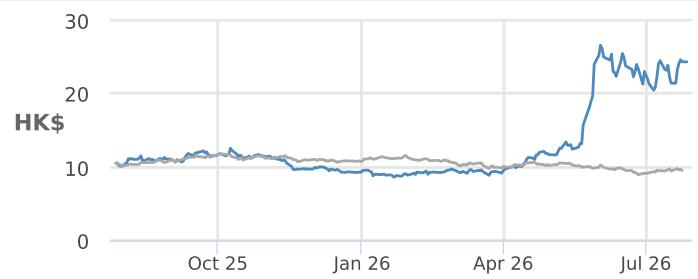

— 0992.HK Price (HK\$) MSCI-Cnx (rebased)

<table><tr><td></td><td>YTD</td><td>1m</td><td>3m</td><td>12m</td></tr><tr><td>Abs</td><td>162.6%</td><td>3.8%</td><td>100.7%</td><td>133.0%</td></tr><tr><td>Rel</td><td>174.1%</td><td>-2.8%</td><td>108.2%</td><td>142.4%</td></tr></table>

Company Data

<table><tr><td>Shares O/S (mn)</td><td>12,405</td></tr><tr><td>52-week range (HK$)</td><td>27.42-8.52</td></tr><tr><td>Market cap ($ mn)</td><td>38,467</td></tr><tr><td>Exchange rate</td><td>7.84</td></tr><tr><td>Free float (%)</td><td>56.9%</td></tr><tr><td>3M ADV (mn)</td><td>169.24</td></tr><tr><td>3M ADV ($ mn)</td><td>445.2</td></tr><tr><td>Volatility (90 Day)</td><td>78</td></tr><tr><td>Index</td><td>MXCNX</td></tr><tr><td>BBG ANR (Buy | Hold | Sell)</td><td>32|4|0</td></tr></table>

Key Metrics (FYE Mar)

<table><tr><td>$ in millions</td><td>FY26A</td><td>FY27E</td><td>FY28E</td></tr><tr><td colspan="4">Financial Estimates</td></tr><tr><td>Revenue</td><td>83,075</td><td>97,873</td><td>112,556</td></tr><tr><td>Adj. EBIT</td><td>3,124</td><td>4,257</td><td>4,966</td></tr><tr><td>Adj. EBITDA</td><td>4,562</td><td>5,633</td><td>6,342</td></tr><tr><td>Adj. net income</td><td>2,049</td><td>2,787</td><td>3,353</td></tr><tr><td>Adj. EPS</td><td>0.17</td><td>0.22</td><td>0.27</td></tr><tr><td>BBG EPS</td><td>0.13</td><td>0.19</td><td>0.25</td></tr><tr><td>Cashflow from operations</td><td>3,844</td><td>5,143</td><td>5,582</td></tr><tr><td>FCFF</td><td>2,704</td><td>4,353</td><td>4,929</td></tr><tr><td colspan="4">Margins and Growth</td></tr><tr><td>Revenue Growth Y/Y (%)</td><td>20.3%</td><td>17.8%</td><td>15.0%</td></tr><tr><td>EBIT margin</td><td>3.8%</td><td>4.3%</td><td>4.4%</td></tr><tr><td>EBIT Growth Y/Y (%)</td><td>27.4%</td><td>36.3%</td><td>16.7%</td></tr><tr><td>EBITDA margin</td><td>5.5%</td><td>5.8%</td><td>5.6%</td></tr><tr><td>EBITDA Growth Y/Y (%)</td><td>31.6%</td><td>23.5%</td><td>12.6%</td></tr><tr><td>Net margin</td><td>2.5%</td><td>2.8%</td><td>3.0%</td></tr><tr><td>Adj. EPS growth</td><td>41.8%</td><td>36.0%</td><td>20.3%</td></tr><tr><td colspan="4">Ratios</td></tr><tr><td>Adj. tax rate</td><td>19.3%</td><td>17.8%</td><td>19.2%</td></tr><tr><td>Interest cover</td><td>7.9</td><td>8.3</td><td>10.2</td></tr><tr><td>Net debt/Equity</td><td>NM</td><td>NM</td><td>NM</td></tr><tr><td>Net debt/EBITDA</td><td>NM</td><td>NM</td><td>NM</td></tr><tr><td>ROE</td><td>27.1%</td><td>29.4%</td><td>28.5%</td></tr><tr><td colspan="4">Valuation</td></tr><tr><td>FCFF yield</td><td>7.0%</td><td>11.3%</td><td>12.8%</td></tr><tr><td>Dividend yield</td><td>1.7%</td><td>1.9%</td><td>2.1%</td></tr><tr><td>EV/Revenue</td><td>0.5</td><td>0.4</td><td>0.3</td></tr><tr><td>EV/EBITDA</td><td>8.4</td><td>6.3</td><td>5.1</td></tr><tr><td>Adj. P/E</td><td>18.8</td><td>13.8</td><td>11.5</td></tr></table>

## Summary Investment Thesis and Valuation

Our industry research suggests Lenovo is seeing fast-growing AI-related client traction and healthy server profitability supported by favorable pricing. As a result, we expect further ISG margin expansion over the coming quarters on operating leverage. While PC earnings visibility remains uncertain, we believe Lenovo should outperform PC peers given its industry leadership and scale advantages.

## Valuation

Our Jun-27 reference price of HK\$30 is based on 16x 12-month-forward non-HKFRS diluted EPS (higher than our previous 14x), above the mid-cycle valuation driven by strong server profitability improvement, better-than-feared IDG price elasticity, and consolidation tailwinds amid tight component supply.

Performance Drivers  
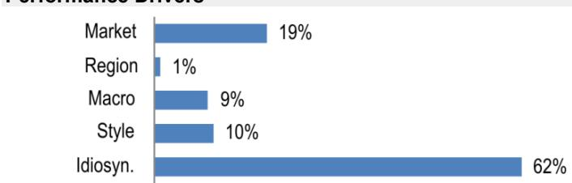

<table><tr><td>Factors</td><td>6M Corr</td><td>1Y Corr</td></tr><tr><td>Market: MSCI Asia Pac ex JP</td><td>0.38</td><td>0.44</td></tr><tr><td>Region: China</td><td>-0.15</td><td>-0.05</td></tr><tr><td>Macro:</td><td></td><td></td></tr><tr><td>Citi Economic Surprise - EM</td><td>-0.32</td><td>-0.23</td></tr><tr><td>Generic 1st &#x27;CO&#x27; Future</td><td>-0.15</td><td>-0.21</td></tr><tr><td>HSI Volatility Index</td><td>-0.10</td><td>-0.12</td></tr><tr><td>Quant Styles:</td><td></td><td></td></tr><tr><td>Growth</td><td>0.29</td><td>0.29</td></tr><tr><td>Size</td><td>0.32</td><td>0.23</td></tr><tr><td>Momentum</td><td>0.07</td><td>0.15</td></tr></table>

## Mixed IDG outlook, but margin resilience looks better than expected

Lenovo's PC shipments were up $3\%$ YoY in 1HCY26 (vs. industry PC shipments at up $+1\%$ YoY), according to Gartner® data, driven by better-than-expected PC demand and market share gains on better supply chain execution. Looking ahead, we expect a flattish 2HCY26 PC outlook (i.e. a $50\% / 50\%$ 1H/2H PC shipment split vs. traditional seasonality of $45\% / 55\%$ ). We attribute the sub-seasonal trend to PC end-demand dynamics due to memory-led negative price elasticity and fading Win-10 replacement demand.

Figure 1: Lenovo PC shipments and YoY mn units, %  
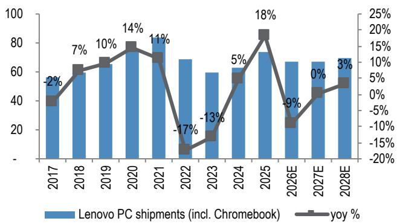  
Source: Gartner® quarterly PC tracker, JPM estimates.

Figure 2: Lenovo's PC Revenue and YoY US\$ in billions, %  
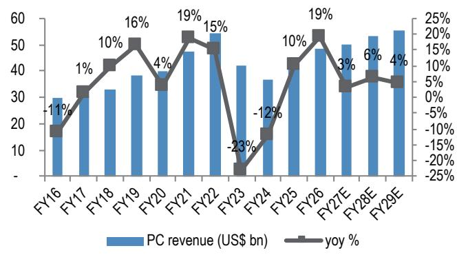  
Source: JPM estimates, Company reports FY16-FY26.

On PC margins, Lenovo delivered a resilient PC OPM in Mar-Q at 7.6% (flattish QoQ). Our research indicates that Lenovo's PC margin could remain resilient in Jun-Q and outperform PC peers in the next few quarters, supported by scale benefits, supply chain excellence, and mix management.

Figure 3: Lenovo PC ASP and GM US\$, %  
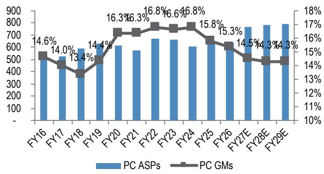  
Source: JPM estimates for both historical and forecast data.

Figure 4: Lenovo's PC operating income and OPM US\$ in millions, %  
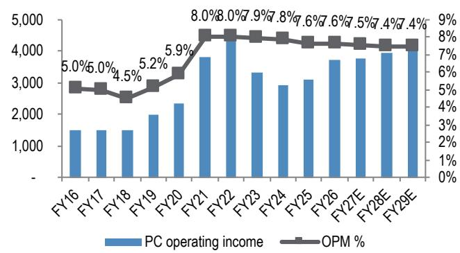  
Source: JPM estimates, Company reports FY16-FY26.

Overall, we model 3% IDG revenue growth in FY27, as PC ASP expansion should more than offset the unit declines. We expect PC margins to decline to 6.8% in FY27 vs. 7.2% in FY26, mainly due to memory cost hikes.

AI breakthrough + general server strength driving a favorable pricing setup

We expect accelerating server shipment growth for Lenovo in FY27 (JPMe 23% YoY growth vs. +13% in FY26), driven by strong MSFT traditional server demand, better-than-expected enterprise server demand, and market share gain in AI servers.

Our research indicates that Lenovo has started GB300 shipments to neocloud customers in late Mar-Q to early Jun-Q, and AI servers could reach \~30% of Lenovo's total ISG revenue in Jun-Q. More importantly, Lenovo's AI server order pipelines have reached US\$21bn+ in Mar-Q and are likely to see continued increase given the strong AI demand, which could help sustain the server revenue momentum in the next few quarters.

Overall, we forecast $\sim 60\%$ ISG revenue growth in FY27, driven by strong server demand, AI server breakthrough, and pricing actions in general servers.

Figure 5: Lenovo server shipments and market share  
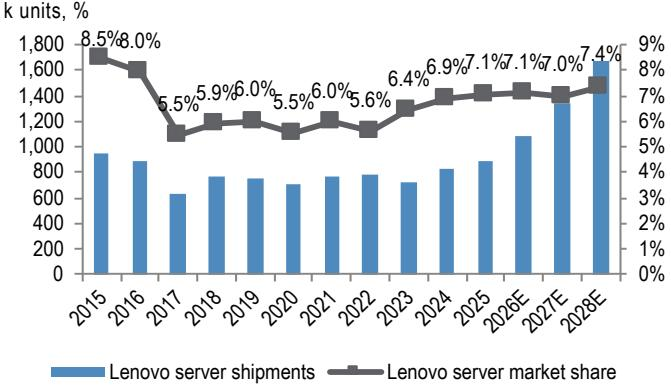  
Source: Gartner® quarterly server tracker, JPM estimates.

Figure 6: Lenovo's ISG Revenue and YoY US\$ in billions, %  
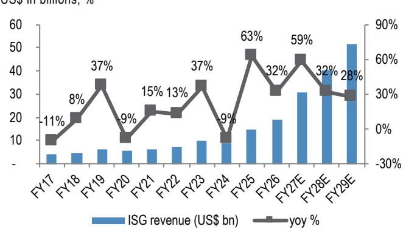  
Source: JPM estimates, Company reports FY17-FY26.

Server OEMs such as Lenovo have enjoyed a favorable pricing dynamics across AI and traditional servers amid strong AI demand and supply constraints. This could more than offset the negative impact from memory component price hikes, in our view. In addition, we believe Lenovo will navigate through this super memory cycle better than peers due to its diversified supplier base (including Chinese suppliers) and scale benefits levered from its PC biz.

Overall, we expect a significant OPM improvement for Lenovo's ISG biz to $5\%$ in FY27 from $0.4\%$ in FY26, driven by favorable pricing dynamics and positive OP leverage. Beyond FY27, we anticipate a sustained ISG growth momentum on the AI-driven multi-year server cycle with continued margin improvement on better scale.

Figure 7: Lenovo's ISG operating income and OPM trend \$ in millions, %  
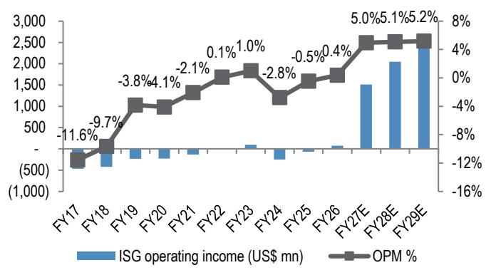  
Source: JPM estimates, Company reports FY17-FY26.

## PE/PB 12m fwd bands

Figure 8: One-year forward P/E band  
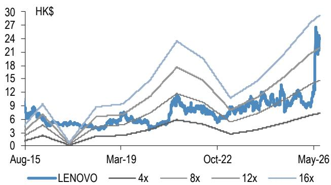  
Source: JPM calculations, Bloomberg Finance L.P. estimates as of close of July 27, 2026. Based on non HKFRS 12M fwd EPS.

Figure 9: One-year forward P/B band  
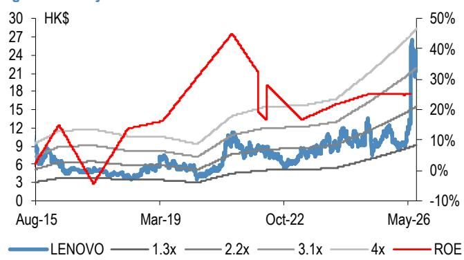  
Source: JPM calculations, Bloomberg Finance L.P. estimates as of close of July 27, 2026.

Table 1: Lenovo earnings revision

<table><tr><td rowspan="2">US$ million, YE Mar</td><td colspan="3">Revised</td><td colspan="3">Prior</td><td colspan="3">Change (%)</td></tr><tr><td>FY27E</td><td>FY28E</td><td>FY29E</td><td>FY27E</td><td>FY28E</td><td>FY29E</td><td>FY27E</td><td>FY28E</td><td>FY29E</td></tr><tr><td>Sales</td><td>97,873</td><td>112,556</td><td>128,139</td><td>93,878</td><td>104,502</td><td>N.A</td><td>4%</td><td>8%</td><td>N.A</td></tr><tr><td>Gross profit</td><td>15,093</td><td>16,811</td><td>18,885</td><td>14,190</td><td>15,234</td><td>N.A</td><td>6%</td><td>10%</td><td>N.A</td></tr><tr><td>Non-HKFRS Operating profit</td><td>4,257</td><td>4,966</td><td>5,881</td><td>3,687</td><td>4,035</td><td>N.A</td><td>15%</td><td>23%</td><td>N.A</td></tr><tr><td>Non-HKFRS Pretax profit</td><td>3,701</td><td>4,463</td><td>5,436</td><td>3,132</td><td>3,528</td><td>N.A</td><td>18%</td><td>27%</td><td>N.A</td></tr><tr><td>Non-HKFRS Net Income</td><td>2,787</td><td>3,353</td><td>4,132</td><td>2,289</td><td>2,605</td><td>N.A</td><td>22%</td><td>29%</td><td>N.A</td></tr><tr><td>Non-HKFRS diluted EPS (US$)</td><td>0.19</td><td>0.23</td><td>0.28</td><td>0.16</td><td>0.18</td><td>N.A</td><td>22%</td><td>29%</td><td>N.A</td></tr><tr><td>Gross Margin</td><td>15.4%</td><td>14.9%</td><td>14.7%</td><td>15.1%</td><td>14.6%</td><td>N.A</td><td>31bps</td><td>36bps</td><td>N.A</td></tr><tr><td>Operating Margin</td><td>4.3%</td><td>4.4%</td><td>4.6%</td><td>3.9%</td><td>3.9%</td><td>N.A</td><td>42bps</td><td>55bps</td><td>N.A</td></tr><tr><td>Net Margin</td><td>2.8%</td><td>3.0%</td><td>3.2%</td><td>2.4%</td><td>2.5%</td><td>N.A</td><td>41bps</td><td>49bps</td><td>N.A</td></tr><tr><td>OPEX Ratio</td><td>11.1%</td><td>10.5%</td><td>10.1%</td><td>11.2%</td><td>10.7%</td><td>N.A</td><td>-12bps</td><td>-19bps</td><td>N.A</td></tr><tr><td>Segment Revenue</td><td></td><td></td><td></td><td></td><td></td><td></td><td></td><td></td><td></td></tr><tr><td>PCSD</td><td>50,094</td><td>53,194</td><td>55,484</td><td>49,960</td><td>53,042</td><td>N.A</td><td>0%</td><td>0%</td><td>N.A</td></tr><tr><td>MBG</td><td>10,889</td><td>11,314</td><td>11,906</td><td>10,889</td><td>11,344</td><td>N.A</td><td>0%</td><td>0%</td><td>N.A</td></tr><tr><td>ISG</td><td>30,517</td><td>40,362</td><td>51,642</td><td>26,436</td><td>31,988</td><td>N.A</td><td>15%</td><td>26%</td><td>N.A</td></tr><tr><td>SSG</td><td>11,795</td><td>13,860</td><td>16,135</td><td>11,795</td><td>13,860</td><td>N.A</td><td>0%</td><td>0%</td><td>N.A</td></tr><tr><td>Segment PTI</td><td></td><td></td><td></td><td></td><td></td><td></td><td></td><td></td><td></td></tr><tr><td>PCSD</td><td>3,766</td><td>3,958</td><td>4,129</td><td>3,757</td><td>3,947</td><td>N.A</td><td>0%</td><td>0%</td><td>N.A</td></tr><tr><td>MBG</td><td>410</td><td>442</td><td>462</td><td>410</td><td>443</td><td>N.A</td><td>0%</td><td>0%</td><td>N.A</td></tr><tr><td>ISG</td><td>1,512</td><td>2,049</td><td>2,673</td><td>823</td><td>824</td><td>N.A</td><td>84%</td><td>149%</td><td>N.A</td></tr><tr><td>SSG</td><td>2,462</td><td>2,755</td><td>3,207</td><td>2,462</td><td>2,755</td><td>N.A</td><td>0%</td><td>0%</td><td>N.A</td></tr></table>

Source: JPM estimates.

Table 2: Lenovo: JPM vs Bloomberg Consensus Estimates

<table><tr><td rowspan="2">US$ million, YE Mar</td><td colspan="4">JPMe</td><td colspan="4">Consensus</td><td colspan="4">Difference (%)</td></tr><tr><td>1QFY27E</td><td>2QFY27E</td><td>FY27E</td><td>FY28E</td><td>1QFY27E</td><td>2QFY27E</td><td>FY27E</td><td>FY28E</td><td>1QFY27E</td><td>2QFY27E</td><td>FY27E</td><td>FY28E</td></tr><tr><td>Sales</td><td>23,270</td><td>25,165</td><td>97,873</td><td>112,556</td><td>22,258</td><td>23,744</td><td>94,069</td><td>105,239</td><td>5%</td><td>6%</td><td>4%</td><td>7%</td></tr><tr><td>Gross profit</td><td>3,650</td><td>3,845</td><td>15,093</td><td>16,811</td><td>3,522</td><td>3,687</td><td>14,664</td><td>16,367</td><td>4%</td><td>4%</td><td>3%</td><td>3%</td></tr><tr><td>Operating profit</td><td>969</td><td>1,094</td><td>4,189</td><td>4,898</td><td>634</td><td>964</td><td>3,915</td><td>4,881</td><td>53%</td><td>13%</td><td>7%</td><td>0%</td></tr><tr><td>Pretax profit</td><td>578</td><td>920</td><td>3,295</td><td>4,275</td><td>609</td><td>609</td><td>3,231</td><td>4,249</td><td>-5%</td><td>51%</td><td>2%</td><td>1%</td></tr><tr><td>Net Income</td><td>403</td><td>676</td><td>2,396</td><td>3,180</td><td>432</td><td>432</td><td>2,485</td><td>3,127</td><td>-7%</td><td>57%</td><td>-4%</td><td>2%</td></tr><tr><td>Gross Margin</td><td>15.7%</td><td>15.3%</td><td>15.4%</td><td>14.9%</td><td>15.8%</td><td>15.5%</td><td>15.6%</td><td>15.6%</td><td>-14bps</td><td>-25bps</td><td>-17bps</td><td>-62bps</td></tr><tr><td>Operating Margin</td><td>4.2%</td><td>4.3%</td><td>4.3%</td><td>4.4%</td><td>2.8%</td><td>4.1%</td><td>4.2%</td><td>4.6%</td><td>131bps</td><td>29bps</td><td>12bps</td><td>-29bps</td></tr><tr><td>Net Margin</td><td>1.7%</td><td>2.7%</td><td>2.4%</td><td>2.8%</td><td>1.9%</td><td>1.8%</td><td>2.6%</td><td>3.0%</td><td>-21bps</td><td>87bps</td><td>-19bps</td><td>-15bps</td></tr><tr><td>OPEX Ratio</td><td>11.5%</td><td>10.9%</td><td>11.1%</td><td>10.6%</td><td>13.0%</td><td>11.5%</td><td>11.4%</td><td>10.9%</td><td>-145bps</td><td>-54bps</td><td>-29bps</td><td>-33bps</td></tr></table>

Source: JPM estimates, Bloomberg Finance L.P. estimates as of close of July 27, 2026. Numbers are based on HK-IFRS.

Table 3: Lenovo quarterly earnings table

<table><tr><td rowspan="2" colspan="2">US$ in mns, YE March</td><td colspan="4">FY26</td><td colspan="4">FY27E</td><td colspan="4">FY28E</td><td rowspan="2">FY26</td><td rowspan="2">FY27E</td><td rowspan="2">FY28E</td><td rowspan="2">FY29E</td></tr><tr><td>1Q</td><td>2Q</td><td>3Q</td><td>4Q</td><td>1QE</td><td>2QE</td><td>3QE</td><td>4QE</td><td>1QE</td><td>2QE</td><td>3QE</td><td>4QE</td></tr><tr><td>Revenue</td><td>18,830</td><td>20,452</td><td>22,204</td><td>21,588</td><td>23,270</td><td>25,165</td><td>25,796</td><td>23,641</td><td>26,299</td><td>28,956</td><td>30,148</td><td>27,153</td><td>83,075</td><td>97,873</td><td>112,556</td><td>128,139</td><td></td></tr><tr><td>COGS</td><td>(16,055)</td><td>(17,305)</td><td>(18,855)</td><td>(18,049)</td><td>(19,620)</td><td>(21,320)</td><td>(21,893)</td><td>(19,947)</td><td>(22,308)</td><td>(24,681)</td><td>(25,734)</td><td>(23,022)</td><td>(70,265)</td><td>(82,780)</td><td>(95,745)</td><td>(109,254)</td><td></td></tr><tr><td>Gross Profit</td><td>2,774</td><td>3,147</td><td>3,349</td><td>3,539</td><td>3,650</td><td>3,845</td><td>3,904</td><td>3,694</td><td>3,990</td><td>4,275</td><td>4,414</td><td>4,131</td><td>12,809</td><td
