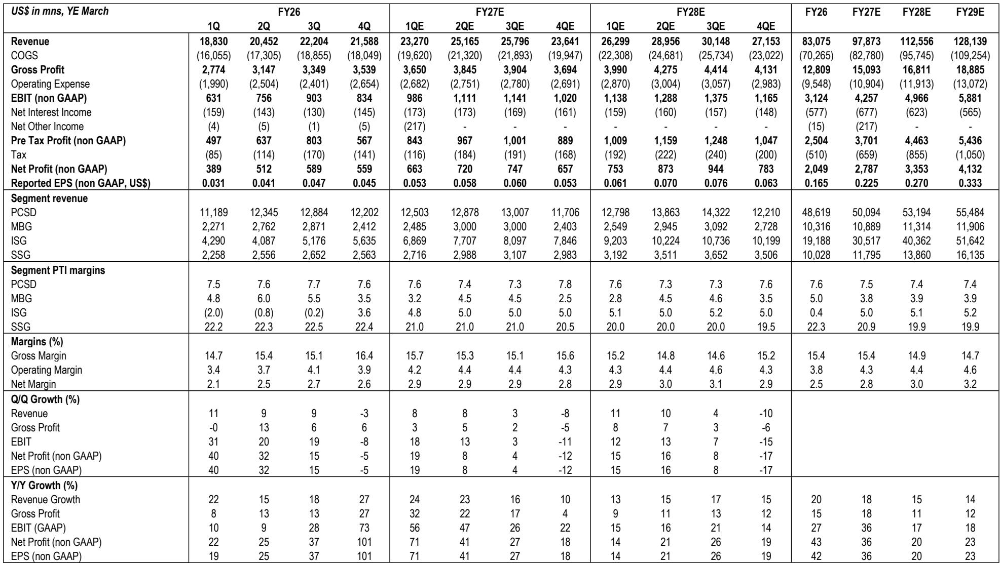
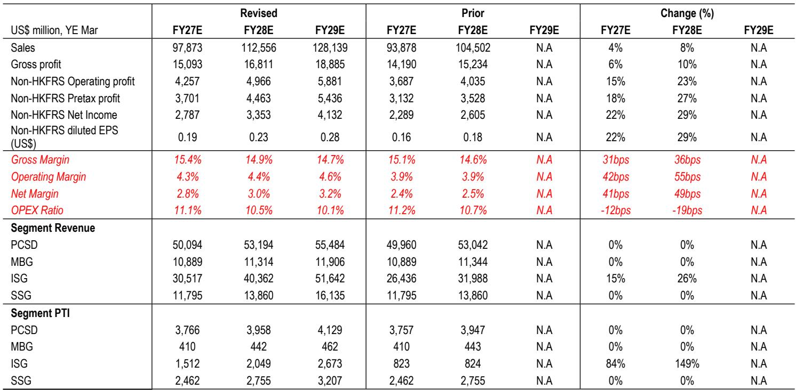
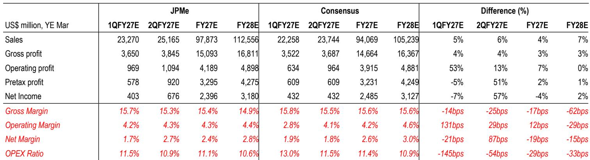

# JPM：联想集团业务与近期数据观察

JPM在最新研报中将联想集团评级从“中性”上调至“观点偏积极”，核心判断是服务器业务的利润改善速度正在超过PC业务的不确定性。报告认为，AI服务器订单的快速增长和通用服务器的定价环境正在为联想创造一个新的利润拐点。

这份研报发布于7月27日，距离联想3月季度业绩公布约两个月。在此之前，联想报价已上涨约85%，同期恒生指数基本持平。

## 1. AI服务器收入占比已超过三成

JPM通过行业调研发现，联想在6月季度的AI相关收入已占基础设施方案集团（ISG）总收入的30%以上，且这一势头有望延续至2026年下半年。更重要的是，联想的AI服务器订单管道在3月季度已超过210亿美元，并仍在增长。

报告指出，联想已从3月末至6月初开始向新云客户交付GB300服务器。在GPU和传统服务器均面临供应紧张的情况下，服务器OEM厂商整体享有有利的定价环境。联想凭借多元化的供应商基础，包括中国供应商，以及ODM加品牌的双重业务模式，在组件约束中表现优于同行。

> **KC评论：** 30%的AI收入占比和210亿美元的订单管道是两个关键数字。前者说明联想在AI服务器领域的渗透已从边缘走向核心，后者则提供了未来几个季度的收入能见度。这两组数据是支撑评级上调的主要事实依据。

## 2. ISG利润率从0.4%向5%的跃迁路径

JPM预计联想ISG业务在FY27的营业利润率将从FY26的0.4%提升至5%，驱动因素包括有利的定价动态和运营杠杆。报告模型显示，FY27 ISG收入同比增长约60%，达到305亿美元。

这一利润率改善幅度相当显著。从历史数据看，联想ISG长期处于低利润甚至亏损状态。报告认为，AI驱动的多年服务器周期将为利润率持续改善提供支撑，规模效应将逐步显现。

在盈利预测方面，JPM将FY27和FY28的调整后净利润分别上调22%和29%，主要来自ISG业务利润的大幅上修。ISG的税前利润在FY27和FY28分别被上调84%和149%，而PC和手机业务的利润预测基本保持不变。

## 3. PC业务利润率韧性好于预期

尽管PC行业面临内存价格上涨和Windows 10替换需求减弱的不利因素，JPM认为联想的PC业务利润率仍具韧性。报告数据显示，联想在3月季度的PC营业利润率维持在7.6%，环比基本持平。

联想在PC市场的表现优于行业整体。根据Gartner数据，2026年上半年联想PC出货量同比增长3%，而行业整体仅增长1%。报告将这一表现归因于更好的供应链执行和市场份额获取。

展望下半年，JPM预计PC出货量将呈现50%对50%的上下半年分布，弱于传统的45%对55%的季节性规律。但联想凭借规模优势、成本控制和产品组合管理，预计仍能维持每季度约10至11亿美元的营业利润。

## 4. 评级上调的时间窗口与不确定性

JPM此前对联想持中性立场，主要担忧PC盈利的节奏变化不确定性。但报告认为，服务器业务的强劲表现现在已足以抵消消费电子业务的疲软。随着GB300的推出，联想在AI服务器供应链中的地位正在提升，有望在未来几年受益于新云需求。

报告同时列出了几个需要关注的不确定性因素。AI资本支出可能在2027年节奏变化，组件成本上升可能对利润率造成大于预期的不确定性。不过，报告也指出，未来一年内存价格涨幅的节奏变化，可能部分缓解组件成本上升带来的利润率不确定性。

> **KC评论：** 这次评级上调的关键逻辑是“服务器利润改善的幅度和速度超过了PC的不确定性”。对于跟踪联想的研究者而言，ISG利润率能否从0.4%持续提升至5%以上，将是验证这一判断的核心观察点。订单管道的转化率和GB300的交付节奏，是未来几个季度最值得跟踪的先行指标。

For informational purposes only. Portions may be generated,translated,summarized,or edited with AI assistance based on source materials and may contain omissions or errors. Please verify independently. This is not investment,legal,tax,accounting,or other professional advice.

For informational purposes only. Portions may be generated,translated,summarized,or edited with AI assistance based on source materials and may contain omissions or errors. Please verify independently. This is not investment,legal,tax,accounting,or other professional advice.

