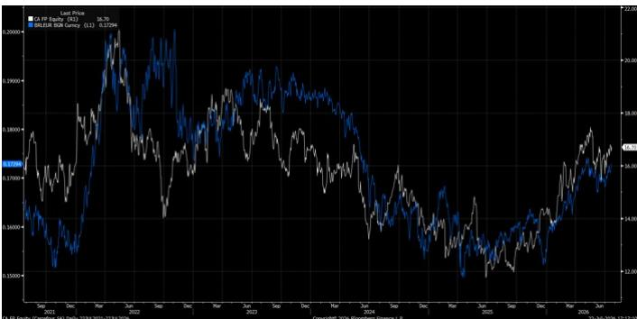
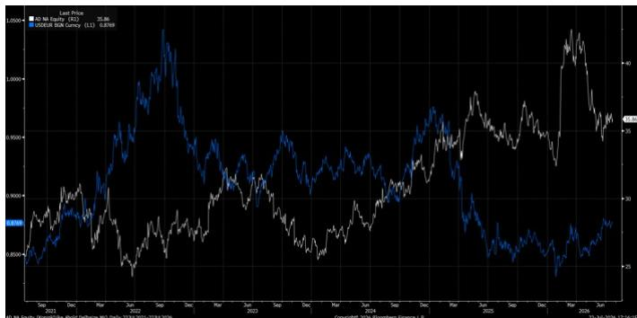

## Lost in translation

FX tracker - sensitivities and correlations

Foreign exchange has re-emerged as a meaningful driver of both fundamentals and factor behaviour across the group, and it tends to matter most precisely when volatility rises and ‘macro’ overwhelms single-name narratives. In this first publication of our new Food Retail FX tracker, we attempt to refresh observers on where our companies' exposures sit in the financial statements – what is translation versus true economic/transaction impact, and what shows up on the balance sheet through net assets, funding and hedging. We will be updating it quarterly, and more frequently if warranted by large FX moves. Within, we also pair company-quoted sensitivities with observed market correlations. See for company-specific exposure and sensitivity analysis (company-calculated as well as JPM calculated). Overall, we would be mindful of mixing mechanical earnings tailwinds driven by FX and interest rates, with improving fundamentals.

## Key take-aways

1. Companies within our coverage with the largest foreign-denominated revenue exposure include Jeronimo (PLN c70%), Ahold-Delhaize (USD c60%) and Carrefour (BRL c20%). This is equally the case from an EBIT standpoint (JMT c85%, AD c65%, Carrefour ≥30%). From a balance sheet perspective, Jeronimo carries material foreign currency-denominated debt (60% in pesos, 25% in zloty).

2. Based on our sensitivity analysis, FX swings have the biggest Price Target impact for Jeronimo Martins.

3. Carrefour: Share price performance is often highly correlated with BRL/EUR, reflecting both fundamentals and positioning: (i) Brazil contributes ~33% of group EBIT, and (ii) BRL also serves as a market proxy for Brazilian macro risk, which observers frequently treat as a key valuation driver. We would be mindful of mixing these share price and P&L tailwinds with improving fundamentals (i.e. volumes and margins should remain capped for Carrefour in Brazil as Cash & Carry remains structurally competitive, despite improving FX, SELIC and some re-rating in the IBOV Index).

4. Ahold Delhaize: Share performance is less tightly linked to USD/EUR movements than it might appear at first glance, as observers tend to anchor more on its defensive fundamentals and stable cash returns than on near-term FX fluctuations. As is the case with CA FP, EURUSD YTD is mechanically helping AD earnings, and yet US volumes and margins would continue to contract through the year on our forecasts, eventually making company guidance challenging.

5. National retailers with no or barely any FX exposure include Colruyt, Domino's and Greggs.

European Food Retail

Borja Olcese AC
(34-91) 516-1511
borja.olcese@JPM.com
JPM Securities plc

Palak Garg
(91-22) 6157-5102
palak.x2.garg@JPM.com
JPM India Private Limited

Specialist Sales contact details:

Olivia Petronilho - Specialist Sales - European Consumer
(44-20) 3493-3709
olivia.b.petronilho@JPM.com

## Holistic set of trackers

With the launch of this new product, JPM Research now offers a holistic set of materials to track the sector – see links to the latest versions below:

Table 1: European Food Retail Trackers

<table><tr><td>Key periodicals</td><td>Description</td><td>Frequency of updates</td><td>Link</td></tr><tr><td>Top line tracker: UK</td><td>Tracks UK players' market share and growth (till roll, grocery, Food & Drink)</td><td>Monthly</td><td>Link</td></tr><tr><td>Top line tracker: France</td><td>Tracks French retailers' market share and growth</td><td>Monthly</td><td>Link</td></tr><tr><td>Top line tracker: Poland</td><td>Poland monthly retail sales across categories (including Food, discretionary, textiles)</td><td>Monthly</td><td>Link</td></tr><tr><td>Top line tracker: US</td><td>Regionally weighted Circana data for the food retail channel to estimate ID sales per retailer</td><td>Fortnightly</td><td>Link</td></tr><tr><td>Grocery macro indicators</td><td>Key grocery macro indicators per market (Food CPI, Food PPI) and category-wise inflation</td><td>Monthly (last week)</td><td>Link</td></tr><tr><td>Pricing tracker: UK Grocers</td><td>Competitiveness of UK food retailers tracked via price, availability and promotional intensity</td><td>Weekly</td><td>Link</td></tr><tr><td>Pricing tracker: US Grocers</td><td>Pricing survey of LFL baskets across Albertsons, Kroger, Sprouts, Target, and Walmart</td><td>Every two months</td><td>Link</td></tr><tr><td>All things management</td><td>Management incentive plans (vs company outlook) and key management changes</td><td>Quarterly1</td><td>Link</td></tr><tr><td>Questions for management</td><td>Investor handbook with key questions per retailer focused on value drivers & gaps vs the market view</td><td>Quarterly (post earnings)</td><td>Link</td></tr><tr><td>Buyback tracker</td><td>Ongoing buybacks, pace of execution vs guidance, ADTV, potential buyback upgrades</td><td>Monthly (15th)1</td><td>Link</td></tr><tr><td>Holders tracker</td><td>Company-wise shareholder landscape with shifts in geographic ownership, top holders, internal stakes</td><td>Quarterly1</td><td>Link</td></tr><tr><td>FX tracker</td><td>Company-wise FX exposure, foreign exchange risk management, Fx rate sensitivity to share price</td><td>Quarterly1</td><td>Link</td></tr><tr><td>Sector presentation</td><td>Sector thesis and company-wise thesis, with latest market data and JPM vs consensus</td><td>Monthly (1st)</td><td>Link</td></tr><tr><td>Valuation sheet</td><td>Main valuation metrics and relative performance of the grocers under our coverage</td><td>Every Wednesday</td><td>Link</td></tr><tr><td>Key sector metrics</td><td>Coverage stance, valuation, JPM vs consensus, LFL/market share, summary of all trackers</td><td>Fortnightly (alternate Monday)</td><td>Link</td></tr></table>

1. Also published on top of the usual run-rate in the event of relevant news flow. Source: JPM.

## Sector – Charts & Tables

Figure 1: FX Dashboard

<table><tr><td>Currency Pair</td><td>Region</td><td>Spot</td><td>%YTD</td><td>%5D</td><td>%1M</td><td>%3M</td><td>%6M</td><td>%1Y</td></tr><tr><td colspan="9">For Europe Players</td></tr><tr><td>EURRON Curncy</td><td>Romania</td><td>5.23</td><td>2.8</td><td>0.1</td><td>(0.2)</td><td>(2.8)</td><td>(2.6)</td><td>(3.1)</td></tr><tr><td>EURPLN Curncy</td><td>Poland</td><td>4.32</td><td>2.5</td><td>0.3</td><td>0.8</td><td>(1.7)</td><td>(2.8)</td><td>(1.4)</td></tr><tr><td>EURARS Curncy</td><td>Argentina</td><td>1,704.11</td><td>0.0</td><td>(0.8)</td><td>1.5</td><td>(2.5)</td><td>1.4</td><td>(12.0)</td></tr><tr><td>EURGBP Curncy</td><td>UK</td><td>0.85</td><td>(1.9)</td><td>(0.6)</td><td>(0.8)</td><td>1.3</td><td>1.7</td><td>1.5</td></tr><tr><td>EURUSD Curncy</td><td>USA</td><td>1.14</td><td>(3.2)</td><td>(0.4)</td><td>(0.4)</td><td>(3.0)</td><td>(5.6)</td><td>(1.9)</td></tr><tr><td>EURBRL Curncy</td><td>Brazil</td><td>5.81</td><td>(10.1)</td><td>0.1</td><td>(1.6)</td><td>0.6</td><td>7.5</td><td>11.5</td></tr><tr><td>EURCOP Curncy</td><td>Colombia</td><td>3,649.96</td><td>(17.6)</td><td>1.9</td><td>(6.3)</td><td>16.9</td><td>19.7</td><td>32.4</td></tr><tr><td colspan="9">For UK Players</td></tr><tr><td>GBPHUF Curncy</td><td>Hungary</td><td>4,024</td><td>10.1</td><td>2.9</td><td>10.1</td><td>5.7</td><td>11.0</td><td>19.5</td></tr><tr><td>GBPEUR Curncy</td><td>Europe (Euros)</td><td>1.17</td><td>2.0</td><td>0.6</td><td>0.8</td><td>(1.3)</td><td>(1.7)</td><td>(1.5)</td></tr><tr><td>GBPCZK Curncy</td><td>Czech Republic</td><td>28</td><td>1.9</td><td>0.8</td><td>0.4</td><td>(0.5)</td><td>(1.4)</td><td>0.3</td></tr></table>

As of July 27, 2026.  
Source: Bloomberg Finance L.P.

Figure 2: Coverage summary – exposure via revenue/EBIT

<table><tr><td>Company</td><td>Fundamental Currency</td><td>Exposure to other currencies</td><td>Currency(s)</td><td>Revenue Exposure - 2025 (%)</td><td>OpEx Exposure - 2025 (%)</td></tr><tr><td>AD NA</td><td>EUR</td><td>Yes</td><td>USD</td><td>60%</td><td>65%</td></tr><tr><td>BME</td><td>GBP</td><td>Yes</td><td>EUR</td><td>10%</td><td>7%</td></tr><tr><td>CA FP</td><td>EUR</td><td>Yes</td><td>PLN, BRL, ARS</td><td>3%/20%/4%</td><td>PLN undisclosed, BRL - 32%/ARS - 5%</td></tr><tr><td>COLR BB</td><td>EUR</td><td>No</td><td></td><td></td><td></td></tr><tr><td>DOM LN</td><td>GBP</td><td>No</td><td></td><td></td><td></td></tr><tr><td>GRG LN</td><td>GBP</td><td>No</td><td></td><td></td><td></td></tr><tr><td>JMT PL</td><td>EUR</td><td>Yes</td><td>PLN, COP</td><td>73%/9%</td><td>84%/6%</td></tr><tr><td>SBRY LN</td><td>GBP</td><td>No</td><td></td><td></td><td></td></tr><tr><td>TSCO LN</td><td>GBP</td><td>Yes</td><td>EUR, CZK, HUF</td><td>6%/2%/2%</td><td>4%</td></tr></table>

Source: Company data, JPM.

Figure 3: Carrefour share price vs BRLEUR Currency – 5Y Chart  
  
Source: Bloomberg Finance L.P.

Figure 4: Ahold share price vs USDEUR Currency – 5Y Chart  
  
Source: Bloomberg Finance L.P.

# Stock-specific exposure

## Ahold Delhaize

Ahold Delhaize's foreign currency exposure is mainly driven by the large US business (60-65% rev/EBIT exposure) vs Euro reporting and HQ costs all in Euros, so movements in the USD/EUR rate have a direct impact on reported net sales, operating income and EPS. The group sometimes explicitly bases guidance (e.g., EPS growth and margin outlook) on an assumed average USD/EUR exchange rate and highlights FX volatility as a key macro uncertainty, indicating that the translation of US earnings into euros is its principal currency risk, partly offset by a diversified European footprint and active treasury management of FX exposure. On the debt side, Ahold Delhaize's net debt is substantial (over €15bn in recent reports) and includes notes and financing obligations. While much of its capital structure is euro-denominated, the company does have exposure to the US dollar (c20% of loans and credit facilities).

Foreign currency sensitivity. As of December 28, 2025, Ahold Delhaize carried out a sensitivity analysis with regard to changes in foreign exchange rates to revalue dollar-denominated cash, cash equivalents and debt in its balance sheet at year-end. Assuming the euro had strengthened (weakened) by 20% against the US dollar compared to the actual 2025 rate, with all other variables held constant, the hypothetical result on income before income taxes would have been an increase (decrease) of €8m (2024: an increase (decrease) of €12m), as a result of the foreign exchange revaluation of US dollar-denominated monetary assets and liabilities held by non-US dollar functional currency subsidiaries. The loss on foreign exchange recognised in the 2025 income statement – related to the revaluation of unhedged leases reported in the balance sheet – amounted to €12m (2024: loss of €5m). The strengthening (weakening) of the euro by 20% against the other currencies, with all other variables held constant, would result in a loss (gain) of €296m (2024: €194m).

Figure 5: Company revenue and EBIT breakdown – JPM estimates

<table><tr><td colspan="7">Ahold Delhaize</td></tr><tr><td>in EUR mn</td><td>2025</td><td>2026E</td><td>2027E</td><td>2028E</td><td>2029E</td><td>2030E</td></tr><tr><td>Revenues</td><td></td><td></td><td></td><td></td><td></td><td></td></tr><tr><td>Group</td><td>92,352</td><td>93,062</td><td>96,567</td><td>99,546</td><td>102,681</td><td>105,906</td></tr><tr><td>US</td><td>53,064</td><td>52,620</td><td>54,871</td><td>56,591</td><td>58,427</td><td>60,314</td></tr><tr><td>% of total</td><td>57%</td><td>57%</td><td>57%</td><td>57%</td><td>57%</td><td>57%</td></tr><tr><td>Europe</td><td>39,290</td><td>40,442</td><td>41,695</td><td>42,956</td><td>44,254</td><td>45,592</td></tr><tr><td>% of total</td><td>43%</td><td>43%</td><td>43%</td><td>43%</td><td>43%</td><td>43%</td></tr><tr><td colspan="7"></td></tr><tr><td>Adjusted EBIT, IFRS 16</td><td></td><td></td><td></td><td></td><td></td><td></td></tr><tr><td>Group</td><td>3,734</td><td>3,722</td><td>3,776</td><td>3,861</td><td>4,031</td><td>4,207</td></tr><tr><td>US</td><td>2,384</td><td>2,324</td><td>2,332</td><td>2,349</td><td>2,425</td><td>2,503</td></tr><tr><td>% of total</td><td>64%</td><td>62%</td><td>62%</td><td>61%</td><td>60%</td><td>60%</td></tr><tr><td>Europe</td><td>1,489</td><td>1,490</td><td>1,564</td><td>1,632</td><td>1,726</td><td>1,824</td></tr><tr><td>% of total</td><td>40%</td><td>40%</td><td>41%</td><td>42%</td><td>43%</td><td>43%</td></tr><tr><td>Others</td><td>-139</td><td>-92</td><td>-120</td><td>-120</td><td>-120</td><td>-120</td></tr><tr><td>% of total</td><td>-4%</td><td>-2%</td><td>-3%</td><td>-3%</td><td>-3%</td><td>-3%</td></tr></table>

Source: Company data (2025), JPM estimates.

Figure 6: EURUSD sensitivity – implied JPM PT

<table><tr><td>EURUSD</td><td>EPS 2027</td><td>EPS 2028</td><td>EPS 2029</td><td>EPS 2030</td><td>JPM PT</td><td>% Change</td></tr><tr><td></td><td>2.71</td><td>2.80</td><td>2.97</td><td>3.16</td><td>24.05</td><td></td></tr><tr><td>1.01</td><td>2.93</td><td>3.02</td><td>3.21</td><td>3.41</td><td>25.38</td><td>5.53%</td></tr><tr><td>1.06</td><td>2.84</td><td>2.93</td><td>3.11</td><td>3.31</td><td>24.82</td><td>3.18%</td></tr><tr><td>1.11</td><td>2.75</td><td>2.84</td><td>3.01</td><td>3.21</td><td>24.30</td><td>1.04%</td></tr><tr><td>1.16</td><td>2.67</td><td>2.76</td><td>2.93</td><td>3.12</td><td>23.84</td><td>-0.91%</td></tr><tr><td>1.21</td><td>2.60</td><td>2.69</td><td>2.85</td><td>3.04</td><td>23.40</td><td>-2.70%</td></tr><tr><td>1.26</td><td>2.53</td><td>2.62</td><td>2.78</td><td>2.97</td><td>23.01</td><td>-4.34%</td></tr><tr><td>1.31</td><td>2.47</td><td>2.55</td><td>2.72</td><td>2.90</td><td>22.64</td><td>-5.87%</td></tr></table>

Source: JPM estimates.

## B&M

B&M's financial exposure to foreign currency is relatively limited and primarily arises from sourcing products in US dollars and euros while reporting in sterling, with a largely UK- and France-based store estate and revenues in local currency (France c10% of revs/7% of EBIT). The main FX impact is on gross margin and cost of goods sold where a part of the purchases are dollar-denominated, which B&M manages through foreign exchange hedging; for example, its statutory gross margin has recently benefitted from favourable hedge accounting, indicating that currency hedges can materially influence reported profitability. Overall, B&M does not have the kind of structural multi-currency operational and financing exposure seen in large global retailers, but it remains sensitive to movements in major sourcing currencies (notably USD) and uses hedging to smooth these effects. This risk is not considered material to the business as amounts owed in foreign currency are short term of up to 30 days and are of a relatively modest nature. Transaction exposures, including those associated with forecast transactions, are hedged when known, principally using forward currency contracts.

Figure 7: Foreign currency sensitivity

<table><tr><td>As at</td><td>Change in USD rate</td><td>28 March 2026 £'m</td><td>29 March 2025 £'m</td></tr><tr><td rowspan="2">Effect on profit before tax</td><td>+2.5%</td><td>(10)</td><td>(10)</td></tr><tr><td>-2.5%</td><td>10</td><td>10</td></tr><tr><td rowspan="2">Effect on other comprehensive income</td><td>+2.5%</td><td>(11)</td><td>(13)</td></tr><tr><td>-2.5%</td><td>11</td><td>14</td></tr></table>

Source: Company data.

## Carrefour

Carrefour has significant exposure to foreign currency risk because a large share of its sales and operations are outside France, notably in Brazil and Argentina, and movements in these currencies have a material impact on reported sales, recurring operating income and financial items, despite the use of various hedging instruments. A key aspect of this exposure is that Argentina is classified as a hyper-inflationary economy under IAS 29, which requires inflation restatement of local financial statements and translation of the full profit and loss at the year-end exchange rate; this amplifies negative accounting effects on Carrefour's euro-denominated results and equity when the Argentine peso depreciates, even if the underlying business performance is robust.

Figure 8: Foreign currency sensitivity  
The following table shows the effect of an increase/decrease in exchange rates on currency instruments:

<table><tr><td rowspan="2">(in millions of euros)(- = loss; + = gain)</td><td colspan="2">10% decrease</td><td colspan="2">10% Increase</td></tr><tr><td>Impact on shareholders' equity (OCI)</td><td>Impact on Income statement</td><td>Impact on shareholders' equity (OCI)</td><td>Impact on Income statement</td></tr><tr><td>Position EUR/USD</td><td>-</td><td>47</td><td>-</td><td>(47)</td></tr><tr><td>Position EUR/HKD</td><td>-</td><td>0</td><td>-</td><td>(0)</td></tr><tr><td>Position EUR/PLN</td><td>-</td><td>5</td><td>-</td><td>(5)</td></tr><tr><td>Position EUR/RON</td><td>-</td><td>1</td><td>-</td><td>(1)</td></tr><tr><td>Position USD/RON</td><td>-</td><td>(3)</td><td>-</td><td>3</td></tr><tr><td>Position CHF/EUR</td><td>-</td><td>(1)</td><td>-</td><td>1</td></tr><tr><td>Position BRL/EUR</td><td>(12)</td><td>-</td><td>15</td><td>-</td></tr><tr><td>Position GBP/EUR</td><td>-</td><td>0</td><td>-</td><td>(0)</td></tr><tr><td>TOTAL EFFECT</td><td>(12)</td><td>49</td><td>15</td><td>(50)</td></tr></table>

Source: Company data.

Figure 9: Company revenue and EBIT breakdown – JPM estimates

<table><tr><td colspan="7">Carrefour</td></tr><tr><td>in EUR mn</td><td>2025</td><td>2026E</td><td>2027E</td><td>2028E</td><td>2029E</td><td>2030E</td></tr><tr><td colspan="7">Revenues</td></tr><tr><td>Group</td><td>91,485</td><td>91,113</td><td>92,333</td><td>93,901</td><td>95,565</td><td>97,308</td></tr><tr><td>France, Spain, Belgium (Euros)</td><td>62,631</td><td>63,975</td><td>64,479</td><td>64,996</td><td>65,525</td><td>66,068</td></tr><tr><td>% of total</td><td>68%</td><td>70%</td><td>70%</td><td>69%</td><td>69%</td><td>68%</td></tr><tr><td>Poland</td><td>2,385</td><td>2,328</td><td>2,303</td><td>2,292</td><td>2,303</td><td>2,315</td></tr><tr><td>% of total</td><td>3%</td><td>3%</td><td>2%</td><td>2%</td><td>2%</td><td>2%</td></tr><tr><td>Brazil</td><td>19,585</td><td>20,833</td><td>21,109</td><td>21,745</td><td>22,400</td><td>23,075</td></tr><tr><td>% of total</td><td>21%</td><td>23%</td><td>23%</td><td>23%</td><td>23%</td><td>24%</td></tr><tr><td>Argentina</td><td>3,709</td><td>3,977</td><td>4,441</td><td>4,869</td><td>5,337</td><td>5,850</td></tr><tr><td>% of total</td><td>4%</td><td>4%</td><td>5%</td><td>5%</td><td>6%</td><td>6%</td></tr><tr><td colspan="7"></td></tr><tr><td colspan="7">Recurring Operating Income/ EBIT</td></tr><tr><td>Group</td><td>2,158</td><td>2,212</td><td>2,271</td><td>2,424</td><td>2,594</td><td>2,684</td></tr><tr><td>Europe (France, Spain, Belgium, Poland)</td><td>1,464</td><td>1,482</td><td>1,500</td><td>1,572</td><td>1,665</td><td>1,715</td></tr><tr><td>% of total</td><td>68%</td><td>67%</td><td>66%</td><td>65%</td><td>64%</td><td>64%</td></tr><tr><td>Brazil</td><td>709</td><td>709</td><td>728</td><td>789</td><td>854</td><td>879</td></tr><tr><td>% of total</td><td>33%</td><td>32%</td><td>32%</td><td>33%</td><td>33%</td><td>33%</td></tr><tr><td>Argentina</td><td>70</td><td>92</td><td>113</td><td>133</td><td>146</td><td>160</td></tr><tr><td>% of total</td><td>3%</td><td>4%</td><td>5%</td><td>5%</td><td>6%</td><td>6%</td></tr></table>

Poland-specific EBIT is not disclosed  
Source: Company data (2025), JPM estimates.

Figure 10: EURBRL sensitivity – implied JPM PT

<table><tr><td>EURBRL</td><td>EPS 2027</td><td>EPS 2028</td><td>EPS 2029</td><td>EPS 2030</td><td>JPM PT</td><td>% Change</td></tr><tr><td></td><td>1.60</td><td>1.74</td><td>1.90</td><td>1.98</td><td>8.97</td><td></td></tr><tr><td>4.28</td><td>1.87</td><td>2.04</td><td>2.22</td><td>2.31</td><td>10.88</td><td>21.26%</td></tr><tr><td>4.78</td><td>1.78</td><td>1.93</td><td>2.10</td><td>2.19</td><td>10.22</td><td>13.85%</td></tr><tr><td>5.28</td><td>1.70</td><td>1.85</td><td>2.01</td><td>2.10</td><td>9.67</td><td>7.78%</td></tr><tr><td>5.78</td><td>1.64</td><td>1.78</td><td>1.94</td><td>2.02</td><td>9.22</td><td>2.71%</td></tr><tr><td>6.28</td><td>1.58</td><td>1.72</td><td>1.88</td><td>1.96</td><td>8.83</td><td>-1.57%</td></tr><tr><td>6.78</td><td>1.54</td><td>1.67</td><td>1.82</td><td>1.90</td><td>8.50</td><td>-5.25%</td></tr><tr><td>7.28</td><td>1.50</td><td>1.63</td><td>1.78</td><td>1.85</td><td>8.22</td><td>-8.44%</td></tr></table>

Source: JPM estimates.

## Colruyt

Colruyt's foreign currency exposure appears relatively limited compared with multinational retailers because the group reports in euros and its core business is concentrated in Belgium and neighbouring European markets. Its main currency risk is transactional rather than translational: it arises from purchasing goods and services in foreign currencies, especially where import or supplier contracts are not denominated in euros, and from any foreign operations or investments outside the euro area if applicable. Exchange rate risks as a result of consolidating revenues and costs of subsidiaries not reporting in euros are not hedged. The group has positions in EUR/INR, EUR/RON, and USD/EUR (not material). On debt, Colruyt's reported financial debt is largely euro-denominated, including a €250m bond due in 2028 issued in euros, and its financing strategy explicitly aims for a diversified funding mix to manage liquidity and interest risk.

## Domino's Pizza

Domino's Pizza Group's foreign currency exposure is relatively modest because its core business is in the UK and Ireland and it reports in sterling, so most of its operating cash flow is generated in GBP and EUR rather than a wide range of currencies. On debt, there is no clear evidence of material non-sterling debt exposure, therefore any foreign-currency debt risk appears limited relative to the group's overall balance sheet.

Figure 11: Foreign currency sensitivity

<table><tr><td></td><td>Change in GBP/EUR rate</td><td>Effect on profit before tax £m</td><td>Effect on pre-tax equity £m</td></tr><tr><td rowspan="2">2025</td><td>+25%</td><td>(1.1)</td><td>(10.7)</td></tr><tr><td>-25%</td><td>1.9</td><td>22.3</td></tr><tr><td rowspan="2">2024</td><td>+25%</td><td>(1.2)</td><td>(15.8)</td></tr><tr><td>-25%</td><td>2.0</td><td>26.3</td></tr></table>

Source: Company data.

## Greggs

Greggs' foreign currency risk is low as it does not have regular material transactions in foreign currency although there are occasional purchases, mainly of capital items, denominated in foreign currency. There is no foreign-denominated debt exposure disclosed either.

## Jeronimo Martins

Jeronimo Martins' foreign currency exposure is meaningful, driven by operations in Poland (PLN - c70% revenues/85% EBIT) and Colombia (COP - 9% revenues/5% EBIT) while reporting in euros, and it also carries material debt in non-euro currencies (PLN/COP - 25%/60% of total) alongside Euro-denominated borrowings.

Figure 12: Currency exposure

<table><tr><td>As at 31 December 2025</td><td>Euro</td><td>Zloty</td><td>Colombian peso</td><td>Total</td></tr><tr><td colspan="5">Assets</td></tr><tr><
