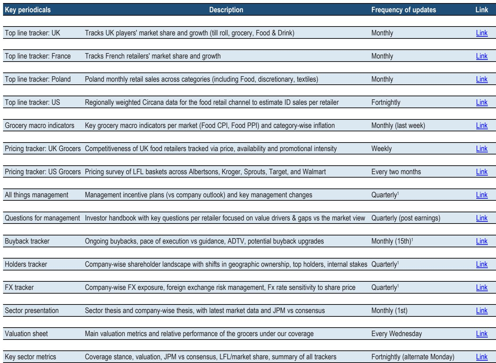
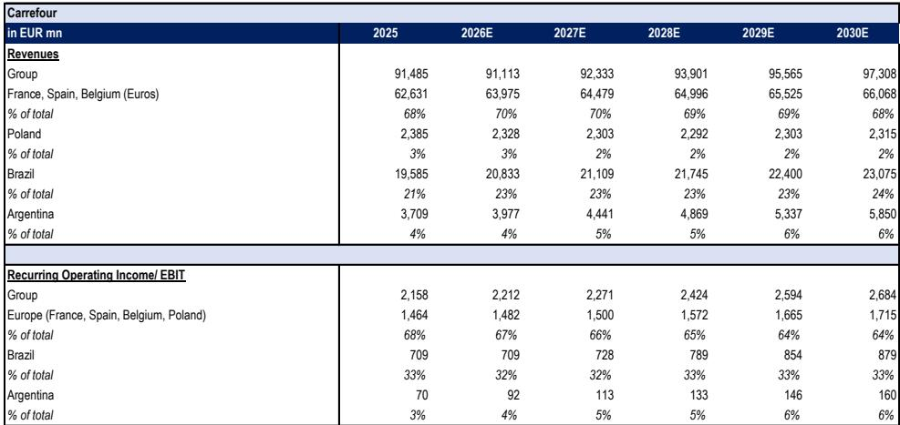
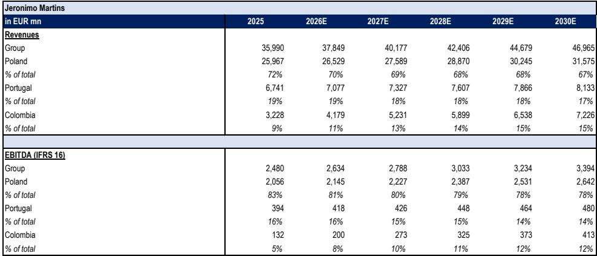

# 当汇率波动超越基本面，食品零售研究者需要一份“翻译地图”

欧元对美元贬值10%，会机械性地使Ahold Delhaize的报告每股收益提升约3%，然而该公司在美国的销量和利润率预计全年将出现收缩。这种机械性汇率顺风与潜在经营状况变化之间的张力，是当前欧洲食品零售研究者面临的核心挑战。外汇已重新成为影响该行业基本面与因子表现的重要变量，且往往在波动加剧、宏观因素压倒个股叙事时最为关键。

问题不仅在于汇率在变动。更在于研究者经常混淆三种不同类型的汇率敞口——折算、交易和经济敞口——然后进一步将机械性的盈利顺风误判为基本面改善的证据。某全球研究机构新推出的食品零售汇率追踪工具，将公司披露的敏感性数据与观察到的市场相关性相结合，为厘清这些效应提供了框架。分析揭示了一个现象：该行业中汇率敞口最大的公司面临一个危险的缺口——报告盈利正被汇率波动美化，而决定可持续价值创造的销量和利润率轨迹却正朝相反方向发展。

三家公司主导了敞口分布。Jeronimo Martins约70%的收入以波兰兹罗提计价，并持有大量外币计价的债务，其中60%为阿根廷比索。Ahold Delhaize约60%的收入和65%的息税前利润来自其美元计价业务。家乐福的巴西雷亚尔敞口贡献了约20%的收入和超过30%的息税前利润。对每家公司而言，当前汇率方向正为报告业绩提供机械性提振。问题在于，这种提振是否掩盖了结构性变化。

## 汇率折算产生机械性盈利提振，不应被误认为经营改善

折算敞口与经济敞口的区分是当前环境下最关键的分析过滤器。折算敞口纯粹是会计驱动：当一家以欧元报告的公司合并其美元计价盈利时，欧元走弱会抬高这些盈利的欧元报告值。实际现金流未变，竞争地位未变。利润表看起来更好，只是因为衡量标尺缩小了。

Ahold Delhaize提供了最清晰的例子。该机构的敏感性分析显示，欧元/美元每波动5美分，机械性折算效应相对于基准汇率假设，会使每股收益预测增加约3%。然而，其美国业务面临持续的销量压力和利润率收缩。该机构明确警告，欧元/美元正机械性地帮助盈利，而美国销量和利润率全年持续收缩，最终将使公司指引面临挑战。

研究者的风险很直接：美元走强时期创造的盈利轨迹看似令人安心，但并非基于经营现实。当汇率周期逆转——欧元已从2022年低点对美元升值约10%——报告盈利的下降将被同一机械性效应的反转放大。未能将折算与业绩区分开的研究者将措手不及。

## 家乐福股价是巴西宏观风险的代理变量，而不仅仅是其零售业务的反映

家乐福五年股价历史显示，其与巴西雷亚尔/欧元汇率的关联度，远高于公司盈利对雷亚尔的实际敏感性所能解释的程度。巴西贡献了集团约33%的息税前利润，但股价表现仿佛整个公司都是巴西资产。

这并非异常现象。它反映了研究者如何对具有新兴市场敞口的跨国零售商进行定价的结构性特征。巴西雷亚尔充当巴西宏观风险的市场代理变量——利率预期、通胀轨迹、政治稳定性——研究者始终将其视为家乐福的关键估值驱动因素，无论该公司巴西业务内部发生什么。当雷亚尔走强且Ibovespa指数上涨时，家乐福股价随之上升，即使巴西零售业务面临结构性竞争压力。

该机构的分析强调了这一动态中的特定风险：汇率改善和巴西利率下降不应被误认为基本面改善。家乐福的巴西现购自运业态仍面临结构性竞争，尽管有雷亚尔走强和SELIC利率下降的顺风，销量和利润率应仍受限。汇率与股价之间的机械性关联形成了一个反馈循环，可能使涨势持续到远超经营现实合理支撑的水平。未能区分宏观代理效应与业务特定轨迹的研究者，很可能在宏观环境看似最有利时支付过高价格。

## Jeronimo Martins拥有最复杂的敞口结构，折算、交易和资产负债表风险在此交汇

Jeronimo Martins是研究覆盖中的特例，不仅因为其约85%的息税前利润来自波兰兹罗提和哥伦比亚比索。该公司的敞口是多层次的，需要比简单收入百分比更复杂的分析框架。

首先，折算效应被其成本结构放大。由于运营费用也以当地货币计价，息税前利润敞口实际上高于收入敞口——波兰约为85%对73%。这意味着汇率变动影响整个利润率，而不仅仅是收入端。其次，资产负债表增加了第三个维度。Jeronimo Martins约60%的债务以阿根廷比索计价，另有25%以波兰兹罗提计价。阿根廷比索敞口尤其成问题，因为阿根廷被归类为IAS 29下的恶性通货膨胀经济体，要求按年末汇率进行通胀重述和折算。即使阿根廷业务表现良好，这也会放大对报告权益的负面会计影响。

结果是，对于Jeronimo Martins，比索的变动并非以可预测的乘数简单传导至每股收益。它同时对报告盈利、净债务估值和权益账面价值产生连锁效应。该机构的敏感性分析明确指出，对Jeronimo Martins而言，汇率并非事后调整的次要因素。它是必须明确建模的主要估值驱动因素。

## 汇率敞口最小的国内零售商提供更清晰的经营表现解读，但以牺牲多元化为代价

Colruyt、Domino's Pizza Group和Greggs没有重大的外币敞口。它们的收入、成本和债务均以本币计价。对于寻求纯粹国内食品零售基本面的研究者而言，这些公司完全消除了汇率折算噪音。

这既是优势也是局限。优势在于分析清晰：当Colruyt报告盈利时，数字反映的是其比利时业务实际发生的情况，而非汇率市场的情况。无需厘清机械性折算效应与潜在表现。局限在于，这些公司也完全暴露于国内经济周期、利率变化和竞争动态，没有任何多元化收益。英国经济衰退将直接冲击Greggs；没有巴西或波兰业务提供部分对冲。

该机构的框架表明，投资于有汇率敞口与无汇率敞口的零售商之间的选择，应取决于研究者明确建模汇率效应的能力。对于缺乏时间或工具来维持动态汇率覆盖的研究者，国内零售商提供更清晰的信号。对于能将汇率情景纳入估值模型的研究者，当市场系统性地错误定价机械性顺风与经营现实之间的差距时，有汇率敞口的公司提供不对称机会。

## 区分汇率噪音与基本面信号的决策框架

该分析指向一个三步框架，用于评估任何具有重大汇率敞口的食品零售研究。

第一步是分离折算效应。获取公司报告的收入和息税前利润对每种相关货币对10%变动的敏感性。将其与过去十二个月的实际即期汇率变动进行比较。机械性每股收益影响与实际每股收益变化之间的差额，即为经营驱动的部分。如果机械性影响为正但经营贡献为负，则盈利轨迹是脆弱的。

第二步是评估汇率与股价之间的关联度。家乐福的经验表明，这种关联可能持续多年，造成虚假的安全感。检验标准是：如果汇率未变动，股价是否仍处于当前水平？如果答案是否定的，则该股票对汇率反转存在隐藏的脆弱性。

第三步是单独评估资产负债表敞口。Jeronimo Martins的阿根廷比索债务是一种或有负债，不会出现在标准利润表敏感性分析中。对于任何持有外币计价债务的公司，在汇率大幅贬值时期，资产负债表效应可能超过利润表效应。该机构的分析显示，对Ahold Delhaize而言，欧元对美元贬值20%将导致未对冲租赁重估产生2.96亿欧元的损失——这一数字远超货币项目800万欧元的敏感性。

该追踪工具的最后一项洞见是，汇率敞口并非静态。它随着每一次收购、剥离、债务发行和对冲决策而变化。季度更新是维持准确图景所需的最低频率。在欧元对美元和雷亚尔已波动超过10%、阿根廷比索对欧元贬值超过12%的一年里，报告盈利与潜在表现之间的差距正在扩大。最能管理这一差距的公司，将是那些透明沟通其汇率敞口并明智对冲的公司。而那些依赖机械性顺风掩盖经营弱点的公司，将在汇率周期逆转时暴露无遗。

*仅供参考。部分内容可能基于源材料通过AI辅助生成、翻译、总结或编辑，可能存在遗漏或错误。请独立核实。本文不构成研究、法律、税务、会计或其他专业建议。*

仅供参考。部分内容可能基于源材料通过AI辅助生成、翻译、总结或编辑，可能存在遗漏或错误。请独立核实。本文不构成研究、法律、税务、会计或其他专业建议。

