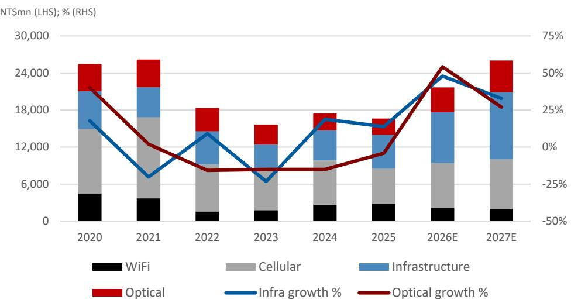
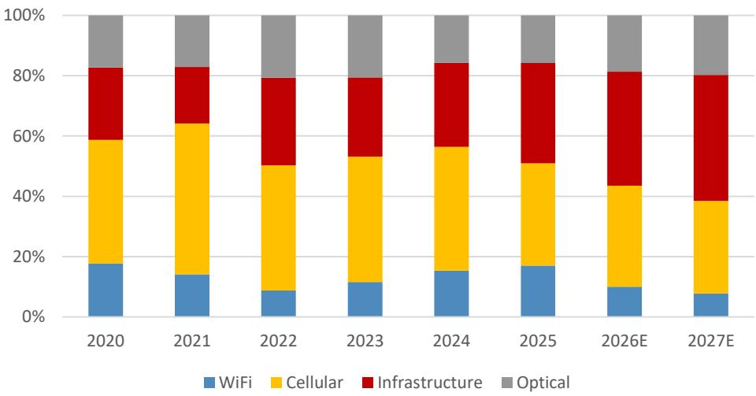

## WIN Semiconductors Corp

## Undergoing transformation led by LEO and optical

- 2Q26 slight beat from optical; 3Q momentum decent. Win's 2Q26 revenue/margins (+16%/2ppt QoQ) were largely in-line with street expectations, while EPS was a strong beat on investment income and USD appreciation. The revenue growth was driven by 1) earlier-than-expected optical receiver chip (PD) mass production (late 2Q vs 2H26), and 2) infrastructure (LEO plus datacenter related demand). Smartphone (cellular) demand was resilient on higher exposure to the high-end smartphone market, while Wi-Fi was the sole weak spot due to a memory shortage. Overall, Win's UTR increased 5ppt to 65% in 2Q. Looking ahead, we expect 3Q revenue to grow 11% QoQ on 1) further PD volume ramp, and 2) rising LEO shipment. We believe the momentum from optical and Infra should continue to rise throughout 2026e, with optical fueling decent upside. As a result, we are now modelling 30% revenue growth for 2026 (40%+/50%+ growth for Infra/Optical) vs our previous ~10% revenue growth estimates. We are also revising up revenue growth from 13% to 20% for 2027e. Our new 2026/27e EPS estimates are 5/11% above our previous numbers.

- Positive LT outlook for optical: with big order and more engagement ongoing. For the PD, Win so far only has one project in the mass-production stage. However, Win mentioned that the order scale of this customer (likely a major US design house) alone is capable of driving AI-related optical comm to reach a high-single-digit mix of total revenue in 2H26e, which has more than doubled vs 2025. We are modelling $50 + / 25\%+$ growth for Win's optical business in 2026/27e, with the AI optical mix reaching double digit of total revenue in 2027e. In addition, Win also has multiple optical projects ongoing – including a short distance VCSEL laser chip project and long distance EML laser chip project that have entered mass production in 2025. Meanwhile, there are more projects in the early stages, including the CW laser project with a major US optical chip IDM (mass production should take place in YE27). As the largest compound semi foundry globally (with decent optical chip capabilities), we don't rule out the possibility of Win capturing more projects.

- LEO growth on track; return to the expansion cycle. On the LEO front, we believe the LEO mix has reached double-digits, which is much earlier than our previous expectation of 2027e. We believe the strong demand brought by LEO together with optical could drive Win's overall UTR to $70\%+$ in 3Q26 ( $65\%$ in 2Q). The steadily rising UTR also drives Win Semi to return to the expansion cycle – although no massive capacity expansion yet, the company has started to conduct project-based capex starting 2H25, for de-bottleneck purpose for LEO and optical chips. The company re-iterated its 2026 capex plan to be NT \$2-3bn, which is significantly higher than the annual capex in prior years.

- A transformation story: observe on pullback. After the strong rally in early 2026, Win's stock has corrected significantly in the past three months (-38% vs +12% of TaiEx). We believe this is due to 1) weak sentiment on both LEO and optical communications, and 2) concerns for Win's relatively slower mix rise in optical vs other companies in the same basket (as Win has exposure in other areas). However, Win's datacenter-related optical comm mix is growing rapidly and should reach double digits in 2027e (while LEO 15%+ mix in 2027e). We believe this could shift sentiment and drive Win's share once investors' spotlight is back to optical communications (or LEO). With an increasing mix of infrastructure and optical, Win is transforming from a cyclical cellular name to a datacomm enabler in the HPC/satellite era. Our new TP of NT\$373 is based on 34x (same as previous) 2027e EPS.

Figure 1: Win Semi annual revenue trend by application  
  
Source: JPM estimates, Company data.

Figure 2: Win Semi revenue mix by application %  
  
Source: JPM estimates, Company data.

Figure 3: Win Semi capex trend  
  
Source: JPM estimates, Company data.

Table 1: Win Semi 2Q26 earnings summary
NT\$mn

<table><tr><td></td><td colspan="3">2Q26</td><td colspan="2">Variance</td><td colspan="2">Growth</td></tr><tr><td>NT$ million</td><td>Actual</td><td>JPM est.</td><td>Consensus</td><td>vs. JPM</td><td>vs. Consensus</td><td>Q/Q</td><td>Y/Y</td></tr><tr><td>Revenue</td><td>5,257</td><td>4,546</td><td>5,298</td><td>16%</td><td>-1%</td><td>15%</td><td>39%</td></tr><tr><td>Gross profit</td><td>1,485</td><td>1,459</td><td>1,550</td><td>2%</td><td>-4%</td><td>23%</td><td>113%</td></tr><tr><td>Operating profit</td><td>742</td><td>636</td><td>705</td><td>17%</td><td>5%</td><td>73%</td><td>N.A.</td></tr><tr><td>Net profit</td><td>977</td><td>766</td><td>656</td><td>28%</td><td>49%</td><td>84%</td><td>N.A.</td></tr><tr><td>Adjusted EPS (NT$)</td><td>2.30</td><td>1.81</td><td>1.51</td><td>27%</td><td>53%</td><td>84%</td><td>N.A.</td></tr><tr><td>Gross margin</td><td>28.2%</td><td>32.1%</td><td>29.3%</td><td>-386bps</td><td>-101bps</td><td>191bps</td><td>979bps</td></tr><tr><td>Operating margin</td><td>14.1%</td><td>14.0%</td><td>13.3%</td><td>12bps</td><td>81bps</td><td>475bps</td><td>1,729bps</td></tr><tr><td>Net margin</td><td>18.6%</td><td>16.8%</td><td>12.4%</td><td>173bps</td><td>620bps</td><td>699bps</td><td>2,975bps</td></tr></table>

Source: JPM estimates, Company data, and Bloomberg Finance L.P.

Table 2: I/S Highlights: Annual Revised vs Previous NT\$ mn except for EPS

<table><tr><td rowspan="2"></td><td colspan="3">Revised</td><td colspan="3">Previous</td><td colspan="3">Change</td></tr><tr><td>FY25</td><td>FY26E</td><td>FY27E</td><td>FY25</td><td>FY26E</td><td>FY27E</td><td>FY25</td><td>FY26E</td><td>FY27E</td></tr><tr><td>Revenues</td><td>16,639</td><td>21,679</td><td>26,040</td><td>16,638</td><td>17,955</td><td>20,236</td><td>0%</td><td>21%</td><td>29%</td></tr><tr><td>Gross profit</td><td>4,026</td><td>6,463</td><td>9,308</td><td>4,027</td><td>5,488</td><td>7,054</td><td>0%</td><td>18%</td><td>32%</td></tr><tr><td>GM (%)</td><td>24.2%</td><td>29.8%</td><td>35.7%</td><td>24.2%</td><td>30.6%</td><td>34.9%</td><td>0bps</td><td>-75bps</td><td>89bps</td></tr><tr><td>Operating profit</td><td>711</td><td>3,094</td><td>5,382</td><td>712</td><td>2,250</td><td>3,797</td><td>0%</td><td>38%</td><td>42%</td></tr><tr><td>OPM (%)</td><td>4.3%</td><td>14.3%</td><td>20.7%</td><td>4.3%</td><td>12.5%</td><td>18.8%</td><td>-1bps</td><td>174bps</td><td>190bps</td></tr><tr><td>Pre-Tax profit</td><td>1,383</td><td>3,742</td><td>5,316</td><td>1,384</td><td>2,269</td><td>3,929</td><td>0%</td><td>65%</td><td>35%</td></tr><tr><td>Net profit</td><td>1,690</td><td>3,397</td><td>4,591</td><td>1,691</td><td>2,815</td><td>4,143</td><td>0%</td><td>21%</td><td>11%</td></tr><tr><td>Net Margin</td><td>10.2%</td><td>15.7%</td><td>17.6%</td><td>10.2%</td><td>15.7%</td><td>20.5%</td><td>-1bps</td><td>-1bps</td><td>-284bps</td></tr><tr><td>EPS (NT$)</td><td>3.99</td><td>8.01</td><td>10.83</td><td>3.99</td><td>6.64</td><td>9.77</td><td>0%</td><td>21%</td><td>11%</td></tr></table>

Source: JPM estimates.

Table 3: I/S Highlights: Annual JPMe vs Consensus NT\$ mn except for EPS

<table><tr><td rowspan="2"></td><td colspan="3">JPMe</td><td colspan="3">Consensus</td><td colspan="3">Difference</td></tr><tr><td>FY25</td><td>FY26E</td><td>FY27E</td><td>FY25</td><td>FY26E</td><td>FY27E</td><td>FY25</td><td>FY26E</td><td>FY27E</td></tr><tr><td>Revenues</td><td>16,639</td><td>21,679</td><td>26,040</td><td>16,518</td><td>21,060</td><td>24,387</td><td>1%</td><td>3%</td><td>7%</td></tr><tr><td>Gross profit</td><td>4,026</td><td>6,463</td><td>9,308</td><td>3,802</td><td>6,314</td><td>8,587</td><td>6%</td><td>2%</td><td>8%</td></tr><tr><td>GM (%)</td><td>24.2%</td><td>29.8%</td><td>35.7%</td><td>23.0%</td><td>30.0%</td><td>35.2%</td><td>118bps</td><td>-17bps</td><td>53bps</td></tr><tr><td>Operating profit</td><td>711</td><td>3,094</td><td>5,382</td><td>514</td><td>2,832</td><td>3,917</td><td>38%</td><td>9%</td><td>37%</td></tr><tr><td>OPM (%)</td><td>4.3%</td><td>14.3%</td><td>20.7%</td><td>3.1%</td><td>13.4%</td><td>16.1%</td><td>116bps</td><td>82bps</td><td>460bps</td></tr><tr><td>Pre-Tax profit</td><td>1,383</td><td>3,742</td><td>5,316</td><td>780</td><td>2,966</td><td>3,604</td><td>77%</td><td>26%</td><td>47%</td></tr><tr><td>Net profit</td><td>1,690</td><td>3,397</td><td>4,591</td><td>1,125</td><td>2,787</td><td>3,244</td><td>50%</td><td>22%</td><td>42%</td></tr><tr><td>Net Margin</td><td>10.2%</td><td>15.7%</td><td>17.6%</td><td>6.8%</td><td>13.2%</td><td>13.3%</td><td>335bps</td><td>244bps</td><td>433bps</td></tr><tr><td>EPS (NT$)</td><td>3.99</td><td>8.01</td><td>10.83</td><td>2.65</td><td>6.57</td><td>7.65</td><td>50%</td><td>22%</td><td>42%</td></tr></table>

Source: JPM estimates, Bloomberg Finance L.P.

Table 4: JPM Quarterly and Annual Estimates
NT\$mn, year-end December

<table><tr><td></td><td colspan="4">FY24</td><td colspan="4">FY25</td><td colspan="4">FY26E</td><td colspan="4">FY27E</td><td colspan="6">Annual</td></tr><tr><td></td><td>1Q</td><td>2Q</td><td>3Q</td><td>4Q</td><td>1Q</td><td>2Q</td><td>3Q</td><td>4Q</td><td>1Q</td><td>2Q</td><td>3QE</td><td>4QE</td><td>1QE</td><td>2QE</td><td>3QE</td><td>4QE</td><td>FY22</td><td>FY23</td><td>FY24</td><td>FY25</td><td>FY26E</td><td>FY27E</td></tr><tr><td>Revenue</td><td>4,442</td><td>4,961</td><td>4,348</td><td>3,706</td><td>3,576</td><td>3,780</td><td>4,488</td><td>4,794</td><td>4,590</td><td>5,257</td><td>5,862</td><td>5,970</td><td>6,159</td><td>6,456</td><td>6,712</td><td>6,712</td><td>18,334</td><td>15,836</td><td>17,458</td><td>16,639</td><td>21,679</td><td>26,040</td></tr><tr><td>Gross profit</td><td>995</td><td>1,352</td><td>938</td><td>758</td><td>598</td><td>698</td><td>1,205</td><td>1,525</td><td>1,209</td><td>1,485</td><td>1,835</td><td>1,934</td><td>2,071</td><td>2,298</td><td>2,454</td><td>2,485</td><td>4,725</td><td>3,469</td><td>4,042</td><td>4,026</td><td>6,463</td><td>9,308</td></tr><tr><td>Operating income</td><td>183</td><td>500</td><td>124</td><td>-49</td><td>-218</td><td>-120</td><td>384</td><td>664</td><td>430</td><td>742</td><td>920</td><td>1,002</td><td>1,129</td><td>1,329</td><td>1,447</td><td>1,477</td><td>1,480</td><td>-60</td><td>758</td><td>711</td><td>3,094</td><td>5,382</td></tr><tr><td>Net profit reported</td><td>406</td><td>484</td><td>227</td><td>-353</td><td>15</td><td>-422</td><td>1,069</td><td>1,028</td><td>532</td><td>977</td><td>900</td><td>988</td><td>969</td><td>1,132</td><td>1,231</td><td>1,259</td><td>1,798</td><td>-84</td><td>764</td><td>1,690</td><td>3,397</td><td>4,591</td></tr><tr><td>EPS (NT$)</td><td>0.96</td><td>1.14</td><td>0.54</td><td>-0.83</td><td>0.03</td><td>-1.00</td><td>2.52</td><td>2.42</td><td>1.26</td><td>2.30</td><td>2.12</td><td>2.33</td><td>2.29</td><td>2.67</td><td>2.90</td><td>2.97</td><td>4.24</td><td>-0.20</td><td>1.80</td><td>3.99</td><td>8.01</td><td>10.83</td></tr><tr><td>Revenue breakdown (%)</td><td></td><td></td><td></td><td></td><td></td><td></td><td></td><td></td><td></td><td></td><td></td><td></td><td></td><td></td><td></td><td></td><td></td><td></td><td></td><td></td><td></td><td></td></tr><tr><td>WiFi</td><td>11%</td><td>17%</td><td>18%</td><td>14%</td><td>15%</td><td>19%</td><td>18%</td><td>16%</td><td>12%</td><td>10%</td><td>9%</td><td>9%</td><td>8%</td><td>8%</td><td>7%</td><td>8%</td><td>9%</td><td>11%</td><td>15%</td><td>17%</td><td>10%</td><td>8%</td></tr><tr><td>Cellular</td><td>50%</td><td>45%</td><td>39%</td><td>28%</td><td>34%</td><td>34%</td><td>35%</td><td>32%</td><td>34%</td><td>34%</td><td>32%</td><td>34%</td><td>32%</td><td>30%</td><td>31%</td><td>31%</td><td>41%</td><td>41%</td><td>41%</td><td>34%</td><td>34%</td><td>31%</td></tr><tr><td>Infrastructure</td><td>24%</td><td>26%</td><td>27%</td><td>37%</td><td>34%</td><td>35%</td><td>30%</td><td>34%</td><td>36%</td><td>38%</td><td>39%</td><td>37%</td><td>40%</td><td>43%</td><td>42%</td><td>42%</td><td>29%</td><td>26%</td><td>28%</td><td>33%</td><td>38%</td><td>42%</td></tr><tr><td>Optical</td><td>15%</td><td>12%</td><td>16%</td><td>21%</td><td>17%</td><td>13%</td><td>16%</td><td>17%</td><td>18%</td><td>17%</td><td>19%</td><td>20%</td><td>20%</td><td>20%</td><td>20%</td><td>20%</td><td>21%</td><td>20%</td><td>16%</td><td>16%</td><td>19%</td><td>20%</td></tr><tr><td>Margins (%)</td><td></td><td></td><td></td><td></td><td></td><td></td><td></td><td></td><td></td><td></td><td></td><td></td><td></td><td></td><td></td><td></td><td></td><td></td><td></td><td></td><td></td><td></td></tr><tr><td>Gross Margin</td><td>22.4</td><td>27.2</td><td>21.6</td><td>20.4</td><td>16.7</td><td>18.5</td><td>26.9</td><td>31.8</td><td>26.3</td><td>28.2</td><td>31.3</td><td>32.4</td><td>33.6</td><td>35.6</td><td>36.6</td><td>37.0</td><td>25.8</td><td>21.9</td><td>23.2</td><td>24.2</td><td>29.8</td><td>35.7</td></tr><tr><td>Operating Margin</td><td>4.1</td><td>10.1</td><td>2.9</td><td>-1.3</td><td>-6.1</td><td>-3.2</td><td>8.6</td><td>13.8</td><td>9.4</td><td>14.1</td><td>15.7</td><td>16.8</td><td>18.3</td><td>20.6</td><td>21.6</td><td>22.0</td><td>8.1</td><td>-0.4</td><td>4.3</td><td>4.3</td><td>14.3</td><td>20.7</td></tr><tr><td>EBITDA Margin</td><td>33.3</td><td>36.0</td><td>31.9</td><td>32.8</td><td>28.6</td><td>27.5</td><td>36.3</td><td>36.9</td><td>32.3</td><td>28.6</td><td>29.3</td><td>30.2</td><td>31.3</td><td>33.0</td><td>33.5</td><td>33.9</td><td>31.5</td><td>29.6</td><td>31.3</td><td>28.3</td><td>29.0</td><td>33.2</td></tr><tr><td>Net Margin</td><td>9.1</td><td>9.8</td><td>5.2</td><td>-9.5</td><td>0.4</td><td>-11.2</td><td>23.8</td><td>21.4</td><td>11.6</td><td>18.6</td><td>15.3</td><td>16.6</td><td>15.7</td><td>17.5</td><td>18.3</td><td>18.8</td><td>9.8</td><td>-0.5</td><td>4.4</td><td>10.2</td><td>15.7</td><td>17.6</td></tr><tr><td>Sequential Growth (%)</td><td></td><td></td><td></td><td></td><td></td><td></td><td></td><td></td><td></td><td></td><td></td><td></td><td></td><td></td><td></td><td></td><td></td><td></td><td></td><td></td><td></td><td></td></tr><tr><td>Revenue</td><td>-8.7</td><td>11.7</td><td>-12.4</td><td>-14.8</td><td>-3.5</td><td>5.7</td><td>18.7</td><td>6.8</td><td>-4.3</td><td>14.5</td><td>11.5</td><td>1.8</td><td>3.2</td><td>4.8</td><td>4.0</td><td>0.0</td><td>-30.0</td><td>-13.6</td><td>10.2</td><td>-4.7</td><td>30.3</td><td>20.1</td></tr><tr><td>Gross Profit</td><td>-30.6</td><td>35.9</td><td>-30.6</td><td>-19.2</td><td>-21.0</td><td>16.6</td><td>72.7</td><td>26.5</td><td>-20.7</td><td>22.8</td><td>23.6</td><td>5.4</td><td>7.1</td><td>11.0</td><td>6.8</td><td>1.3</td><td>-51.6</td><td>-26.6</td><td>16.5</td><td>-0.4</td><td>60.5</td><td>44.0</td></tr><tr><td>EBIT</td><td>-71.4</td><td>174.0</td><td>-75.1</td><td>n.m.</td><td>n.m.</td><td>n.m.</td><td>n.m.</td><td>72.7</td><td>-35.2</td><td>72.6</td><td>23.9</td><td>9.0</td><td>12.7</td><td>17.7</td><td>8.9</td><td>2.1</td><td>-76.9</td><td>n.m.</td><td>n.m.</td><td>-6.2</td><td>335.3</td><td>74.0</td></tr><tr><td>Net Profit reported</td><td>5.6</td><td>19.4</td><td>-53.1</td><td>n.m.</td><td>n.m.</td><td>n.m.</td><td>n.m.</td><td>-3.9</td><td>-48.2</td><td>83.5</td><td>-7.9</td><td>9.8</td><td>-1.9</td><td>16.9</td><td>8.7</td><td>2.3</td><td>-67.0</td><td>n.m.</td><td>n.m.</td><td>121.1</td><td>101.0</td><td>35.2</td></tr></table>

Source: JPM estimates, Company data.

# Investment Thesis, Valuation and Risks

WIN Semiconductors Corp (Overweight; Price Target: NT\$373.00)

## Investment Thesis

We are OW on Win Semi, given its increasing exposure to LEO (Low Earth Orbital) and the long-term optical communication theme. Meanwhile, we expect the cellular business to remain stable as Win is more exposed to premium smartphones. In addition, the company's self-disciplined capex leads to a decrease in depreciation, which should also benefit margins in the next few years.

## Valuation

Our Dec-26 PT of NT\$373 is based on 34x 2027e EPS. 34x is 1.2-STD above the average multiple since 2016 (which excludes extremes). We believe the multiple assigned is justifiable given Win is riding on dual catalysts, and emerging drivers have effectively lifted multiples in the past.

## Risks to Rating and Price Target

Upside risks to our rating and price target include share regain for cellular PA clients, Chinese customers gaining more market share, and faster-than-expected LiDar adoption. Additionally, management mentioned increasing engagement with US IDMs, who are evaluating the use of foundry capacity to mitigate tariff risks. We believe this potential outsourcing presents upside risk to our forecasts.

Downside risks include further market share loss for both Win Semi and its clients, weaker-than-expected consumer demand, and slower-than-expected WiFi 6E/WiFi 7 penetration.

Note: NT\$ in millions (except per-share data). Fiscal year ends Dec. o/w - out of which

WIN Semiconductors Corp: Summary of Financials

<table><tr><td>Income Statement</td><td>FY24A</td><td>FY25A</td><td>FY26E</td><td>FY27E</td><td>FY28E</td></tr><tr><td>Revenue</td><td>17,458</td><td>16,639</td><td>21,679</td><td>26,040</td><td>-</td></tr><tr><td>COGS</td><td>(13,416)</td><td>(12,612)</td><td>(15,216)</td><td>(16,732)</td><td>-</td></tr><tr><td>Gross profit</td><td>4,042</td><td>4,026</td><td>6,463</td><td>9,308</td><td>-</td></tr><tr><td>SG&amp;A</td><td>(1,593)</td><td>(1,715)</td><td>(1,749)</td><td>(1,981)</td><td>-</td></tr><tr><td>Adj. EBITDA</td><td>5,458</td><td>4,704</td><td>6,297</td><td>8,655</td><td>-</td></tr><tr><td>D&amp;A</td><td>(4,700)</td><td>(3,994)</td><td>(3,203)</td><td>(3,273)</td><td>-</td></tr><tr><td>Adj. EBIT</td><td>758</td><td>711</td><td>3,094</td><td>5,382</td><td>-</td></tr><tr><td>Net Interest</td><td>(609)</td><td>(521)</td><td>(483)</td><td>(528)</td><td>-</td></tr><tr><td>Adj. PBT</td><td>329</td><td>1,383</td><td>3,742</td><td>5,316</td><td>-</td></tr><tr><td>Tax</td><td>7</td><td>(297)</td><td>(670)</td><td>(1,063)</td><td>-</td></tr><tr><td>Minority Interest</td><td>428</td><td>604</td><td>326</td><td>339</td><td>-</td></tr><tr><td>Adj. Net Income</td><td>764</td><td>1,690</td><td>3,397</td><td>4,591</td><td>-</td></tr><tr><td>Reported EPS</td><td>1.80</td><td>3.99</td><td>8.01</td><td>10.83</td><td>-</td></tr><tr><td>Adj. EPS</td><td>1.80</td><td>3.99</td><td>8.01</td><td>10.83</td><td>-</td></tr><tr><td>DPS</td><td>0.00</td><td>1.00</td><td>2.19</td><td>0.00</td><
