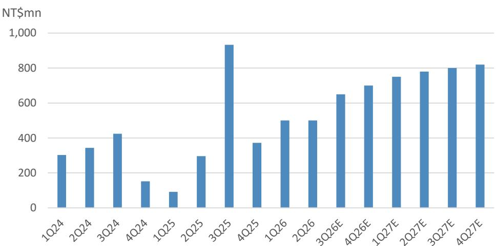

# 化合物半导体代工厂的转型：从周期型业务到数据通信基础设施的关键角色

2026年第二季度，某半导体公司实现营收52.57亿新台币，环比增长15%，略高于市场预期。这一数字背后，隐藏着比单季表现更深远的结构性变化。该公司基础设施业务——受低轨卫星和数据中心相关需求驱动——首次占营收的38%，同时光通信业务的一款接收芯片提前进入量产。这些并非现有模式的渐进式改进，而是标志着多年转型的开端：公司正摆脱其作为周期型手机芯片代工厂的历史定位，成为数据通信和卫星基础设施建设的关键参与者。

市场尚未完全反映这一转变。从2026年初高点回调后，当前报价对应2027年预估每股盈余约34倍，这一估值倍数反映了市场对光通信和低轨卫星应用普及速度的持续疑虑。然而，底层数据指向相反方向：业务结构变化正在加速而非放缓。对于观察者而言，问题在于是否愿意超越短期情绪，认识到该公司的营收轨迹已相对于先前预估出现根本性上调——2026年上调约30%，2027年上调约20%。答案取决于理解三个相互关联的动态：已到来的光通信拐点、提前实现的低轨卫星增长，以及使两者可持续的产能再投入周期。

## 光通信：从规划到量产，规模超预期

该公司近期业绩中最被低估的进展，是一款为某美国主要设计公司生产的光接收芯片提前进入量产。仅此项目就有望在2026年下半年将人工智能相关光通信业务推至总营收的高个位数百分比——较2025年全年水平弹性较高以上。含义明确：光通信业务已不再是投机性的长期主题，而是真实的营收驱动力，单一客户订单足以在两个季度内重塑公司营收结构。

这并非孤例。该公司有多个光通信项目处于不同商业化阶段。一款短距离VCSEL激光芯片项目和一款长距离EML激光芯片项目均于2025年进入量产。一款与某美国主要光芯片IDM合作的连续波激光项目有望在2027年底前量产。作为全球最大的化合物半导体代工厂，该公司拥有制造规模和光芯片能力，鲜有竞争对手能匹敌。其从其他客户获取额外项目的可能性并非理论上的，而是其现有基础与工艺成熟度的逻辑结果。

财务影响显著。分析师预估模型显示，该公司光通信业务2026年增长超过50%，2027年增长超过25%，人工智能光通信业务占比到2027年将达到总营收的两位数。这不是边际提升，而是公司营收构成的根本性变化——从依赖智能手机的周期型业务，转向数据中心光互连的长期增长。

## 低轨卫星需求提前两年达到两位数占比，推动产能再投入周期

低轨卫星业务已成为该公司多个季度的讨论焦点，但数据现已证实这一叙事已成为现实。低轨卫星营收占比在2026年第二季度达到两位数，这一里程碑原预计2027年才实现。这一加速，加上光通信业务的增长，正推动公司整体产能利用率在2026年第三季度超过70%，高于第二季度的65%。

持续超过70%的产能利用率改变了公司的资本配置逻辑。多年来，该公司保持自律的资本支出方式，维持较低折旧，但利润率因产能利用率不足而承压。这种自律正让位于选择性扩张周期。从2025年下半年开始，公司启动了针对低轨卫星和光芯片生产的项目式资本支出，用于瓶颈缓解。2026年20-30亿新台币的资本支出计划显著高于往年，反映了管理层对这两个领域需求并非暂时性高峰而是持久增长轨迹的信心。

产能再投入是积极信号而非风险。在代工业务中，与确认的客户需求和上升的产能利用率挂钩的产能增加，是最有效的资本部署形式。资本支出由低轨卫星和光通信驱动，而这些正是推动产能利用率上升的同一领域。这形成了良性循环：更高的产能利用率产生现金流，为有针对性的产能扩张提供资金，进而推动来自同一高利润领域的进一步营收增长。过度投入的风险极小，因为需求有客户支持，产能增加基于项目而非投机。

## 营收重估真实存在，但市场情绪滞后

尽管运营证据清晰，该公司报价在截至2026年7月下旬的三个月内回调，表现落后于台湾市场约50个百分点。这一回调反映了两种不同但相关的市场偏见。首先，低轨卫星和光通信作为主题板块的疲弱情绪，压缩了所有涉足这些终端市场公司的估值倍数，无论其个体执行情况如何。其次，该公司的光通信业务占比虽快速增长，但仍低于纯光通信组件公司，导致一些观察者将其视为同一主题群体中的落后者。

这种框架在分析上存在缺陷。该公司并非光通信组件公司，而是拥有多元化营收基础的化合物半导体代工厂，涵盖手机、Wi-Fi、基础设施和光通信。其光通信业务占比从低于纯竞争对手的起点上升，并非弱点——而是最大上行杠杆的来源。随着光通信和低轨卫星业务在未来18个月内从个位数营收占比增长至两位数，公司整体营收增长率和利润率将比已拥有更高光通信占比且上调空间较小的公司改善更快。

分析师预估反映了这种不对称性。2026年营收增长预测已从约10%修正至30%，2027年预测从13%修正至20%。这些并非小幅调整，而是对公司增长轨迹的完全重新评估。2026年和2027年每股盈余预估分别较先前预估上调21%和11%。市场当前估值——约34倍2027年每股盈余——基于旧预估。若新预估准确，报价已反映了一条已被超越的增长轨迹。

## 评估框架：如何看待公司的多年转型

对于评估该公司的机构观察者，关键分析挑战在于区分周期型复苏与结构性重估。以下框架有助于区分信号与噪音。

第一项测试是客户集中度与营收可见性。来自某美国主要设计公司的单一光接收芯片项目，预计将在2026年下半年将人工智能光通信业务推至高个位数占比。这是来自单一客户的大订单，引入了集中度风险。然而，多个其他光通信项目处于早期阶段——VCSEL、EML和连续波激光——意味着公司并非依赖单一客户实现光通信未来。风险通过项目广度得到缓解。

第二项测试是产能约束。公司产能利用率接近70%，并已启动资本支出周期。关键问题是产能增加是预防性的还是反应性的。在此案例中，资本支出基于项目，与低轨卫星和光通信的具体瓶颈缓解需求挂钩。这是最佳意义上的反应性：它跟随已确认的需求，而非预期未经验证的需求。过度建设的风险较低。

第三项测试是利润率轨迹。2026年第二季度毛利率为28.2%，环比上升191个基点。营业利润率达到14.1%，环比上升475个基点。分析师预估模型显示，到2027年毛利率将达到35.7%，营业利润率达到20.7%。若向高利润的光通信和基础设施业务的结构转变持续，这些并非激进假设。关键变量是产能利用率：当产能利用率超过70%时，固定成本分摊至更大的营收基础，推动运营杠杆。利润率扩张是结构转变和产能利用率改善的直接结果，而非独立变量。

第四项测试是竞争定位。该公司是全球最大的化合物半导体代工厂，拥有仍被市场低估的光芯片能力。在规模与工艺成熟度构成进入壁垒的行业中，该公司的地位使其在从需要产量和可靠性的客户那里获取新项目时具有结构性优势。公司能够与不同光通信技术——PD、VCSEL、EML、连续波激光——的多个客户互动，表明其代工模式非常适合碎片化且快速变化的光通信组件生态系统。

## 转型已在财务数据中显现，但市场尚未重新定价

该公司正在经历结构性转型的最有力证据，是其运营轨迹与报价之间的背离。公司2026年营收预估已上调21%，2027年预估上调29%，每股盈余预估也有类似幅度上调。产能利用率上升，资本支出周期已启动，营收结构正向更高增长、更高利润领域转变。然而，报价在三个月内回调，主要受情绪驱动抛售影响。

这种背离创造了分析机会。市场将该公司视为周期型手机芯片代工厂，受益于光通信和低轨卫星需求的暂时性上升。数据指向相反：手机业务稳定但营收占比下降，而基础设施和光通信正以复合增长率增长，将在两年内成为主导业务。公司并非周期上行，而是在转型。

可能颠覆这一论点的风险是光通信量产执行失败或低轨卫星星座部署突然放缓。两者均为真实可能性。光芯片制造技术要求高，良率问题可能延迟新项目的营收贡献。低轨卫星需求与少数卫星运营商的部署时间表挂钩，其建设放缓将直接影响公司产能利用率。这些风险是任何转型故事中固有的，无法忽视。

但不对称性对观察者有利。当前约34倍2027年每股盈余的估值已折现了大量执行风险。若转型成功，随着市场将公司从周期型代工厂重新归类为长期数据通信基础设施关键角色，估值倍数可能扩张。若转型失败，下行空间受稳定的手机业务和公司自律的资本支出方式限制。证据平衡支持以下论点：该公司处于多年重估的早期阶段，近期回调为能够超越短期情绪、关注已在进行中的结构性转变的观察者提供了切入点。

*仅供参考。部分内容可能基于源材料通过人工智能辅助生成、翻译、总结或编辑，可能存在遗漏或错误。请独立核实。本文不构成专业建议。*

仅供参考。部分内容可能基于源材料通过人工智能辅助生成、翻译、总结或编辑，可能存在遗漏或错误。请独立核实。本文不构成专业建议。

