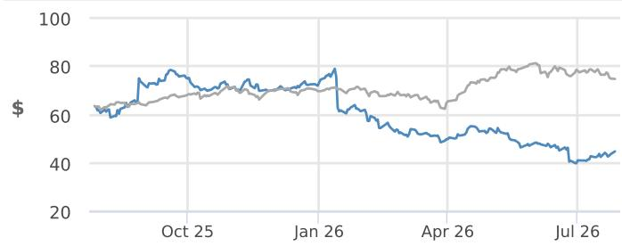
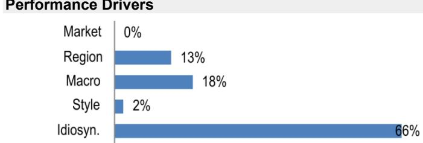

# Trip.com (TCOM US & 9961 HK)

## Regulation changes the form, not the earning power

We recommend accumulating Trip.com (TCOM US / 9961 HK, OW), as we think the market is likely to risk interpreting a lackluster 2H26 as evidence of structural damage from the antitrust remedy. We believe the weakness is primarily cyclical, with regulation changing the commercial form of monetization rather than impairing Trip.com's earning power.

- Our core thesis is simple: the remedy changes how Trip.com monetizes hotels, not whether hotels need Trip.com. Hotels ultimately pay for incremental demand, visibility, and conversion, not for any specific contractual structure. With its strong position among high-intent travelers, deep mid-to-high-end inventory, and superior conversion capability, Trip.com remains an important demand channel for hotels.

- The near-term impact is real but manageable, in our view. The penalty is known, measurable, and largely one-off, while the commercial transition should be temporary. We expect the next two earnings prints to help distinguish transition costs from structural impairment. We cut 3Q26/4Q26 total revenue by 6%/4%, mainly due to macro weakness, while tweaking our Jun-27 PTs to US\$72/HK\$560, now benchmarked to 2027E earnings.

## China

Head of China Equity Research and Co-Head of Asia TMT Research

(86 21) 6106 6505

alex.yao@JPM.com

SAC Registration Number: S1730523020001

Nancy Liu

(86 21) 6106 6343

nancy.liu@JPM.com

SAC Registration Number: S1730524090001

JPM Securities (China) Company Limited

Equity Ratings and Price Targets

<table><tr><td rowspan="2">Company</td><td rowspan="2">Ticker</td><td rowspan="2">Mkt Cap ($ mn)</td><td rowspan="2">Price CCY</td><td rowspan="2">Price</td><td colspan="2">Rating</td><td colspan="4">Price Target</td></tr><tr><td>Cur</td><td>Prev</td><td>Cur</td><td>End Date</td><td>Prev</td><td>End Date</td></tr><tr><td>Trip.com Group Ltd</td><td>TCOM US</td><td>29,309</td><td>USD</td><td>44.77</td><td>OW</td><td>n/c</td><td>72.00</td><td>Jun-27</td><td>75.00</td><td>Dec-26</td></tr><tr><td>Trip.com Group Ltd - H</td><td>9961 HK</td><td>29,684</td><td>HKD</td><td>355.60</td><td>OW</td><td>n/c</td><td>560.00</td><td>Jun-27</td><td>600.00</td><td>Dec-26</td></tr></table>

Source: Company data, Bloomberg Finance L.P., JPM estimates. n/c = no change. All prices as of 27 Jul 26.

See page 11 for analyst certification and important disclosures, including non-US analyst disclosures.

## Market is likely to price in structural damage; we see a manageable transition

Trip.com's public conference call on 27 Jul 2026 clarified the scope of the rectification plan and confirmed that the financial penalty will be fully recognized in 2Q26. Management outlined five initiatives: discontinuing the tier-one and tier-two delegated distribution programs under a new multi-tier partnership framework; refining the pricing ecosystem, with the automated pricing tool already decommissioned earlier this year; improving rule transparency; enhancing consumer protection; and establishing normalized antitrust self-assessment procedures.

The financial impact is also clearer. Management stated that the penalty will enter 2Q26 results as a RMB5.18bn expense plus RMB122mn of contra revenue, while capital allocation priorities remain unchanged. The pricing tool impact is already reflected in the 2Q outlook, and management did not provide 2H26 guidance due to macro uncertainty and limited visibility.

In our view, the remedy is narrow and consistent with prior platform economy precedents. Similar to the Alibaba (2021) and Meituan (2021) cases in our framework, the focus is on prohibited commercial practices rather than structural intervention into traffic allocation, marketplace operations, or monetization. There is no fee cap and no evidence of broader restrictions on Trip.com's business model.

The key investor debate is therefore not the penalty itself, but whether the remedy permanently damages Trip.com's hotel monetization capability. We believe the market will likely overestimate this risk.

## Hotel monetization should survive because merchants pay for demand, not contract structure

We believe Trip.com's hotel monetization remains durable because its value proposition comes from demand generation and conversion efficiency rather than the specific form of commercial agreements.

The remedy removes exclusivity, delegated distribution programs, and the repricing tool. We expect the replacement model to evolve toward a base distribution fee combined with optional promotion and advertising products, consistent with management's direction.

The critical question is whether hotels will continue paying for visibility after this transition. We believe the answer is yes. Hotels optimize for incremental bookings and customer acquisition, and Trip.com remains valuable because of its traveler base, inventory quality, and ability to convert demand.

External precedents support this view. Meituan's fee structure evolved after its 2021 antitrust decision, while subsequent profit pressure was driven by competition rather than the remedy itself. Booking.com maintained strong monetization in Europe after parity clauses were removed, as merchants continued to purchase visibility and demand-generation products.

We expect a similar mechanism at Trip.com. The commercial form may change, but the underlying economic value remains.

We add one timing qualification: while rectification supervision is underway, we expect commercially measured behavior from Trip.com and its partners. Our base case assumes that optional advertising monetization ramps gradually into 2027. Any near-term take-rate softness would therefore reflect transition restraint rather than a permanent loss of bargaining power.

## Near-term earnings pressure is macro-driven, not evidence of franchise damage

We expect a lackluster 2H26, driven primarily by macro demand weakness, with a smaller regulatory transition impact that should fade by 4Q26.

Our approach is to separate cyclical weakness from regulatory impact by benchmarking Trip.com's performance against industry demand indicators and domestic peers. Our 2Q bridge attributed roughly 8ppts of sequential slowdown to macro factors (industry-wide hotel RevPAR down 6% yoy into second week of July, according to industry data link) and 4ppts to regulatory compliance adjustments; we apply a similar framework when assessing 3Q26 performance.

We cut 3Q26/4Q26E total revenue by 6%/4% due to lackluster travel demand and limited visibility into 4Q, and reduce 2026E/2027E adjusted EPS by 4%/4% due to greater efforts into operational adjustment with antitrust remedy. Transportation revenue is treated separately: lower fuel prices support travel demand but pressure ticket prices, and we cut transportation revenue by 2% for 3Q26/4Q26E each.

Table 1: Trip.com forecast revisions

<table><tr><td rowspan="2">YE 31 DecRMBm except for EPS</td><td rowspan="2">JPM old</td><td colspan="4">2026E</td><td rowspan="2">JPM old</td><td colspan="4">2027E</td></tr><tr><td>JPM new</td><td>% change</td><td>Consens us</td><td>% delta</td><td>JPM new</td><td>% change</td><td>Consens us</td><td>% delta</td></tr><tr><td>Net revenues</td><td>67,806</td><td>65,911</td><td>-3%</td><td>67,739</td><td>-3%</td><td>79,215</td><td>78,707</td><td>-1%</td><td>75,173</td><td>5%</td></tr><tr><td>Gross profit</td><td>54,108</td><td>52,512</td><td>-3%</td><td>54,019</td><td>-3%</td><td>63,072</td><td>62,604</td><td>-1%</td><td>59,962</td><td>4%</td></tr><tr><td>Opex</td><td>36,713</td><td>42,358</td><td>15%</td><td></td><td></td><td>41,592</td><td>42,083</td><td>1%</td><td></td><td></td></tr><tr><td>Product development</td><td>15,706</td><td>16,651</td><td>6%</td><td></td><td></td><td>18,343</td><td>19,442</td><td>6%</td><td></td><td></td></tr><tr><td>Sales</td><td>16,344</td><td>15,974</td><td>-2%</td><td></td><td></td><td>17,789</td><td>17,330</td><td>-3%</td><td></td><td></td></tr><tr><td>G&amp;A</td><td>4,663</td><td>9,732</td><td>109%</td><td></td><td></td><td>5,461</td><td>5,311</td><td>-3%</td><td></td><td></td></tr><tr><td>Operating profit (GAAP)</td><td>17,395</td><td>10,154</td><td>-42%</td><td></td><td>na</td><td>21,480</td><td>20,520</td><td>-4%</td><td></td><td>na</td></tr><tr><td>Operating profit (non GAAP)</td><td>20,054</td><td>17,922</td><td>-11%</td><td></td><td>na</td><td>24,403</td><td>23,425</td><td>-4%</td><td></td><td>na</td></tr><tr><td>PBT (GAAP)</td><td>19,852</td><td>12,611</td><td>-36%</td><td>17,705</td><td>-29%</td><td>24,063</td><td>23,104</td><td>-4%</td><td>21,087</td><td>10%</td></tr><tr><td>Net income (GAAP)</td><td>15,806</td><td>9,836</td><td>-38%</td><td>13,461</td><td>-27%</td><td>19,488</td><td>18,666</td><td>-4%</td><td>16,749</td><td>11%</td></tr><tr><td>Net income (Non-GAAP)</td><td>19,180</td><td>18,319</td><td>-4%</td><td>16,413</td><td>12%</td><td>22,411</td><td>21,570</td><td>-4%</td><td>18,978</td><td>14%</td></tr><tr><td>EPADS (GAAP)</td><td></td><td></td><td></td><td></td><td></td><td></td><td></td><td></td><td></td><td></td></tr><tr><td>Diluted (RMB)</td><td>23.39</td><td>14.56</td><td>-38%</td><td>20.18</td><td>-28%</td><td>29.32</td><td>28.08</td><td>-4%</td><td>24.81</td><td>13%</td></tr><tr><td>EPADS (Non GAAP)</td><td></td><td></td><td></td><td></td><td></td><td></td><td></td><td></td><td></td><td></td></tr><tr><td>Diluted (RMB)</td><td>28.39</td><td>27.11</td><td>-4%</td><td>23.95</td><td>13%</td><td>33.72</td><td>32.45</td><td>-4%</td><td>27.77</td><td>17%</td></tr><tr><td>Margin analysis (%)</td><td></td><td></td><td></td><td></td><td></td><td></td><td></td><td></td><td></td><td></td></tr><tr><td>Gross margin</td><td>80%</td><td>80%</td><td></td><td>80%</td><td>0%</td><td>80%</td><td>80%</td><td></td><td>80%</td><td>0%</td></tr><tr><td>Operating margin (GAAP)</td><td>26%</td><td>15%</td><td></td><td></td><td></td><td>27%</td><td>26%</td><td></td><td></td><td></td></tr><tr><td>Operating margin (non-GAAP)</td><td>30%</td><td>27%</td><td></td><td></td><td></td><td>31%</td><td>30%</td><td></td><td></td><td></td></tr><tr><td>Net margin (GAAP)</td><td>23%</td><td>15%</td><td></td><td>20%</td><td>-5%</td><td>25%</td><td>24%</td><td></td><td>22%</td><td>1%</td></tr><tr><td>Net margin (non GAAP)</td><td>28%</td><td>28%</td><td></td><td>24%</td><td>4%</td><td>28%</td><td>27%</td><td></td><td>25%</td><td>2%</td></tr></table>

Source: JPM estimates, Bloomberg Finance L.P (as of Jul 27, 2026).

Two reporting mechanisms matter for 2Q26. First, the RMB122mn contra revenue reduces reported revenue growth by roughly 0.7ppt versus guidance issued on June 25, which predates the accounting treatment. A result near the low end of guidance may therefore still represent operational performance within expectations.

Second, we expect the RMB5.18bn penalty expense to be excluded from adjusted results, pending confirmation in the filing. We also expect any formal outlook provided during 2Q26 results to remain conservative given management's stated visibility constraints; we would interpret cautious guidance as uncertainty around the macro environment rather than fundamental deterioration.

Risks: Slower travel market recovery; intensified competition; deeper macro slowdown; rectification scope extending into broader traffic and fee mechanics; faster migration of chain hotel bookings to direct channels.

## Overweight

TCOM, TCOM US

Price (27 Jul 26): \$44.77

▼ Price Target (Jun-27): \$72.00
Prior (Dec-26): \$75.00

## China

Head of China Equity Research and Co-Head of Asia TMT Research

Alex Yao AC
(86 21) 6106 6505
alex.yao@JPM.com
SAC Registration Number: S1730523020001
JPM Securities (China) Company Limited

## Key Changes (FYE Dec)

<table><tr><td></td><td>Prev</td><td>Cur</td><td>Δ</td></tr><tr><td>Adj. EPS - 26E (Rmb)</td><td>28.39</td><td>27.11</td><td>-4.5%</td></tr><tr><td>Adj. EPS - 27E (Rmb)</td><td>33.72</td><td>32.45</td><td>-3.8%</td></tr></table>

## Quarterly Forecasts (FYE Dec)

<table><tr><td colspan="4">Adj. EPS (Rmb)</td></tr><tr><td></td><td>2025A</td><td>2026E</td><td>2027E</td></tr><tr><td>Q1</td><td>5.97</td><td>5.73A</td><td>5.66</td></tr><tr><td>Q2</td><td>7.20</td><td>7.48</td><td>8.59</td></tr><tr><td>Q3</td><td>27.56</td><td>8.39</td><td>11.71</td></tr><tr><td>Q4</td><td>4.97</td><td>5.52</td><td>6.50</td></tr><tr><td>FY</td><td>45.59</td><td>27.11</td><td>32.45</td></tr></table>

## Style Exposure

<table><tr><td rowspan="2">Quant Factors</td><td rowspan="2">Current %Rank</td><td colspan="4">Hist %Rank (1=Top)</td></tr><tr><td>6M</td><td>1Y</td><td>3Y</td><td>5Y</td></tr><tr><td>Value</td><td>11</td><td>18</td><td>22</td><td>24</td><td>17</td></tr><tr><td>Growth</td><td>19</td><td>5</td><td>9</td><td>8</td><td>2</td></tr><tr><td>Momentum</td><td>92</td><td>9</td><td>47</td><td>2</td><td>53</td></tr><tr><td>Quality</td><td>26</td><td>43</td><td>36</td><td>78</td><td>92</td></tr><tr><td>Low Vol</td><td>56</td><td>67</td><td>62</td><td>90</td><td>54</td></tr><tr><td>ESGQ</td><td>92</td><td>89</td><td>30</td><td>90</td><td>-</td></tr></table>

Sources for: Style Exposure – JPM Global Markets Strategy; all other tables are company data and JPM estimates.

## Trip.com Group Ltd

## Regulation changes the form, not the earning power

Our core thesis is simple: the antitrust remedy changes how Trip.com monetizes hotels, not whether hotels need Trip.com. Hotels ultimately pay for incremental demand, visibility, and conversion, not for any specific contractual structure. With its strong position among high-intent travelers, deep mid-to-high-end inventory, and superior conversion capability, Trip.com remains an important demand channel for hotels, in our view.

## Investment Thesis, Valuation and Risks

Trip.com Group Ltd (Overweight; Price Target: \$72.00)

## Investment Thesis

We recommend accumulating Trip.com, as the market is likely to interpret a lackluster 2H26 as evidence of structural damage from the antitrust remedy. We believe the weakness is primarily cyclical, with regulation changing the commercial form of monetization rather than impairing Trip.com's earning power.

## Valuation

Our Jun-27 PT of US\$72 is based on a 15x 2027E P/E, supported by its clear growth outlook and stronger competitive positioning vs. peers. Given the company's solid three-year earnings growth outlook, we value the stock in line with other tier-1 China Internet stocks in our coverage universe.

## Risks to Rating and Price Target

Downside risks to our rating and price target include: (1) a slower-than-expected recovery in the travel market; (2) intense industry competition; and (3) a macroeconomic slowdown.

Price Performance  

— TCOM Price (\$)— CCMP (rebased)

<table><tr><td></td><td>YTD</td><td>1m</td><td>3m</td><td>12m</td></tr><tr><td>Abs</td><td>-37.7%</td><td>9.5%</td><td>-15.8%</td><td>-30.5%</td></tr><tr><td>Rel</td><td>-45.0%</td><td>10.9%</td><td>-16.0%</td><td>-48.2%</td></tr></table>

<table><tr><td colspan="2">Company Data</td></tr><tr><td>Shares O/S (mn)</td><td>655</td></tr><tr><td>52-week range ($)</td><td>78.99-38.04</td></tr><tr><td>Market cap ($ mn)</td><td>29,309</td></tr><tr><td>Exchange rate</td><td>1.00</td></tr><tr><td>Free float (%)</td><td>-</td></tr><tr><td>3M ADV (mn)</td><td>3.15</td></tr><tr><td>3M ADV ($ mn)</td><td>145.2</td></tr><tr><td>Volatility (90 Day)</td><td>36</td></tr><tr><td>Index</td><td>NASDAQ COMPOSITE</td></tr><tr><td>BBG ANR (Buy | Hold | Sell)</td><td>30|4|0</td></tr></table>

<table><tr><td colspan="4">Key Metrics (FYE Dec)</td></tr><tr><td>Rmb in millions</td><td>FY25A</td><td>FY26E</td><td>FY27E</td></tr><tr><td>Financial Estimates</td><td></td><td></td><td></td></tr><tr><td>Revenue</td><td>62,408</td><td>65,911</td><td>78,707</td></tr><tr><td>Adj. EBITDA</td><td>19,027</td><td>13,453</td><td>24,037</td></tr><tr><td>Adj. EBIT</td><td>18,043</td><td>12,743</td><td>23,425</td></tr><tr><td>Adj. net income</td><td>31,839</td><td>18,319</td><td>21,570</td></tr><tr><td>Adj. EPS</td><td>45.59</td><td>27.11</td><td>32.45</td></tr><tr><td>BBG EPS</td><td>45.00</td><td>24.08</td><td>27.83</td></tr><tr><td>Cashflow from operations</td><td>42,189</td><td>11,085</td><td>37,448</td></tr><tr><td>FCFF</td><td>40,116</td><td>9,038</td><td>35,189</td></tr><tr><td>Margins and Growth</td><td></td><td></td><td></td></tr><tr><td>Revenue Growth Y/Y (%)</td><td>17.1%</td><td>5.6%</td><td>19.4%</td></tr><tr><td>Gross margin</td><td>80.6%</td><td>79.7%</td><td>79.5%</td></tr><tr><td>EBITDA margin</td><td>30.5%</td><td>20.4%</td><td>30.5%</td></tr><tr><td>EBIT margin</td><td>28.9%</td><td>19.3%</td><td>29.8%</td></tr><tr><td>Adj. EPS growth</td><td>63.6%</td><td>(40.5%)</td><td>19.7%</td></tr><tr><td>Ratios</td><td></td><td></td><td></td></tr><tr><td>Adj. tax rate</td><td>14.1%</td><td>13.7%</td><td>13.7%</td></tr><tr><td>Interest cover</td><td>NM</td><td>NM</td><td>NM</td></tr><tr><td>Net debt/Equity</td><td>NM</td><td>NM</td><td>NM</td></tr><tr><td>Net debt/EBITDA</td><td>NM</td><td>NM</td><td>NM</td></tr><tr><td>ROCE</td><td>7.8%</td><td>5.1%</td><td>8.8%</td></tr><tr><td>ROE</td><td>20.2%</td><td>10.3%</td><td>11.4%</td></tr><tr><td>Valuation</td><td></td><td></td><td></td></tr><tr><td>FCFF yield</td><td>18.9%</td><td>4.4%</td><td>17.5%</td></tr><tr><td>Dividend yield</td><td>1.1%</td><td>1.1%</td><td>1.1%</td></tr><tr><td>EV/Revenue</td><td>2.3</td><td>2.1</td><td>1.3</td></tr><tr><td>EV/EBITDA</td><td>7.5</td><td>10.1</td><td>4.2</td></tr><tr><td>Adj. P/E</td><td>6.7</td><td>11.2</td><td>9.3</td></tr></table>

## Summary Investment Thesis and Valuation

We recommend accumulating Trip.com, as the market is likely to interpret a lackluster 2H26 as evidence of structural damage from the antitrust remedy. We believe the weakness is primarily cyclical, with regulation changing the commercial form of monetization rather than impairing Trip.com's earning power.

Our Jun-27 PT of US\$72 is based on a 15x 2027E P/E, supported by its clear growth outlook and stronger competitive positioning vs. peers.

Performance Drivers  

<table><tr><td>Factors</td><td>6M Corr</td><td>1Y Corr</td></tr><tr><td>Market: MSCI Asia Pac ex JP</td><td>-0.02</td><td>0.02</td></tr><tr><td>Region: China</td><td>0.26</td><td>0.37</td></tr><tr><td>Macro:</td><td></td><td></td></tr><tr><td>JPM Global Equity Sentiment</td><td>0.44</td><td>0.36</td></tr><tr><td>JPM China A-shares Sentiment</td><td>0.16</td><td>0.19</td></tr><tr><td>Emerging Economies CPI(YoY)</td><td>0.26</td><td>0.16</td></tr><tr><td>Quant Styles:</td><td></td><td></td></tr><tr><td>LowVol</td><td>0.10</td><td>-0.14</td></tr><tr><td>Momentum</td><td>-0.18</td><td>-0.10</td></tr><tr><td>Growth</td><td>-0.11</td><td>0.09</td></tr></table>

Trip.com Group Ltd: Summary of Financials

<table><tr><td>Income Statement</td><td>FY24A</td><td>FY25A</td><td>FY26E</td><td>FY27E</td><td>FY28E</td></tr><tr><td>Revenue</td><td>53,294</td><td>62,408</td><td>65,911</td><td>78,707</td><td>-</td></tr><tr><td>COGS</td><td>(9,990)</td><td>(12,121)</td><td>(13,398)</td><td>(16,104)</td><td>-</td></tr><tr><td>Gross profit</td><td>43,304</td><td>50,287</td><td>52,512</td><td>62,604</td><td>-</td></tr><tr><td>SG&amp;A</td><td>(15,988)</td><td>(19,378)</td><td>(25,707)</td><td>(22,642)</td><td>-</td></tr><tr><td>Adj. EBITDA</td><td>17,326</td><td>19,027</td><td>13,453</td><td>24,037</td><td>-</td></tr><tr><td>D&amp;A</td><td>(1,107)</td><td>(984)</td><td>(710)</td><td>(612)</td><td>-</td></tr><tr><td>Adj. EBIT</td><td>16,219</td><td>18,043</td><td>12,743</td><td>23,425</td><td>-</td></tr><tr><td>Net Interest</td><td>606</td><td>1,754</td><td>1,753</td><td>1,879</td><td>-</td></tr><tr><td>Adj. PBT</td><td>19,045</td><td>41,118</td><td>15,200</td><td>26,008</td><td>-</td></tr><tr><td>Tax</td><td>(2,604)</td><td>(5,815)</td><td>(2,077)</td><td>(3,562)</td><td>-</td></tr><tr><td>Minority Interest</td><td>(160)</td><td>(92)</td><td>(116)</td><td>(148)</td><td>-</td></tr><tr><td>Adj. Net Income</td><td>19,109</td><td>31,839</td><td>18,319</td><td>21,570</td><td>-</td></tr><tr><td>Reported EPS</td><td>24.88</td><td>47.68</td><td>14.56</td><td>28.08</td><td>-</td></tr><tr><td>Adj. EPS</td><td>27.86</td><td>45.59</td><td>27.11</td><td>32.45</td><td>-</td></tr><tr><td>DPS</td><td>0.00</td><td>3.28</td><td>3.36</td><td>3.42</td><td>-</td></tr><tr><td>Payout ratio</td><td>0.0%</td><td>6.9%</td><td>23.1%</td><td>12.2%</td><td>-</td></tr><tr><td>Shares outstanding</td><td>686</td><td>698</td><td>676</td><td>665</td><td>-</td></tr><tr><td>Balance Sheet</td><td>FY24A</td><td>FY25A</td><td>FY26E</td><td>FY27E</td><td>FY28E</td></tr><tr><td>Cash and cash equivalents</td><td>51,093</td><td>90,555</td><td>98,946</td><td>133,597</td><td>-</td></tr><tr><td>Accounts receivable</td><td>12,459</td><td>15,492</td><td>12,222</td><td>20,873</td><td>-</td></tr><tr><td>Inventories</td><td>0</td><td>0</td><td>0</td><td>0</td><td>-</td></tr><tr><td>Other current assets</td><td>48,568</td><td>49,164</td><td>50,542</td><td>52,064</td><td>-</td></tr><tr><td>Current assets</td><td>112,120</td><td>155,211</td><td>161,710</td><td>206,534</td><td>-</td></tr><tr><td>PP&amp;E</td><td>5,053</td><td>4,636</td><td>4,459</td><td>4,484</td><td>-</td></tr><tr><td>LT investments</td><td>47,194</td><td>47,194</td><td>47,194</td><td>47,194</td><td>-</td></tr><tr><td>Other non current assets</td><td>78,214</td><td>78,214</td><td>78,214</td><td>78,214</td><td>-</td></tr><tr><td>Total assets</td><td>242,581</td><td>285,255</td><td>291,578</td><td>336,427</td><td>-</td></tr><tr><td>Short term borrowings</td><td>19,433</td><td>19,433</td><td>19,433</td><td>19,433</td><td>-</td></tr><tr><td>Payables</td><td>16,578</td><td>25,528</td><td>22,553</td><td>34,864</td><td>-</td></tr><tr><td>Other short term liabilities</td><td>37,999</td><td>40,849</td><td>42,018</td><td>57,381</td><td>-</td></tr><tr><td>Current liabilities</td><td>74,010</td><td>85,811</td><td>84,003</td><td>111,678</td><td>-</td></tr><tr><td>Long-term debt</td><td>20,134</td><td>20,134</td><td>20,134</td><td>20,134</td><td>-</td></tr><tr><td>Other long term liabilities</td><td>4,955</td><td>4,955</td><td>4,955</td><td>4,955</td><td>-</td></tr><tr><td>Total liabilities</td><td>
