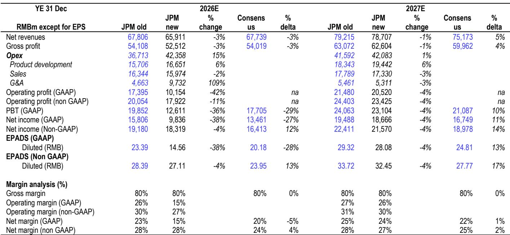
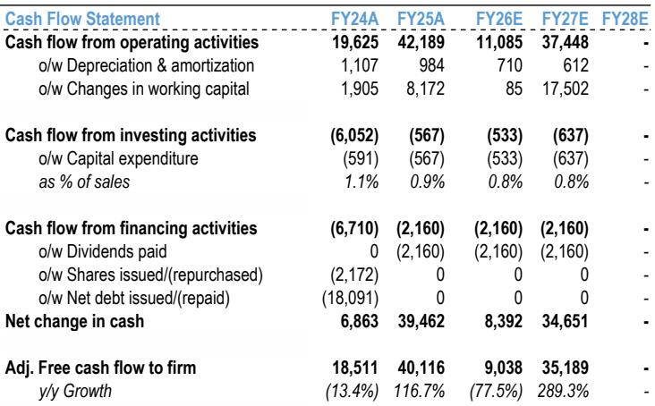

# JPM：携程反垄断整改改变变现形式而非业务与近期数据观察

2026年7月27日，携程在公开交流中披露了反垄断整改方案的具体范围，包括终止一级和二级委托分销计划、停用自动定价工具、提升规则透明度等五项举措，并确认5.18亿元人民币罚款将全额计入二季度业绩。JPM在最新报告中提出一个核心判断：市场可能将下半年表现解读为结构性变化，但该机构认为周期因素是主因，监管改变的是商业化形式而非携程的盈利基础。

报告指出，整改方案聚焦于禁止特定商业行为，而非对流量分配、平台运营或变现模式进行结构性干预。与阿里巴巴（2021年）和美团（2021年）的案例类似，没有设置费率上限，也没有证据表明对携程商业模式存在更广泛的限制。因此，读者争论的焦点不是罚款本身，而是整改是否永久影响了携程的酒店变现能力。

> **KC评论：** 报告的核心分析框架是区分“周期性变化”和“结构性变化”。作者通过对比行业需求指标和国内同行表现来分离两类影响，认为二季度约8个百分点的环比节奏变化来自宏观因素（行业酒店RevPAR同比下降6%），4个百分点来自监管合规调整。这一归因方法值得关注，因为它直接决定了后续业绩解读的基准。

## 1. 酒店变现能力的基础是需求转化而非合同结构

JPM认为，携程对酒店的价值来自增量需求生成和转化效率，而非特定商业协议形式。整改取消了排他性条款、委托分销计划和重新定价工具，预计替代模式将演变为基础分销费加可选推广和广告产品。

关键问题在于：酒店在整改后是否仍愿意为曝光度付费。报告给出的答案是肯定的。酒店优化的目标是增量预订和客户获取，而携程在高意图旅行者群体中的位置、中高端库存深度以及转化能力使其仍是一个重要需求渠道。

外部先例支持这一判断。美团在2021年反垄断决定后费率结构发生变化，但后续利润不确定性主要来自竞争而非整改本身。Booking.com在欧洲取消价格一致性条款后仍维持了较强的变现能力，因为商家继续购买曝光度和需求生成产品。

报告增加了一个时间限定：在整改监督期内，预计携程及其合作伙伴会采取商业上审慎的行为。可选广告变现预计在2027年逐步提升，任何近期的费率变化反映的是过渡期约束而非议价能力的永久性变化。

## 2. 下半年业绩不确定性以宏观驱动为主，监管影响可控

JPM下调了2026年第三和第四季度总收入预测6%和4%，主要原因是旅行需求变化，监管过渡影响预计在四季度消退。2026年和2027年调整后每股收益预测分别下调4%。

报告提供了一个区分两类影响的观察框架：通过将携程业绩与行业需求指标和国内同行进行对比。二季度分析显示，约8个百分点的环比节奏变化来自宏观因素（行业酒店RevPAR同比下降6%），4个百分点来自监管合规调整。这一框架同样适用于三季度业绩评估。

两个会计处理细节值得注意。第一，1.22亿元人民币的抵减收入将使报告收入增长比6月25日指引低约0.7个百分点，因此接近指引下限的结果仍可能代表运营表现符合预期。第二，5.18亿元罚款预计将被排除在调整后业绩之外，有待财报确认。管理层已表示因宏观不确定性和有限可见性而未提供下半年指引，报告认为谨慎的指引应被解读为对宏观环境的不确定性而非基本面出现变化。

## 3. 可复用的观察框架：区分周期性变化与结构性变化

报告提供了一个分析类似情况的框架：当一家公司同时面临监管调整和宏观需求变化时，如何分离两类影响。

第一步，识别监管整改的具体范围。在携程案例中，整改聚焦于特定商业行为而非商业模式本身，没有费率上限，没有流量分配干预。这一范围决定了后续影响的性质。

第二步，建立行业需求基准。报告使用行业酒店RevPAR变化作为宏观需求指标，将携程的业绩变化与之对比。二季度行业RevPAR同比下降6%，对应携程约8个百分点的环比节奏变化归因于宏观因素。

第三步，评估监管过渡的持续时间和幅度。报告认为监管影响约4个百分点，应在四季度基本消退。这一判断基于整改范围有限、罚款一次性、以及外部先例中变现能力未受永久性影响。

第四步，关注会计处理细节。抵减收入、罚款是否计入调整后业绩、管理层指引的保守程度，这些技术性因素会影响对实际运营表现的理解。

> **KC评论：** 这一框架的实用性在于，它提供了一个可量化的归因方法，而不是笼统地说“业绩受多重因素影响”。对于关注携程后续财报的读者，可以参照这一逻辑：先看行业需求数据，再看监管过渡的进展，最后判断业绩变化中哪些是周期性的、哪些可能是结构性的。报告认为市场可能高估结构性不确定性，这一判断的验证窗口在接下来两个季度的财报。

For informational purposes only. Portions may be generated,translated,summarized,or edited with AI assistance based on source materials and may contain omissions or errors. Please verify independently. This is not investment,legal,tax,accounting,or other professional advice.

For informational purposes only. Portions may be generated,translated,summarized,or edited with AI assistance based on source materials and may contain omissions or errors. Please verify independently. This is not investment,legal,tax,accounting,or other professional advice.

